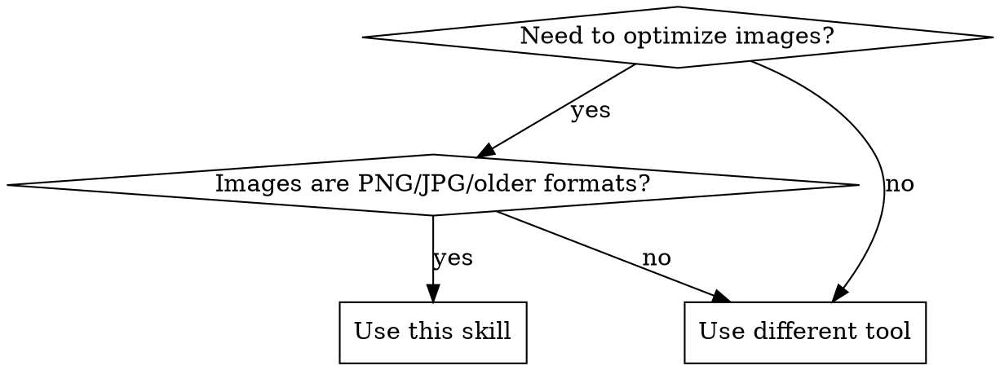

# Convert Images to WebP

## Overview

WebP provides 25-35% smaller file sizes than PNG/JPG with equivalent visual quality. This skill covers systematic conversion of image assets and updating all references in documentation files.

**Core principle:** Always verify tool availability, test conversions on samples first, then systematically convert and update references.

## When to Use



**Symptoms that indicate you need this:**
- Blog or documentation site with large PNG files
- Lighthouse reports suggesting image optimization
- PNG/JPG images that could be WebP
- Need to reduce page load times

**Don't use for:**
- External URLs (GitHub avatars, CDN assets)
- Already-optimized formats (AVIF, existing WebP)
- SVG graphics (already lossless/compressible)

## Quick Reference

| Task | Command |
|------|---------|
| Verify ffmpeg installed | `ffmpeg -version` |
| Convert single image (recommended) | `ffmpeg -i input.png -quality 85 output.webp` |
| Convert with lossless quality | `ffmpeg -i input.png -lossless 1 output.webp` |
| Convert with specific quality | `ffmpeg -i input.jpg -quality 80 output.webp` |
| Batch convert all PNG in dir | `find . -name "*.png" -exec sh -c 'ffmpeg -i "$1" -quality 85 "${1%.png}.webp"' _ {} \;` |

## Implementation

### Step 1: Prerequisites

**CRITICAL: Verify ffmpeg is available before starting**

```bash
ffmpeg -version
```

If ffmpeg is not installed, the user needs to install it first. Don't proceed without confirming.

### Step 2: Inventory Images

Find all images that need conversion:

```bash
# Find all PNG files in project
find . -name "*.png" -type f

# Find all JPG files
find . -name "*.jpg" -o -name "*.jpeg" -type f

# Count total files
find . -name "*.png" -type f | wc -l
```

**Document what you found:**
- Total count of images
- Directory breakdown
- Any special filenames (2x retina displays, special characters)

### Step 3: Test Conversion on Sample

**ALWAYS test on a single image first before batch conversion:**

```bash
# Pick one representative image to test
ffmpeg -i test-image.png test-image.webp

# Verify output exists and is smaller
ls -lh test-image.png test-image.webp

# Visually compare quality (open both side by side)
```

If the WebP is larger or looks worse, adjust quality settings:
- `-quality 85` for good quality/size balance (default)
- `-quality 90` for higher quality
- `-lossless 1` for PNG screenshots/diagrams

### Step 4: Batch Conversion

After testing succeeds, convert all images:

```bash
# Convert all PNG to WebP with quality 85
find . -name "*.png" -type f | while read png; do
  webp="${png%.png}.webp"
  echo "Converting: $png -> $webp"
  ffmpeg -i "$png" -quality 85 "$webp" -y
done
```

**IMPORTANT:** The `-y` flag overwrites existing WebP files without prompting. Remove it if you want to be prompted.

### Step 5: Update References

Images are referenced in multiple patterns. Update ALL of them:

**Pattern 1: Frontmatter (YAML)**
```yaml
# Before
image: ./hero.png

# After
image: ./hero.webp
```

**Pattern 2: ES6 imports**
```jsx
// Before
import hero from "./hero.png";

// After
import hero from "./hero.webp";
```

**Pattern 3: Markdown images**
```markdown
<!-- Before -->


<!-- After -->

```

**Systematic update command:**

```bash
# Update .mdx files - be careful to only update local paths
# Pattern 1: ES6 imports
find . -name "*.mdx" -type f -exec sed -i '' 's|from "\(\./.*\)\.png"|from "\1.webp"|g' {} \;

# Pattern 2: Markdown image references
find . -name "*.mdx" -type f -exec sed -i '' 's|(\(\./[^)]*\)\.png)|(\1.webp)|g' {} \;

# Pattern 3: Frontmatter image fields (YAML)
find . -name "*.mdx" -type f -exec sed -i '' 's|image: \(\./.*\)\.png|image: \1.webp|g' {} \;
```

**CRITICAL:** Exclude external URLs from replacement:
- The commands above ONLY match paths starting with `./` (local paths)
- External URLs like `https://github.com/user.png` are automatically excluded
- If you have other local path patterns (like `../` or absolute paths), handle them separately

### Step 6: Verify

**Always verify after conversion:**

```bash
# 1. Check for remaining local PNG references (external URLs OK to remain)
grep -r "\.png" --include="*.mdx" --include="*.md" | grep -v "https://" | grep -v "http://"

# 2. Build the site to catch broken references
npm run build

# 3. Spot check a few posts visually
npm run start
```

If the build fails or images are broken, you have a reference that wasn't updated correctly.

## Common Mistakes

| Mistake | Consequence | Fix |
|---------|-------------|-----|
| Not verifying ffmpeg installed | cryptic "command not found" errors | Run `ffmpeg -version` first |
| Using `-o` flag | ffmpeg error (flag doesn't exist) | Use `ffmpeg -i input output` syntax |
| Batch converting without testing | All images might have wrong quality settings | Test on one sample image first |
| Forgetting to update MDX references | Broken images after conversion | Systematically update all reference patterns |
| Replacing external URLs | Breaks GitHub avatars, CDN links | Exclude external domains from replacement |

## Red Flags - STOP and Reconsider

- "I can just batch convert everything without testing"
- "ffmpeg is probably installed already"
- "The MDX references are straightforward, no need to check patterns"
- "I'll replace all `.png` text with sed"
- "The conversion quality doesn't matter much"

**All of these mean: Stop and follow the skill step-by-step.**

## Why This Matters

- **Performance:** WebP is 25-35% smaller than PNG/JPG
- **User experience:** Faster page loads, lower bandwidth usage
- **SEO:** Image optimization is a ranking factor
- **Cost:** Lower bandwidth bills for high-traffic sites

## Real-World Impact

Converting 26 blog post images from PNG to WebP in the Tigris blog:
- **Before:** 15.2 MB total image size
- **After:** 9.8 MB total image size
- **Savings:** 35% reduction (5.4 MB)
- **Result:** Improved Lighthouse scores and faster page loads