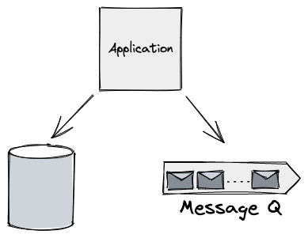
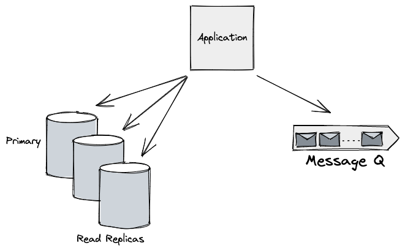
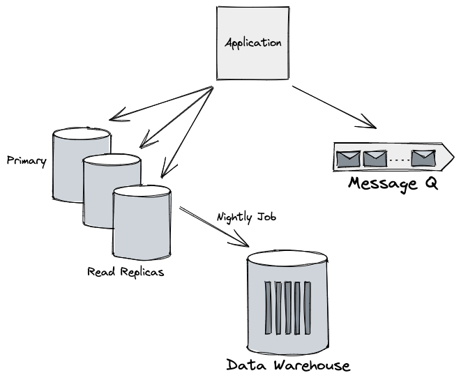
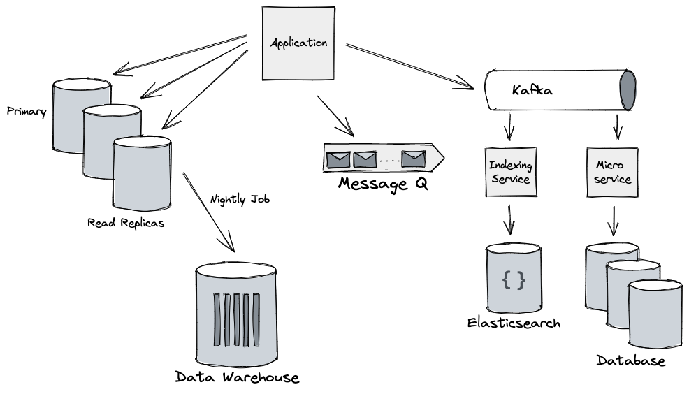
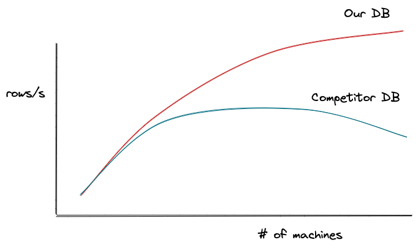
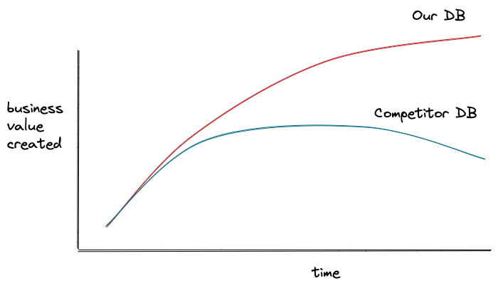
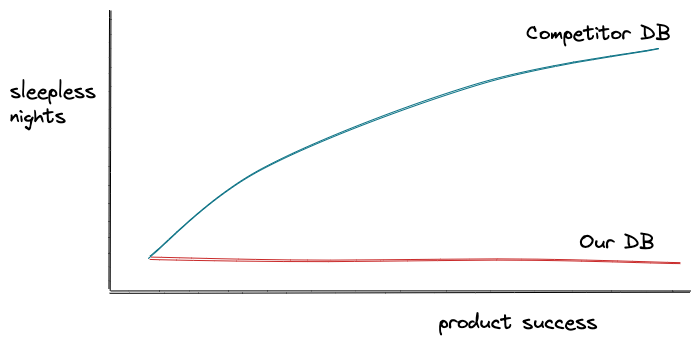

In our inaugural blog post [Hello world](/hello-world), we
talked about the problem of data infrastructure sprawl that, over the years,
has complicated modern application development, while putting a lot of
burden on the operations team who must manage, maintain and secure many
different databases and technologies.

In this blog post, we’ll explain what we mean when we say "data
infrastructure sprawl" by walking through a typical example, and then we’ll
explain why it doesn’t have to be this way.

## The standard evolution story of a modern application

Let's start by taking a look at what an application looks like at the
beginning of the journey. The application is simple, it talks to a database,
typically a traditional OLTP database such as Postgres, or MySQL.

To scale the application further and increase reliability, some of the
application logic is moved to background processing. This requires
introducing a message queue such as RabbitMQ or ActiveMQ. Now the application
architecture looks something like this:

Over time, the application grows in popularity and more features are added.
The development team starts to feel the pain of working with a relational
database. They want to be able to scale reads and writes independently, so
they introduce read replicas and update the application logic to split the
read and write requests. This exposes the development team to
infrastructure-related concerns. At the same time, it also increases the
application complexity as developers now need to decide when it’s safe to
read from the read replicas and when they need to query the primaries instead.

At some point, the business analysts may need to analyze the data to guide
business decisions. They could do it for a while using the primary database,
but eventually these requests will have to be isolated from production. One
easy solution that companies adopt involves running a nightly job that
exports the data out of production into a data warehouse like Redshift or
BigQuery.

As the business continues to grow, so does the complexity of the application
infrastructure required to support it. The developers continue to expand the
application's functionality by adding full text search capabilities. They
decide that introducing Elasticsearch or Solr would be best since the
primary OLTP database does not have a capable search engine. The search
functionality is introduced via a new microservice so that the team can
iterate quickly and experiment with new technology without disrupting the
existing business. The new search microservice needs to know when certain
operations are performed on the primary OLTP database, so a message bus,
such as Kafka, is introduced as well. Now the application architecture looks
something like this:

Does this look familiar? The application isn’t doing anything crazy from a
technological perspective. All the team has built is a backend that can:

1. Power CRUD operations.
2. Provide search functionality.
3. Exposes key business data to our analysts in a data warehouse.
4. Allows experimentation and quick iteration in a “safe” manner that
   doesn’t put the entire business in jeopardy.

The backend though has become a complex distributed system with many different
moving components. Each component must be deployed, configured, secured,
monitored, and maintained. The team has to think about things like data
replication, data consistency, availability, and scalability for each of the
individual components as well.

Over time, the team starts spending less time building the functionality
required to grow the business, and more time managing incidental infrastructure.

## Fundamental reasons for the data infrastructure sprawl

This type of _“data infrastructure sprawl”_ is the norm in the industry today,
and justifiably so. At every point in the story above, engineering
leadership made well-founded and logical architectural decisions, but the
end result was high amounts of incidental complexity that made even
straightforward feature development time-consuming. But at Tigris, we don’t
think it has to be this complicated. Users are forced into this situation
because the open source marketplace is filled with rich and powerful
building blocks, but it’s lacking in holistic solutions.

Most open source databases today take a narrow view of the world:

- They have rich query functionality, but they can’t scale beyond a single
  node. Or, they can scale horizontally, but push all the hard correctness and
  consistency problems to the application developers.
- They can function as your primary data store, or they support rich full text
  search functionality, but rarely both.
- Multi-tenancy and isolation between workloads are an afterthought or not
  present at all. Applications can’t be logically isolated while sharing the
  same underlying “database platform” in a safe manner. Often the database
  itself is “unsafe by default” and won’t provide so much as a warning before
  happily performing a full table scan every time someone navigates to your
  home page.

## What should a modern database look like?

We believe that, **“Correctness, reliability, and user experience over raw
performance”** is a good guiding principle that, if followed, would lead to
the development of a modern database platform that could keep the data
infrastructure sprawl at bay.

This of course sounds great on paper, but prioritizing user experience over
micro-benchmarks is not how most modern database companies try to
differentiate themselves.

**What most database comparisons look like today**

This may seem obvious, but building a holistic database platform that can
keep data architectural sprawl at bay means that the developers of this new
system must take a principled stand to always do right by the user instead
of the benchmarks. This is a very difficult thing to do in the current
competitive climate that is dominated by benchmark-obsessed marketing
material. The
[recent controversy between Snowflake and Databricks](https://www.snowflake.com/blog/industry-benchmarks-and-competing-with-integrity/)
is a great example of this. It’s much easier to quantify rows/s/core than it
is to quantify _(a) sleepless nights, (b) apologies issued to your customers,
and (c) developer productivity_.

**What most database comparisons _should_ look like**

So what would a database that helps customers maximize business value
instead of micro-benchmarks look like? At Tigris, it boils down to a system
with the following characteristics:

1. A flexible document model that enables developers to model data in a way
   that best suits their applications’ needs. The data model should also be easy
   to evolve, and schema changes should be as simple and painless as regular
   feature development.
2. Simple and intuitive APIs that allow developers to quickly insert and
   retrieve data while continuing to use their preferred programming language -
   no new database query language to learn.
3. Strictly serializable isolation by default. This ensures that developers
   never need to think about how transactions work or what their limitations
   are, nor do they need to configure things like read and write concerns or
   transaction isolation levels.
4. “Distributed by default” with no painful transition point when the needs
   of the application begin to exceed the capabilities of a single node.
   Sharding should also be transparent, and the system should ensure that the
   database scales seamlessly as the application traffic increases, while core
   operations such as transactions do not have any restrictions in terms of the
   records or shards that can participate.
5. Multi-tenant by default so that learning how to deploy, operate, and
   secure a single database technology is enough for the majority of the
   applications.
6. An integrated search engine that provides developers with real-time
   search functionality eliminating the need to run a separate search platform
   and synchronize data.
7. Built-in low latency replication to cloud data lakes for OLAP workloads
   that eliminates the need for developers to configure, track, and maintain
   separate ETL processes.

This is exactly what we’re building with
[Tigris](https://github.com/tigrisdata/tigris)! Stay tuned for future posts
where we’ll discuss in detail how we’re leveraging open source technology
like FoundationDB to build a rock solid and intuitive database platform in
record time. We’re also [hiring](https://jobs.lever.co/tigris)!
