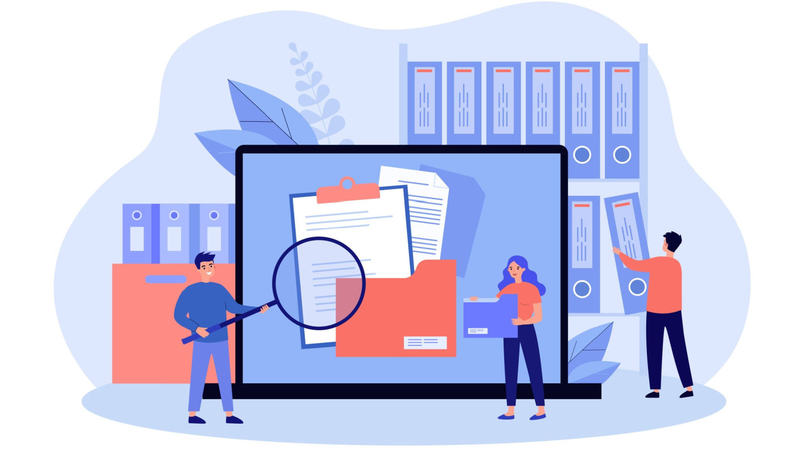
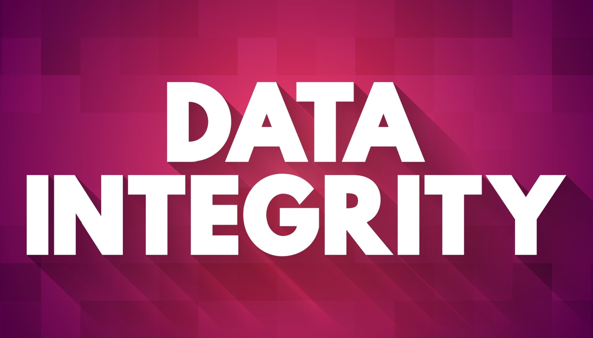

import heroImage from "./foundationdb-blog-header.jpg";

The most complicated and time-consuming parts of building a new storage system
are usually the edge cases and low-level details. Concurrency control,
consistency, handling faults, load balancing, that kind of thing. Almost every
mature storage system will have to grapple with all of these problems at one
point or another. For example, at a high level, load balancing hot partitions
across brokers in Kafka is not that different from load balancing hot shards in
MongoDB, but each system ends up re-implementing a custom load-balancing
solution instead of focusing on their differentiating value to end-developers.

This is one of the most confusing aspects of the modern data infrastructure
industry, why does every new system have to completely rebuild (not even
reinvent!) the wheel? Most of them decide to reimplement common processes and
components without substantially increasing the value gained from reimplementing
them. For instance, many database builders start from scratch when building
their own storage and query systems, but often merely emulate existing
solutions. These items usually take a massive undertaking just to get basic
features working, let alone correct.

{/* truncate */}

Take the OLTP database industry as an example. Ensuring that transactions always
execute with
["linearizable" or "serializable" isolation](https://www.postgresql.org/docs/current/transaction-iso.html#XACT-SERIALIZABLE)
is just one of the dozens of incredibly challenging problems that must be solved
before even the most basic correctness guarantees can be provided. Other
challenges that will have to be solved: fault handling, load shedding, QoS,
durability, and load balancing. The list goes on and on, and every new system
has to at least make a reasonable attempt at all of them! Some vendors rode the
hype wave of NoSQL to avoid providing meaningful guarantees, such as not
providing linearizability in a lot of cases, but we think those days are long
gone.

Vendors are spending so much time rebuilding existing solutions, they end up not
solving the actual end users' problems, although ostensibly that's why they
decided to create a new data platform in the first place! Instead of
re-inventing the wheel, we think database vendors should be focused on solving
the user's actual pain points.

The good news is there is a growing trend in the industry to reuse great open
source software as a building block for higher level data infrastructure. For
example, some vendors realized that a local key-value store like RocksDB could
be used to deliver many features and enforce an abstraction boundary between the
higher level database system and storage. They still hide RocksDB behind a
custom API, but get to leverage all the development and testing effort it has
received over the years. This can result in new systems that are both robust
(durable, correct) and performant at the single-node level in a very short
amount of time.

That said, even if all these storage systems magically used RocksDB under the
hood, the problem of a complicated data infrastructure with many different
components and data pipelines wouldn't be solved. That's because, even if all
your storage systems use RocksDB under the hood, there is no common domain to
perform transactions across them. After all, RocksDB is only a local key-value
store.

While a local key-value store is a great abstraction for separating the storage
engine from the higher-level system, Google took this a step further with
Spanner, which is a SQL database built on a distributed key-value store.
CockroachDB is another example of a SQL database built on top of a distributed
key-value store. The distributed key-value store interface shifts the hard
problems of consistency, fault tolerance, and scalability down into the storage
layer and allows database developers to focus on building value-added features
database users actually need.

## Why Tigris leverages FoundationDB for its Metadata Storage layer

Until a few years ago, the open-source community did not have any viable options
for a stand-alone, production-ready distributed key-value store with interactive
transactions. FoundationDB, used by Apple, Snowflake, and others is such a
system. It provides the same consistency and isolation guarantees as Spanner -
strict serializability, and has an amazing correctness story through
[simulation testing](https://apple.github.io/foundationdb/testing.html).
FoundationDB exposes a key-value API, similar to RocksDB, but it automatically
scales horizontally to support petabytes of data and millions of operations per
second in a single deployment on a modest amount of commodity hardware.

Tigris uses FoundationDB's transactional key-value interface for its underlying
metadata storage. This separation of compute from storage allows Tigris to focus
its attention on higher level concerns, instead of lower level ones. In other
words, we leverage FoundationDB to handle the hard problems of durability,
replication, sharding, transaction isolation, and load balancing so we can focus
on higher level concerns.

Building a new storage platform on top of an existing distributed transactional
key value interface like FoundationDB heavily skews the implementation towards
"correct and reliable by default", even in the face of extreme edge cases. Many
existing distributed databases still struggle to pass the most basic aspects of
[Jepsen](https://jepsen.io) testing even after over a decade of development. At
Tigris, we greatly value correctness, reliability, and user experience. The
generic abstraction of a transactional, sorted key-value store is flexible
enough to support many kinds of access patterns, as well as enable rapid feature
development. For example, a secondary index is just another key-value pair
pointing from the secondary index key to the primary index key. Searching for
records via this secondary index is as simple as a range scan on the key-value
store and doing point reads on the primary index to retrieve the records.
Ensuring the secondary index is always consistent only requires that the
secondary index key is written in the same FoundationDB transaction in which the
primary record is updated.

We use FoundationDB's transactions to ensure the invariants of these data
structures remain intact regardless of the different failure modes the cluster
might encounter.

- Tigris encodes index keys using the FoundationDB's key encoder. It accepts
  high level data structures like arrays, strings, and numbers and encodes them
  into a lexicographically sortable byte string. Encoded keys are a common
  language for different components inside Tigris to communicate with.
- Tigris Streams are powered by FoundationDB's support for "baking" a
  transaction's commit timestamp
  [into a key](https://apple.github.io/foundationdb/javadoc/com/apple/foundationdb/tuple/Versionstamp.html),
  which allows reading all mutations in the total order of transactions
  committed into the database.

So why do we feel comfortable trusting FoundationDB with our most critical data?
In a nutshell, it is because while perhaps lesser known, FoundationDB is one of
the most well tested and battle hardened databases in the world.

## FoundationDB's correctness and fault tolerance

FoundationDB has more comprehensive testing than almost any other database
system on the market. It relies on
[simulation testing](https://apple.github.io/foundationdb/testing.html), an
approach where an entire FoundationDB cluster can be deterministically simulated
in a single operating system process, alongside a wide variety of test workloads
which exercise the database and assert on various properties. Simulation testing
allows the test runtime to speed up time much faster than wall clock time by
skipping over all the boring moments where code is waiting for a timeout to
happen, or a server to come back up after being rebooted. This means many more
"test hours" can pass for each real hour dedicated to running tests, and these
tests can be run in parallel across many servers to explore the state of
possible failure modes even further.

There are very few databases which even come close to this level of testing.
Those that do typically only simulate a small portion of their system, leaving
many components untested by simulation and only relying on unit tests.
FoundationDB even simulates the backup-restore process to ensure the operational
tools are just as good as the database itself. After all, those kinds of tools
are often just as important! No database is perfect, but simulation catches
problems before they make it into a user facing release.

FoundationDB also receives extensive real-world testing at Apple and Snowflake.
The releases are beta tested by them long before being released to the community
to ensure simulation results match reality of running in chaotic cloud
environments. It also provides Tigris with extremely powerful workload
management features. FoundationDB is constantly evaluating the load of the
cluster to determine when it is "too busy", and when that happens it will
artificially slow down starting new transactions until the load is stable again.
By forcing all the latency to the beginning of your transaction, FoundationDB
ensures every operation after that experiences a consistent, low latency. Many
other database systems lack any workload management features at all, which
manifests as overloaded clusters requiring operators to shut down all the
clients to get it back under control.

We previously mentioned that backup-restore functionality is tested in
simulation. That's true of other features like disaster recovery, logging, and
metrics too. These built-in tools are a core part of FoundationDB's developer
experience. Many other database systems force you to use a third-party backup
tool once you cross a small scale due to table locking or other concurrency
problems. FoundationDB's backups and disaster recovery system are both streaming
(so your recovery point objective can be measured in seconds instead of hours)
and they work for large, busy databases, not just the toy sized ones.

## Tigris operations and reliability

Tigris is built following a microservice architecture approach. This allows us
to have separate components that can each be scaled independently. For example,
separating storage from compute ensures a better distribution of resources. Some
workloads will store a small amount of data that requires tons of CPU for
processing queries, while others will store large amounts of data and use a tiny
amount of CPU. We can right-size storage and compute resources separately so
that valuable CPU and memory resources are never again stranded on a big
instance which mostly sits idle because of high storage utilization.

Tigris expands on FoundationDB's integrated workload management features to
provide more fine-grained workload management down to the individual bucket
level.

All in all, FoundationDB provides Tigris a strong foundation for building a high
quality storage platform.
