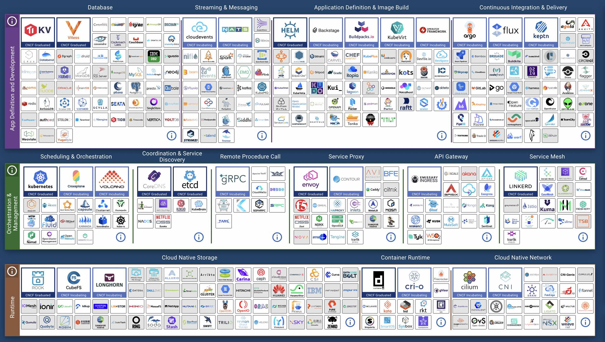

Data is the lifeblood of modern applications, powering rich and diverse user
experiences. We rely on these applications in our daily life to do everything
from managing logistics, finances, shopping needs, and even the most mundane and
basic of tasks.

However, as much as these modern applications have become data-dependent, the
supporting data infrastructure hasn't evolved to support these rich data
needs. Today's applications still rely on **"databases"** in the classical
sense, a concept designed in the 1970s and 1980s.

## How we got here

Over the past five years, we have seen not only the exponential growth of new
applications being launched but also the diversification of tools and
infrastructure components needed to support those applications. Most new
applications are built using a microservice architecture.

Each of these microservices will often have its own disparate database
components, many times more than one. This variance is usually driven by the
requirements of the services around data structure, model, and access
patterns. The need to support multiple data models and patterns has led to
the idea of a specific toolset or component for a particular use-case has
become the norm. There has been a "gold" rush for infrastructure companies
to stake a place in this new landscape, creating new tools and resulting in
increasingly complex architectures. The tools being released are generally
focused on specific usage cases or components instead of solving the larger
problem.

Looking at the current [CNCF landscape](https://landscape.cncf.io/) you can see
how evident the variety and sprawl is

This complex map shows the hundreds and hundreds of different infrastructure
components that can be bundled together. Most of them are focused on
performing one specific niche item. We often need many of these components
to build a robust modern application because the core infrastructure
components ( like the database ) were never designed to meet today's needs.
We are now in a time when DIY builders can couple together Frankenstein's
monster to support their application.

## The impact of increased complexity

While purpose-built tooling and components have some benefits, the downside
is that the environments in which we currently build applications are
getting larger and more complex.

[MongoDB recently surveyed 2,000 IT professionals; over 50% described their
data architecture as "Complex"](https://www.mongodb.com/blog/post/survey-2000-it-professionals-reveals-importance-innovation-challenges).

[Percona ( an Open Source Database Vendor ) did a similar survey and found
that the number of organizations supporting 1000s of databases in production
more than doubled in the last year](https://www.percona.com/open-source-data-management-software-survey).
That same survey found over 90% of the
respondents run multiple databases, and most running five or more.

This complexity has grown not only the footprint of companies' data
infrastructure. Still, it has forced developers to learn and maintain the
skills to build and support dozens of disparate components, with each
component having its APIs, characteristics, access methods, operations, and
best practices.

**And time is a resource developers are lacking!**

A [2022 study by Reveal.io](https://www.revealbi.io/whitepapers/software-developers-biggest-challenges)
showed that 40%+ of developers are challenged by not only the high demands
being placed on them but the constant raising of those requirements.

[Stack Overflow's 2022 survey](https://survey.stackoverflow.co/2022/#productivity-impacts-time-searching)
showed that a quarter of all developers spend more than 25% of their time
every week looking for solutions to problems. No wonder that same study
showed that nearly 53% of developers are looking at Low or No Code solutions
to help reduce the time to release applications.

The more complex the environment, the more time is spent maintaining,
troubleshooting, learning, and getting components to play nicely together.
Much of the complexity of the infrastructure comes from how data is stored
and accessed using legacy database management systems.

## Databases are legacy

One of the main reasons for the explosion in data infrastructure tools is
that the databases were never designed for the rich use cases applications
have today. Then, instead of rethinking the developer experience related to
data and widening the functions of the database, we added more bolt-on tools.

Our idea of how we need to store and interact with data in applications
dates back to the 1970s. While databases have evolved regarding stability,
security, and scalability, the core functionality remains the same. At its
core, all databases have these common tenants:

- Stores data in a self-describing universal format
- Allows you to query data with a specific language
- Separates the data from the application, allowing many applications to
  connect and use the same data source
- Handles the persistence of the data
- Secures data in some manner

By definition, database management systems are designed to separate the
application and data, focusing on interacting with data in a narrow way.
This is archaic thinking in today's modern environments.

**Today applications and data are as connected as ever before. The application
should dictate the best way to store and retrieve data, not the other way
around**.

## The Developer Data Platform

If we were to go back and redesign the core systems we use to store, access,
and use data with what we know now, we would build a completely different
experience. Instead of adding more disparate components and bolt-ons, we
need a new solution to handle the modern requirements. We need a Data
Platform purpose-build for Developers with the following characteristics:

1. Has the capabilities to meet the demands of a multi-model application.
2. Data stored is optimized for application access patterns, not the
   application designed to adhere to the database's preferred patterns.
3. All data is queryable and searchable directly from common application
   frameworks (the tools, libraries, and packages developers use daily) and
   APIs without learning a new language.
4. Data is sharable in common formats for end users, applications, APIs, and
   services in real time.
5. Infrastructureless from the developers' perspective: indexing, sharding, HA,
   recovery, and standard database administration operations are handled
   automatically.
6. Built with modern cloud-native architecture with independently scalable
   components.
7. Provides control of their data to the users in a secure way that complies
   with laws and regulations.

Many database companies like to say they are taking a developer-first
approach to designing their products, but most of the time, they remain
stuck in the past.

**It is time to start building the data platforms that conform to how
developers think, code, and create.**

This is why we are building Tigris. We hope other vendors will evolve as
well to better support a modern developer's needs.

---

import BetaSignupCTA from "../_beta-signup-cta.mdx";

<BetaSignupCTA />
