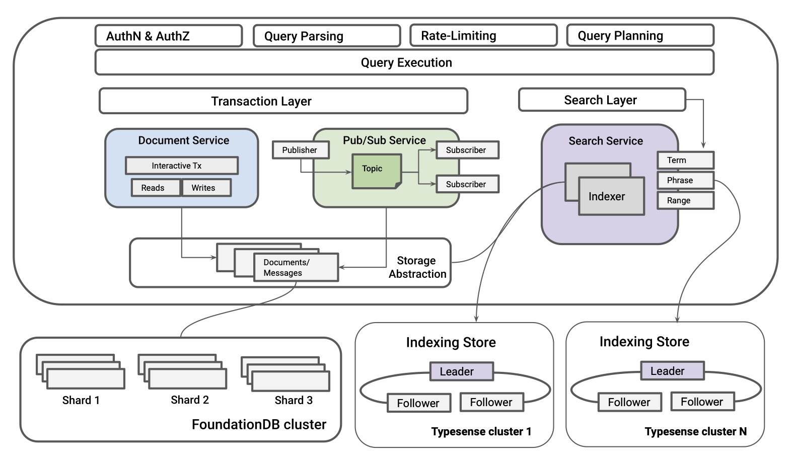
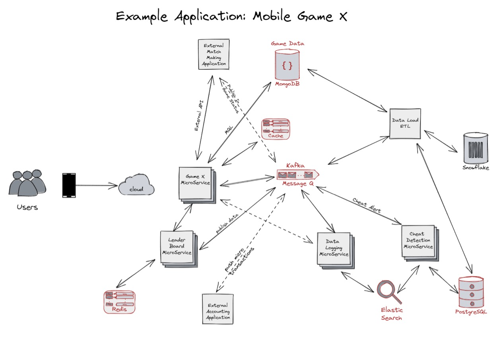
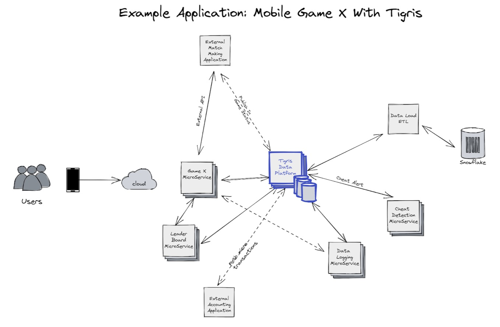
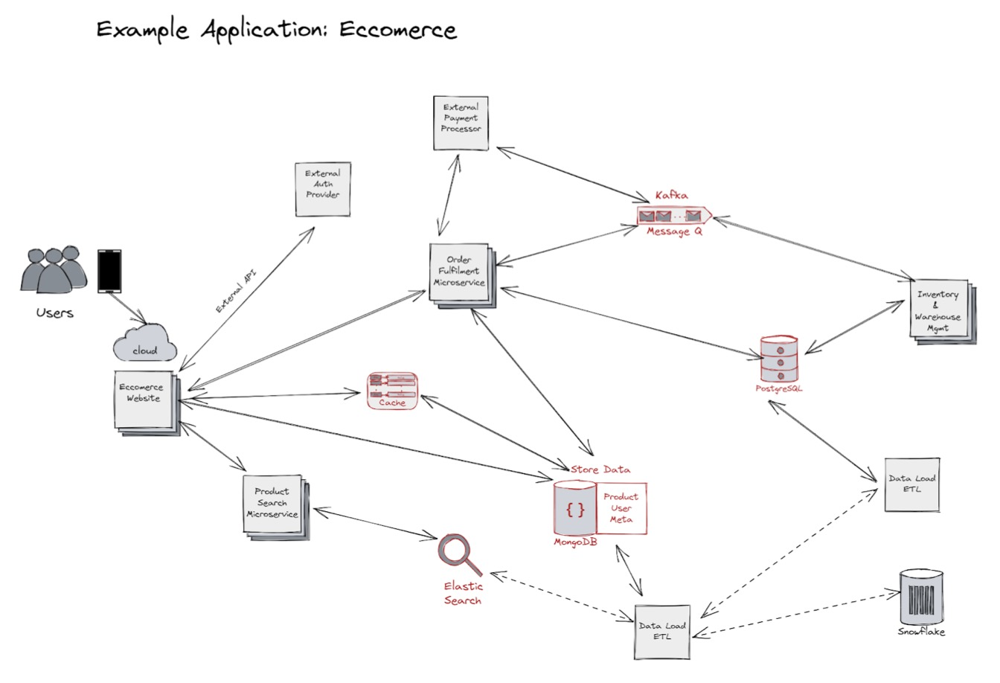
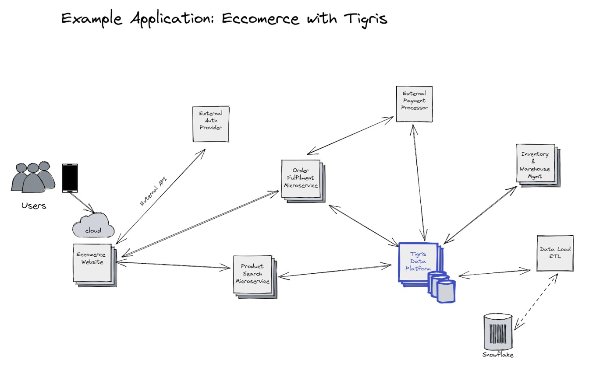

import tigrisConfig from "@site/tigris.config.js";

In our recent blog post [Databases are legacy. It's time to rethink data storage and usage](/databases-are-legacy),
we explored the current landscape and the need to rethink how we deal with
data, dropping the legacy definition of a database and instead focusing on the
concept of a developer data platform. Let me recap the elements of a
developer data platform.

## The Developer Data Platform

If we were to go back and redesign the core systems we use to store, access,
and use data with what we know now, we would build a completely different
experience. Instead of adding more disparate components and bolt-ons, we
need a new solution to handle the modern requirements. We need a Data
Platform purpose-build for Developers with the following characteristics:

1. Has the capabilities to meet the demands of a multi-model application.
2. Data stored is optimized for application access patterns, not the
   application designed to adhere to the database's preferred patterns.
3. All data is queryable and searchable directly from common application
   frameworks (the tools, libraries, and packages developers use daily) and
   APIs without learning a new language.
4. Data is sharable in common formats for end users, applications, APIs, and
   services in real time.
5. Infrastructureless from the developers' perspective: indexing, sharding, HA,
   recovery, and standard database administration operations are handled
   automatically.
6. Built with modern cloud-native architecture with independently scalable
   components.
7. Provides control of their data to the users in a secure way that complies
   with laws and regulations.

## Tigris - the Open Source Developer Data Platform

We built Tigris to meet these characteristics. Tigris is an open source
developer data platform that replaces the need for having separate systems
to support each disparate data model, data storage, event streaming, global
search, and infrastructure management. It provides a cohesive, flexible set
of tools for application developers to take an idea from production without
stepping into the sinkhole of data pipelines, broken sync jobs, and
complicated concurrency bugs present in many modern application
architectures. Tigris is truly cloud-native, allowing separate components to
be scaled on-demand independently. It provides a serverless experience where
developers can focus on building new applications while storing and
retrieving data with a simple but powerful universal API.

By providing the most common tools developers need to build data-rich
applications and doing it through a developer-friendly interface, we can
enable them to focus on building applications and stop worrying about the
data infrastructure.

Now, let's look at a few classic application architectures and see how
Tigris simplifies them and eliminates the infrastructure sprawl.

## Simplifying the backend architecture of a new mobile game

### Classic architecture without Tigris

Let's look at an example of a team building a new mobile game. We will call
the game X for brevity. When the team starts building X, they focus on the
fundamental game elements. They want to make a fun, compelling, and
successful game. While a lot of work goes into the UI and the core play
elements, they also realize early in development that they need a database
to store inventory, state, etc. The team adds a MongoDB database to keep
that data persistent. The development process speeds ahead. As they are near
having the core game done, they want to add those extra features that most
games have.

The first component on the list that game X needs is the ability to handle
micro-transactions and allow people to buy in-game items. This means that
in-app purchases need to connect to external services, be processed, and
update the game data. Not only that, the transaction will need to be logged
in the accounting system and the ancillary logging systems. The team looks
to messaging or event streaming services to support the interconnectivity of
different internal and external micro-services. This may take something like
RabbitMQ, Apache Kafka, Apache Pulsar, or others, allowing different
services to easily receive and act upon inflight data.

When money is introduced into a game, the likelihood that gamers will start
to abuse the game increases dramatically. This leads to developing log
processing services, analytics, and other tools to search and find problems
from logged data. This adds a few other components to the infrastructure,
including an analytics platform like Snowflake and a tool like Elasticsearch
to search through large amounts of logs.
Now, as the team is dealing with financial data on top of game data, they
need a rock-solid backend data store for the financial data, so they include
Postgres in the mix.

As you can see, the sprawl quickly adds up, and we are now looking at a
complex application architecture with multiple moving pieces.

Developers working on GameX need to know the tools, languages, and
frameworks to build the core game. On top of that, now they also need to
learn, maintain, and troubleshoot MongoDB, Redis, Postgres, Elasticsearch,
and Kafka. Not only do these components need to be managed independently,
but they also need to work in unison. For example, there are data pipelines
and synchronization jobs to manage and maintain, to ensure the data is
consistent across these systems.

The result is developers spend more time managing infrastructure and
performing operations (DevOps) and less time shipping features.

### Modern architecture with Tigris

Tigris dramatically reduces the complexity and removes the operational
burden on developers. Tigris replaces the need for Mobile Game X to deploy
separate systems for caching, search, data persistence, and event streaming.

With Tigris, developers don't spend time on infrastructure operations
(DevOps). Instead, they spend their time doing what they do best - building.

## Simplifying the backend architecture of an e-commerce application

### Classic architecture without Tigris

On the surface, e-commerce sites may appear simple, but under the hood, they
require a rich set of data-intensive features and an event-driven
application architecture to keep them running smoothly. Let's walk through
what the application looks like with a classic take on the architecture.

For our site, we store our product details, reviews, and other pertinent
information about the products themselves in a MongoDB cluster. We also
deploy a caching layer for the product catalog to deliver a low-latency user
experience. We use Redis for the cache. Users need to be able to search for
products and reviews, so we built a product search service backed by
Elasticsearch. We need ACID transactional guarantees for some user flows,
resulting in Postgres' introduction.

One of the critical user flows is the order processing flow. It needs to be
event-driven as it needs to interact with external services, such as payment
processors, shipping service providers, and others. The payment status,
refund status, and shipping status need to trigger different business logic
in the application. We chose Kafka to support this event-driven architecture.

All of this adds up fast, and we are now again looking at a complex
application architecture with multiple moving pieces.

### Modern architecture with Tigris

Tigris dramatically simplifies the application architecture for an
e-commerce application by combining the most commonly used components in an
open source developer data platform, supporting multiple models and data
access patterns. With a single, unified API that spans search, event
streaming, and transactional document store, along with innovative features
like automatic indexing, Tigris enables developers to focus on building
their applications and stop spending time on infrastructure operations (DevOps).

## Tigris: a modern approach to application data architecture

Modern application requirements require a modern approach to data management
that is developer-first! As you can see in the examples above, Tigris
simplifies the application architecture. It shifts the burden of managing
infrastructure operations away from the developers, so they can focus on
building applications and creating rich experiences for their users.

---

import BetaSignupCTA from "../_beta-signup-cta.mdx";

<BetaSignupCTA />
