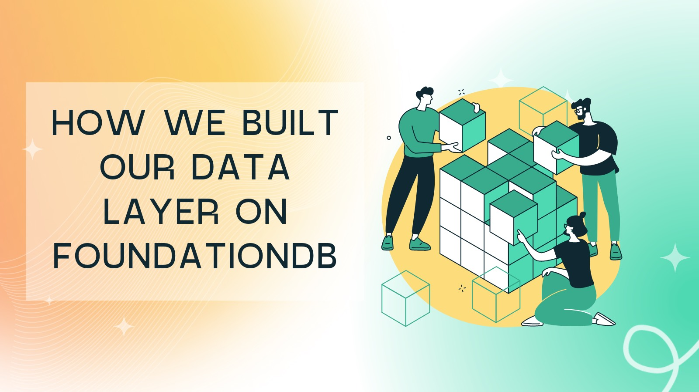
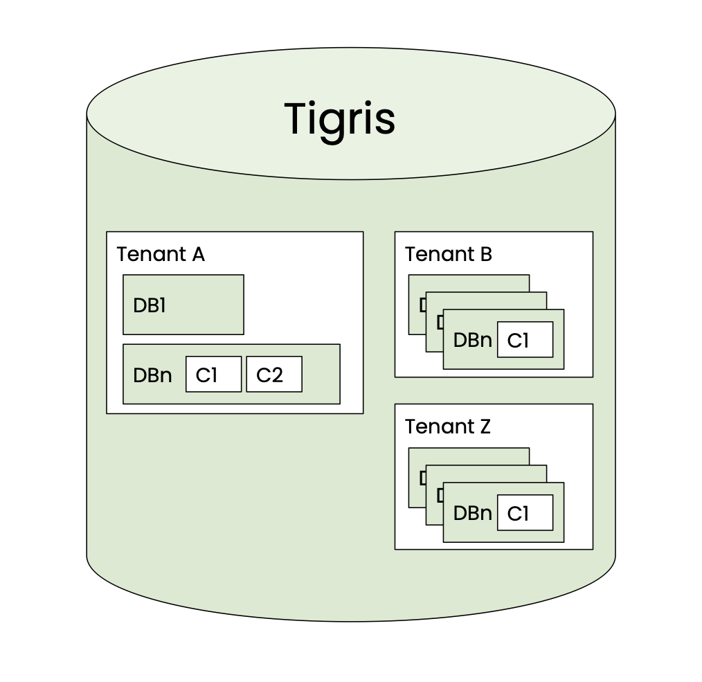
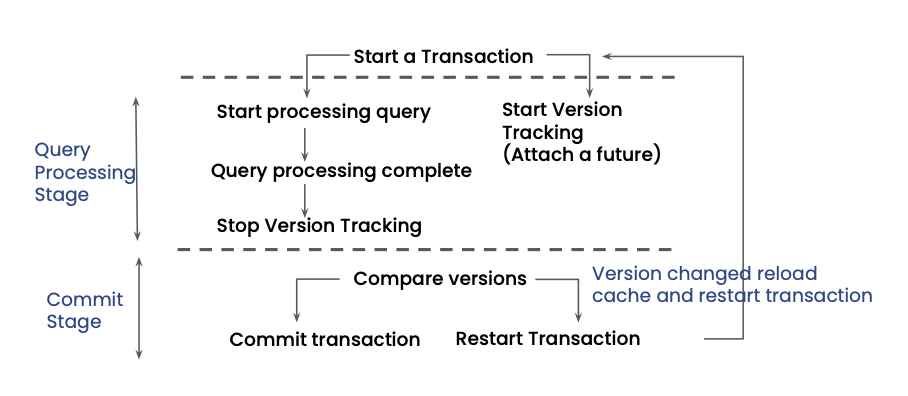

Tigris is an open source developer data platform that makes building
data-rich serverless applications a breeze. It enables developers to stick
to just being developers and not be forced into DevOps.

Tigris uses FoundationDB's transactional key-value interface as its
underlying storage engine. In our blog post
[Skipping the boring parts of building a database using FoundationDB](/building-a-database-using-foundationdb)
we went into the details of why we chose to build on FoundationDB. To recap,
FoundationDB is an ordered, transactional, key-value store with native
support for multi-key strictly serializable transactions across its entire
keyspace. We leverage FoundationDB to handle the hard problems of durability,
replication, sharding, transaction isolation, and load balancing so we can
focus on higher-level concerns.

We are starting a series of blog posts that go into the details of how
Tigris has been implemented. In the first post of the series, we will share
the details of how we have built the multi-model document layer on top of
FoundationDB. We will cover the topics of data layout, and schema management.



<!--truncate-->

## Data layout

To understand the data layout, the first step is to talk about how data is
modeled in Tigris.

### Data modeling

Tigris stores data records as documents. Documents are analogous to JSON
objects but Tigris stores them in an optimized binary format. Documents are
grouped together in collections. Collections are grouped together in databases.

```json
{
  "field1": 1,
  "field2": "string",
  "field3": { "field1": "value1", "field2": "value2" },
  "field4": [1, 2, 3]
}
```

You can read more about the data modeling concepts in the
[Documents](https://docs.tigrisdata.com/documents/documents) section of the
docs.

As Tigris is a multi-tenant system, when a user is created they are assigned
to a tenant. All of their data is then stored under this tenant. Thus, the
hierarchy of data storage looks something like this



### Data layout

As Tigris leverages FoundationDB as the storage engine, which exposes a
key-value interface, the data has to be stored as key-value pairs. This
means there needs to be some translation from a logical layout of storing
tenants, databases, collections, documents, and schemas to a physical layout.

Tigris maintains different key layouts depending on the information it
stores. Each key layout has a custom encoder-decoder and has a prefix at the
start of the key. The encoder adds this prefix; then, the decoder uses it to
decode it according to the appropriate structure. The high-level concept of
key encoding remains the same for all types of data (users or system data).
The following section discusses how user data (JSON documents) are stored
inside Tigris.

### Key encoding

As we have seen in the data modeling section, a collection is identified by
a tenant, database, and collection name. This is the minimum information we
need in the key to identify a record. However, a collection may have
secondary indexes as well. Therefore, an index identifier must also be part
of the key.

This key structure is made extensible by having a **version** component
allowing us to add or remove attributes in the future.

To summarize, we need to pack the following information in the key:

```shell
tenant | database | collection | index name | index value
```

Taking a more realistic example, let's say we have a tenant _foobar_ with a
database _userdb_, a collection _users_, and an _id_ field defined as the
primary key of the documents. This translates to the following key structure

```shell
["fooApp", "userdb", "users", "pkey", [1]] =>
  {"id": 1, "email": "alex@example.com", "phone_number": 12345}
```

The index values are seen as an array here because Tigris supports composite
indexes as well, meaning a collection can have one or more than one field
defined as index fields. These index values are packed in a single binary
structure.

However, storing this information in every key as-is means unnecessary costs
attached to each document. Therefore we implemented key compression.

### Key compression

The key compression algorithm that we have implemented replaces these long
strings with integers and ensures that the integer assignments are unique.
This is accomplished by persisting these mapping in an internal metadata
collection and assigning to these strings during creation time.

In order to compress a key, the first step is to assign a unique integer to
the container (tenant, database, collection) names. This is done during a
Data Definition Language (DDL) operation. Whenever Tigris receives a tenant
creation, database creation, or collection creation request, it starts a
transaction. In this transaction, a unique integer value is reserved for
this container name and then assigned to this container. This mapping is
stored in an internal collection called encoding. The value assigned is
incremented in a fashion that each mapping is unique. This mapping is
immutable so that it can be freely cached on Tigris servers. In other words,
all the user metadata like a tenant, database, collection, and index names
are uniquely identifiable by their corresponding integer representation. As
this is done in a transaction, completing the request means a unique
assignment of the integer to the string.

Using integers has the following benefits:

- Machine-level instruction can be used to perform integer comparison in one
  cycle
- Packed as 4bytes; on the other hand, if the string size grows, it will take
  up a lot of memory. This results in compact keys, therefore, optimizing CPU,
  memory, and storage usage
- Even nominally saving a few bytes per string representation does add up
  when there are billions of records

The encoding collection that has this information and has the following layout:

```shell
encoding | version | tenant-name => integer identifier
encoding | version | tenant-id | database-name => integer identifier
encoding | version | tenant-id | database-id | collection-name => integer identifier
```

Where

- encoding → identifier of this metadata collection (key layout)
- version → version of this key structure so that we can evolve this layout
- tenant-name, database-name, collection-name → The user-facing names

These integer values are then used to form the key. Now with this
information, here is how the key structure looks like:

```shell
["usr",0x01,0x01,0x02,0x03,0x04,[1]] =>
  {"id": 1, "email": "alex@example.com", "phone_number": 12345}
```

Where

- usr → the identifier for this key layout
- 0x01 → version of this key layout
- 0x01 → tenant-id
- 0x02 → database-id
- 0x03 → collection-id

### Value encoding

Internally all user values are stored inside a
[protobuf](https://developers.google.com/protocol-buffers/docs/overview)
message. We don't mutate user payload. Introducing this top-level structure
allows us to have metadata of the record attached to it along with raw user
content. As an example, this protobuf message, apart from user data, has
information such as compression, created time, updated time, the schema
version, and other housekeeping fields. Some of this information is then
indexed so that we can support time series queries like returning records
that are created after _Jan 1, 2022_.

```protobuf
message ValueWrapper {
  int32 ver = 1; // schema version
  int32 enc = 2; // encoding of the raw data
  int32 comp = 3; // compression of the raw data
  Timestamp created_at = 4; // created timestamp of the document
  Timestamp updated_at = 5; // updated timestamp of the document
  bytes raw = 6; // raw user payload
}
```

Our wrapper adds a slight overhead to every value, but provides us with much
flexibility. For example, we can switch between different compression
algorithms and value encodings on the fly with no downtime or backfills
required. In addition, unused fields don't have to be encoded at all.

## Schemas

For Tigris, schemas are an integral part and form the basis of rich features
such as automatic indexing and real-time search. Tigris enforces that all
documents in a collection must conform to a schema. The schema is defined as
part of creating the collection. Tigris, then, provides a lightweight way to
modify the schema.

This aligns well with application development flow as schemas provide a way
to structure the data according to the application logic and flexibility in
modifying the schema allows for it to evolve with the application.

### Schema storage

To store schemas, there is an internal metadata collection. All operations
on this collection are performed using transactions. This allows us to
create a single collection, or multiple collections, or evolve a schema of
collections atomically.

Tigris supports performing DDLs in an interactive transaction. Once this
transaction is committed, Tigris guarantees that this schema will be
atomically applied and any new request will see the latest schema. The
schema change is applied in an online manner, and there is no downtime, so
this operation can be safely done in production during live traffic. Since
schema change for Tigris is a metadata operation, the schema change can be
completed in milliseconds.

As mentioned before, there is an internal collection that stores the schemas.
The key is of the following structure:

```shell
schemas | version | tenant-id | database-id | collection-id | revision-id
```

Where

- schemas → identifier for this collection
- version → version of this key structure so that we can evolve this layout
- tenant-id → tenant integer identifier
- database-id → database integer identifier
- collection-id → collection integer identifier
- revision-id → version of the schema

As an example

```shell
["schemas", 0x01, 0x01, 0x02, 0x03, 0x01] =>
  {"properties":{"a":{"type":"integer"},"primary_key":["a"]}}
```

The schemas are cached on the Tigris servers to avoid reloading them from
the storage but as we provide transactional schema updates we need to ensure
the cache is always consistent and never return stale schema version. The
following section talks about how these schemas are propagated atomically
and how the cache always returns a consistent view of the schemas.

### How are schema changes propagated instantaneously?

One of the ways of atomically propagating schema change is for all the
servers to block the transactions until all other servers have received the
new schema. However, in a production environment, this behavior is highly
undesirable.

Tigris has chosen a different route to avoid this coordination but still
support atomic schema changes. As Tigris transactionally stores the schema,
in the same transaction, it bumps up a metadata version using FoundationDB's
versionstamp.

Now any request that arrives must be checked against this version.



Checking metadata versions at the start of every transaction is an expensive
operation so Tigris has optimized this flow by attaching a
[FoundationDB futures](https://apple.github.io/foundationdb/developer-guide.html#programming-with-futures) to it.

FoundationDB provides asynchronous APIs that rather than blocking the
calling thread until the result is available, immediately return a future
object. Using futures helps us to not penalize the request and let it
proceed as usual.

Once the request is processed and is ready to be committed, this future is
ready. Before committing the transaction we check if the metadata version
has changed. If the version is bumped for a tenant that means a schema
change operation has been performed so the server reloads the latest version
of the schema for this tenant otherwise the request can proceed as-is.

This guarantees atomicity of schema propagation across the Tigris servers.
This is also how Tigris provides the guarantee that once success is returned
for a schema change operation, the new schema is always used for subsequent
requests.

### Schema enforcement

As mentioned above, Tigris enforces that all documents in a collection must
conform to a schema. Schema defines all the fields that make up the document
in a collection, and is required as part of creating the collection.

The schema validation happens during all write requests. Validating during
writes means there is no penalty during read operations as the stored data
already conforms to the schema. Tigris allows evolving schema but with some
restrictions at this time.

Read the following sections in the documentation to learn more about how
schemas work in Tigris:

- [Documents in Tigris](https://docs.tigrisdata.com/documents/documents)
- [Modifying the schema](https://docs.tigrisdata.com/documents/schema-modification)
- [Data modeling with Tigris](https://docs.tigrisdata.com/documents/datamodel)

This is the first blog post in a multi-part series where we will be sharing
the details of how we have implemented some of the core features in Tigris.
Be on the lookout for the next part!

---

import OpensourceCTA from "../_oss-cta.mdx";

<OpensourceCTA />
