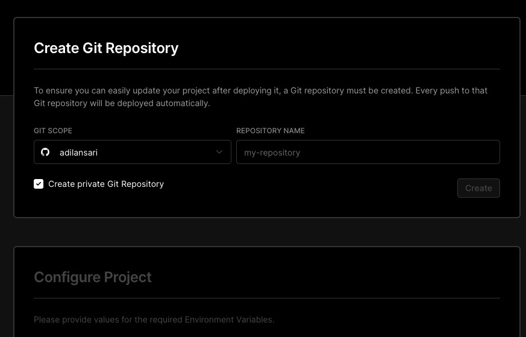
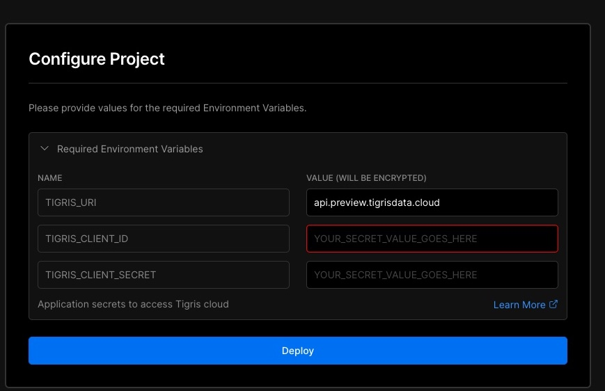
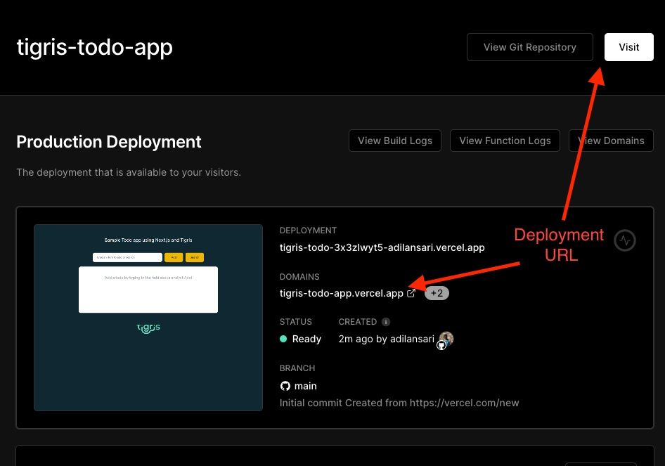

import LiteYouTubeEmbed from "react-lite-youtube-embed";
import "react-lite-youtube-embed/dist/LiteYouTubeEmbed.css";

## Introduction

This is the first article in a series of posts where we learn how to deploy fullstack apps built
using Tigris. In this particular article, you will deploy a fullstack To-do list web app using
[Next.js][nextjs-url] and [Tigris][tigris-url] and deploy it on [Vercel][vercel-url]. This To-do web
application allows users to add to-do items to list, mark them completed, or remove them and
search for items through the list.

### What is Next.js

If you're not already familiar, [Next.js][nextjs-url] is a popular open-source web development
framework based on [React](https://reactjs.org) for building modern web applications. It enables
developers to build production ready and scalable applications with its feature rich and extremely
user friendly features.

## Prerequisites

For this tutorial you'll need:

1. [Vercel account (sign up for free)][vercel-url] to deploy app
2. [GitHub account (sign up for free)](https://github.com)
3. Node.js 16+
4. npm and npx

## 1. Getting started with Tigris {#tigris-getting-started}

Tigris is an open source developer data platform that makes building data-rich serverless applications
a breeze. We will use Tigris as backend for our Next.js app. If you don't already have an account,
[signup here for a free Tigris account](https://www.tigrisdata.com/beta#signup-form).

Now, lets register an application in your Tigris account to use with the app.

1. Login to your Tigris dashboard,
2. Navigate to **My Settings** &rarr; **Application Keys**,
3. And click on **New Key** button to generate new application key

:::note
We will use the `Client Id` and `Client Secret` to connect application to Tigris in next steps.
:::

:::tip
Alternatively, you can follow this small demo to generate application key

<LiteYouTubeEmbed
  id="Ls50EOrU3AQ"
  params="autoplay=1&autohide=1&showinfo=0&rel=0"
  title="Generate application keys for Tigris"
  poster="maxresdefault"
/>
:::

## 2. Deploying existing Next.js app on Vercel {#deploy-to-vercel}

In this step, you will fork an existing [To-do fullstack Next.js app from GitHub][tigris-todo-repo-url]
to your GitHub account and deploy the forked repository to Vercel. As you might expect, this repo
will come with everything you need to connect to Tigris Cloud, we will explore that in detail in
next section.

### 2.1 Create a project on Vercel {#create-vercel-project}

Vercel makes it easier to deploy public Git projects with a single button click.

- Hit the following **Deploy** button to get redirected to Vercel

[](https://vercel.com/new/clone?repository-url=https%3A%2F%2Fgithub.com%2Ftigrisdata%2Ftigris-vercel-starter%2F&env=TIGRIS_URI,TIGRIS_CLIENT_ID,TIGRIS_CLIENT_SECRET&envDescription=Application%20secrets%20to%20access%20Tigris%20cloud&envLink=https%3A%2F%2Fgithub.com%2Ftigrisdata%2Ftigris-vercel-starter%2Fblob%2Fmain%2F.env.example&project-name=tigris-nextjs-todo-app&repo-name=tigris-nextjs-todo-app&demo-title=Tigris%20todo%20app&demo-description=A%20ToDo%20list%20web%20app%20using%20NextJS%20and%20Tigris%20Data)

- This should take you to Vercel workflow to clone the repo to your account that appears like:

<details>
  <summary>Screenshot</summary>



</details>

- Pick a name for your new Git repo and then you'll configure the required environment variables
  in next step:

<details>
  <summary>Screenshot</summary>



</details>

- This is where we'd need the `Client ID` and `Client Secret` generated in [previous step](#tigris-getting-started),
  and `TIGRIS_URI` would be the API endpoint for Tigris Cloud. Enter the values as following and hit
  **Deploy** button

```yaml
TIGRIS_URI=api.preview.tigrisdata.cloud
TIGRIS_CLIENT_ID=<Paste your Client ID here>
TIGRIS_CLIENT_SECRET=<Paste your Client Secret here>
```

- Once your deployment completes, continue to your project dashboard on Vercel where you'll find URLs
  for your fullstack app as shown below:

<details>
  <summary>Screenshot</summary>



</details>

:tada: All done. Visit the URL in browser to access your To-do app and play around. :tada:

You, can continue to explore the app on your own or follow along as we do a code walkthrough of the
project next. You'll learn how Next.js frontend interacts with Tigris backend for data storage in the
next section.

## 3. Code walk-through

This section will elaborate on important aspects of To-do application you just deployed. Let's glance
over the important components of project tree

```text title="File structure"
|-- package.json
|-- lib
|   |-- schema.ts
|   |-- tigris.ts
|-- pages
    |-- index.tsx
    |-- api
        |-- item
        |   |-- [id].ts
        |-- items
            |-- index.ts
            |-- search.ts
```

### 3.1 `lib/schema.ts` - Tigris schema definition

Tigris allows you to model your backend schema in the code itself. Schema is flexible and changes
are very lightweight enabling you to evolve application without any downtime or migration.

To-do app defines the schema for our collection named `todoItems` as follows

<!-- prettier-ignore-start -->
```typescript title=lib/schema.ts
import {
  TigrisCollectionType,
  TigrisDataTypes,
  TigrisSchema
} from '@tigrisdata/core/dist/types'

export const DB_NAME = 'tigrisTodoApp'
export const COLLECTION_NAME = 'todoItems'

export interface TodoItem extends TigrisCollectionType {
  id?: number;
  text: string;
  completed: boolean;
}

export const TodoItemSchema: TigrisSchema<TodoItem> = {
  id: {
    type: TigrisDataTypes.INT32,
    primary_key: { order: 1, autoGenerate: true }
  },
  text: { type: TigrisDataTypes.STRING },
  completed: { type: TigrisDataTypes.BOOLEAN },
}
```
<!-- prettier-ignore-end -->

The `TodoItem` interface is native _typeScript_ model that is used in our application to model
individual to-do list item within app. Tigris schema is defined as `TodoItemSchema` which wraps around
`TodoItem` object and defines each property as collection field to persist in schema.

### 3.2 `lib/tigris.ts` - Connecting to Tigris

This file loads the environment variables you specified previously in [creating a Vercel project section](#create-vercel-project)
and uses them to configure a re-usable Tigris client. This client can be used to manage all your
Tigris operations from here on.

<!-- prettier-ignore-start -->
```typescript title=lib/tigris.ts
import { DB, Tigris, TigrisClientConfig } from '@tigrisdata/core'
import { DB_NAME } from './schema'

if (!process.env.TIGRIS_URI) {
  throw new Error('Cannot find TIGRIS_URI environment variable ')
}

const tigrisUri = process.env.TIGRIS_URI
const clientConfig: TigrisClientConfig = { serverUrl: tigrisUri }

if (process.env.TIGRIS_CLIENT_ID) {
  clientConfig.clientId = process.env.TIGRIS_CLIENT_ID
}
if (process.env.TIGRIS_CLIENT_SECRET) {
  clientConfig.clientSecret = process.env.TIGRIS_CLIENT_SECRET
}

declare global {
  var tigrisDb: DB
}

let tigrisDb: DB

if (process.env.NODE_ENV === 'production') {
  if (!global.tigrisDb) {
    const tigrisClient = new Tigris(clientConfig)
    global.tigrisDb = tigrisClient.getDatabase(DB_NAME)
  }
  tigrisDb = global.tigrisDb
} else {
  const tigrisClient = new Tigris(clientConfig)
  tigrisDb = tigrisClient.getDatabase(DB_NAME)
}

// export to share DB across modules
export default tigrisDb
```
<!-- prettier-ignore-end -->

:::info
This app ensures that the Database and Collection exist, or will automatically bootstrap one for you
at build time, so you don't have to explicitly create one. `tigrisClient.getDatabase(DB_NAME)` just
gets an instance for the existing Database. More details on this automatic setup can be found in
`scripts/setup.ts` file.
:::

### 3.3 `pages/index.tsx` - Frontend for To-do list

Next.js makes it really easy to [add routes](https://nextjs.org/docs/basic-features/pages) to a
web application, all the routes are added under `/pages` directory. This page is the only place to
render to-do list and allows interactivity. This page does not directly interact with Tigris, rather
uses internal api endpoints defined in `/pages/api` to orchestrate data, we will learn more about
api endpoints in next sections. Let's take a look at the `fetchListItems()` in this React frontend that
loads and renders to-do list items

<!-- prettier-ignore-start -->
```typescript
// Fetch Todo List
const fetchListItems = ()=>{
  setIsLoading(true);
  setIsError(false);

  //highlight-start
  fetch("/api/items")
    .then(response => response.json())
    .then(data =>
      {
        setIsLoading(false)
        if(data.result){
          setViewMode('list')
          setTodoList(data.result)
        }
        else {
          setIsError(true)
        }
      }
    )
  // highlight-end
    .catch(() => {
      setIsLoading(false)
      setIsError(true)
    });
}
```
<!-- prettier-ignore-end -->

Evidently this React component is only rendering the items returned by `/api/items`. Similarly, the
`addTodoItem()` to add a to-do list item simply makes a **POST** to `/api/items`.

<!-- prettier-ignore-start -->
```typescript
// Add a new to-do item
const addToDoItem = () => {
  if(queryCheckWiggle()){
    return;
  }
  setIsLoading(true);

  //highlight-start
  fetch("/api/items", {
    method:'POST',
    body:JSON.stringify({text:textInput, completed:false})
  })
  .then(() =>
    {
      setIsLoading(false);
      setTextInput('');
      fetchListItems();
    })
  // highlight-end
}
```
<!-- prettier-ignore-end -->

Feel free to explore rest of the frontend code on your own. We will now dive into the `/api/` and Tigris
backend that is powering our application.

### 3.4 `/pages/api/` - Nextjs API endpoints and Tigris backend

Next.js has a very handy solution to build API routes, which is pretty similar to **pages** directory
based routing we saw in previous section. All the API routes are defined under `/pages/api/` by
convention; we have three files `/pages/api/items/index.ts`, `/pages/api/items/search.ts` and
`/pages/api/item/[id].ts` in our directory that expose following endpoints:

- `GET /api/items` to get an array of to-do items as `Array<TodoItem>`
- `POST /api/items` to add an item to the list
- `GET /api/items/search?q=query` to find and return items matching the given query
- `GET /api/item/{id}` to get an item having **item.id={id}**
- `PUT /api/item/{id}` to update the given item
- `DELETE /api/item/[id]` to delete a single item with **item.id={id}**

## Summary

<!-- MARKDOWN LINKS -->

[tigris-url]: https://docs.tigrisdata.com
[nextjs-url]: https://nextjs.org/
[vercel-url]: https://vercel.com/
[tigris-todo-repo-url]: https://github.com/tigrisdata/tigris-vercel-starter
