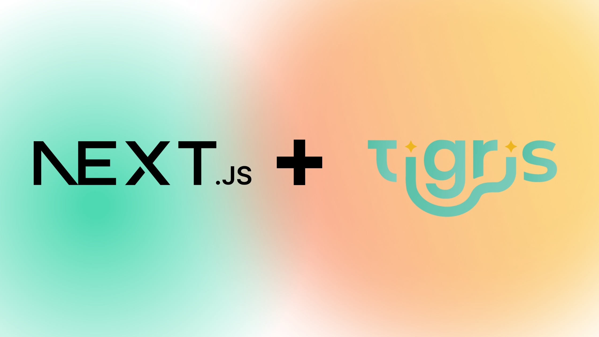
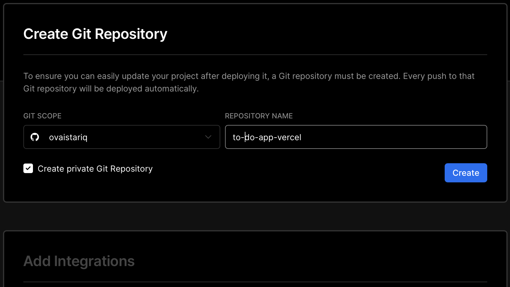
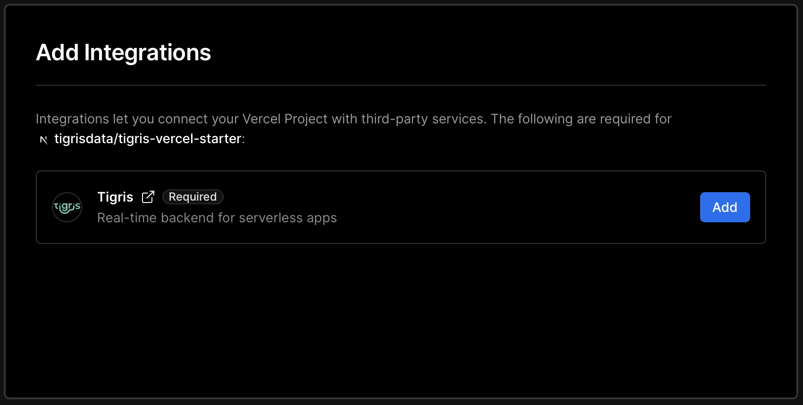
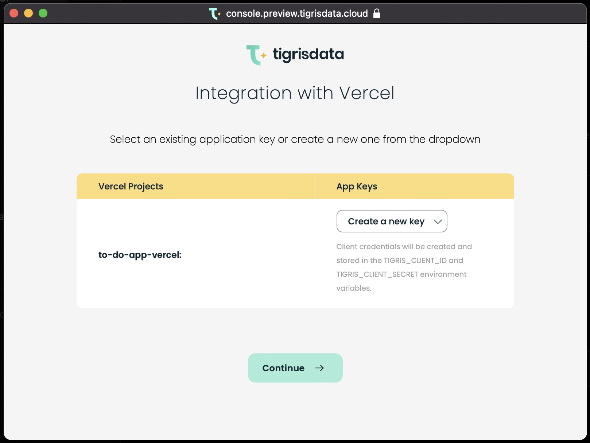
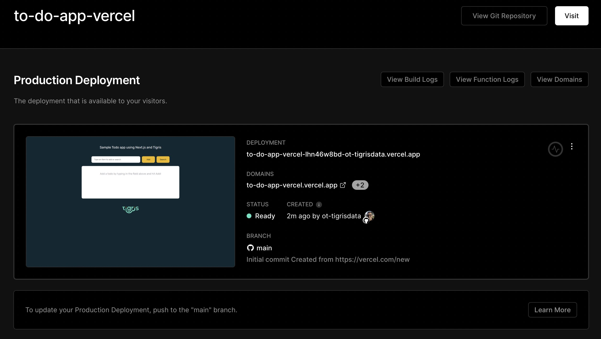

import tigrisConfig from "@site/tigris.config.js";

<!-- MARKDOWN LINKS -->

[tigris-url]: https://docs.tigrisdata.com/guides/nextjs/
[nextjs-url]: https://nextjs.org/
[vercel-url]: https://vercel.com/
[tigris-todo-repo-url]: https://github.com/tigrisdata/tigris-vercel-starter

[Next.js][nextjs-url] gives you the best developer experience with all the
features you need to build modern, fast production-ready applications.
[Tigris][tigris-url] is the perfect companion for Next.js as it is similarly
built with developer experience in mind and is truly serverless: build
data-rich features, seamlessly implement search, and easily use it with
serverless functions, all without needing to do Ops.



<!--truncate-->

Now with the introduction out of the way, it is time to demonstrate how.

This is the first of a series of blog posts where we will demonstrate how
easy it is to build Next.js apps with Tigris. We will build a
**to-do list app** and deploy it to [Vercel][vercel-url]. The to-do list app
will have the following features:

- add to-do items to the list
- update to-do items as completed
- delete to-do items
- search for to-do items in the list

To follow along with this tutorial you can get the code from the
[GitHub repo][tigris-todo-repo-url]. This is how the to-do app will look
once its deployed:
[https://tigris-nextjs-starter-kit.vercel.app/](https://tigris-nextjs-starter-kit.vercel.app/)

## Prerequisites

For this tutorial you'll need:

1. [GitHub account (sign up for free)](https://github.com)
2. <a href={tigrisConfig.signupUrl}>Tigris Cloud account (sign up for free)</a>
3. [Vercel account (sign up for free)][vercel-url] to deploy app
4. Node.js 16+
5. npm and npx

## Deploying the to-do list app to Vercel

We will start off first by deploying the pre-prepared to-do list app to Vercel
from the [GitHub repo][tigris-todo-repo-url]. Then once it is deployed and
running, we will explore the code in detail.

### Create a project on Vercel {#create-vercel-project}

Vercel makes it easier to deploy Git projects with a few clicks.

Hit the following **Deploy** button to get started with the Vercel
workflow to clone the repo to your account

[](https://vercel.com/new/clone?repository-url=https%3A%2F%2Fgithub.com%2Ftigrisdata%2Ftigris-vercel-starter&project-name=todo-list-app-tigris&repo-name=todo-list-webapp-tigris&demo-title=My%20To-do%20list%20webapp&demo-description=A%20To-do%20list%20webapp%20using%20NextJS%20and%20Tigris&integration-ids=oac_Orjx197uMuJobdSaEpVv2Zn8)

This should take you to Vercel to the "Create Git Repository" step



### Add Tigris integration

Pick a name for your new Git repo and then you'll configure the Tigris
integration that will setup the environment variables needed to connect to
Tigris: `TIGRIS_PROJECT`,`TIGRIS_URI`, `TIGRIS_CLIENT_ID`, `TIGRIS_CLIENT_SECRET` and `TIGRIS_DB_BRANCH`.



Hit the **Add** button and it will take you to the Tigris integration page
where in few simple steps you will be able to configure the integration.



Hit the **Continue** button and that's it!

Once the deployment completes, continue to your project dashboard on Vercel
where you'll find URL for your to-do list app



:tada: All done. Visit the URL in browser to access your to-do list app and play
around. :tada:

Now let's continue to explore the code for the to-do list app to see how
easily Tigris can be integrated with Next.js.

## Code walk-through

This section will elaborate on important aspects of the to-do list app
you just deployed. Let's glance over the important components of the project.

```text title="File structure"
|-- package.json
|-- lib
    |-- tigris.ts
|-- db
    |-- models
        |-- todoItems.ts
|-- pages
    |-- index.tsx
    |-- api
        |-- item
            |-- [id].ts
        |-- items
            |-- index.ts
            |-- search.ts
```

### Tigris data models and collections - `db/models`

With Tigris it all starts with the data model! Tigris stores data records as
documents. Documents are analogous to JSON objects but Tigris stores them in
an optimized binary format. Documents are grouped together in collections.

The to-do list app has a single [collection](https://docs.tigrisdata.com/documents/documents)
`todoItems` that stores the to-do items. The first thing you would do is
define the collection.

Tigris follows the convention of having the model stored in the
`db/models` directory. Within this directory we have the
`todoItems.ts` file which defines the collection named `todoItems`:

```ts title=db/models/todoItems.ts
import {
  Field,
  PrimaryKey,
  TigrisCollection,
  TigrisDataTypes,
} from "@tigrisdata/core";

@TigrisCollection("todoItems")
export class TodoItem {
  @PrimaryKey(TigrisDataTypes.INT32, { order: 1, autoGenerate: true })
  id!: number;

  @Field()
  text: string;

  @Field()
  completed: string;
}
```

### Connecting to Tigris - `lib/tigris.ts`

This file loads the environment variables that are populated by the Tigris integration, initializes the Tigris client, and exports it to be shared among all modules.

```ts title=lib/tigris.ts
import { Tigris } from "@tigrisdata/core";

const tigrisClient = new Tigris();
const tigrisDb = tigrisClient.getDatabase();

// export to share DB across modules
export default tigrisDb;
```

### Creating the database and collection - `scripts/setup.ts`

The file `scripts/setup.ts` sets up the database and collection in the `registerSchemas` array automatically at build time. It also sets up a branch for your database.

```ts title=scripts/setup.ts
import { Tigris } from "@tigrisdata/core";
import { TodoItem } from "../db/models/todoItems";

async function main() {
  // setup client
  const tigrisClient = new Tigris();
  // ensure branch exists, create it if it needs to be created dynamically
  await tigrisClient.getDatabase().initializeBranch();
  // register schemas
  await tigrisClient.registerSchemas([TodoItem]);
}

main();
```

### Pages

Let's take a look at `fetchListItems()` in this React component that
loads and renders the to-do list items.

```ts title=pages/index.ts
// Fetch Todo List
const fetchListItems = () => {
  setFetchStatus("loading");

  fetch("/api/items")
    .then((response) => response.json())
    .then((data) => {
      setFetchStatus("success");
      if (data.result) {
        setViewMode("list");
        setTodoList(data.result);
      } else {
        setFetchStatus("error");
      }
    })
    .catch(() => {
      setFetchStatus("error");
    });
};
```

Evidently this React component is only rendering the items returned by
`/api/items`.

Similarly, the `addTodoItem()`, to add a to-do list item, simply
makes a _POST_ request to `/api/items`.

```ts title=pages/index.ts
// Add a new to-do item
const addToDoItem = () => {
  if (queryCheckWiggle()) {
    return;
  }
  setFetchStatus("loading");

  fetch("/api/items", {
    method: "POST",
    body: JSON.stringify({ text: textInput, completed: false }),
  }).then(() => {
    setFetchStatus("success");
    setTextInput("");
    fetchListItems();
  });
};
```

We will now dive into the API routes to see how these are integrated with
Tigris that is powering our application.

:::tip Tigris and Serverless Functions

All the API routes are deployed as Serverless Functions. Tigris is
serverless itself and natively supports HTTP. This makes it a perfect fit
for Serverless Functions.

:::

### API routes to find and add items

All the Next.js API routes are defined under `/pages/api/`. We have three files:
`/pages/api/items/index.ts`, `/pages/api/items/search.ts` and
`/pages/api/item/[id].ts` that expose following endpoints:

- `GET /api/items` to get an array of to-do items as `Array<TodoItem>`
- `POST /api/items` to add an item to the list
- `GET /api/items/search?q=query` to find and return items matching the given query
- `GET /api/item/{id}` to fetch an item
- `PUT /api/item/{id}` to update the given item
- `DELETE /api/item/[id]` to delete an item

Let's look at the `/api/items` api that supports both `GET` and `POST`
handlers.

```ts title=pages/api/items/index.ts
import type { NextApiRequest, NextApiResponse } from 'next'
import { TodoItem } from '../../../db/models/todoItems'
import tigrisDb from '../../../lib/tigris'

type Response = {
  result?: Array<TodoItem>
  error?: string
}

// GET /api/items -- gets items from collection
// POST /api/items {ToDoItem} -- inserts a new item to collection
export default async function handler (
  req: NextApiRequest,
  res: NextApiResponse<Response>
) {
  switch (req.method) {
    case 'GET':
      await handleGet(req, res)
      break
    case 'POST':
      await handlePost(req, res)
      break
    default:
      res.setHeader('Allow', ['GET', 'POST'])
      res.status(405).end(`Method ${req.method} Not Allowed`)
  }
}

...
```

`handleGet()` method is fetching and returning items from Tigris collection,
let's take a look at its implementation. You will see how easy it is to
fetch data from Tigris.

```ts title=pages/api/items/index.ts
...

async function handleGet(req: NextApiRequest, res: NextApiResponse<Response>) {
  try {
    const itemsCollection = tigrisDb.getCollection<TodoItem>(TodoItem)
    const cursor = itemsCollection.findMany()
    const items = await cursor.toArray()
    res.status(200).json({ result: items })
  } catch (err) {
    const error = err as Error
    res.status(500).json({ error: error.message })
  }
}

...
```

The `itemsCollection.findMany()` function sends a query to Tigris and
returns a cursor to fetch results from collection.

Let's look at `handlePost()` implementation that inserts a `TodoItem` in
collection by using the `insertOne()` function.

```ts title=pages/api/items/index.ts
...

async function handlePost(req: NextApiRequest, res: NextApiResponse<Response>) {
  try {
    const item = JSON.parse(req.body) as TodoItem
    const itemsCollection = tigrisDb.getCollection<TodoItem>(TodoItem)
    const inserted = await itemsCollection.insertOne(item)
    res.status(200).json({ result: [inserted] })
  } catch (err) {
    const error = err as Error
    res.status(500).json({ error: error.message })
  }
}
```

### API route to search items

Tigris makes it really easy to implement search within your applications by
providing an embedded search engine that makes all your data instantly
searchable.

Let's take a look at the search handler to see how easy it is to add
powerful real-time search functionality.
The `itemsCollection.search` functions sends a search query to Tigris and
fetches the documents that match the query.

:::tip Tigris real-time search

Note how you did not have to setup Elasticsearch, or configure search
indexes. It was all taken care for you automatically.

:::

```ts title=pages/api/items/search.ts
import { NextApiRequest, NextApiResponse } from "next";
import { TodoItem } from "../../../db/models/todoItems";
import tigrisDb from "../../../lib/tigris";

type Data = {
  result?: Array<TodoItem>;
  error?: string;
};

// GET /api/items/search?q=searchQ -- searches for items matching text `searchQ`
export default async function handler(
  req: NextApiRequest,
  res: NextApiResponse<Data>
) {
  const query = req.query["q"];
  if (query === undefined) {
    res.status(400).json({ error: "No search query found in request" });
    return;
  }
  try {
    const itemsCollection = tigrisDb.getCollection<TodoItem>(TodoItem);
    const searchResult = await itemsCollection.search({ q: query as string });
    const items = new Array<TodoItem>();
    for await (const res of searchResult) {
      res.hits.forEach((hit) => items.push(hit.document));
    }
    res.status(200).json({ result: items });
  } catch (err) {
    const error = err as Error;
    res.status(500).json({ error: error.message });
  }
}
```

## Summary

In this tutorial, you deployed a to-do list Next.js app that uses Tigris as
the backend. You saw all the powerful functionality that Tigris provides, and
how easy it is to use it within Serverless Functions.

Tigris is the easiest way to work with data in your Next.js applications.
Tigris and Next.js provide developers with the fastest way to build fast,
data-rich and highly-responsive applications.

You can find the complete source code for this tutorial
[GitHub repo] [tigris-todo-repo-url], feel free to raise issues or
contribute to the project.

Happy learning!

---

import BetaSignupNextJSCTA from "../_beta-signup-nextjs-cta.mdx";

<BetaSignupNextJSCTA />
