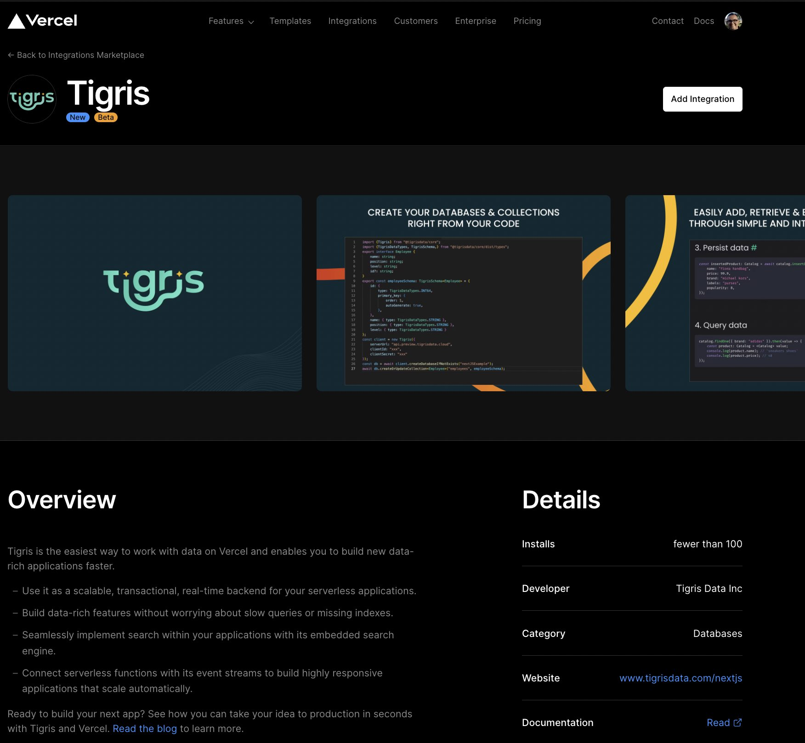

We are excited to announce that Tigris is now available on the
[Vercel Integrations Marketplace](https://vercel.com/integrations/tigris).
If you are already using Vercel to develop and ship data-rich applications
or considering it for a new application, this integration enables you to add
[Tigris](https://www.tigrisdata.com/nextjs), _an Open Source Ops-free
Serverless alternative to MongoDB Atlas_, to your Vercel application within
a few minutes.

<!-- truncate-->

# Build data-rich applications with ease

[Vercel](https://vercel.com/) is known for providing a great experience to
developers to deploy and scale Next.js applications with ease and in a
configuration-free manner. Features such as CI/CD, serverless functions,
analytics and content delivery at the edge simplify the development workflow
and enable the developers to focus on building applications.

Tigris is the perfect companion to Vercel! Tigris is an open source,
ACID-transactional serverless document store which brings a Vercel-like modern
Ops-free developer experience for database users.

# Scale confidently with a true serverless database

Unlike MongoDB Atlas, it is built to be serverless from the ground-up.
Storage, compute and data-indexing are built as separate layers which can be
scaled independently. This is how Tigris provides a true serverless
experience and is able to scale easily based on the application's needs.

Tigris provides a native HTTP interface that makes it work well with
serverless applications where traditional databases suffer from
connection-related issues.

# The only database made for your development workflow

All the interactions with Tigris happen in code. Your development workflow is:

1. Define data models
2. Implement application logic, and
3. Push the code to production.

All the database changes (creation, modification) get taken care of
automatically, with no need to manually execute queries or click buttons.

It doesn't stop there, once your application is in production, Tigris
doesn't put the burden of DBA operations on you. It provides automated data
indexing which removes the need for DBA operations and means all the queries
are always fast - no infra setup or configuration needed.

Finally, unlike MongoDB Atlas, Tigris' local development environment can run
the entire platform in a single container, so you can develop locally and be
sure that your code behaves the same way in production.

# Get started today

If you're ready to start building your next application with Tigris
and Vercel, getting started is simple. Select
[Tigris](https://vercel.com/integrations/tigris) on the Vercel
Integrations Marketplace and automatically create and link Tigris with your
Vercel project in just a few clicks. We also have a
[starter app](https://github.com/tigrisdata/tigris-vercel-starter) available for
you to get you started quickly.

