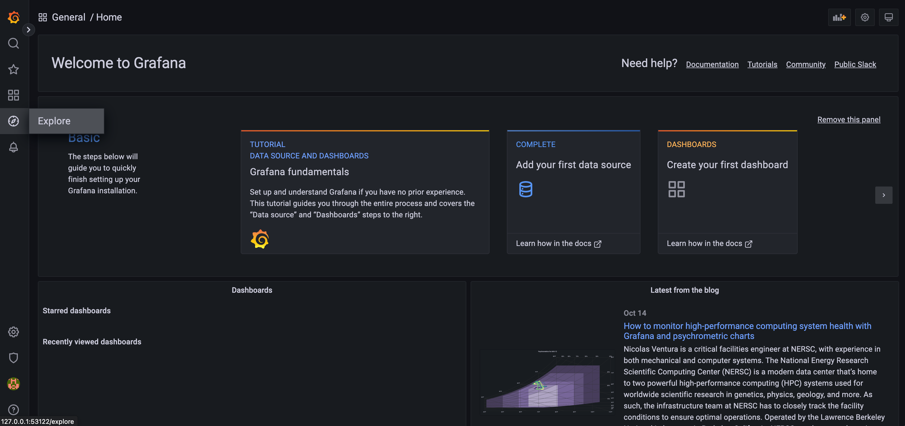
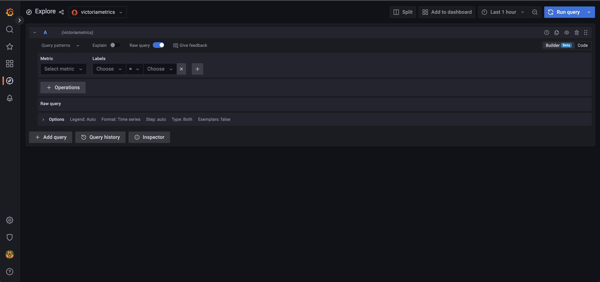
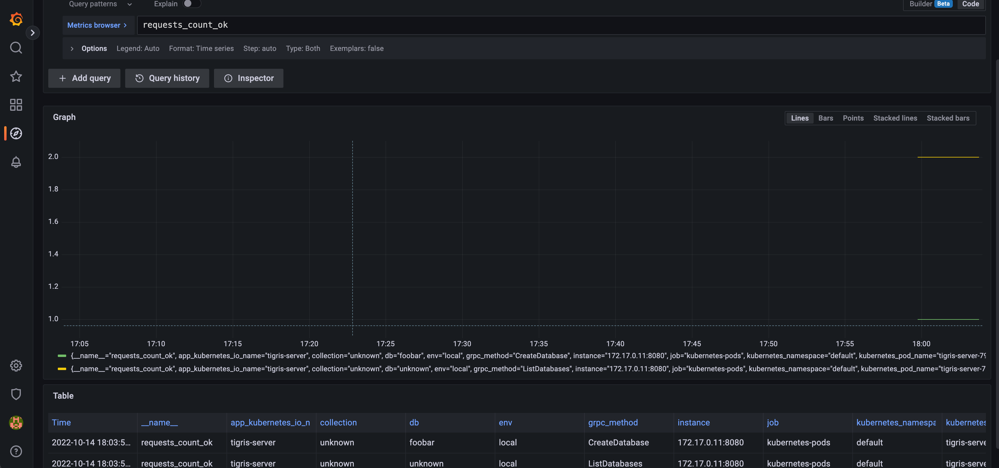

This blog post will show you how to set up the Tigris platform on your laptop. We will use [tigris-deploy](https://github.com/tigrisdata/tigris-deploy), which is a set of helm charts and a wrapper script. Using it, we will deploy FoundationDB, TypeSense, Grafana, VictoriaMetrics, Tigris itself and an nginx-based load balancer. For this example, we will use minikube but you may use k3s or Kind, if you prefer.
When you deploy the Tigris platform to your kubernetes cluster and already have metrics store and grafana, you can turn those off easily via values yaml. Tigris itself is providing prometheus compatible metrics on the /metrics url.

## Clone tigris-deploy repository

The quickest way to deploy Tigris is using its Helm Chart. To perform a Helm-based installation, you need to clone the tigris-deploy repository. This has several helm charts in it. One of them is tigris-stack, a “chart of charts” that installs all the dependencies, so installing that will result in a fully working Tigris platform.

```
$ git clone git@github.com:tigrisdata/tigris-deploy.git
$ cd tigris-deploy
```

## Start minikube

In this example, we will use minikube to have a kubernetes cluster. The goal of this step is to have a working kubernetes cluster and a kubernetes client that is configured to use that cluster. 

```
$ minikube start --kubernetes-version=1.21.14
😄  minikube v1.27.1 on Darwin 12.6
✨  Automatically selected the docker driver
📌  Using Docker Desktop driver with root privileges
👍  Starting control plane node minikube in cluster minikube
🚜  Pulling base image ...
🔥  Creating docker container (CPUs=2, Memory=16300MB) ...
🐳  Preparing Kubernetes v1.21.14 on Docker 20.10.18 ...
    ▪ Generating certificates and keys ...
    ▪ Booting up control plane ...
    ▪ Configuring RBAC rules ...
🔎  Verifying Kubernetes components...
    ▪ Using image gcr.io/k8s-minikube/storage-provisioner:v5
🌟  Enabled addons: storage-provisioner, default-storageclass
🏄  Done! kubectl is now configured to use "minikube" cluster and "default" namespace by default
```

After minikube is started, no pods will run in the default namespace.

```
$ kubectl get pods
No resources found in default namespace.
```

But you should see pods in the kube-system namespace.

```
$ kubectl get pods -A
NAMESPACE     NAME                               READY   STATUS    RESTARTS   AGE
kube-system   coredns-558bd4d5db-7x8hv           1/1     Running   0          82s
kube-system   etcd-minikube                      1/1     Running   0          94s
kube-system   kube-apiserver-minikube            1/1     Running   0          94s
kube-system   kube-controller-manager-minikube   1/1     Running   0          94s
kube-system   kube-proxy-69xh5                   1/1     Running   0          82s
kube-system   kube-scheduler-minikube            1/1     Running   0          94s
kube-system   storage-provisioner                1/1     Running   0          92s
```

At this point, we have minikube working, ready to deploy tigris in it.

## Deploy Tigris

For the sake of simplicity, we provide `deploy.sh`, a wrapper script. This script extends the Chart's functionality and addresses common tasks such as the setup of dependencies for the Chart.
We will deploy Tigris with no redundancy to minimize resource consumption and make Tigris fit on a reasonably equipped laptop.
For Production, you will want to enable full redundancy. Without overrides, the Charts will deploy resources with redundancy enabled.

```
$ bash deploy.sh
Getting updates for unmanaged Helm repositories...
...Successfully got an update from the "https://kubernetes.github.io/ingress-nginx" chart repository
Hang tight while we grab the latest from your chart repositories...
...Successfully got an update from the "grafana" chart repository
...Successfully got an update from the "vm" chart repository
Update Complete. ⎈Happy Helming!⎈
Saving 7 charts
Downloading ingress-nginx from repo https://kubernetes.github.io/ingress-nginx
Downloading victoria-metrics-single from repo https://victoriametrics.github.io/helm-charts
Downloading grafana from repo https://grafana.github.io/helm-charts
Deleting outdated charts
Release "tigris-stack" does not exist. Installing it now.
W1014 17:51:00.854310   48946 warnings.go:70] policy/v1beta1 PodSecurityPolicy is deprecated in v1.21+, unavailable in v1.25+
W1014 17:51:00.856463   48946 warnings.go:70] policy/v1beta1 PodSecurityPolicy is deprecated in v1.21+, unavailable in v1.25+
W1014 17:51:00.858829   48946 warnings.go:70] policy/v1beta1 PodSecurityPolicy is deprecated in v1.21+, unavailable in v1.25+
W1014 17:51:09.081654   48946 warnings.go:70] policy/v1beta1 PodSecurityPolicy is deprecated in v1.21+, unavailable in v1.25+
W1014 17:51:09.081939   48946 warnings.go:70] policy/v1beta1 PodSecurityPolicy is deprecated in v1.21+, unavailable in v1.25+
W1014 17:51:09.082027   48946 warnings.go:70] policy/v1beta1 PodSecurityPolicy is deprecated in v1.21+, unavailable in v1.25+
NAME: tigris-stack
LAST DEPLOYED: Fri Oct 14 17:50:59 2022
NAMESPACE: default
STATUS: deployed
REVISION: 1
```

The platform should become available 4-5 minutes after the deploy script is run. This can be verified with kubectl get all. 
Once It’s ready, you will see this output.

```
$ kubectl get all
NAME                                                         READY   STATUS    RESTARTS   AGE
pod/fdb-cluster-log-1                                        2/2     Running   0          2m18s
pod/fdb-cluster-stateless-1                                  2/2     Running   0          2m18s
pod/fdb-cluster-storage-1                                    2/2     Running   0          2m18s
pod/tigris-search-0                                          2/2     Running   1          4m45s
pod/tigris-server-79f77c8cb7-cxwxk                           1/1     Running   0          4m45s
pod/tigris-stack-fdb-operator-5d9dbc4c9d-6f6b2               1/1     Running   0          4m45s
pod/tigris-stack-grafana-7586c54dc-24fvn                     1/1     Running   0          4m45s
pod/tigris-stack-ingress-nginx-controller-57c4689667-th296   1/1     Running   0          4m45s
pod/tigris-stack-victoria-metrics-single-server-0            1/1     Running   0          4m45s

NAME                                                      TYPE           CLUSTER-IP       EXTERNAL-IP   PORT(S)                      AGE
service/kubernetes                                        ClusterIP      10.96.0.1        <none>        443/TCP                      9m7s
service/tigris-grpc                                       NodePort       10.109.166.16    <none>        80:31740/TCP                 4m45s
service/tigris-headless                                   ClusterIP      None             <none>        8080/TCP                     4m45s
service/tigris-http                                       NodePort       10.100.38.18     <none>        80:31945/TCP                 4m45s
service/tigris-search                                     NodePort       10.102.197.16    <none>        80:32466/TCP                 4m45s
service/tigris-stack-grafana                              ClusterIP      10.111.119.96    <none>        80/TCP                       4m45s
service/tigris-stack-ingress-nginx-controller             LoadBalancer   10.102.175.141   <pending>     80:31965/TCP,443:31050/TCP   4m45s
service/tigris-stack-ingress-nginx-controller-admission   ClusterIP      10.100.243.2     <none>        443/TCP                      4m45s
service/tigris-stack-victoria-metrics-single-server       ClusterIP      None             <none>        8428/TCP                     4m45s
service/ts                                                ClusterIP      None             <none>        8108/TCP                     4m45s

NAME                                                    READY   UP-TO-DATE   AVAILABLE   AGE
deployment.apps/tigris-server                           1/1     1            1           4m45s
deployment.apps/tigris-stack-fdb-operator               1/1     1            1           4m45s
deployment.apps/tigris-stack-grafana                    1/1     1            1           4m45s
deployment.apps/tigris-stack-ingress-nginx-controller   1/1     1            1           4m45s

NAME                                                               DESIRED   CURRENT   READY   AGE
replicaset.apps/tigris-server-79f77c8cb7                           1         1         1       4m45s
replicaset.apps/tigris-stack-fdb-operator-5d9dbc4c9d               1         1         1       4m45s
replicaset.apps/tigris-stack-grafana-7586c54dc                     1         1         1       4m45s
replicaset.apps/tigris-stack-ingress-nginx-controller-57c4689667   1         1         1       4m45s

NAME                                                           READY   AGE
statefulset.apps/tigris-search                                 1/1     4m45s
statefulset.apps/tigris-stack-victoria-metrics-single-server   1/1     4m45s
```

Here is an example output when the service is not ready yet.

```
$ kubectl get all
NAME                                                         READY   STATUS              RESTARTS   AGE
pod/tigris-search-0                                          0/2     ContainerCreating   0          40s
pod/tigris-server-79f77c8cb7-cxwxk                           0/1     ContainerCreating   0          40s
pod/tigris-stack-fdb-operator-5d9dbc4c9d-6f6b2               0/1     Init:0/3            0          40s
pod/tigris-stack-grafana-7586c54dc-24fvn                     0/1     Init:0/1            0          40s
pod/tigris-stack-ingress-nginx-controller-57c4689667-th296   1/1     Running             0          40s
pod/tigris-stack-victoria-metrics-single-server-0            0/1     Running             0          40s

NAME                                                      TYPE           CLUSTER-IP       EXTERNAL-IP   PORT(S)                      AGE
service/kubernetes                                        ClusterIP      10.96.0.1        <none>        443/TCP                      5m2s
service/tigris-grpc                                       NodePort       10.109.166.16    <none>        80:31740/TCP                 40s
service/tigris-headless                                   ClusterIP      None             <none>        8080/TCP                     40s
service/tigris-http                                       NodePort       10.100.38.18     <none>        80:31945/TCP                 40s
service/tigris-search                                     NodePort       10.102.197.16    <none>        80:32466/TCP                 40s
service/tigris-stack-grafana                              ClusterIP      10.111.119.96    <none>        80/TCP                       40s
service/tigris-stack-ingress-nginx-controller             LoadBalancer   10.102.175.141   <pending>     80:31965/TCP,443:31050/TCP   40s
service/tigris-stack-ingress-nginx-controller-admission   ClusterIP      10.100.243.2     <none>        443/TCP                      40s
service/tigris-stack-victoria-metrics-single-server       ClusterIP      None             <none>        8428/TCP                     40s
service/ts                                                ClusterIP      None             <none>        8108/TCP                     40s

NAME                                                    READY   UP-TO-DATE   AVAILABLE   AGE
deployment.apps/tigris-server                           0/1     1            0           40s
deployment.apps/tigris-stack-fdb-operator               0/1     1            0           40s
deployment.apps/tigris-stack-grafana                    0/1     1            0           40s
deployment.apps/tigris-stack-ingress-nginx-controller   1/1     1            1           40s

NAME                                                               DESIRED   CURRENT   READY   AGE
replicaset.apps/tigris-server-79f77c8cb7                           1         1         0       40s
replicaset.apps/tigris-stack-fdb-operator-5d9dbc4c9d               1         1         0       40s
replicaset.apps/tigris-stack-grafana-7586c54dc                     1         1         0       40s
replicaset.apps/tigris-stack-ingress-nginx-controller-57c4689667   1         1         1       40s

NAME                                                           READY   AGE
statefulset.apps/tigris-search                                 0/1     40s
statefulset.apps/tigris-stack-victoria-metrics-single-server   0/1     40s
```

From the services part of the `kubectl get all` output, it’s visible that the tigris-http and the tigris-grpc services are available in kubernetes. Tigris provides the same API with HTTP and GRPC. We will use the GRPC with the tigris command line client to try it out.

## Testing Tigris

We will use minikube to make these services available on our computer.

```
$ minikube service tigris-grpc --url
http://127.0.0.1:52999
❗  Because you are using a Docker driver on darwin, the terminal needs to be open to run it.
```

This exposes tigris service on port 52999. We can use the tigris command line client to interact with the platform running in kubernetes. Apart from this, now everybody knows I was writing this blog post using macOS :). 

```
$ export TIGRIS_URL="127.0.0.1:52999"
$ tigris list databases
$ tigris create database foobar
$ tigris list databases
foobar
```

With our small interaction there, we listed the available databases twice and created one. Now let’s check what metrics we have about these interactions. To do that, we need to interact with the grafana service that was deployed by tigris-deploy. First, we need to fetch grafana’s admin password.

```
$ kubectl get secret tigris-stack-grafana -o yaml | awk '/admin-password/ {print $2}' | base64 --decode ; echo
PASSWORD_OUTPUT_HERE
```

The actual output of this command will be the password that can be used to access grafana. Now we can access the grafana service with minikube service just like before.

```
$ minikube service tigris-stack-grafana --url
😿  service default/tigris-stack-grafana has no node port
http://127.0.0.1:53122
❗  Because you are using a Docker driver on darwin, the terminal needs to be open to run it.
```

After logging in with the admin password, click on explore to access the metrics.



The VictoriaMetrics instance stores the metrics and is pre-configured as a data source. Switch the query input field to code from the builder.



Once this is done, check the *requests_count_ok* metrics.



By checking *requests_count_ok*, we can view the metrics about the 3 requests we just issued. For further information, check out the [documentation on metrics](https://docs.tigrisdata.com/observability/observability/metrics), as well as the [documentation on deployment](https://docs.tigrisdata.com/overview/deployment). 

We also recorded a screen cast if you would like to follow the deployment procedure that way. 

import LiteYouTubeEmbed from "react-lite-youtube-embed";
import "react-lite-youtube-embed/dist/LiteYouTubeEmbed.css";

<LiteYouTubeEmbed
  id="uK-jifeXU0o"
  params="autoplay=1&autohide=1&showinfo=0&rel=0"
  title="Deploy Tigris on your laptop"
/>

<br />
