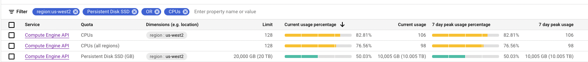

import tigrisConfig from "@site/tigris.config.js";

This blog outlines the deployment of Tigris on an Google's Kubernetes Engine (GKE) Autopilot instance.

The installation will use recommended settings for redundancy, allocating more resources than a simple laptop based installation would. For more information on the laptop based installation please consult our [previous blog](https://blog.tigrisdata.com/deploy-tigris-on-your-laptop)!

If you would rather watch a video, check out the deployment in action on YouTube:

import LiteYouTubeEmbed from "react-lite-youtube-embed";
import "react-lite-youtube-embed/dist/LiteYouTubeEmbed.css";

<LiteYouTubeEmbed
  id="--xp54g4kCU"
  params="autoplay=1&autohide=1&showinfo=0&rel=0"
  title="Deploying Tigris on GKE"
  poster="maxresdefault"
/>

<!--truncate-->

# Requirements

Below are the requirements for the installation box and the target Kubernetes environment.

The list of items required:

- Helm
- Google Cloud SDK
- git and tigris-deploy repository
- GKE cluster with sufficient quotas

## Installation Host

We will require Helm to perform the installation. It is assumed that the installation host already has access to the deployment target GKE cluster.

The version of `helm` used in this blog was:

```shell
❯ helm version
version.BuildInfo{Version:"v3.10.1", GitCommit:"9f88ccb6aee40b9a0535fcc7efea6055e1ef72c9", GitTreeState:"clean", GoVersion:"go1.19.2"}
```

To interface with the GKE cluster using `kubectl` conveniently, you may want to install the GKE plugin. You can install it with this command:

```shell
❯ gcloud components install gke-gcloud-auth-plugin
```

## GKE

Fortunately, GKE Autopilot clusters automatically comes with a set of controllers installed. The list includes [GKE Ingress](https://cloud.google.com/kubernetes-engine/docs/concepts/ingress)
that enables the creation of external load balancers for Ingress resources and controllers that manage other aspects of GCP, such as persistent disks.

One of the challenges of ensuring a successful deployment in GCP is to manage quotas efficiently. You will want to ensure quotas allow for sufficient CPU and SSD storage allocation.

Using the defaults of the Helm Chart, the following quotas proved to be sufficient:



# Deployment

The installation deploys the following components:

- Kubernetes Operator for FoundationDB
- FoundationDB
- Tigris Search (TypeSense)
- Tigris Server

You can install the components individually or together, using the encompassing tigris-stack Helm Chart. Below I’m going to use this Chart to install Tigris.

## Prepare For Deployment

Next, check out the deploy script repository:

```shell
❯ git clone git@github.com:tigrisdata/tigris-deploy.git
Cloning into 'tigris-deploy'...
remote: Enumerating objects: 177, done.
remote: Counting objects: 100% (97/97), done.
remote: Compressing objects: 100% (60/60), done.
remote: Total 177 (delta 43), reused 68 (delta 34), pack-reused 80
Receiving objects: 100% (177/177), 87.68 KiB | 568.00 KiB/s, done.
Resolving deltas: 100% (63/63), done.
```

Navigate to the folder which contains the helm chart of tigris-stack:

```shell
❯ cd tigris-deploy/helm/tigris-stack
```

## Deploy Tigris Stack

To ensure there is initial quorum for Tigris Search, we should deploy it initially with a single replica.

```shell
❯ helm install tigris-stack . --set tigris-search.replicas=1
W1103 11:56:22.823655   12264 gcp.go:119] WARNING: the gcp auth plugin is deprecated in v1.22+, unavailable in v1.26+; use gcloud instead.
To learn more, consult https://cloud.google.com/blog/products/containers-kubernetes/kubectl-auth-changes-in-gke
W1103 11:56:30.072806   12264 warnings.go:70] Autopilot increased resource requests for Deployment default/tigris-server to meet requirements. See http://g.co/gke/autopilot-resources.
W1103 11:56:30.089432   12264 warnings.go:70] Autopilot increased resource requests for Deployment default/tigris-stack-fdb-operator to meet requirements. See http://g.co/gke/autopilot-resources.
W1103 11:56:30.232424   12264 warnings.go:70] Autopilot set default resource requests on StatefulSet default/tigris-search for container tigris-ts-node-mgr, as resource requests were not specified, and adjusted resource requests to meet requirements. See http://g.co/gke/autopilot-defaults and http://g.co/gke/autopilot-resources.
NAME: tigris-stack
LAST DEPLOYED: Thu Nov  3 11:56:25 2022
NAMESPACE: default
STATUS: deployed
REVISION: 1
TEST SUITE: None
```

At this point your cluster will likely only have a few nodes:

```shell
❯ kubectl get nodes
W1103 11:57:04.068108   12352 gcp.go:119] WARNING: the gcp auth plugin is deprecated in v1.22+, unavailable in v1.26+; use gcloud instead.
To learn more, consult https://cloud.google.com/blog/products/containers-kubernetes/kubectl-auth-changes-in-gke
NAME                                 STATUS   ROLES    AGE   VERSION
gk3-doc-default-pool-ddd321b8-4v8x   Ready    <none>   42h   v1.23.8-gke.1900
gk3-doc-default-pool-e88cea62-9b77   Ready    <none>   42h   v1.23.8-gke.1900
```

The pods will be in the `Pending` state and trigger pod scale-ups:

```shell
❯ kubectl get pods
W1103 11:56:43.749022   12327 gcp.go:119] WARNING: the gcp auth plugin is deprecated in v1.22+, unavailable in v1.26+; use gcloud instead.
To learn more, consult https://cloud.google.com/blog/products/containers-kubernetes/kubectl-auth-changes-in-gke
NAME                                       READY   STATUS    RESTARTS   AGE
tigris-search-0                            0/2     Pending   0          14s
tigris-server-8646cb4b7b-fz6h4             0/1     Pending   0          14s
tigris-server-8646cb4b7b-hmxj9             0/1     Pending   0          14s
tigris-server-8646cb4b7b-qsjw7             0/1     Pending   0          14s
tigris-stack-fdb-operator-8fd845b9-wb4r5   0/1     Pending   0          14s


❯ kubectl describe pod tigris-search-0 | tail
W1103 11:58:18.395905   12695 gcp.go:119] WARNING: the gcp auth plugin is deprecated in v1.22+, unavailable in v1.26+; use gcloud instead.
To learn more, consult https://cloud.google.com/blog/products/containers-kubernetes/kubectl-auth-changes-in-gke
Node-Selectors:              <none>
Tolerations:                 kubernetes.io/arch=amd64:NoSchedule
                             node.kubernetes.io/not-ready:NoExecute op=Exists for 300s
                             node.kubernetes.io/unreachable:NoExecute op=Exists for 300s
Events:
  Type     Reason            Age   From                                   Message
  ----     ------            ----  ----                                   -------
  Warning  FailedScheduling  108s  gke.io/optimize-utilization-scheduler  0/2 nodes are available: 2 Insufficient cpu, 2 Insufficient memory.
  Warning  FailedScheduling  38s   gke.io/optimize-utilization-scheduler  0/3 nodes are available: 1 node(s) had taint {node.kubernetes.io/not-ready: }, that the pod didn't tolerate, 2 Insufficient cpu, 2 Insufficient memory.
  Normal   TriggeredScaleUp  26s   cluster-autoscaler                     pod triggered scale-up: [{https://www.googleapis.com/compute/v1/projects/mystic-berm-360500/zones/us-west2-a/instanceGroups/gk3-doc-nap-10cyk06a-9f9e9a3f-grp 0->1 (max: 1000)}]
```

Tigris will restart a few times before it changes state to `Running`. This is due to the unavailability of FoundationDB, the key-value store Tigris uses for persistence.

As you can see below, fdb is still in a Pending state when the `tigris-server` Pods are already up:

```shell
❯ kubectl get pods
W1103 12:05:30.762386   14893 gcp.go:119] WARNING: the gcp auth plugin is deprecated in v1.22+, unavailable in v1.26+; use gcloud instead.
To learn more, consult https://cloud.google.com/blog/products/containers-kubernetes/kubectl-auth-changes-in-gke
NAME                                       READY   STATUS              RESTARTS        AGE
fdb-cluster-log-1                          0/2     Pending             0               43s
fdb-cluster-log-2                          0/2     Pending             0               43s
fdb-cluster-log-3                          0/2     Pending             0               42s
fdb-cluster-log-4                          0/2     Pending             0               42s
fdb-cluster-log-5                          0/2     Pending             0               42s
fdb-cluster-stateless-1                    0/2     Pending             0               43s
fdb-cluster-stateless-10                   0/2     Pending             0               43s
fdb-cluster-stateless-2                    0/2     Pending             0               43s
fdb-cluster-stateless-3                    0/2     Pending             0               43s
fdb-cluster-stateless-4                    0/2     Pending             0               43s
fdb-cluster-stateless-5                    0/2     Pending             0               43s
fdb-cluster-stateless-6                    0/2     Pending             0               43s
fdb-cluster-stateless-7                    0/2     Pending             0               43s
fdb-cluster-stateless-8                    0/2     Pending             0               43s
fdb-cluster-stateless-9                    0/2     Pending             0               43s
fdb-cluster-storage-1                      0/2     Pending             0               43s
fdb-cluster-storage-2                      0/2     Pending             0               43s
fdb-cluster-storage-3                      0/2     Pending             0               43s
fdb-cluster-storage-4                      0/2     Pending             0               43s
fdb-cluster-storage-5                      0/2     Pending             0               43s
tigris-search-0                            2/2     Running             1 (5m49s ago)   9m1s
tigris-server-8646cb4b7b-fz6h4             0/1     ContainerCreating   0               9m1s
tigris-server-8646cb4b7b-hmxj9             0/1     CrashLoopBackOff    1 (6s ago)      9m1s
tigris-server-8646cb4b7b-qsjw7             0/1     CrashLoopBackOff    2 (7s ago)      9m1s
tigris-stack-fdb-operator-8fd845b9-zgr4t   1/1     Running             0               5m55s
```

:info: You can improve the deployment sequence by using more sophisticated deployment methods, such as Synchronization Waves in ArgoCD!

Give Autopilot enough time to scale up nodes for the deployment. FoundationDB will likely trigger a separate scale-up event on its own.

```shell
❯ kubectl get nodes
W1103 12:09:59.375610   16639 gcp.go:119] WARNING: the gcp auth plugin is deprecated in v1.22+, unavailable in v1.26+; use gcloud instead.
To learn more, consult https://cloud.google.com/blog/products/containers-kubernetes/kubectl-auth-changes-in-gke
NAME                                 STATUS     ROLES    AGE     VERSION
gk3-doc-default-pool-ddd321b8-4v8x   Ready      <none>   42h     v1.23.8-gke.1900
gk3-doc-default-pool-e88cea62-9b77   Ready      <none>   42h     v1.23.8-gke.1900
gk3-doc-nap-10cyk06a-854c84a8-4qss   Ready      <none>   4m23s   v1.23.8-gke.1900
gk3-doc-nap-10cyk06a-854c84a8-6fd2   Ready      <none>   4m21s   v1.23.8-gke.1900
gk3-doc-nap-10cyk06a-854c84a8-m6hp   Ready      <none>   4m23s   v1.23.8-gke.1900
gk3-doc-nap-10cyk06a-854c84a8-p8zq   Ready      <none>   4m21s   v1.23.8-gke.1900
gk3-doc-nap-10cyk06a-854c84a8-r744   Ready      <none>   4m22s   v1.23.8-gke.1900
gk3-doc-nap-10cyk06a-854c84a8-xj5b   Ready      <none>   4m20s   v1.23.8-gke.1900
gk3-doc-nap-10cyk06a-9f9e9a3f-4m2r   Ready      <none>   4m18s   v1.23.8-gke.1900
gk3-doc-nap-10cyk06a-9f9e9a3f-d6nm   Ready      <none>   4m18s   v1.23.8-gke.1900
gk3-doc-nap-10cyk06a-9f9e9a3f-ggxv   Ready      <none>   4m17s   v1.23.8-gke.1900
gk3-doc-nap-10cyk06a-9f9e9a3f-lfwl   Ready      <none>   4m18s   v1.23.8-gke.1900
gk3-doc-nap-10cyk06a-9f9e9a3f-s456   Ready      <none>   4m18s   v1.23.8-gke.1900
gk3-doc-nap-10cyk06a-9f9e9a3f-slg8   Ready      <none>   4m19s   v1.23.8-gke.1900
gk3-doc-nap-10cyk06a-9f9e9a3f-vg27   Ready      <none>   11m     v1.23.8-gke.1900
gk3-doc-nap-10cyk06a-9f9e9a3f-xf4k   Ready      <none>   4m18s   v1.23.8-gke.1900
gk3-doc-nap-10cyk06a-9f9e9a3f-xptm   Ready      <none>   4m18s   v1.23.8-gke.1900
gk3-doc-nap-10cyk06a-c0284c87-5hpx   Ready      <none>   4m13s   v1.23.8-gke.1900
gk3-doc-nap-10cyk06a-c0284c87-96c2   Ready      <none>   4m12s   v1.23.8-gke.1900
gk3-doc-nap-10cyk06a-c0284c87-c7h8   Ready      <none>   4m13s   v1.23.8-gke.1900
gk3-doc-nap-10cyk06a-c0284c87-klm4   Ready      <none>   4m12s   v1.23.8-gke.1900
gk3-doc-nap-10cyk06a-c0284c87-mrqp   Ready      <none>   4m12s   v1.23.8-gke.1900
gk3-doc-nap-10cyk06a-c0284c87-wwj2   Ready      <none>   4m12s   v1.23.8-gke.1900
gk3-doc-nap-qm2jb0jm-1393ada1-bgwt   Ready      <none>   11m     v1.23.8-gke.1900
gk3-doc-nap-qm2jb0jm-6d70fd3a-pxdr   Ready      <none>   12m     v1.23.8-gke.1900
```

Following the scale up of the nodes, the services to slowly also come up. As it is waiting for foundational services to start,

However, after about 15 minutes the Pods should become available:

```shell
❯ kubectl get pods
W1103 12:10:45.077224   16929 gcp.go:119] WARNING: the gcp auth plugin is deprecated in v1.22+, unavailable in v1.26+; use gcloud instead.
To learn more, consult https://cloud.google.com/blog/products/containers-kubernetes/kubectl-auth-changes-in-gke
NAME                                       READY   STATUS    RESTARTS        AGE
fdb-cluster-log-1                          2/2     Running   0               5m57s
fdb-cluster-log-2                          2/2     Running   0               5m57s
fdb-cluster-log-3                          2/2     Running   0               5m56s
fdb-cluster-log-4                          2/2     Running   0               5m56s
fdb-cluster-log-5                          2/2     Running   0               5m56s
fdb-cluster-stateless-1                    2/2     Running   0               5m57s
fdb-cluster-stateless-10                   2/2     Running   0               5m57s
fdb-cluster-stateless-2                    2/2     Running   0               5m57s
fdb-cluster-stateless-3                    2/2     Running   0               5m57s
fdb-cluster-stateless-4                    2/2     Running   0               5m57s
fdb-cluster-stateless-5                    2/2     Running   0               5m57s
fdb-cluster-stateless-6                    2/2     Running   0               5m57s
fdb-cluster-stateless-7                    2/2     Running   0               5m57s
fdb-cluster-stateless-8                    2/2     Running   0               5m57s
fdb-cluster-stateless-9                    2/2     Running   0               5m57s
fdb-cluster-storage-1                      2/2     Running   0               5m57s
fdb-cluster-storage-2                      2/2     Running   0               5m57s
fdb-cluster-storage-3                      2/2     Running   0               5m57s
fdb-cluster-storage-4                      2/2     Running   0               5m57s
fdb-cluster-storage-5                      2/2     Running   0               5m57s
tigris-search-0                            2/2     Running   1 (11m ago)     14m
tigris-server-8646cb4b7b-95lcf             1/1     Running   0               2m37s
tigris-server-8646cb4b7b-gff64             1/1     Running   2 (3m12s ago)   3m23s
tigris-server-8646cb4b7b-hmxj9             1/1     Running   5 (3m59s ago)   14m
tigris-stack-fdb-operator-8fd845b9-zgr4t   1/1     Running   0               11m
```

That’s it, your Tigris deployment should be now on its way coming up!

## Validate Deployment

This time we are going to validate Tigris Server using the Tigris CLI, using a small linux Pod that was deployed in the same namespace as the Tigris Stack.

First we need to install the CLI:

```shell
$ curl -sSL https://tigris.dev/cli-linux | sudo tar -xz -C /usr/local/bin
...
$ ls -la /usr/local/bin/tigris
-rwxr-xr-x 1 1001 121 17264640 Nov  3 07:21 /usr/local/bin/tigris
```

Set TIGRIS_URL to point at the Service endpoint of `tigris-server`:

```shell
$ export TIGRIS_URL=http://tigris-http:80
```

After that see if you can interact with the Tigris database using the `tigris` utility:

```shell
$ tigris quota limits
{
  "ReadUnits": 100,
  "WriteUnits": 25,
  "StorageSize": 104857600
}

$ tigris server info
{
  "server_version": "v1.0.0-beta.17"
}

$ tigris server version
tigris server version at http://tigris-http:80 is v1.0.0-beta.17

$ tigris create database robert

$ tigris list databases
robert
```

# Preparing For Production

## Scaling Search Out

To ensure Search is also redundant, once the deployment has progressed past transient state, Tigris Search should be scaled up to multiple replicas. In order to maintain quorum, the number of replicas should be set to an odd number, at a minimum of 3.

Below command will increase the number of Tigris Search replicas to 5 which should be a sufficiently large number of replicas for an initial Production deployment:

```shell
❯ helm upgrade tigris-stack . --set tigris-search.replicas=5
W1103 18:12:06.790278   82440 gcp.go:119] WARNING: the gcp auth plugin is deprecated in v1.22+, unavailable in v1.26+; use gcloud instead.
To learn more, consult https://cloud.google.com/blog/products/containers-kubernetes/kubectl-auth-changes-in-gke
W1103 18:12:14.011524   82440 warnings.go:70] Autopilot increased resource requests for Deployment default/tigris-stack-fdb-operator to meet requirements. See http://g.co/gke/autopilot-resources.
W1103 18:12:14.362641   82440 warnings.go:70] Autopilot increased resource requests for Deployment default/tigris-server to meet requirements. See http://g.co/gke/autopilot-resources.
W1103 18:12:14.711610   82440 warnings.go:70] Autopilot increased resource requests for StatefulSet default/tigris-search to meet requirements. See http://g.co/gke/autopilot-resources.
Release "tigris-stack" has been upgraded. Happy Helming!
NAME: tigris-stack
LAST DEPLOYED: Thu Nov  3 18:12:08 2022
NAMESPACE: default
STATUS: deployed
REVISION: 2
TEST SUITE: None
```

You can verify that additional replicas were started, using `kubectl`:

```shell
❯ kubectl get pods | grep tigris
W1103 18:12:33.301669   82537 gcp.go:119] WARNING: the gcp auth plugin is deprecated in v1.22+, unavailable in v1.26+; use gcloud instead.
To learn more, consult https://cloud.google.com/blog/products/containers-kubernetes/kubectl-auth-changes-in-gke
tigris-search-0                            2/2     Running   8 (25m ago)    6h16m
tigris-search-1                            0/2     Pending   0              19s
tigris-search-2                            0/2     Pending   0              19s
tigris-search-3                            0/2     Pending   0              18s
tigris-search-4                            0/2     Pending   0              18s
tigris-server-8646cb4b7b-95lcf             1/1     Running   0              6h4m
tigris-server-8646cb4b7b-gff64             1/1     Running   2 (6h5m ago)   6h5m
tigris-server-8646cb4b7b-hmxj9             1/1     Running   5 (6h5m ago)   6h16m
tigris-stack-fdb-operator-8fd845b9-zgr4t   1/1     Running   0              6h12m
```

The replicas should catch up quickly as there isn't a lot of search index to be synchronized. However, GKE Autopilot might need to scale up the nodes prior:

```shell
❯ kubectl describe pod tigris-search-1 | tail
W1103 18:14:04.069915   83269 gcp.go:119] WARNING: the gcp auth plugin is deprecated in v1.22+, unavailable in v1.26+; use gcloud instead.
To learn more, consult https://cloud.google.com/blog/products/containers-kubernetes/kubectl-auth-changes-in-gke
Node-Selectors:              <none>
Tolerations:                 kubernetes.io/arch=amd64:NoSchedule
                             node.kubernetes.io/not-ready:NoExecute op=Exists for 300s
                             node.kubernetes.io/unreachable:NoExecute op=Exists for 300s
Events:
  Type     Reason            Age   From                                   Message
  ----     ------            ----  ----                                   -------
  Warning  FailedScheduling  110s  gke.io/optimize-utilization-scheduler  0/24 nodes are available: 24 Insufficient cpu, 24 Insufficient memory.
  Normal   TriggeredScaleUp  74s   cluster-autoscaler                     pod triggered scale-up: [{https://www.googleapis.com/compute/v1/projects/mystic-berm-360500/zones/us-west2-c/instanceGroups/gk3-doc-nap-2qbw2tfi-b7486e29-grp 0->1 (max: 1000)} {https://www.googleapis.com/compute/v1/projects/mystic-berm-360500/zones/us-west2-a/instanceGroups/gk3-doc-nap-2qbw2tfi-efcf60fb-grp 0->1 (max: 1000)}]
  Warning  FailedScheduling  23s   gke.io/optimize-utilization-scheduler  0/26 nodes are available: 2 node(s) had taint {node.kubernetes.io/not-ready: }, that the pod didn't tolerate, 24 Insufficient cpu, 24 Insufficient memory.
```

It should take only a minute or two to get them up `Running`:

```shell
❯ kubectl get pods | grep tigris-search
W1103 18:15:05.957816   83699 gcp.go:119] WARNING: the gcp auth plugin is deprecated in v1.22+, unavailable in v1.26+; use gcloud instead.
To learn more, consult https://cloud.google.com/blog/products/containers-kubernetes/kubectl-auth-changes-in-gke
tigris-search-0                            2/2     Running   8 (27m ago)    6h18m
tigris-search-1                            2/2     Running   0              2m52s
tigris-search-2                            2/2     Running   0              2m52s
tigris-search-3                            2/2     Running   0              2m51s
tigris-search-4                            2/2     Running   0              2m51s
```

## Ending TLS

For a Production installation you will want to add a certificate to your load balancer. However, as this step does not have any Tigris specific detail, we are going to skip detailing this step.

# Wrapping Up!

I hope above could illustrate how easy it is to deploy Tigris to GKE Autopilot! Feel free to compare it to the [article about deploying Tigris to EKS](https://blog.tigrisdata.com/deploying-tigris-on-eks)
where we discussed the steps necessary to deploy it to AWS!

If you have any suggestions for us on Tigris related subjects that you think people might find interesting, feel free to reach out to us on either our Tigris Community <a href={tigrisConfig.discordUrl}>Discord</a> server!

Hope you enjoyed reading or watching this blog or vlog! If you did, stay tuned as next we are going to cover a few interesting subjects such as performing logical backups and restores with Tigris!

---

import BetaSignupCTA from "../_beta-signup-cta.mdx";

<BetaSignupCTA />
