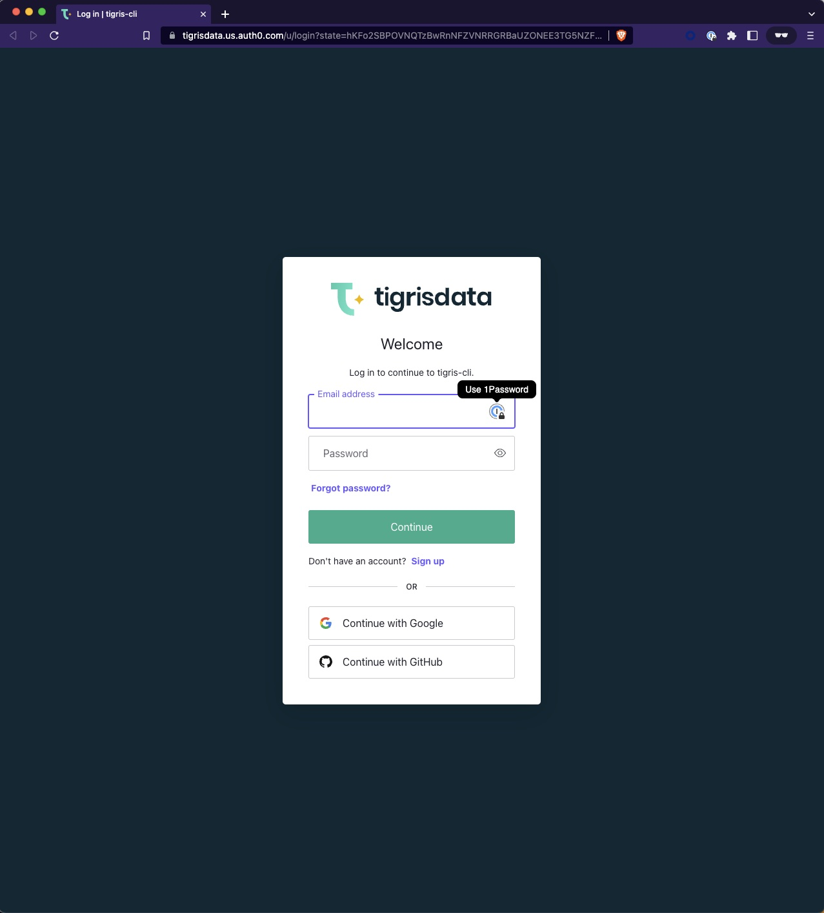
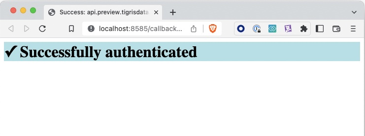

import tigrisConfig from "@site/tigris.config.js";

In this blog we focus on how we can dump and restore data stored in Tigris Server, an Open Source Database, using Tigris CLI. This will
be demonstrated using our public beta environment.

# Overview

At a high level the process looks as follows:

- Setting up Tigris CLI
- Authentication via the CLI
- Performing the data dump or restore

<!-- truncate-->

# Setting up Tigris CLI

We will need to grab the CLI binary that fits your platform and architecture. Several operating systems and architectures are supported.

I'm going to demonstrate the process using an M1 Mac laptop but the process should be similar on other platforms.

## Mac

```shell
$ curl -sSL https://tigris.dev/cli-macos | sudo tar -xz -C /usr/local/bin
```

Alternatively, if you are a _Homebrew_ user you may also use:

```shell
$ brew install tigrisdata/tigris/tigris-cli
```

## Linux

```shell
$ curl -sSL https://tigris.dev/cli-linux | sudo tar -xz -C /usr/local/bin
```

## Windows

```shell
C:\Users\robert> curl -sSLO https://tigris.dev/cli-windows
C:\Users\robert> tar xvzf cli-windows
```

# Authentication

In order to interact with the public beta environment, we need to first authenticate our client with Tigris.

You can run the following CLI command to initiate login:

```shell
$ tigris login
```

This should initiate browser based authentication:



Pick whichever authentication method is applicable to your user to authenticate.

A successful setup should yield the following message in the browser:



On the command line the utility should also inform you that authentication was successful and your credentials have been saved:

```shell
❯ tigris login
Opening login page in the browser. Please continue login flow there.
Successfully logged in

❯ cat ~/.tigris/tigris-cli.yaml
token: <redacted>
url: api.preview.tigrisdata.cloud
```

:information_source: Your authentication process may look different if you are self-hosting Tigris. For instance, you will not
have to authenticate if authentication has not been setup.

# Performing Data Dump

We are going to use a simple script to dump all the contents into individual JSON files in the current working directory:

```shell
$ cat dump_all.sh
#!/usr/bin/env bash

# Increase Tigris Timeout
TIGRIS_TIMEOUT=1h
export TIGRIS_TIMEOUT

for DATABASE in `tigris list databases`
do
  echo " [.] Dumping schema of db ${DATABASE}"
	tigris describe database "${DATABASE}" --schema-only > "${DATABASE}.schema"
	for COLLECTION in `tigris list collections "${DATABASE}"`
	do
		echo " [*] Backing up collection ${DATABASE}:${COLLECTION}"
		tigris read "${DATABASE}" "${COLLECTION}" > "${DATABASE}.${COLLECTION}.json"
	done
done
```

Above script increases the timeout and dumps the data in all the databases and their collections that you have access to into an
individual JSON file, one by one.

For example:

```shell
❯ ./dump_all.sh
 [.] Dumping schema of db tigris_netlify_starter
 [*] Backing up collection tigris_netlify_starter:todoItems
 [.] Dumping schema of db tigris_starter_ts
 [*] Backing up collection tigris_starter_ts:orders
 [*] Backing up collection tigris_starter_ts:products
 [*] Backing up collection tigris_starter_ts:social_messages
 [*] Backing up collection tigris_starter_ts:user_events
 [*] Backing up collection tigris_starter_ts:users
 [.] Dumping schema of db tigris_vercel_starter
 [*] Backing up collection tigris_vercel_starter:todoItems
 [.] Dumping schema of db tigris_starter_java
 [*] Backing up collection tigris_starter_java:orders
 [*] Backing up collection tigris_starter_java:product_collection
 [*] Backing up collection tigris_starter_java:users
 [.] Dumping schema of db meteorites
 [*] Backing up collection meteorites:landings
 [.] Dumping schema of db ycsb_tigris
 [*] Backing up collection ycsb_tigris:user_tables
 [.] Dumping schema of db auth0
 [*] Backing up collection auth0:users
 [.] Dumping schema of db catalog
 [*] Backing up collection catalog:products

❯ ls -la *.json *.schema
-rw-r--r--  1 rbarabas  staff      619 Nov  8 16:02 auth0.schema
-rw-r--r--  1 rbarabas  staff    49234 Nov  8 16:02 auth0.users.json
-rw-r--r--  1 rbarabas  staff    13866 Nov  8 16:02 catalog.products.json
-rw-r--r--  1 rbarabas  staff      424 Nov  8 16:02 catalog.schema
-rw-r--r--  1 rbarabas  staff  8892587 Nov  8 16:02 meteorites.landings.json
-rw-r--r--  1 rbarabas  staff      419 Nov  8 16:02 meteorites.schema
-rw-r--r--  1 rbarabas  staff      250 Nov  8 16:01 tigris_netlify_starter.schema
-rw-r--r--  1 rbarabas  staff        0 Nov  8 16:01 tigris_netlify_starter.todoItems.json
-rw-r--r--  1 rbarabas  staff        0 Nov  8 16:02 tigris_starter_java.orders.json
-rw-r--r--  1 rbarabas  staff        0 Nov  8 16:02 tigris_starter_java.product_collection.json
-rw-r--r--  1 rbarabas  staff     1722 Nov  8 16:02 tigris_starter_java.schema
-rw-r--r--  1 rbarabas  staff      173 Nov  8 16:02 tigris_starter_java.users.json
-rw-r--r--  1 rbarabas  staff        0 Nov  8 16:01 tigris_starter_ts.orders.json
-rw-r--r--  1 rbarabas  staff        0 Nov  8 16:01 tigris_starter_ts.products.json
-rw-r--r--  1 rbarabas  staff     1400 Nov  8 16:01 tigris_starter_ts.schema
-rw-r--r--  1 rbarabas  staff      553 Nov  8 16:01 tigris_starter_ts.social_messages.json
-rw-r--r--  1 rbarabas  staff     1161 Nov  8 16:02 tigris_starter_ts.user_events.json
-rw-r--r--  1 rbarabas  staff      563 Nov  8 16:02 tigris_starter_ts.users.json
-rw-r--r--  1 rbarabas  staff      250 Nov  8 16:02 tigris_vercel_starter.schema
-rw-r--r--  1 rbarabas  staff      172 Nov  8 16:02 tigris_vercel_starter.todoItems.json
-rw-r--r--  1 rbarabas  staff      545 Nov  8 16:02 ycsb_tigris.schema
-rw-r--r--  1 rbarabas  staff  7570000 Nov  8 16:02 ycsb_tigris.user_tables.json
```

# Restore

To make the process a bit more interesting, in this example we are going to do a partial restore to an empty database. Full restore can be
scripted similar to the data dump.

```shell
❯ tigris list databases
❯
```

First, let's make sure we will not time out during restore:

```shell
❯ export TIGRIS_TIMEOUT=1h
```

Next, let's create the database using the schema we captured prior:

```shell
❯ tigris create database tigris_vercel_starter
❯ tigris list databases
tigris_vercel_starter
```

Also, its collections

```shell
❯ cat tigris_vercel_starter.schema | tigris create collection tigris_vercel_starter
❯ tigris list collections tigris_vercel_starter
todoItems
```

Lastly, load the data into the database:

```shell
❯ cat tigris_vercel_starter.todoItems.json | tigris insert tigris_vercel_starter todoItems
❯ tigris read tigris_vercel_starter todoItems
{"text":"Pasta","completed":true,"id":6}
{"text":"Celery","completed":true,"id":10}
{"text":"Bread","completed":false,"id":12}
{"text":"Grocery","completed":false,"id":13}
```

# Summary

I hope above process gave you a good enough idea on how to perform data dumps out an into Tigris. If this article piqued your interest and would
like to read more on operational matters, please let us know on our community interfaces! Join our

<a href={tigrisConfig.discordUrl}>Tigris Community Discord Server</a>!
