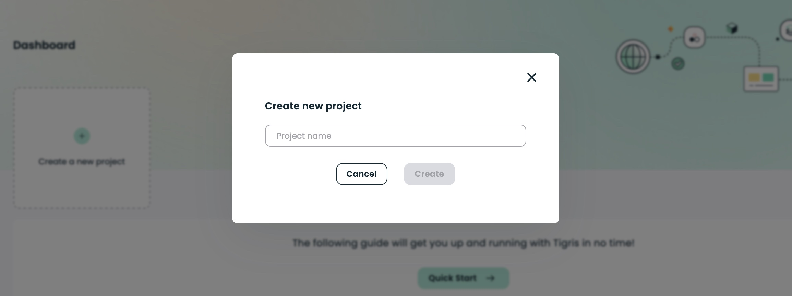
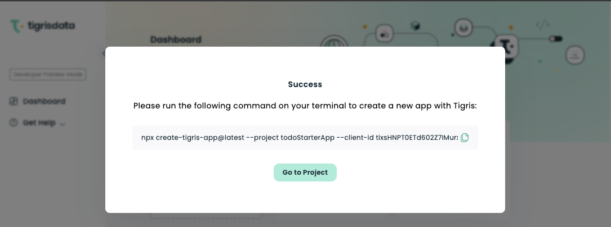
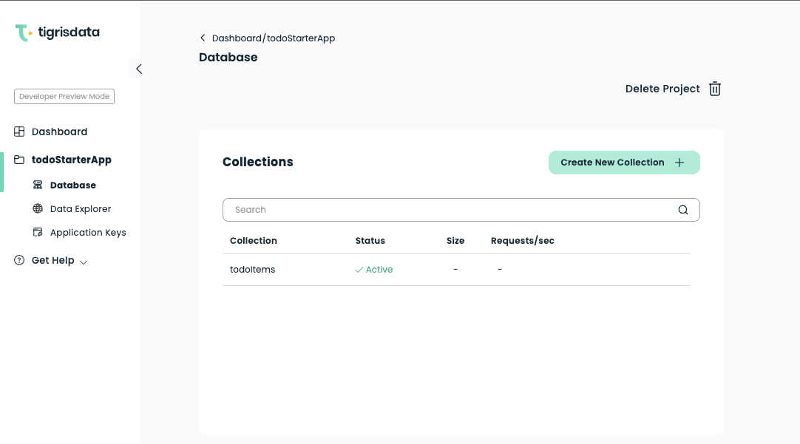

import createNextAppOutput from "!!raw-loader!./_create_next_app_output";
import runNextAppOutput from "!!raw-loader!./_run_next_app_output";
import CodeBlock from "@theme/CodeBlock";
import TerminalWindow from "@site/src/components/TerminalWindow/index";
import Installation from "@site/includes/_install_cloud_login.mdx";
import tigrisConfig from "@site/tigris.config.js";

We are happy to announce that [Next.js][nextjs-url] now has an officially supported example for creating
a new Next.js project with [Tigris][tigris-url] as its database.

<!-- truncate -->

## Prerequisites

<Installation />

## Create a new Next.js project

Use the official [create-next-app](https://nextjs.org/docs/api-reference/create-next-app) utility
to create a new Next.js project with Tigris as its database.

```shell
$ npx create-next-app --example with-tigris
```

<details>
  <summary>Output</summary>
  <TerminalWindow>
    <CodeBlock language="shell">{createNextAppOutput}</CodeBlock>
  </TerminalWindow>
</details>

## Create a Tigris Project

Now create a Tigris project for your Next.js application.
Click on the `Create a new project` button from the <a href={tigrisConfig.consoleUrl}>Tigris Cloud dashboard</a>.



Use `todoStarterApp` as the project name.

Tigris will generate the necessary credentials for your application and provide you with a command to create the application code with Tigris pre-configured.



As you have already created a Next.js project using `create-next-app` utility, you don't need to run this command.
Copy the `project name`, `clientId`, and `clientSecret` from the command shown
and close the modal.

### Configure environment variables

Now that you have created a Tigris project set up the environment variables
which will allow your application to connect with Tigris using the `project name`, `clientId`, and `clientSecret` from the previous step.

```dotenv title=.env
TIGRIS_URI=api.preview.tigrisdata.cloud
TIGRIS_PROJECT=todoStarterApp
TIGRIS_CLIENT_ID=ftSUj9B5czFW79s9M6YUkxKE3H4WeRyY
TIGRIS_CLIENT_SECRET=DOxxx
TIGRIS_DB_BRANCH=main
```

### Run the Next.js app

Now run the app and see it automatically create your database and collection.

```shell
$ cd my-tigris-app
$ npm run dev
```

<details>
  <summary>Output</summary>
  <TerminalWindow>
    <CodeBlock language="shell">{runNextAppOutput}</CodeBlock>
  </TerminalWindow>
</details>

Go back to the Tigris web console to view your database and collection.



<!-- MARKDOWN LINKS -->

[nextjs-url]: https://nextjs.org/
[tigris-url]: https://docs.tigrisdata.com/guides/nextjs/
