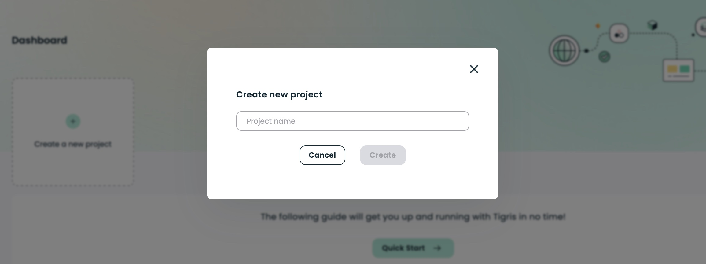

import netlifyDevOutput from "!!raw-loader!./_netlifyDevOutput";
import envFileInput from "!!raw-loader!./_envFileInput";
import createAppKeyOutput from "!!raw-loader!./_createAppKeyOutput";
import npmRunLoadOutput from "!!raw-loader!./_npmRunLoadOutput";
import CodeBlock from "@theme/CodeBlock";
import TerminalWindow from "@site/src/components/TerminalWindow/index";
import tigrisConfig from "@site/tigris.config.js";
import Installation from "@site/includes/_install_cloud_login.mdx";

# Using Tigris Search and Netlify Functions to Add Full-Text Search to an E-commerce Store Built with Nuxt

Search is a fundamental part of an application, especially when we build retail and e-commerce applications. Search
provides your customers with a great shopping experience. This blog will demonstrate how Tigris
makes it super easy to add real-time and full-text search to your application using the Tigris embedded search engine,
which automatically makes all your data searchable.


The article will be focusing mainly on integrating full-text search capabilities using Tigris and Nuxt.js and may skip
over a few things like styling etc., which will be pre-generated in the template used for this tutorial.

Checkout the [e-commerce full-text serach demo](https://nuxt-ecommerce-netlify.netlify.app/) for a working example of the
e-commerce site that we'll build in this tutorial. The [e-commerce full-text search demo source code](https://github.com/tigrisdata/tigris-netlify-ecommerce)
is available on GitHub if you want to explore the code on your own. Otherwise, follow along with the tutorial.

<!--truncate-->

## Prerequisites

<Installation />

## Getting Started

The first step is to clone the repository that contains the starting source code.

```mdx-code-block
<TerminalWindow>
<CodeBlock language="shell">git clone -b ecommerce-search-scaffold git@github.com:tigrisdata/tigris-netlify-ecommerce.git</CodeBlock>
</TerminalWindow>
```

`cd` into the project directory:

```shell
cd tigris-netlify-ecommerce
```

The layout of this project is like below:

```text
tigris-netlify-ecommerce
├── package.json
└── pages
    ├── all.vue
    ├── cart.vue
    ├── index.vue
    ├── women.vue
    └── men.vue
└── layouts
    ├── default.vue
└── static
    ├── storedata.json
└── functions
    ├── read-all-products.ts
    ├── create-payment-intent.ts
    └── handle-payment-succeeded.ts
|── lib
    └── tigris.ts
├── db
│   └── models
|       └── products.ts
|── scripts
    └── setup.ts
└── store
    └── index.js
```

- `package.json` - Configuration for the Node project.
- `pages/` - This is where all the vue files that encapsulate the template, logic, and styling of a Vue component.
- `functions/` - All serverless functions (API endpoints) for the application are defined in this directory.
- `db/models/products.ts` - Contains the code to define the schema of the `products` collection.
- `scripts/setup.ts` - Contains the scripts that creates the collection using the schema defined in the `models/products.ts` file.
- `lib/tigris` - This is where the Tigris client is initialized and exported across other modules.
- `store/` - Vuex store.

## Create a Tigris Project

To obtain the necessary credentials to connect your e-commerce store application with a Tigris database, you need to create a Tigris project.
To do that, go to your <a href={tigrisConfig.consoleUrl}>Tigris Cloud Console</a> and click on the `Create a new project` button.
Then use `catalog` as the project name and click on the `Create` button.



Select **Go to Project** in the next dialog.

### Configure environment variables

Upon creation of a project, Tigris will automatically generate an application key with the required credentials for your application.
Select **Application Keys** and click the eye icon on the row for the listed key. This will open a dialog containing the values you
need to configure your local application with via environment variables:

| Dialog        | Environment variable   |
| ------------- | ---------------------- |
| URL           | `TIGRIS_URI`           |
| Client ID     | `TIGRIS_CLIENT_ID`     |
| Client Secret | `TIGRIS_CLIENT_SECRET` |
| Name          | `TIGRIS_PROJECT`       |

Now, create a `.env` file in the root directory of the project folder and copy the values for `TIGRIS_URI`, `TIGRIS_PROJECT`, `TIGRIS_CLIENT_ID`,
and `TIGRIS_CLIENT_SECRET` from the dialog in the Tigris web console and add them to the file.
You should also include the `TIGRIS_DB_BRANCH` variable to establish a branch for your Tigris database. It is a good practice to use the `main`
branch for a production environment and any other branch for development environments.

```dotenv title=.env
TIGRIS_URI=api.preview.tigrisdata.cloud
TIGRIS_PROJECT=catalog
TIGRIS_CLIENT_ID=ftSxxx
TIGRIS_CLIENT_SECRET=DOxxx
TIGRIS_DB_BRANCH=main
```

## Add full-text search capabilities

To add full-text search to our application, we only need three things:

1. Serverless functions to call Tigris search
2. An async action in the vuex store to call Tigris search serverless function
3. A search vue component for the search text in the UI

### Step:1 Serverless functions to call Tigris Search

Let's write a serverless function to add search functionality to the e-commerce store. This
serverless function will be used by the vuex store to power search functionality for the application.

#### ⌲ Add the following code inside `functions/search-products.ts`.

```ts title=functions/search-products.ts
import { Handler } from "@netlify/functions";
import tigrisDB from "~/lib/tigris";
import { Product } from "~/db/models/products";

const handler: Handler = async (event, context) => {
  const searchReq = JSON.parse(event.body);

  try {
    const products = tigrisDB.getCollection<Product>(Product);
    const searchResult = await products.search({ q: searchReq.q as string });
    const productHits = new Array<Product>();
    for await (const res of searchResult) {
      res.hits.forEach((hit) => productHits.push(hit.document));
    }
    return {
      statusCode: 200,
      body: JSON.stringify(productHits),
    };
  } catch (err) {
    console.log(err);
    return {
      statusCode: 500,
      body: JSON.stringify({
        status: err,
      }),
    };
  }
};

export { handler };
```

The main thing to note in the above serverless function is that we are simply calling `search` on the product collection.

### Step2: Integrate Search Serverless functions in vuex store

The next step is to integrate the serverless function that we have just added to the vuex store.
Here we will be adding an async action, `searchProducts`.

#### ⌲ Add the following code inside actions `export const actions = {...}` in `store/index.ts`

```ts title=searchProducts
async searchProducts({ commit }, keyword) {
  try {
    const response = await axios.post(
      "/.netlify/functions/search-products",
      {
        q: keyword,
      },
      {
        headers: {
          "Content-Type": "application/json"
        }
      }
    );
    if (response.data) {
      commit("searchProducts", response.data);
    }
  } catch (e) {
    console.log("error", e);
  }
}
```

The `searchProducts` async action is making a `POST` request with a parameter `q` with a value assigned by the `keyword` variable.
This request calls the serverless function on the path `/.netlify/functions/search-products`. `keyword` is the text the user wants
to search for within the e-commerce catalog. We will see in Step 3 how the vue is passing the
text to this async action.

The next step is to update the mutations based on the actions that we have added. Add the `searchProducts` in the
`export const mutations = {...}` by adding the following code.

```ts title=searchProducts
searchProducts: (state, payload) => {
  state.searchdata = payload;
};
```

> Note: Add a new variable "searchdata" in the state so that mutations can update it.

Add a `searchResult` inside getters `export const getters = {...}` to access search results

```ts title=searchResult
searchResult: (state) => state.searchdata;
```

### Step3: A search vue component for the search text in the UI

Create a `search.vue` file and add the following code to it:

```js title=pages/search.vue
<template>
    <div>
        <div class="searchHeader">
            <input type="text" v-model="keyword" placeholder="Search Keyword" />
            <button
                class="searchBtn"
                @click="search"
                :disabled="loading || !keyword"
                >{{(!loading) ? 'Search Products' : 'Loading...'}}</button>
        </div>

        <p class="noResults" v-if="usingSearch && !loading && searchResult.length<1">No results found..</p>

        <app-store-grid :data="(usingSearch) ? searchResult : storedata" />
    </div>
</template>
<script>
import AppStoreGrid from "~/components/AppStoreGrid.vue"
import { mapGetters, mapState } from 'vuex';
export default {
    components: {
        AppStoreGrid
    },
    computed: {
        ...mapGetters(["searchResult"]),
        ...mapState(["storedata"])
    },
    data() {
        return {
            keyword: "",
            error: "",
            loading: false,
            usingSearch: false,
        };
    },
    methods: {
        search() {
            this.loading = true;
            this.usingSearch = true;
            this.$store.dispatch("searchProducts", this.keyword).
            then(() => {
                this.loading = false;
            })
        }
    }
};
</script>

<style lang="scss" scoped>
.noResults {
    text-align: center;
}
.searchBtn {
    width: 180px;
}
.searchHeader {
    display: flex;
    justify-content: center;
    gap: 10px;
    margin-bottom: 40px;
}
</style>
```

Add this `search.vue` to the `AppNav.vue` component.

```js
<li>
  <nuxt-link to="/search">Search</nuxt-link>
</li>
```

At this point, you have successfully integrated Search into your application. You can also check out the
[full-text search e-commerce example](https://github.com/tigrisdata/tigris-netlify-ecommerce) on GitHub.

## Run the app

Let's reap the rewards. Run `netlify dev` using [netlify CLI](https://cli.netlify.com/) in the terminal.

You should see the following output:

```mdx-code-block
<TerminalWindow>
<CodeBlock language="shell">netlify dev</CodeBlock>
</TerminalWindow>
```

<details>
  <summary>Output</summary>
  <TerminalWindow>
    <CodeBlock language="shell">{netlifyDevOutput}</CodeBlock>
  </TerminalWindow>
</details>

Voila! The e-commerce store is accessible on [http://localhost:8888](http://localhost:8888)
in your browser, go ahead and play around.

## Summary

Tigris has an embedded search engine that automatically makes all your data searchable. This blog
demonstrated that adding search functionality in your application using Tigris search is super easy,
and it's all managed from your codebase. You can also check out this product catalog for your application
in the [Tigris console](https://console.preview.tigrisdata.cloud/).

<!-- MARKDOWN LINKS -->

[nuxtjs-url]: https://nuxtjs.org/
[tigris-netlify-ecommerce]: https://github.com/tigrisdata/tigris-netlify-ecommerce
[tweet-intent]: https://twitter.com/intent/tweet?url=https%3A%2F%2Ftigrisdata.com%2Fnextjs%2F&text=I%20learned%20how%20easy%20it%20is%20to%20build%20%23data%20rich%20applications%20using%20@nextjs%20and%20@TigrisData
