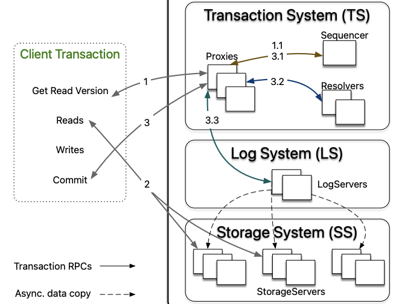

import styles from "!!raw-loader!./styles.css";

Tigris is a globally available, S3 compatible object storage service. Tigris
utilizes FoundationDB's transactional key-value interface for its underlying
metadata storage. This blog delves into the topics of serializable transactions,
the mechanics of transactions within Tigris, and concurrency control.

{/* truncate */}

Serializable transactions are a transactional consistency model that guarantees
that the outcome of concurrent transactions is equivalent to a serial execution
of these transactions. In other words, transactions executed concurrently under
serializable consistency appear to be executed one at a time in some sequential
order. This provides a strong guarantee for correctness, ensuring that the
execution of transactions doesn't create anomalous behaviors, such as dirty
reads or lost updates, which can occur in weaker isolation levels. FoundationDB,
used by Apple, Snowflake, and others, is such a system. It provides the same
consistency and isolation guarantees as Spanner - strict serializability and has
a fantastic correctness story through
[simulation testing](https://apple.github.io/foundationdb/testing.html).

## Serializable Transactions in Tigris

Tigris employs FoundationDB's transactional key-value interface for its
underlying metadata storage. Transactions are initiated automatically by Tigris
upon receiving a request, as they are core to every operation.

Tigris executes all operations within the context of a transaction by default,
enabling atomicity for all operations and allowing the application to perform
strongly consistent reads after writing to the database. In the following
section, we will review how transactions work inside Tigris.

### Transaction Coordinator

A Tigris deployment consists of multiple workers that receive and process the
requests. Upon receiving a request, one of the Tigris servers acts as a request
coordinator. The coordinator assesses whether the request can be handled locally
or must be forwarded to the transaction owner using the information available in
the transactional context. By reading this context, the coordinator can
determine if the request is new, an interactive, transactional request that can
be handled locally, or an interactive, transactional request that should be
forwarded to its owner.

### Managing Transaction Sessions

The session manager in Tigris is responsible for managing transaction sessions,
which are created each time a new transaction request is made. The session
manager attaches a transactional context to each session and tracks all sessions
created by the server using a session tracker. A session object is responsible
for managing the lifecycle of a transaction. Each session utilizes the storage
layer to communicate with the underlying storage engine to determine whether to
commit, rollback, or signal a failure. For each new transaction request, the
session manager attaches a transactional context to the session and tracks all
sessions created by the server using a session tracker.

### Concurrency Control

Many systems use the time of acquiring all locks to establish the serial order
among transactions and to guarantee atomicity and isolation. For instance,
[Spanner uses True-time](https://www.usenix.org/system/files/conference/osdi12/osdi12-final-16.pdf)
for determining the commit timestamps when all locks are acquired.
[CockroachDB uses the hybrid-logical clock](https://dl.acm.org/doi/pdf/10.1145/3318464.3386134),
a combination of physical and logical time. Tigris provides lock-free
concurrency control using FoundationDB, combining OCC and MVCC to order
transactions. This is achieved by a sequencer which determines the serial order
by assigning a read version and a commit version to each transaction. Proxies
offer MVCC read versions to clients and orchestrate transaction commits.

## Conclusion

We believe developers should not have to bear the responsibility of working
around the use of transactions and complicating their application architectures.
Instead, storage systems should provide ACID transactions by default and strong
data consistency mechanics, simplifying the applications and making them more
manageable for developers.
