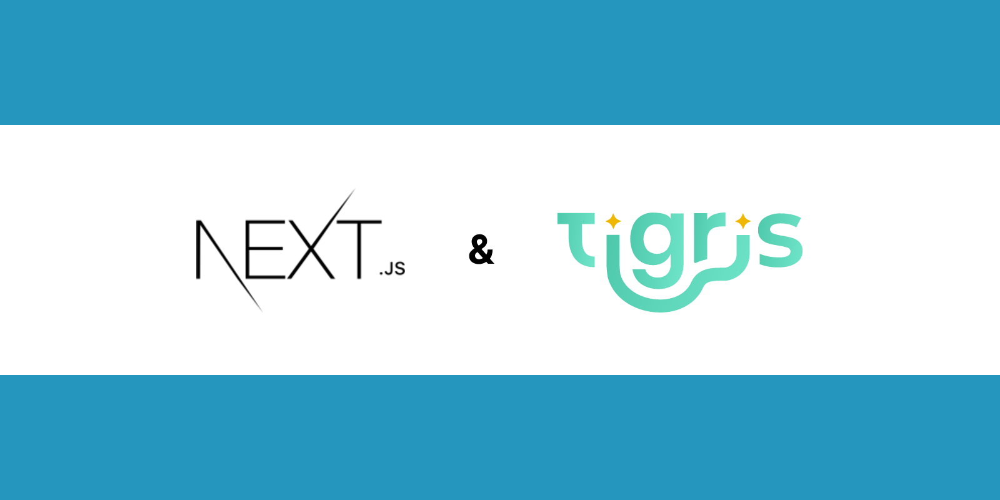
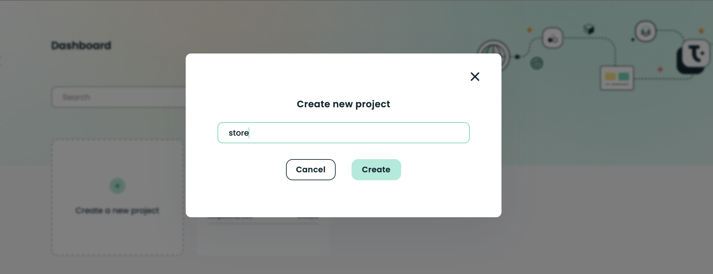
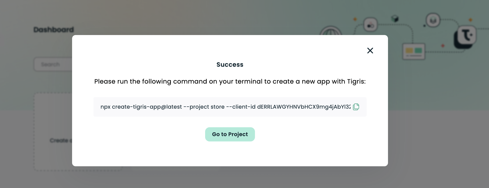
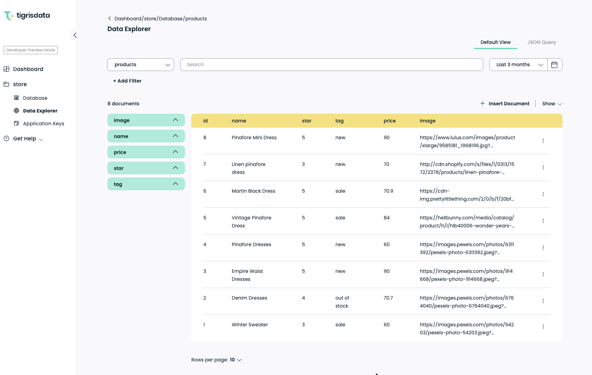

import tigrisConfig from "@site/tigris.config.js";
import TerminalWindow from "@site/src/components/TerminalWindow/index";
import CodeBlock from "@theme/CodeBlock";
import runSetupOutput from "!!raw-loader!./_runSetupOutput";

# "Adding real-time full-text search to a Next.js app with Tigris"



Real-time full-text search is a feature that enhances the user experience of web applications, particularly in online stores, social media platforms, documentation, and blogs.
It enables users to search and instantly get up-to-date information returned to them. Combining that with an experience where search results update as a user types (without direct user query submission or a page reload) provides an even better UX that helps users get the information they need more efficiently.

In this tutorial, we'll walk you through converting a static [Next.js](https://nextjs.org/) e-commerce product listing into a database-driven site with real-time full-text search of all products using [Tigris](https://www.tigrisdata.com/).

In the following section, we'll provide background info on real-time, full-text search, and how Tigris is an enabler of both. However, feel free to jump to the [Tutorial](./index.mdx#get-the-static-e-commerce-site) to follow the step-by-step guide.
Or, head to the [real-time full-text search GitHub repo](https://github.com/tigrisdata-community/real-time-full-text-search-nextjs) if you want to dive into the code.

<!-- truncate -->

## Background

### What Is Real-Time Search?

Real-time search returns search results based on an underlying database index that is instantaneously updated following any database operation.
This allows users to find relevant and up-to-date information as quickly as possible.

There are a growing number of [real-time search use cases](https://www.tigrisdata.com/blog/real-time-search-intro/),
such as news aggregator websites that display the latest headlines as soon as they are published and social media platforms that show new posts from a user's network as soon as they are posted.

The increase in use cases is driven by user preference; as more and more information is generated online, real-time search gives users what they are looking for faster than before.
As a result, many companies are incorporating real-time search capabilities to provide a better user experience on their online applications.

### What is Full-Text Search?

Full-text search is a technique that allows users to search for information in a database or document collection by entering a query: typically a combination of keywords.
The full-text search uses natural language processing and algorithms to understand the context and meaning of the query and returns results that are relevant even if they do not match the exact terms.
This method is commonly used in various applications such as online databases, search engines, e-commerce sites, and enterprise searches to help employees find the information they need.
Full-text search engines can provide features such as text indexing, parsing, tokenizing, stemming, creating an inverted index, ranking results, and providing an API or web interface for performing the search.

### How does Tigris help with real-time full-text search?

Tigris is a code-first developer data platform that integrates the database, search engine, and sync mechanism into a unified and fully managed platform, making it easy to build real-time search capabilities into applications.
The database functionality is built on [FoundationDB](https://blog.tigrisdata.com/building-a-database-using-foundationdb), an open-source, distributed, transactional key-value store.
Tigris is designed to integrate with real-time web applications and serverless functions.

Real-time full-text search can present several challenges for developers, such as running two systems (database and search) in parallel,
standing up and managing a sync mechanism to keep the database and search indexes in sync in real-time and remapping the search indexes as the database evolves.

Tigris addresses these challenges by providing an integrated database, automatic indexing, and search functionality in an all-in-one developer data platform.
This integration eliminates the complexity of running separate database and search systems, and the need to sync the database and search manually;
Tigris does it all automatically. With Tigris, developers can implement real-time search functionality within their applications using a single developer data platform.

Already convinced? Then, sign up for <a href={`${tigrisConfig.signupUrl}`}>Tigris Cloud</a>. You should still read the rest of the tutorial, too, though!

## Build a Next.js e-commerce product listing app

To follow along with this tutorial, you'll need to do the following:

- Install [Node.js 18.13.0](https://nodejs.org/) or newer and NPM
- A <a href={`${tigrisConfig.signupUrl}`}>Tigris Cloud</a> account

### Get the static e-commerce site

First, clone the Next.js e-commerce application created for the demonstrations in this tutorial:

```shell
git clone https://github.com/tigrisdata-community/real-time-full-text-search-nextjs
```

Then change the directory to the project folder, switch to the **starter** branch, and install the project dependencies:

```shell
cd real-time-full-text-search-nextjs
git checkout starter && npm install
```

You can now run the application and see the static listing of products:

```shell
npm run dev
```


The code and file structure will look familiar because the application was created using the `create-next-app` command.
The product information is defined in `db/products.json`, which is then used in `pages/index.tsx` to display the product listing.

Now, let's change the application to store and retrieve the products via a Tigris database.

### Create a Tigris Project

Create a Tigris project for your e-commerce store in your [Tigris Cloud dashboard](https://console.preview.tigrisdata.cloud/). Click on the **Create a new project** button, enter **store** as your project name, and click on the **Create** button to continue.



After you select the **Create** button, a window will appear with a command to scaffold an application for your new Tigris Project. But we can ignore that.



As mentioned above, we do not need to execute the `npx create-tigris-app` command. Click **Go to Project**.

Next, copy the `Project Name`, `Client ID`, and `Client Secret` from the Application keys section of your new Tigris project.
Then, open the project in your preferred code editor, create a `.env.local` file in the root directory of the project, and paste the credentials inside it:

```dotenv title=.env.local
TIGRIS_URI=api.preview.tigrisdata.cloud
TIGRIS_PROJECT=<REPLACE WITH PROJECT_NAME>
TIGRIS_CLIENT_ID=<REPLACE WITH CLIENT_ID>
TIGRIS_CLIENT_SECRET=<REPLACE WITH CLIENT_SECRET>
TIGRIS_DB_BRANCH="develop"
```

### Install the Tigris TypeScript SDK

To integrate Tigris into your application, install the Tigris Typescript SDK:

```shell
npm install @tigrisdata/core
```

Next, update the `tsconfig.json` file with the configurations below to specify the options the TypeScript compiler should use when transpiling the project's code:

```json title=package.json
{
  "compilerOptions": {
    ...

    "experimentalDecorators": true,
    "emitDecoratorMetadata": true,
  },
  "ts-node": {
    "compilerOptions": {
      "module": "commonjs"
    }
  },
  ...
}
```

In the above configuration, we update `compilerOptions` object, which contains several properties that control the TypeScript compiler's behavior, such as:

- `experimentalDecorators`: Enables experimental support for [TypeScript decorators](https://www.typescriptlang.org/docs/handbook/decorators.html), which is a way to add metadata to a class or its members.
- `emitDecoratorMetadata`: Enables emitting design-type metadata for decorated declarations in the source.
- `ts-node`: It's a configuration for [ts-node package](https://www.npmjs.com/package/ts-node) that allows you to run TypeScript files directly from the command line. `module` property is set to `commonjs`, meaning that the module resolution is set to use the commonjs strategy.

### Create Tigris Data Models

Each Tigris project has a database already set up, and it stores data records in the form of [documents](https://www.tigrisdata.com/docs/concepts/database/documents/).
These documents are similar to JSON objects and are organized into groups called Collections.

Let's create a Tigris model to define the collection for the e-commerce application.
Create a `db/models` folder in the root directory of your e-commerce project. Inside that folder, create a `store.ts` file, and add the code:

```ts title=db/models/products.ts
import {
  Field,
  PrimaryKey,
  TigrisCollection,
  TigrisDataTypes,
} from "@tigrisdata/core";

@TigrisCollection("products")
export class Product {
  @PrimaryKey(TigrisDataTypes.INT32, { order: 1, autoGenerate: true })
  id!: number;

  @Field()
  name: string;

  @Field()
  price: number;

  @Field()
  star: number;

  @Field()
  tag: string;

  @Field()
  image: string;
}
```

The above code defines a Tigris model for the `products` collection in your e-commerce application.
It imports the `@TigrisCollection` decorator, which defines that there should be a collection of `Product` named “products” by passing in a name for the collection as an argument.
The `TigrisDataTypes` type provides access to the various data types available in Tigris.
The `@Field` decorator defines the fields in the collection, and the `@PrimaryKey` decorator specifies the primary key for each record in the collection.

### Instantiate the Tigris Client and get the database

Let's initialize the Tigris client and export it to other parts of the application to make it available for use. Create a `lib/tigris.ts` file in the project root folder and add the code snippets below:

```tsx title=lib/tigris.ts
import { DB, Tigris } from "@tigrisdata/core";

const tigrisClient = new Tigris();
const tigrisDB: DB = tigrisClient.getDatabase();

// export to share client and DB across modules
export { tigrisClient, tigrisDB };
```

The code imports the `DB` and `Tigris` classes from the `@tigrisdata/core` package.
It creates an instance of the `Tigris` class, which initializes the Tigris client using the credentials stored in the environmental variables defined in `.env.local` (note: these have to be loaded).
Then creates a new variable called `tigrisDB` and assigns it to the value returned by calling the `getDatabase` method, which will get the pre-configured database of your project from the Tigris console.
Both the client and the database instances are exported for shared use within the application.

### Create Setup Scripts

Next, let's create a setup script that will create the collection for the data model defined above. Go ahead to create a `scripts/setup.ts` file and add the following code:

```tsx title=scripts/setup.ts
import { loadEnvConfig } from "@next/env";
loadEnvConfig(process.cwd());

import { Product } from "../db/models/store";
import { tigrisClient } from "../lib/tigris";

async function main() {
  // ensure branch exists, create it if it needs to be created dynamically
  await tigrisClient.getDatabase().initializeBranch();
  // create collections
  await tigrisClient.registerSchemas([Product]);
}

main()
  .then(async () => {
    console.log("Setup complete ...");
    process.exit(0);
  })
  .catch(async (e) => {
    console.error(e);
    process.exit(1);
  });
```

Here we import the `loadEnvConfig` function from the `@next/env` package, which is used to load environment variables from `.env.local`.
The `tigrisClient` is imported from the shared utility library we just created, and we also import the `Product` model.
The `loadEnvConfig` must be called before importing the `tigrisClient` as it relies on environmental variables having been loaded.

Within the `main` function, we initialize the Tigris client and create a collection with the `registerSchemas` method using the provided model schema.
We call the `initializeBranch()` from `getDatabase()` method to create a [database branch](https://www.tigrisdata.com/docs/concepts/database/branching/)
with the value supplied for the `TIGRIS_DB_BRANCH` variable in the `.env.local` file.

Then update your `package.json` file to add the scripts `setup`, `predev`, and `postbuild`, which all eventually run `setup.ts`:

```json title=package.json
  "scripts": {
    "predev": "npm run setup",
    "dev": "next",
    "build": "next build",
    "postbuild": "npm run setup",
    "setup": "npx ts-node ./scripts/setup.ts",
    "start": "next start",
    "typecheck": "tsc"
  }
```

Now, run the `scripts/setup.ts` file to create a collection for the **Product** model with the command:

```jsx
npm run setup
```

You'll see output similar to the following telling you the schema registration was successful:

<TerminalWindow>
  <CodeBlock language="shell">{runSetupOutput}</CodeBlock>
</TerminalWindow>

### Load Data to Tigris

With Tigris configured and the collection created for the application, it's time to load some data into the products database collection.
To do this, create a `scripts/loadData.ts` file with the code below:

```tsx title=scripts/loadData.ts
import { loadEnvConfig } from "@next/env";
loadEnvConfig(process.cwd());

import { Product } from "../db/models/store";
import { tigrisDB } from "../lib/tigris";
import productsJson from "../db/products.json";

async function main() {
  const products: Array<Product> = productsJson as Array<Product>;
  const productsCollection = tigrisDB.getCollection<Product>(Product);
  const inserted = await productsCollection.insertMany(products);
  console.log(inserted);
}

main()
  .then(async () => {
    console.log("Data loading complete ...");
    process.exit(0);
  })
  .catch(async (e) => {
    console.error(e);
    process.exit(1);
  });
```

As with the setup script, `loadEnvConfig` is imported and used to load the environment variables.
Then, it imports the `Product` model from `../db/models/store`, which defines the structure of the products that will be saved in the Tigris database.
It also imports `tigrisDB` object from `../lib/tigris`, which is responsible for handling the database operations.

The load data script reads the product data from the `../db/products.json` file and assigns it to the `productsJson` variable.
Then, it defines an async function `main` that performs an `Array<Product>` [type assertion](https://www.typescriptlang.org/docs/handbook/2/everyday-types.html#type-assertions) on `productsJson`.
Then, it uses the `tigrisDB` object to access the “products” collection and insert the data using the
[`insertMany`](https://www.tigrisdata.com/docs/sdkstools/typescript/database/insert/#insert-multiple-documents) method.
The function returns the result of the insertion and assigns it to the `inserted` variable, which is logged to the console.

> 💡 Tigris also has an [insertOne](https://www.tigrisdata.com/docs/sdkstools/typescript/database/insert/#insert-a-single-document) method to insert one or more documents into the collection.

Now, update the `package.json` file to add a script that allows you to load data from the command line:

```json title=package.json
...
"scripts": {
   ...
   "load-data": "npx ts-node ./scripts/loadData.ts"
},
...
```

Finally, use the command below to run the script that loads the product data in the `products.json` file into the Tigris database:

```shell
npm run load-data
```

Upon executing the `load-data` command, the products are loaded into the database and are visible on the data explorer page on the Tigris Console for your Tigris Project.



### Get All Products in the Next.js app

Now, let's add a function called `fetchAll` to the store API to an `api/store/index.ts` file to get all the products in the database:

```tsx title=pages/api/store/index.ts
import { NextApiRequest, NextApiResponse } from "next";
import { Product } from "../../../db/models/store";
import { tigrisDB } from "../../../lib/tigris";

type FetchAllResponse = {
  result?: Array<Product>;
  error?: string;
};

async function fetchAll(res: NextApiResponse<FetchAllResponse>) {
  try {
    const productsCollection = tigrisDB.getCollection<Product>(Product);
    const cursor = productsCollection.findMany();
    const products = await cursor.toArray();
    res.status(200).json({ result: products });
  } catch (err) {
    res.status(500).json({ error: err.message });
  }
}
```

The code here will fetch all the data from the products collection using the `findMany()` method
(see [Query Documents](https://www.tigrisdata.com/docs/sdkstools/typescript/database/query/) for more info).
It will convert the cursor to an array using `toArray()`method and store the data returned in the `products` variable.

### Define the Next.js API handler

With the script to load and function to get products out of the way, add a handler function to the API endpoint to call the function you've just created earlier on a **GET** request:

```tsx title=pages/api/store/index.ts
export default async function handler(
  req: NextApiRequest,
  res: NextApiResponse<FetchAllResponse>
) {
  switch (req.method) {
    case "GET":
      await fetchAll(res);
      break;
    default:
      res.setHeader("Allow", ["GET"]);
      res.status(405).end(`Method ${req.method} Not Allowed`);
  }
}
```

Here we used a `switch` statement to determine which operation to perform based on the HTTP method of the request, which is accessed using the `req.method` property.
If the request method is **GET**, the `fetchAll` function is called.

### Update the UI to fetch the products from Tigris

Let's update the user interface of your e-commerce application to show the products from the Tigris database and enable the real-time feature in the application.
First, update the **Home Component** in the `pages/index.tsx` as follows:

```tsx title=pages/index.tsx
//...

import { useEffect, useState } from "react";
import { Product } from "../db/models/store";

// import products from "../db/products.json";

export default function Home() {
  const [products, setProducts] = useState<Product[]>([]);

  const fetchProducts = async () => {
    try {
      const response = await fetch("/api/store");
      const { result } = await response.json();
      if (result) {
        setProducts(result);
      }
    } catch (e) {
      console.log(`Error: ${e}`);
    }
  };

  useEffect(() => {
    fetchProducts();
  }, []);

  //...
```

Here we import the `useEffect` and `useState` hooks from react and comment out the loading of the products from the JSON file.
We then create a state variable named `products` with a function `setProducts` to update the value of `products`.
We also define a function `fetchProducts` which uses the [fetch API](https://developer.mozilla.org/en-US/docs/Web/API/Fetch_API) to request the `/api/store` endpoint.

When the response is received within `fetchProducts`, it will be parsed as JSON, and the result property of the JSON object is passed to the `setProducts` function to update the `products` state variable.
Then we use the `useEffect` hook to call the `fetchProduts` function when the component renders for the first time.

We've now converted our static product listing into a database-driven product listing.

### Implement Real-time Search

At this point, you can get data from your collection by making an API request to the store API (`/api/store`). But we need to add one more API endpoint to enable the search experience for your users.
So, let's create `search.ts` file in the `api/store` directory to add real-time search to your application:

```ts title=pages/api/store/search.ts
import { NextApiRequest, NextApiResponse } from "next";
import { Product } from "../../../db/models/store";
import { tigrisDB } from "../../../lib/tigris";
import { SearchQuery } from "@tigrisdata/core";

type Data = {
  result?: Array<Product>;
  error?: string;
};

export default async function handler(
  req: NextApiRequest,
  res: NextApiResponse<Data>
) {
  const { query, page } = req.query;
  try {
    const productCollection = tigrisDB.getCollection<Product>(Product);
    const searchRequest: SearchQuery<Product> = { q: query as string };
    const results = await productCollection.search(
      searchRequest,
      Number(page) || 1
    );
    const products = new Array<Product>();
    for (const hit of results.hits) {
      products.push(hit.document);
    }
    res.status(200).json({ result: products });
  } catch (err) {
    res.status(500).json({ error: err.message });
  }
}
```

In addition to the **next** package imports, we also import the `Products` model, `SearchQuery` from the `tigrisdata/core` library and `tigrisDB` object.
We declare a `Data` type that defines the search response payload with properties, `results,` and `error` of type `Array<Products>` and `string,` respectively.

Then we destructure the `query` and `page` parameters from the incoming request's query object and search for products in a collection using the Tigris `search` method.
The search query is defined as a `SearchQuery` object, with the `q` property set to the incoming `query` parameter. The `page` parameter is passed to the `search` method, with a default value of `1`.

## Add search functionality to the UI

Begin by adding a state hook for the search query to the **Home Component** in `pages/index.tsx`:

```tsx title=pages/index.tsx
//...

export default function Home() {
  const [searchInput, setSearchInput] = useState<string>();

		//...
```

Next, create a function to make a **GET** request to the new search endpoint:

```jsx title=pages/index.tsx
//...

const searchQuery = async () => {
    const response = await fetch(`/api/store/search?query=${encodeURI(searchInput)}`);
    const { result } = await response.json();
    if (result) {
      setProducts(result);
    }
  };
  useEffect(() => {
		//...

```

The `searchQuery` function sends a **GET** request using `fetch` to the `/api/store/search` endpoint with a parameter name of `query` and the value set to an encoded version of the user's text entry.
The result is used to update the `products` state variable.

Next, update the `<form>` tag in the Home Component to add event listeners to call the the `SearchQuery` and `SetSearchInput` functions:

```tsx title=pages/index.tsx
<form className="d-flex" role="search">
  <input
    className="form-control me-2"
    type="search"
    placeholder="Search"
    aria-label="Search"
    onKeyUp={searchQuery}
    onChange={(e) => setSearchInput(e.target.value)}
  />
</form>
```

We bind the `searchQuery` function to the `onKeyUp` event so that the function is called to perform a search every time the user releases a key.

That's it! Let's try out the application.

### Test the Application

Now, let's test the application to see how the real-time search function works on your e-commerce application:

```shell
npm run dev
```

Your e-commerce application now lists the products from your Tigris database with the shiny real-time full-text search functionality.


### Conclusion

In this tutorial, we explored the concept of real-time full-text search and how to implement it in a Next.js application using Tigris.

As a demonstration, we developed a Next.js e-commerce product listing app and integrated the real-time search feature using Tigris.  
We began by setting up the Tigris TypeScript SDK and created scripts to create models for our product collection and import that product data into the database.
We then updated the application to retrieve the product details from the Tigris database via a Next.js API endpoint.
Finally, we added real-time full-text search functionality for the products via a new API endpoint and by updating the UI to listen for user keystroke events within a search form.

The complete code for this tutorial is available [here](https://github.com/tigrisdata-community/realtime-search/) on the **main** branch.

Next.js is a highly productive framework for building web apps.
This tutorial shows just some of the benefits of combining Next.js with Tigris, a new all-in-one developer data platform that provides databases and automatic search indexing for real-time search.
Check out the Tigris <a href={`${tigrisConfig.docsUrl}`}>documentation</a> to learn more. Happy coding!
