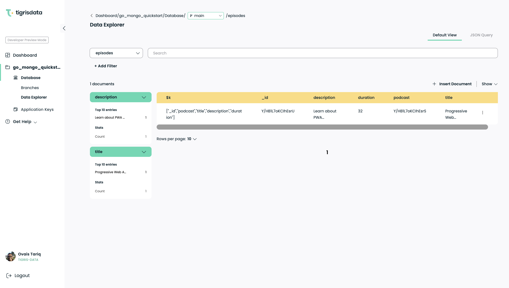

MongoDB is one of the most popular databases developers use for data
persistence for their applications. MongoDB has several benefits over
traditional relational databases. One of the most significant advantages is
its flexible data model, which makes it easier for developers to manage
their data.

[MongoDB Atlas](https://www.mongodb.com/atlas) is the cloud-hosted version
of MongoDB, including other proprietary data services such as Search and
Analytics. While Atlas provides several benefits, there are three major
issues associated with it: costs, control over data, and operational issues
when dealing with large datasets.

In this blog post, we discuss Tigris as a scalable, cost-effective, and open
source alternative to MongoDB Atlas. We will also demonstrate using
[Go driver for MongoDB](https://github.com/mongodb/mongo-go-driver)
in a way that is transparent to the application that the data is stored in
Tigris Cloud database.

The [Tigris Go MongoDB quickstart code](https://github.com/tigrisdata-community/go-mongo-quickstart)
is available on GitHub.

<!--truncate-->

## How Tigris differentiates from MongoDB Atlas

At Tigris Data, we have built a
[developer data platform called "Tigris"](https://github.com/tigrisdata/tigris)
that provides a scalable, cost-effective, and open source alternative to MongoDB
Atlas. Below are the key differentiators:

- Unlike MongoDB, Tigris follows
  [a modern composable architecture](https://www.tigrisdata.com/docs/concepts/architecture/)
  with loosely coupled components. Furthermore, compute is separated from
  storage, allowing for independent scaling and a more resilient system.
- The storage layer in Tigris is built on FoundationDB, and Tigris inherits the
  [strong consistency guarantees](https://www.tigrisdata.com/blog/building-a-database-using-foundationdb/#foundationdbs-correctness-and-fault-tolerance),
  and the scalability of FoundationDB.
- Tigris provides automatic database sharding, and shard keys are unnecessary
  as the data distribution is automatically handled. This ensures
  true serverless behavior with no painful transition from a
  non-sharded to a sharded MongoDB cluster.
- Tigris' open source Kubernetes-native design allows it to be deployed
  [anywhere in the cloud](https://www.tigrisdata.com/docs/concepts/platform/self-host/)
  in the user's account, ensuring that the user is always in control of
  their data.
- Some other differentiating features include global interactive ACID
  transactions, consistent secondary indexes, and an integrated search platform.

Now that we have gone over the key differentiators when comparing Tigris to
MongoDB Atlas, let's look at a quickstart application that demonstrates
performing CRUD operations on Tigris using the Go driver for MongoDB.

## Connect a Go application to Tigris using the Go driver for MongoDB

This is a simple Go application that uses the Go driver for MongoDB through
[FerretDB](https://github.com/FerretDB/FerretDB) in a way that is
transparent to the application that the data is stored in Tigris.

The application demonstrates CRUD operations and is adapted from the
excellent [blog series](https://www.mongodb.com/blog/post/quick-start-golang--mongodb--modeling-documents-with-go-data-structures)
by Nicolas Raboy.

### Prerequisites

- A Tigris Cloud account.
  [Create one for free](https://console.preview.tigrisdata.cloud/signup).
- [Go](https://golang.org/) installed on your computer, and a working
  knowledge of Go.
- [Git](https://git-scm.com/downloads).
- Tigris CLI. The installation instructions can be found
  [here](https://www.tigrisdata.com/docs/sdkstools/cli/installation/).

### Setup

Clone the repo:

```shell
git clone https://github.com/tigrisdata-community/go-mongo-quickstart.git
```

Change into the directory where you cloned the repo:

```shell
cd go-mongo-quickstart
```

### Create the Tigris project and generate the application key

Login to Tigris Cloud:

```shell
tigris login
```

Create a Tigris project and generate the application key. The project name
will be used as the MongoDB database name. The application key is used to
authenticate to Tigris.

```shell
tigris create project go_mongo_quickstart
tigris create app_key default --project go_mongo_quickstart
```

The above command will have an output similar to the following:

```json
{
  "id": "your_client_id",
  "name": "default",
  "secret": "your_client_secret",
  "created_at": 1676857746000,
  "created_by": "google-oauth2|1111xxx",
  "project": "go_mongo_quickstart"
}
```

### Setup the `.env` file

This application uses environment variables to store the URI, application
key, and project name. Using the `id`, `secret`, and `project` values from the
output above, create a file named `.env` with the following content:

```shell
TIGRIS_URI=m1k.preview.tigrisdata.cloud:27018
TIGRIS_PROJECT=go_mongo_quickstart
TIGRIS_CLIENT_ID=your_client_id
TIGRIS_CLIENT_SECRET=your_client_secret
```

### Running the quickstart

Run this quickstart application using the following command:

```shell
go run main.go
```

You will see output similar to the following:

```text
Connected.
Inserted document into podcast collection: ObjectID("63f7e90863877e55d8e9ddf4")
Inserted 2 documents into episode collection!
Found 1 documents matching filter!
[
    {
        "ID": "63f7e90b63877e55d8e9ddf6",
        "Podcast": "63f7e90863877e55d8e9ddf4",
        "Title": "Progressive Web Application Development",
        "Description": "Learn about PWA development with Tara Manicsic.",
        "Duration": 32
    }
]
Updated 1 Documents!
DeleteOne removed 1 document(s)
```

### Explore the data

You can explore the data created by the quickstart application in Tigris
Cloud Console



---

import OpenSourceCTA from "../_oss-cta.mdx";

<OpenSourceCTA />
