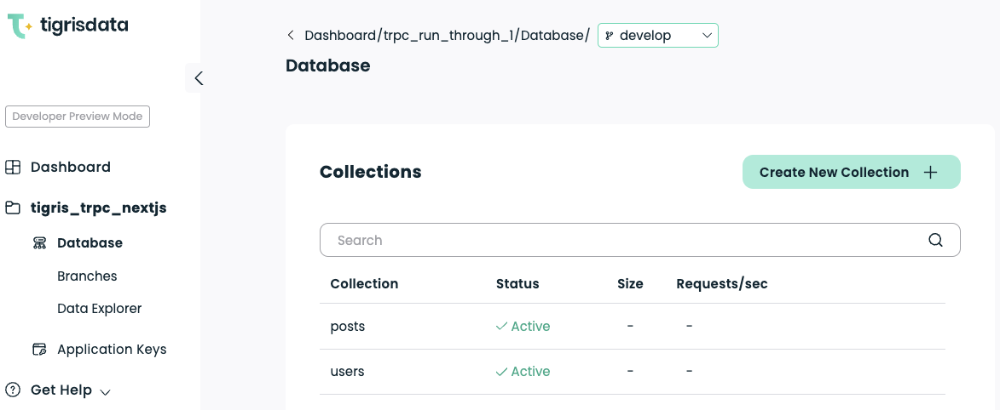
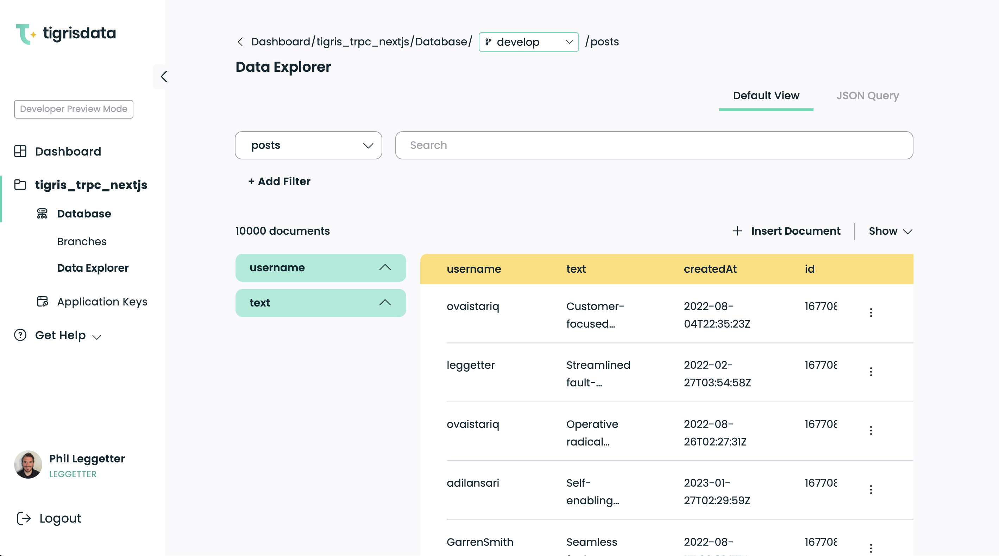
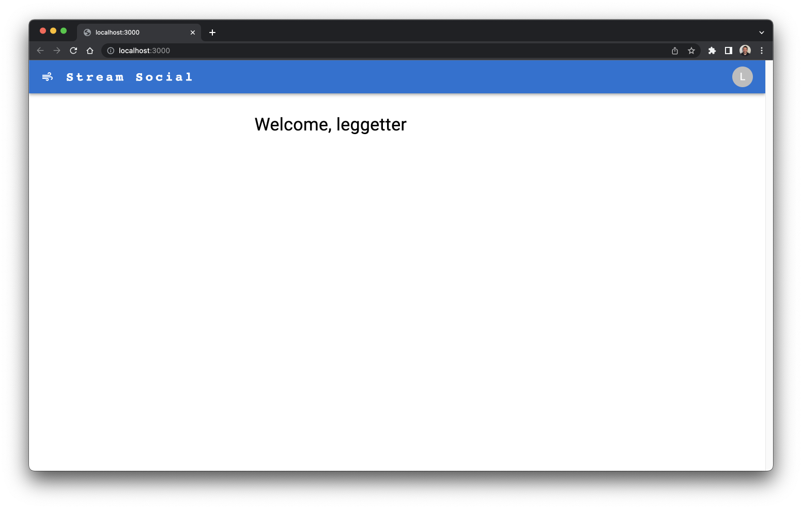

<head>
  <meta name="twitter:creator" content="@leggetter" />
</head>

# Using Tigris Database and Search with tRPC and Next.js - Part 1

As we continue to build out our [open source Developer Data Platform](https://github.com/tigrisdata/tigris) with data services such as [Database](https://www.tigrisdata.com/docs/concepts/database/) and [Search](https://www.tigrisdata.com/docs/concepts/searching/), we're constantly exploring ecosystems and their technologies to determine where our platform solves the biggest problems and is the best fit.

[tRPC](https://trpc.io) and [Next.js](https://nextjs.org/) standout in the serverless ecosystem. tRPC's mission of enabling developers to move fast and break nothing via end-to-end typesafe APIs perfectly aligns with our thinking at Tigris Data. In particular, how Tigris Database enables developers to define their data models in TypeScript and use them throughout their application logic, on both client and server.

So, in this tutorial series, we'll build a micro-blogging application called "Stream Social" using Tigris Database, Tigris Search, tRPC, and Next.js.

[](./index.mdx)

Tigris is a production-grade platform built to handle large datasets and a high volume of reads and writes. So, we'll pre-load the application with a reasonable sample size of 10,000 posts across a number of different users. We'll build functionality that lists the posts and allows you to paginate through them. We'll also add the ability to view all posts from a specific user and perform full-text search on all the posts.

<!-- truncate -->

Here's an overview video of the app we'll build over these three tutorials:

import overviewVideoUrl from "@site/static/tigris-database-search-trpc-nextjs/stream-social-overview.webm";

<video controls style={{ width: "100%" }}>
  <source src={overviewVideoUrl} />
</video>

The series is broken down as follows:

1. An overview of the technology, getting a basic Tigris, tRPC, and Next.js app up and running, defining a schema with TypeScript, and performing a simple read queries with Tigris Database.
2. Inserting a post document, adding pagination, and querying using a tRPC query with an input and a filtered Tigris Database query
3. Using Tigris Search to add full-text search with pagination

We won't be building signup or login functionality, and we also won't focus too much on the UI for which we'll use [MUI](https://mui.com/).

In the following section, we'll cover some background on tRPC and Tigris (we'll assume Next.js needs no introduction). However, feel free to [jump](#tutorial) into the first part of this three-part tutorial series below. Or head straight to the full [Tigris Database and Search + tRPC + Next.js repo](https://github.com/tigrisdata-community/tigris-trpc-nextjs) on GitHub.

## Background

### What is tRPC?

[tRPC](https://trpc.io) stands for TypeScript Remote Procedure Call<sup>†</sup> and is a library that enables typesafe remote procedure calls between client and server. With tRPC you define a procedure on the server, which can be called via client-side code. Thanks to TypeScript, you can be sure that you are calling defined methods and passing strongly typed parameters. You can also use your development tools to refactor code across client and server.

If this still isn't super-clear, don't worry! We'll start with a very simple example in the tutorial.

<sup>
  † You may also have heard of the term RMI which stands for Remote Method
  Invocation.
</sup>

### What is Tigris?

Tigris is an [open-source Developer Data Platform](https://github.com/tigrisdata/tigris). We also provide a hosted and managed version of the platform called [Tigris Cloud](https://www.tigrisdata.com), offering a serverless database and serverless search data services.

The term Developer Data Platform is reasonably new. It refers to a platform that exposes a set of data services such as database, search, message queuing, caching, and client/server pub/sub as a single platform which means you do not need to manage and synchronize multiple separate services. If you choose to use a hosted version of the Developer Data Platform, such as Tigris Cloud, you get all the lovely serverless benefits of having someone else manage those services.

## Tutorial {#tutorial}

In this tutorial you'll learn how to:

- Create a Tigris project and configure a Next.js application to use Tigris
- Define a Tigris Database schema using TypeScript
- Use tRPC `useQuery` to make a remote procedure call from the client to the server
- Query a collection in a Tigris Database with `collection.findOne` and `collection.findMany`

### Before you being

To follow this tutorial, you will require:

- [A Tigris Cloud account](https://console.preview.tigrisdata.cloud/signup)
- [Node.js LTS](https://nodejs.org/en/download/) or above which comes with the [NPM CLI](https://docs.npmjs.com/cli/v9/commands/npm)
- [Git](https://git-scm.com/book/en/v2/Getting-Started-The-Command-Line) so you can clone the code required for the tutorial or check out the completed code.

### Get the code

Clone the code locally from GitHub, navigate into the new directory, and switch to the bootstrap branch:

```bash
git clone https://github.com/tigrisdata-community/tigris-trpc-nextjs.git
cd tigris-trpc-nextjs
git checkout bootstrap
```

Next, install the app dependencies:

```bash
npm install
```

And finally, run the app:

```bash
npm run dev
```

If you head to `[http://localhost:3000](http://localhost:3000)` in your browser, You'll see the following:


We'll focus on the following areas within this codebase:

1. `src/pages` - the pages within the Next.js application
2. `src/pages/api/trpc/[trpc].ts` - where we define our tRPC remote procedures that are called from the client. This is where we'll also use the Tigris TypeScript SDK to add data-driven functionality to the Next.js app.
3. `src/components` - there are a few existing components defined here already, but we'll add one new component as we go.
4. `scripts/` - there are a couple of helper scripts here already. we'll also add a script to set up our Tigris Database schema.
5. `db/models` - this directory doesn't yet exist, but we'll create some [Tigris TypeScript data models](https://www.tigrisdata.com/docs/sdkstools/typescript/database/datamodel/) in there shortly.

### Create a Tigris Project and configure the Next.js app

Run the following command to create a `.env.development.local` with the variables required to use Tigris within the application.

```bash
cp .env.development.local.example .env.development.local
```

Open `.env.development.local` file and you will see the following:

```bash
TIGRIS_URI=api.preview.tigrisdata.cloud
TIGRIS_PROJECT=tigris_trpc_nextjs
TIGRIS_CLIENT_ID=
TIGRIS_CLIENT_SECRET=
TIGRIS_DB_BRANCH=develop
```

This configuration assumes that we're going to use Tigris Cloud (`TIGRIS_URI`), the project is going to be called “tigris_trpc_nextjs” (`TIGRIS_PROJECT`), and we're going to be working on a [database branch](https://www.tigrisdata.com/docs/concepts/database/branching/) called `develop` (`TIGRIS_DB_BRANCH`). We still need to populate `TIGRIS_CLIENT_ID` and `TIGRIS_CLIENT_SECRET`. So, let's create a project in Tigris Cloud.

If you haven't already done so, [signup for a free Tigris Cloud account](https://console.preview.tigrisdata.cloud/signup).

Then, create a new project within the Tigris Web Console. As mentioned above, the assumption is that the project will be named “tigris_trpc_nextjs” so if you decide to call your project something else, make sure you update the value in the `.env.development.local` file. You will find your values for `TIGRIS_CLIENT_ID` and `TIGRIS_CLIENT_SECRET` under **Application Keys** for your project.

With the Tigris configuration in place, we can move on to defining the Tigris Database schema.

### Going code-first to define the Tigris Database Schema

With Tigris, you define your database schema using code that you can also use in your application logic. We believe that this code-first approach, where your schema definitions live within your application's codebase and are written using the same language and syntax as the rest of your codebase, is a more powerful approach than having to learn another language just to define a data model and schema. We also think it's pretty cool!

So, our application will have two data models:

1. `Post`: a message that's posted within the application by a User
2. `User`: a model representation of a person who is using the application and who can post a message

Let's start by installing the Tigris TypeScript SDK:

```bash
npm install @tigrisdata/core
```

Next, define a `User` model in a new file, `src/db/models/user.ts`:

```tsx
import {
  Field,
  PrimaryKey,
  TigrisCollection,
  TigrisDataTypes,
} from "@tigrisdata/core";

@TigrisCollection("users")
class User {
  @PrimaryKey(TigrisDataTypes.INT64, { order: 1, autoGenerate: true })
  id?: string;

  @Field()
  username!: string;

  @Field({ timestamp: "createdAt" })
  createdAt?: Date;
}

export default User;
```

The above code:

1. Defines a new class called `User`. The `User` has a decorator, `@TigrisCollection("users")`, which is used to instruct the Tigris SDK that a collection called “users” will contain documents with the structure defined by this class.

:::tip

You can learn more about the [TypeScript
decorators](https://www.typescriptlang.org/docs/handbook/decorators.html) in
the official TypeScript documentation.

:::

2. The `id` is the primary key within the collection, indicated by the `@PrimaryKey` decorator. Within that decorator, we also set the type (`TigrisDataTypes.INT64`) and passing the additional options of `{ autoGenerate: true, order: 1 }` informs Tigris that this is an auto-generated field, and this is why we've marked it as optional with `?` (note: `order` is only used if there are multiple primary keys, so we can ignore it here). You'll probably notice that although in the database this is an Int64, in TypeScript, we're defining `id` to be of type `string`.
3. The `username` property is decorated with a `Field()`. We don't need to set the type within this decorator - although we could - because the TypeScript SDK detects the property type as `string` via reflection. This is the display name for a user within the application and should be set any time a `User` is created and thus is marked as non-null with `!`.
4. Finally, there's a `createdAt` field. The `@Field({ timestamp: "createdAt" })` informs Tigris that this is a date field and should be auto-populated with a timestamp at the time of creation (note: `updateAt` is another option). Since this field is populated upon creation it flagged as optional with `?`.

We also need a model to store posts. Create a `src/db/models/post.ts` file with the following code:

```ts
import {
  Field,
  PrimaryKey,
  TigrisCollection,
  TigrisDataTypes,
} from "@tigrisdata/core";

@TigrisCollection("posts")
class Post {
  @PrimaryKey(TigrisDataTypes.INT64, { order: 1, autoGenerate: true })
  id?: string;

  @Field()
  username!: string;

  @Field()
  text!: string;

  @Field({ timestamp: "createdAt" })
  createdAt?: Date;
}

export default Post;
```

`Post` follows the same principles as `User`:

1. We use the `@TigrisCollection` decorator to define a collection of `Post`s called “posts”.
2. `username` is used to store the username of the person posting and is non-null
3. `text` for the textual contents of the post and is non-null
4. As with `User`, there's a `createdAt` field to indicate when the post was created.

With the models in place, we need to write a small script in `scripts/setup.ts` to setup the database schema in Tigris:

```ts
import { Tigris } from "@tigrisdata/core";
import Post from "../src/db/models/post";
import User from "../src/db/models/user";

import { loadEnvConfig } from "@next/env";
loadEnvConfig(process.cwd(), process.env.NODE_ENV !== "production");

async function main(): Promise<void> {
  const tigrisClient = new Tigris();

  // ensure branch exists, create it if it needs to be created dynamically
  await tigrisClient.getDatabase().initializeBranch();
  // register schemas
  await tigrisClient.registerSchemas([User, Post]);
}

main()
  .then(async () => {
    console.log("Setup complete ...");
    process.exit(0);
  })
  .catch(async (e) => {
    console.error(e);
    process.exit(1);
  });
```

In this script, we:

1. Import the Tigris client and the models we've just created, and finally, load in the environmental variables using the `@next/env` `loadEnvConfig` helper function. The second parameter to `loadEnvConfig` indicates if the development environmental variables should be loaded. When we run this script, `process.env.NODE_ENV` will not equal “production”, so `true` will be passed, and the contents of our `.env.development.local` will be loaded.
2. Within the `main` function, we create a new instance of the `Tigris` client, which loads the environment variables from `.env.development.local`.
3. `await tigrisClient.getDatabase().initializeBranch()` ensures that a branch with the name we've defined in `TIGRIS_DB_BRANCH`, with a value of `develop`, is created and initialized.
4. `await tigrisClient.registerSchemas([User, Post])` informs Tigris of the two data models we've just defined and have been imported into the script. This results in creating two collections, `users` and `posts`, respectively, with the schema defined in our models.

Update `package.json` to have a `setup` script as follows:

```json {5,6}
"scripts": {
    "preadd-users": "npm run setup",
    "add-users": "ts-node ./scripts/add-users.ts",
    "preload-mock-data": "npm run setup",
    "load-mock-data": "ts-node ./scripts/load-mock-data.ts",
    "setup": "ts-node ./scripts/setup.ts",
    "predev": "npm run setup",
    "dev": "next dev",
    "build": "next build",
    "lint": "eslint --ext \".js,.ts,.tsx\" --report-unused-disable-directives src",
    "start": "next start"
},
```

This adds two scripts:

1. `setup` - to run the new `setup.ts` script we just created
2. `predev` - which runs `setup` before `dev` is run.

You'll notice several other scripts that rely on this new `setup` script. This is because our script ensures that our models and Tigris are in sync.

Now, run:

```tsx
npm run setup
```

And you will see the output as follows:

```bash
$ npm run setup

> tigris-trpc-nextjs@0.1.0 setup
> ts-node ./scripts/setup.ts

info - Using reflection to infer type of Post#username
info - Using reflection to infer type of Post#text
info - Using reflection to infer type of Post#createdAt
info - Using reflection to infer type of User#username
info - Using reflection to infer type of User#createdAt
Loaded env from /Users/leggetter/tmp/tigris-trpc-nextjs/.env.development.local
info - Using Tigris at: api.preview.tigrisdata.cloud:443
event - Created database branch: 'develop'
info - Using database branch: 'develop'
event - Creating collection: 'users' in project: 'tigris_trpc_nextjs'
event - Creating collection: 'posts' in project: 'tigris_trpc_nextjs'
Setup complete ...
```

From the output, you can see that the various fields and their types are discovered via reflection, the environment variables are loaded, the `develop` database branch is created, and the two collections, `users` and `posts`, are created in the `tigris_trpc_nextjs` project.

If you head to your project in the Tigris Web Console, select the **develop** branch from the dropdown at the top, and You'll see the collections are now defined.



### Add mock data

With the database schema in place, let's add some mock data, so we have some data to display in our Next.js application.

You may have already noticed `scripts/add-users.ts` script and the `"add-users"` script in `package.json`. This can be used to populate the `users` collection with some sample users via the following:

```bash
npm add-users -- {username1} {username2} ... {usernameX}
```

So, go ahead and add some users. If you're not feeling very creative, feel free to use the following, which will add five of the team here at Tigris:

```bash
npm run add-users -- leggetter ovaistariq adilansari GarrenSmith HimankChaudhary
```

As discussed, running `add-users` will first run `setup` and then run the `add-users.ts` script. The output will look as follows:

```bash
> tigris-trpc-nextjs@0.1.0 add-users
> ts-node ./scripts/add-users.ts leggetter ovaistariq adilansari GarrenSmith HimankChaudhary

info - Using reflection to infer type of User#username
info - Using reflection to infer type of User#createdAt
Loaded env from /Users/leggetter/tmp/tigris-trpc-nextjs/.env.development.local
info - Using Tigris at: api.preview.tigrisdata.cloud:443
Inserting users with usernames: leggetter, ovaistariq, adilansari, GarrenSmith, HimankChaudhary
Users inserted.
```

Don't worry, we'll get hands-on with document insertion code later in this tutorial series.

Next, let's add 10,000 mock posts to the `posts` collection. We can do this using the script in `scripts/load-mock-data.ts` via the script `load-mock-data` in `package.json`. This uses fake data stored in JSON files in the `mock-data` directory and randomly attributes each post to one of the users we've just inserted.

:::tip

During creating this app and tutorial, we discovered
[Mockaroo](https://www.mockaroo.com/), a handy
service to help you generate mock data.

:::

Run the `load-mock-data` script:

```bash
npm run load-mock-data
```

The output of running this will look at follows:

```bash
> tigris-trpc-nextjs@0.1.0 load-mock-data
> ts-node ./scripts/load-mock-data.ts

info - Using reflection to infer type of Post#username
info - Using reflection to infer type of Post#text
info - Using reflection to infer type of Post#createdAt
info - Using reflection to infer type of User#username
info - Using reflection to infer type of User#createdAt
Loaded env from /Users/leggetter/tmp/tigris-trpc-nextjs/.env.development.local
info - Using Tigris at: api.preview.tigrisdata.cloud:443
Gettings users from Users collection
Reading mock file 1 of 10
Reading mock file 2 of 10
Reading mock file 3 of 10
Reading mock file 4 of 10
Reading mock file 5 of 10
Reading mock file 6 of 10
Reading mock file 7 of 10
Reading mock file 8 of 10
Reading mock file 9 of 10
Reading mock file 10 of 10
Loading data complete ...
```

And you will now have both users and mock posts in your Tigris Database. You can head to your project in the Tigris Web Console and select **Data Explorer** to look at the data (remember to make sure you are viewing the **develop** branch.



Now that we have some data to play with within our application, we can move to the Next.js codebase.

### Get the User via tRPC useQuery and a Tigris Database query

Before we start, it's worth knowing that the codebase was bootstrapped using the [trpc/examples-next-minimal-starter repo](https://github.com/trpc/examples-next-minimal-starter). For more details on the structure of that repo, see the [tRPC Next.js docs](https://trpc.io/docs/nextjs), but ignore the parts about Prisma.

With that out of the way, we really can dive into the codebase. The first thing we will do is fetch a user from the `users` collection and take their identity. This is because we're not covering signup and login in this tutorial. However, this also gives us an opportunity to cover a simple [tRPC useQuery](https://trpc.io/docs/useQuery).

The code is already in place to make a remote procedure call to get a statically defined user. Within `src/pages/index.tsx`, you will see the following:

```ts {9}
import React from "react";
import { Typography } from "@mui/material";
import { Layout } from "~/components/layout";
import { Loading } from "~/components/loading";

import { trpc } from "../utils/trpc";

export default function IndexPage(): JSX.Element {
  const userPayload = trpc.getUser.useQuery();

  if (userPayload.data === undefined) {
    return <Loading />;
  }

  const user = userPayload.data as { username: string };

  return (
    <Layout username={user.username}>
      <Typography variant="h4" component="h2" mb={5}>
        Welcome, {user.username}
      </Typography>
    </Layout>
  );
}
```

The line `const userPayload = trpc.getUser.useQuery();` makes a call to a procedure called `getUser` defined within `src/pages/api/trpc/[trpc].ts`:

```ts {7-9}
import * as trpcNext from "@trpc/server/adapters/next";
import { publicProcedure, router } from "~/server/trpc";
import { z } from "zod";
import CONFIG from "~/config";

const appRouter = router({
  getUser: publicProcedure.query(() => {
    return { username: "staticUser" };
  }),
});

// export only the type definition of the API
// None of the actual implementation is exposed to the client
export type AppRouter = typeof appRouter;

// export API handler
export default trpcNext.createNextApiHandler({
  router: appRouter,
  createContext: () => ({}),
});
```

Right now, the `getUser` procedure returns an inline object. Let's update that to instead return the first user found in the “users” collection within the Tigris Database:

```ts {5-8,12-16}
...

import CONFIG from "~/config";

import { Tigris } from "@tigrisdata/core";
import User from '~/db/models/user';

const tigrisClient = new Tigris();

const appRouter = router({
  getUser: publicProcedure
    .query(async () => {
      const usersCollection = tigrisClient.getDatabase().getCollection<User>(User);
      const user = await usersCollection.findOne();
      return user;
    }),
});

...
```

To get the user:

1. We import the `Tigris` client, and the `User` model
2. Create a new instance of the Tigris Client.
3. We then update the `getUser` procedure to be `async` with the query updated to do the following:
   1. `const usersCollection = tigrisClient.getDatabase().getCollection<User>(User);` get the user collection
   2. `const user = await usersCollection.findOne();` find the first user
   3. `return user;` return the user object to the client

Instead of returning an inline object of `{ username: "staticUser" }` we return a `User` with a `username` property so we won't see any TypeScript errors or have to make any changes on the client.

Pretty simple, huh! The change to the application's UI isn't significant, but it represents a big step forward as the app is now database-driven.



### Retrieve Posts from the Tigris Database and display them in the Next.js app

Earlier, we pre-loaded a bunch of mock posts into the Tigris Database. Let's update the Next.js app to retrieve some posts and display them.

Start in `src/pages/api/trpc/[trpc].js` by defining a new procedure that queries the `posts` collection:

```ts {3,5,8,18-27}
...

import { type Cursor, FindQueryOptions, Order, Tigris } from "@tigrisdata/core";
import User from '~/db/models/user';
import Post from '~/db/models/post';

const tigrisClient = new Tigris();
const postsCollection = tigrisClient.getDatabase().getCollection<Post>(Post);

const appRouter = router({
  getUser: publicProcedure
    .query(async () => {
      const usersCollection = tigrisClient.getDatabase().getCollection<User>(User);
      const user = await usersCollection.findOne();
      return user;
    }),

  getMessages: publicProcedure
    .query(async () => {
      const cursor: Cursor<Post> = postsCollection.findMany({
        sort: { field: "createdAt", order: Order.DESC },
        options: new FindQueryOptions(CONFIG.DEFAULT_PAGING_SIZE, 0),
      });

      const results = await cursor.toArray();
      return results;
    }),
});

...
```

In the above code, we've first imported some new dependencies:

- `FindQueryOptions` and `Order` - used as part of the `posts` collection query.
- `Cursor` - a type returned from the `postCollection.findMany` call
- `Post` - since we're now querying the collection of `Post` documents

We created the `postCollection` variable to reference the `posts` collection we later use in the query within the new `getMessages` procedure. We'll use `postCollection` in other queries later too.

Within the new `getMessages` procedure we do the following:

1. Use [findMany with no filter](https://www.tigrisdata.com/docs/sdkstools/typescript/database/query/#simple-read-query) on the `postCollection`. By default, this would get all the documents within the collection, so we pass in `options` to restrict the number of results.
2. For the `options` we pass in a `FinderQueryOptions` object with a `limit` set to `CONFIG.DEFAULT_PAGING_SIZE` (which is set to `20` in `src/config.ts`). The second parameter is a `skip` value, so we pass in a value of `0` since we're not building pagination right now (but we'll cover this later).
3. We pass in a `sort` property and specify that Tigris should sort the results by `createdAt` in descending order (`Order.DESC`).
4. Finally, we convert the `cursor` to an Array with `await cursor.toArray()` and return the Array of posts to the client.

### Query the new tRPC procedure and add the posts to the UI

With the new `getMessages` procedure in place, we can update `src/pages/index.tsx` to make use of it:

```ts {1,7-8,13,15,20-25,33-35}
import React, { useEffect, useState } from "react";
import { Typography } from "@mui/material";
import { Layout } from "~/components/layout";
import { Loading } from "~/components/loading";

import { trpc } from "../utils/trpc";
import type Post from "~/db/models/post";
import PostsList from "~/components/posts-list";

export default function IndexPage(): JSX.Element {
  const userPayload = trpc.getUser.useQuery();
  const user = userPayload.data as { username: string };
  const queryPosts = trpc.getMessages.useQuery();

  const [posts, setPosts] = useState<Post[]>([]);

  if (userPayload.data === undefined) {
    return <Loading />;
  }

  useEffect(() => {
    if (queryPosts.status === "success") {
      setPosts(queryPosts.data as Post[]);
    }
  }, [queryPosts.data]);

  return (
    <Layout username={user.username}>
      <Typography variant="h4" component="h2" mb={5}>
        Welcome, {user.username}
      </Typography>

      {queryPosts.status === "loading" && <Loading />}

      {queryPosts.status === "success" && <PostsList posts={posts} />}
    </Layout>
  );
}
```

First, import a few new dependencies:

1. `useEffect` and `useState` from `React`
2. `type Post` from the `Post` model we've defined. Using the model on the server and on the client is a great way to help avoid errors.
3. A `PostList` component that we've not yet created. But we'll do that next.

Within the `IndexPage` function:

1. `const queryPosts = trpc.getMessages.useQuery();` to call the new `getMessages` procedure.
2. `const [posts, setPosts] = useState<Post[]>([]);` to store the posts that we retrieve using the procedure and eventually use them in the rendered UI.
3. We call `useEffect` with `[queryPosts.data](http://queryPosts.data)` as a dependency. This means the effect only runs if the value of `queryPosts.data` changes, and this is where the post data is stored. If the `status` of the query is `success`, then we call `setPosts(queryPosts.data as Post[]);` to set the value of `posts`.

In the definition of the page UI, we make a few changes:

1. `{queryPosts.status === "loading" && <Loading />}` to render the `<Loading />` component if the query status is `loading`
2. `{queryPosts.status === "success" && <PostsList posts={posts} />}` to render the as yet unimplemented `<PostsList />` component, passing the `posts` if the status of the tRPC query is `success`.

So, let's add the `PostsList` component to see the application in action. Create a `src/components/posts-list.tsx` file with the following:

```tsx
import React from "react";
import { Box, Stack, Typography } from "@mui/material";
import PostCard from "~/components/post-card";
import type Post from "~/db/models/post";

export default function PostsList({ posts }: { posts: Post[] }): JSX.Element {
  return (
    <Box id="posts">
      <Stack spacing={2}>
        {posts.length === 0 && <Typography>No posts yet!</Typography>}
        {posts.length > 0 &&
          posts.map((post) => {
            return (
              <PostCard
                key={post.id}
                username={post.username}
                text={post.text}
                createdAt={
                  post.createdAt !== undefined
                    ? new Date(post.createdAt)
                    : new Date()
                }
              />
            );
          })}
      </Stack>
    </Box>
  );
}
```

The key points from the `<PostsLists />` component are:

1. It takes a `posts` prop of type `Post[]` and uses this for the logic to determine what should be rendered.
2. If `posts.length === 0`, show “No posts yet!
3. Otherwise, loop through the posts and create a new `<PostCard />` passing the `username`, `text`, and `createdAt` values from the `Post`.
4. The `createdAt=` assignment and related `undefined` checking logic is in place due to [a bug in the Tigris TypeScript SDK](https://github.com/tigrisdata/tigris-client-ts/issues/245). Once the bug is fixed, the assignment will be simplified to `createdAt={post.createdAt!}` because the posts are from the Tigris Database where the value is auto-populated, so we know it won't be null.

Take a look at the source for `<PostCard />` in `src/components/post-card.tsx` if you like. It uses several MUI components. There are also a few things we don't fully use, such as the like/heart and share icons, but we've left those in to make the app feel more social and as an opportunity for you to add more functionality.

The Next.js application now contains a user and posts from the Tigris Database, retrieved using tRPC queries.

import demoVideoUrl from "@site/static/tigris-database-search-trpc-nextjs/social-stream-tutorial-1-end.webm";

<video controls style={{ width: "100%" }}>
  <source src={demoVideoUrl} />
</video>

## Conclusion

In the first part of this Tigris, tRPC, and Next.js tutorial series, we have covered:

1. How to set up a Tigris Project, define a Tigris Database schema using data models defined in TypeScript, and set up a Next.js project to make use of Tigris
2. How to use tRPC within Next.js to make remote procedure calls from client to server using `userQuery`, and how to query a Tigris Database and return the results to the client using tRPC
3. How to render the results of the tRPC and Tigris Database queries in the Next.js UI

:::tip
You can grab the completed code for this first part of the series in the [part-1 branch](https://github.com/tigrisdata-community/tigris-trpc-nextjs/tree/part-1) on GitHub.
:::

In the next tutorial in this series, we'll show how to post a message by passing data from the client to the server using tRPC and [inserting a document](https://www.tigrisdata.com/docs/sdkstools/typescript/database/insert/) into a Tigris Database collection. We'll also add [pagination](https://www.tigrisdata.com/docs/sdkstools/typescript/database/query/#pagination) to the application and add a `/username` page to the app, which will make use of [Tigris Database filtering](https://www.tigrisdata.com/docs/sdkstools/typescript/database/query/#simple-read-query).

Follow [@TigrisData](https://twitter.com/TigrisData) and/or me, [@leggetter](https://twitter.com/leggetter), on Twitter to ensure you don't miss the next tutorial in this series. You can also follow me on [Mastodon](https://fosstodon.org/@leggetter) and catch me live streaming, building apps like this on [Twitch](https://www.twitch.tv/leggetter).

We'd also love you to join our [Tigris Community Discord](https://www.tigrisdata.com/discord).

And if you haven't yet [signed up for Tigris](https://console.preview.tigrisdata.cloud/signup), you should do that too.
