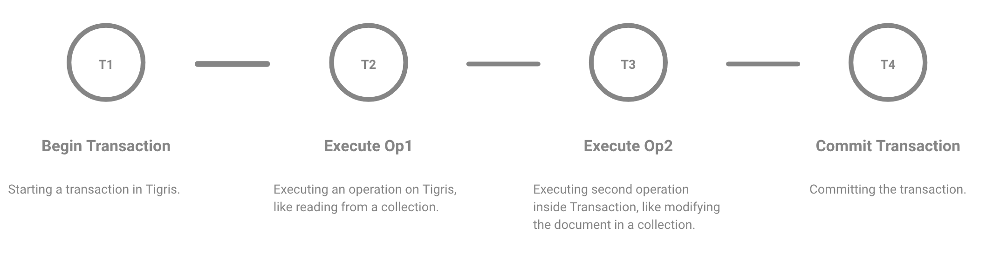
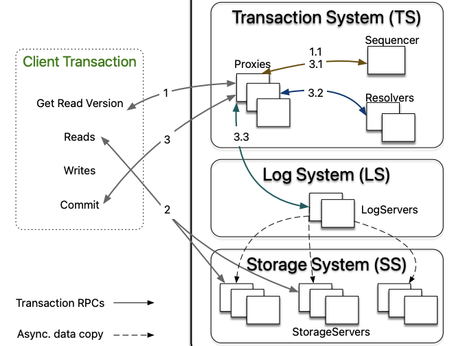

Tigris is an open-source developer data platform that utilizes
FoundationDB's transactional key-value interface as its underlying
storage engine. In a blog post titled [How We Built the Data Layer
on FoundationDB](https://www.tigrisdata.com/blog/data-layer-foundationdb/),
we delved into why we decided to use FoundationDB for this purpose. This
blog focuses on the serializable transactions
provided by Tigris.

Serializable transactions are a transactional consistency model that
guarantees that the outcome of concurrent transactions is equivalent
to a serial execution of these transactions. In other words, transactions
executed concurrently under serializable consistency appear to be executed
one at a time in some sequential order. This provides a strong guarantee
for correctness, ensuring that the execution of transactions doesn't create
anomalous behaviors, such as dirty reads or lost updates, which can occur
in weaker isolation levels. FoundationDB, used by Apple, Snowflake, and others,
is such a system. It provides the same consistency and isolation guarantees as
Spanner - strict serializability and has a fantastic correctness story through
[simulation testing](https://apple.github.io/foundationdb/testing.html).

## Serializable Transactions in Tigris

Tigris employs FoundationDB's transactional key-value interface as its underlying
storage engine to enable transactions that involve multiple collections, keys, or both.
Transactions can be initiated by users or by Tigris automatically upon receiving a request,
as they are core to every operation.



Tigris executes all operations within the context of a transaction by default, enabling atomicity
for all operations and allowing the application to perform strongly consistent reads after writing
to the database. However, specific use cases necessitate transactions across multiple collections or
dependent operations. To accommodate these cases, Tigris provides explicit transaction functionality
through interactive transactions. Tigris leverages FoundationDB's concurrency control to support these
features.
In the following section, we will review how transactions work inside Tigris.

### Transaction Coordinator

A Tigris deployment consists of multiple workers that receive and process the queries. Upon receiving a
query, one of the Tigris servers acts as a request coordinator. The coordinator assesses whether the request
can be handled locally or must be forwarded to the transaction owner using the information available in the
transactional context. By reading this context, the coordinator can determine if the request is new, an interactive,
transactional request that can be handled locally, or an interactive, transactional request that should be forwarded
to its owner.

### Managing Transaction Sessions

The session manager in Tigris is responsible for managing transaction sessions, which are created each time a new
transaction request is made. The session manager attaches a transactional context to each session and tracks all
sessions created by the server using a session tracker. A session object is responsible for managing the lifecycle
of a transaction. Each session utilizes the storage layer to communicate with the underlying storage engine to
determine whether to commit, rollback, or signal a failure. For each new transaction request, the session manager
attaches a transactional context to the session and tracks all sessions created by the server using a session tracker.
Tigris provides support for two types of transactions.

#### Interactive Transactions

Tigris can execute operations across collections to perform multiple dependent operations within a transaction. The user
can initiate a transaction by submitting a BeginTxn request and control the transaction state using Commit or Rollback.
When such transactions are initiated, the session manager generates a context containing the session ID and the owner's
information. All subsequent operations performed within the transaction will include this transactional context, which the
coordinator uses to determine how to execute the transaction.

#### Implicit Transactions

Implicit transactions occur when the session manager receives an operation without any BeginTxn request. Although no explicit
transaction is initiated, the operation is still executed within the context of a transaction. The session manager decides
whether to commit or roll back these transactions based on the operation's response. This means multi-documents operations
will always be atomic.

The following example illustrates how easy is to leverage Tigris’s transactions across collections and documents without any
restrictions.

```ts title=interactive transactions
await db.transact(async (tx) => {
  // read user 1
  const user1: User | undefined = await users.findOne(
    {
      filter: {
        userId: 1,
      },
    },
    tx
  );

  // read user 2
  const user2: User | undefined = await users.findOne(
    {
      filter: {
        userId: 2,
      },
    },
    tx
  );

  if (user1 === undefined || users2 === undefined) {
    throw new Error("User(s) not found"); // This will auto-rollback transaction
  }

  // deduct balance from user1
  await users.update(
    {
      filter: {
        userId: user1.userId,
      },
      fields: {
        balance: user1.balance - 100,
      },
    },
    tx
  );

  // add balance to user2
  await users.update(
    {
      filter: {
        userId: user2.userId,
      },
      fields: {
        balance: user2.balance + 100,
      },
    },
    tx
  );
});
```

### Concurrency Control

Many systems use the time of acquiring all locks to establish the serial order among transactions and to guarantee atomicity
and isolation. For instance, [Spanner](https://www.usenix.org/system/files/conference/osdi12/osdi12-final-16.pdf) uses True-time
for determining the commit timestamps when all locks are acquired. [CockroachDB](https://dl.acm.org/doi/pdf/10.1145/3318464.3386134)
uses the hybrid-logical clock, a combination of physical and logical time. Tigris provides lock-free concurrency
control using FoundationDB, combining OCC and MVCC to order transactions. This is achieved by a sequencer which determines
the serial order by assigning a read version and a commit version to each transaction. Proxies offer MVCC read versions to
clients and orchestrate transaction commits.



## How does it compare to MongoDB Transactions?

A range of tunable read-and-write consistency levels in a database can be advantageous for specific use cases. However,
it often leads to confusion for application developers since it places a responsibility on them to carefully design their
operations and establish the appropriate read-write concerns; otherwise, it can result in unforeseeable performance issues
or data loss. This section demonstrates how various operations carry different implications based on different read-write
concerns.

MongoDB's multi-document operations are, by default, not atomic, meaning a single operation can interleave with other
operations. MongoDB provides multi-document transactions to address this issue, but these [transactions can significantly
impact performance](https://www.mongodb.com/docs/v6.0/core/write-operations-atomicity/#multi-document-transactions).
Quoting below from MongoDB's manual,

_"In most cases, multi-document transaction incurs a greater performance cost over single document writes, and the availability
of multi-document transactions should not be a replacement for effective schema design."_

Similarly, transactions that affect multiple shards can
[significantly impact performance](https://www.mongodb.com/docs/manual/core/transactions-sharded-clusters/#performance). Quoting below from MongoDB's manual

_"Transactions that affect multiple shards incur a greater performance cost."_

This pushes the complexity to the application developers, who must now understand the sharding logic and perform
operations at the shard level.

The tunable consistency varies for transactional and non-transactional operations in MongoDB. However, it's important
to note that the default isolation level for non-transactional reads is
[read uncommitted](https://www.mongodb.com/docs/v6.0/core/read-isolation-consistency-recency/#read-uncommitted),
which means that read operations may see the updated document before the changes are made durable or committed. To prevent
this, a linearizable read concern guarantees linearizability but this can result in blocking reads, and works only for read
operations that have a query filter that identifies a single document uniquely. Quoting below from MongoDB's manual

_“As such, reads with linearizable read concern may be significantly slower than reads with "majority" or "local" read concerns”_

## Conclusion

In MongoDB, having a good grasp of read-write concerns and transaction options is vital. Furthermore, because of
the performance implications most of the time you will end up working around the use of transactions in MongoDB.
On the contrary, Tigris provides serializable transactions by default, without any additional overhead for
cross-shard, cross-collection transactions, and doesn’t require a need for tunable options so that performance
is always predictable and there is no complexity for the application developers. This is achieved by leveraging
the unique architecture of FoundationDB.

We believe developers should not have to bear the responsibility of working around the use of transactions and
complicating their application architectures. Instead, database systems should provide transactional and strong
data consistency mechanics, simplifying the applications and making them more manageable for developers.

---

import OpenSourceCTA from "../_oss-cta.mdx";

<OpenSourceCTA />
