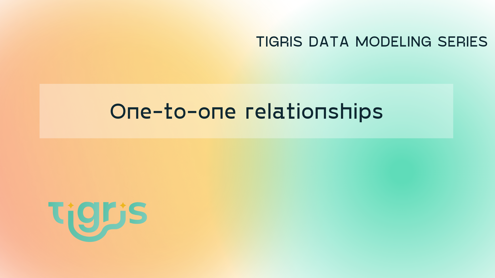

Tigris provides a transactional document database, this allows you to model relations in a few different ways to get the best performance, consistency and ease of use in your application.

In this blog, I show you how to get up and running with Tigris and how to model one-to-one relationships using the embedded document and sub-document pattern. We will combine this with Tigris's transactions to make sure that all updates are consistent.
I will show how to model one-to-many and many-to-many relationships in future posts.



<!--truncate-->

## Getting started

To follow along, you will need to get set up with Tigris. This is a quick and easy process.
The Tigris Docs have a [Quickstart](https://www.tigrisdata.com/docs/quickstarts/) to show you how to sign up. Once you have signed up and created a new project, let's create a new template to get started.

```
$ npx create-tigris-app@latest --project relations --example playground
```

Follow the prompts to add your `clientId` and `clientSecret`

## Embedded One-to-one

The first way to model one-to-one relationships between models is to embed the model in the document. Let's do that in Tigris, by modelling a `User` and a `Location`.
In our project, there is already a `user.ts` file under `src/db/models`. Change that file to contain two classes like this:

```ts showLineNumbers
import {
  Field,
  PrimaryKey,
  TigrisCollection,
  TigrisDataTypes,
} from "@tigrisdata/core";

export class Location {
  @Field()
  country: string;

  @Field()
  address: string;

  @Field()
  code: string;
}

@TigrisCollection("user")
export class User {
  @PrimaryKey({ order: 1, autoGenerate: false })
  email: string;

  @Field()
  name: string;

  @Field({ elements: Location })
  location: Location;
}
```

This creates a `Location` object embedded inside the `User` schema. This allows us to store and read the `Location` and `User` in one query. The User's email address is the primary key.

Let's create a few users and query them. In the `src/index.ts` file, let's change the file to look like this:

```ts showLineNumbers
import { Tigris } from "@tigrisdata/core";
import { User } from "./db/models/user";

// setup client
const tigrisClient = new Tigris();
async function setup() {
  // ensure branch exists, create it if it needs to be created dynamically
  await tigrisClient.getDatabase().initializeBranch();
  // register schemas
  await tigrisClient.registerSchemas([User]);
}

async function main() {
  await setup();
  const db = await tigrisClient.getDatabase();
  const userCollection = await db.getCollection<User>(User);

  await userCollection.insertMany([
    {
      email: "eddie@temp.com",
      name: "Eddie Vedder",
      location: {
        country: "USA",
        address: "1 Red Road",
        code: "8878",
      },
    },
    {
      email: "Jimi@temp.com",
      name: "Jimi Hendrix",
      location: {
        country: "USA",
        address: "13 Yellow Road",
        code: "1234",
      },
    },
    {
      email: "johnny@temp.com",
      name: "Johnny Clegg",
      location: {
        country: "RSA",
        address: "87 Green Road",
        code: "9087",
      },
    },
  ]);

  let user = await userCollection.findOne({ filter: { name: "Eddie Vedder" } });
  console.table(user);

  let userCursor = await userCollection.findMany({
    filter: { "location.country": "USA" },
  });

  for await (user of userCursor) {
    console.table(user);
  }
}

main()
  .then(async () => {
    console.log("Query complete ...");
    process.exit(0);
  })
  .catch(async (e) => {
    console.error(e);
    process.exit(1);
  });
```

Let's unpack what is happening. In our `setup` function we are setting up the Tigris database, creating our `user` collection and defining the schema for that collection.

Then in our `main` function, we get the database object and then fetch our `user` collection object so that we can work with our collection. We create 3 new users. And then show how to query for one on line 48, or if we want to query many of them based on a filter, we do that on line 51.

:::tip
In the above example, we call the `setup()` function to check the database and update the schema. In a
production application this only needs to be called when the schema has changed.
:::

## Reference one-to-one relationships

There can be cases where our embedded objects are very large and we do not need to load them every time. In these cases, we can split the document into its own collection and fetch it when we need it. Lets add a short `biography` about the users we have added above and put it in a separate collection so that we can load it when we need to.

We are going to add a new `biography` object in our `user.ts` so the file now looks like this:

```ts showLineNumbers {19-29}
import {
  Field,
  PrimaryKey,
  TigrisCollection,
  TigrisDataTypes,
} from "@tigrisdata/core";

export class Location {
  @Field()
  country: string;

  @Field()
  address: string;

  @Field()
  code: string;
}

@TigrisCollection("biography")
export class Biography {
  @PrimaryKey(TigrisDataTypes.UUID, { order: 1, autoGenerate: true })
  id?: string;

  @Field()
  userId: string;

  @Field()
  description: string;
}

@TigrisCollection("user")
export class User {
  @PrimaryKey({ order: 1, autoGenerate: false })
  email: string;

  @Field()
  name: string;

  @Field({ elements: Location })
  location: Location;
}
```

As you can see, we have defined a new class, `Biography` and given it the collection name `biography`. It also has a field `userId`, which is a reference back to the `User` and will contain the user's email address. We can now update our creating and reading of users to include the biography information.

Change the `index.tx` to look like this:

```ts {19,53-73,86-93} showLineNumbers
import { Tigris } from "@tigrisdata/core";
import { User, Biography } from "./db/models/user";

// setup client
const tigrisClient = new Tigris();
async function setup() {
  // ensure branch exists, create it if it needs to be created dynamically
  await tigrisClient.getDatabase().initializeBranch();
  // register schemas
  await tigrisClient.registerSchemas([User, Biography]);
}

async function main() {
  await setup();
  const db = await tigrisClient.getDatabase();
  const userCollection = await db.getCollection<User>(User);
  const bioCollection = await db.getCollection<Biography>(Biography);

  const tx = await db.beginTransaction();
  await userCollection.insertMany(
    [
      {
        email: "eddie@temp.com",
        name: "Eddie Vedder",
        location: {
          country: "USA",
          address: "1 Red Road",
          code: "8878",
        },
      },
      {
        email: "Jimi@temp.com",
        name: "Jimi Hendrix",
        location: {
          country: "USA",
          address: "13 Yellow Road",
          code: "1234",
        },
      },
      {
        email: "johnny@temp.com",
        name: "Johnny Clegg",
        location: {
          country: "RSA",
          address: "87 Green Road",
          code: "9087",
        },
      },
    ],
    tx
  );

  await bioCollection.insertMany(
    [
      {
        userId: "eddie@temp.com",
        description:
          "Eddie Jerome Vedder is an American singer, musician, and songwriter best known as the lead vocalist and one of three guitarists of the rock band Pearl Jam.",
      },
      {
        userId: "jimi@temp.com",
        description:
          'James Marshall "Jimi" Hendrix was an American guitarist, singer and songwriter.',
      },
      {
        userId: "johnny@temp.com",
        description:
          "Jonathan Paul Clegg, OBE OIS was a South African musician, singer-songwriter, dancer, anthropologist and anti-apartheid activist, some of whose work was in musicology focused on the music of indigenous South African peoples.",
      },
    ],
    tx
  );
  await tx.commit();

  let user = await userCollection.findOne({ filter: { name: "Eddie Vedder" } });
  console.table(user);

  const readTx = await db.beginTransaction();
  let userCursor = await userCollection.findMany(
    {
      filter: { "location.country": "USA" },
    },
    readTx
  );

  for await (user of userCursor) {
    let userBio = await bioCollection.findOne(
      { filter: { userId: user.email } },
      readTx
    );
    console.log(user);
    console.log(userBio);
  }
}

main()
  .then(async () => {
    console.log("main complete ...");
    process.exit(0);
  })
  .catch(async (e) => {
    console.error(e);
    process.exit(1);
  });
```

We have added the `biography` as a collection in the `setup` function. Then in `main`, we created a transaction before we insert our `user` and `biography` documents. We pass this transaction to both `insert` functions so that both insert operations will either complete successfully, or the transaction will roll the inserts back. This makes sure that writing to both collections is safe and consistent. We never have to worry about our data not being accurate or correct.

Now we can read from the two collections. We do this at Line 33. We start another read transaction and first read from the `userCollection` as we stream those results back we also fetch the `biography` of the user from the `bioCollection`. Again we use a transaction to make sure that we are reading a consistent snapshot of the data and that no modifications will affect the queries.

This blog post is a fast overview of working with one-to-one relations with Tigris. Using the power of Tigris's transactions gives you a few options depending on your use case. In the next blog post, I will show how to model one-to-many relations.

import NewsletterSubscribe from "../../src/components/NewsletterSubscribe";

<NewsletterSubscribe ctaMessage="Make sure you don't miss the next post in the series by subscribing to the Tigris Newsletter:" />

---

import OpenSourceCTA from "../_oss-cta.mdx";

<OpenSourceCTA />
