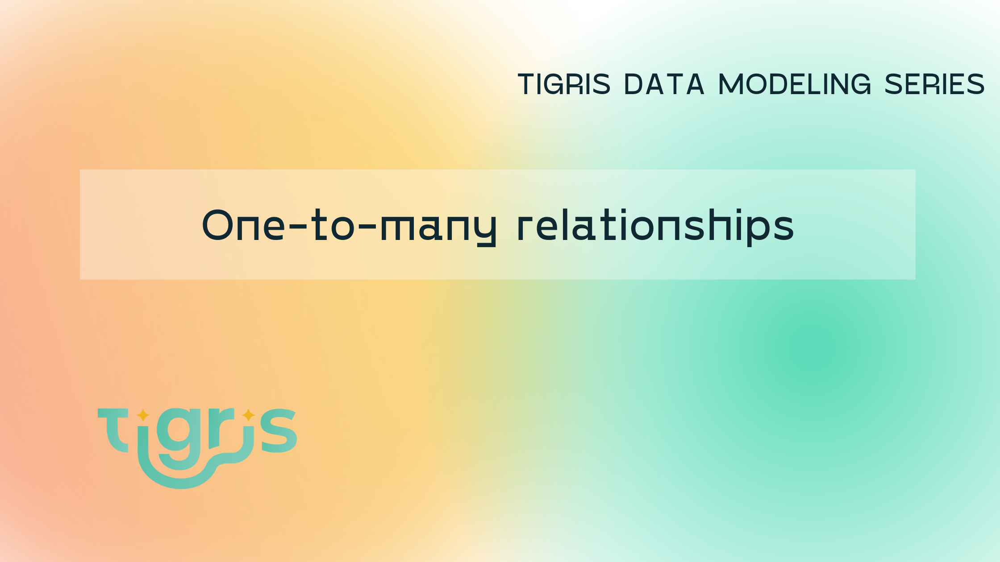

This is part 2 of the **Tigris Data Modeling Series**. In the first part of the series, we covered [modeling one-to-one relations](../2023-03-02-one-to-one-relations/index.mdx). In this second part of the series, we will explore modeling one-to-many relations.
We'll look at two ways to implement one-to-many relations. The first uses an embedded pattern, and the second uses a separate collection with a relation field. We will also look at when it is best to use either of these designs.



<!--truncate-->

## Getting started

To follow along, you will need to get set up with Tigris. This is a quick and easy process.
The Tigris Docs have a [Quickstart](https://www.tigrisdata.com/docs/quickstarts/) to show you how to sign up. Once you have signed up and created a new project, let's create a new template to get started.

```
$ npx create-tigris-app@latest --project relations --example playground
```

Follow the prompts to add your `clientId` and `clientSecret`.

## Embedded One-to-Many

Let us start with modeling one-to-many relations with an embedded document. In the playground repository there is a `Post` model defined in `src/db/models/post.ts`.
For our example we can reduce some of the fields. Edit it so that it looks like this:

```ts showLineNumbers
import {
  Field,
  PrimaryKey,
  TigrisCollection,
  TigrisDataTypes,
} from "@tigrisdata/core";

@TigrisCollection("post")
export class Post {
  @PrimaryKey(TigrisDataTypes.UUID, { order: 1, autoGenerate: true })
  id?: string;

  @Field({ timestamp: "createdAt" })
  createdAt?: Date;

  @Field({ timestamp: "updatedAt" })
  updatedAt?: Date;

  @Field()
  title: string;

  @Field()
  content?: string;

  @Field({ default: false })
  published?: boolean;
}
```

This is a simplified model we will use to model blog posts. Next, add an embedded comments object to keep track of all the comments
for this blog post.

```ts showLineNumbers {8-17,39-40}
import {
  Field,
  PrimaryKey,
  TigrisCollection,
  TigrisDataTypes,
} from "@tigrisdata/core";

export class Comment {
  @Field()
  content: string;

  @Field()
  name: string;

  @Field({ timestamp: "createdAt" })
  createdAt?: Date;
}

@TigrisCollection("post")
export class Post {
  @PrimaryKey(TigrisDataTypes.UUID, { order: 1, autoGenerate: true })
  id?: string;

  @Field({ timestamp: "createdAt" })
  createdAt?: Date;

  @Field({ timestamp: "updatedAt" })
  updatedAt?: Date;

  @Field()
  title: string;

  @Field()
  content?: string;

  @Field({ default: false })
  published?: boolean;

  @Field(TigrisDataTypes.ARRAY, { elements: Comment })
  comments: Array<Comment>;
}
```

In the above code, we define a new `Comment` class on line 8. We then embed this as an array in our `Post` object on `line 39`.

When there is a new comment, we will fetch the post document from Tigris and append the latest comment.
Open up `index.ts` and add the following code to do that:

```ts showLineNumbers {18-42}
import { Tigris } from "@tigrisdata/core";
import { Post } from "./db/models/post";

// setup client
const tigrisClient = new Tigris();
async function setup() {
  // ensure branch exists, create it if it needs to be created dynamically
  await tigrisClient.getDatabase().initializeBranch();
  // register schemas
  await tigrisClient.registerSchemas([Post]);
}

async function main() {
  await setup();
  const db = await tigrisClient.getDatabase();
  const postCollection = await db.getCollection<Post>(Post);

  const post = await postCollection.insertOne({
    title: "A book review of Designing Data-Intensive Applications",
    content: `
        Design Data-intensive Applications by Martin Kleppmann is a must read
        for anyone that loves learning about databases and build distributed systems.
        It covers a large range of topics on the complexity of building distributed systems.
        It is one of my favourite technical books.
    `,
    comments: [],
  });

  post.comments.push({
    content:
      "Thank you for the excellent book review. I've added it to my reading list",
    name: "Henry",
  });

  post.comments.push({
    content:
      "I strongly disagree, everyone should be learning distributed systems from reading academic papers only!",
    name: "Angry Max",
  });

  const updated = await postCollection.insertOrReplaceOne(post);
  console.log(updated.comments);

  const foundPost = postCollection.findOne({
    filter: { title: "A book review of Designing Data-Intensive Applications" },
  });
  console.log("Fetching post from server");
  console.log(foundPost);
}

main()
  .then(async () => {
    console.log("Setup complete ...");
    process.exit(0);
  })
  .catch(async (e) => {
    console.error(e);
    process.exit(1);
  });
```

The main lines to focus on are `line 18` to `line 43`. Here we create a post and save it to Tigris. Then we add two comments to the `comments` Array field
in the document and save it to the server.
Finally, we find the first document in the collection that matches the title and print it to the console. This is how you can work with one-to-many relations using the embedded pattern.

This pattern works well for documents that do not have a lot of changes to them, so there are very few writes of the document to the database.
However, if there are a lot of writes, like in the case of a blog post receiving a lot of comments, we will get a lot of conflicts. We can handle this by retrying the update or fetching the document
again, adding the comments, and trying to save it again. But this is a very tedious process and is prone to writing over data.

Instead, we can solve this by breaking up the comments into their own collection and using Tigris's transactions.

## Reference one-to-many relations

Breaking up the comments into their own collections avoids any write conflicts but will mean queries will require a read from two
collections. We will query from the blog collection to get the post we want and then from the comments collection to get all the comments
for a specific post. Below is what is required to change the Tigris schema to follow this pattern:

```ts showLineNumbers {8}
import {
  Field,
  PrimaryKey,
  TigrisCollection,
  TigrisDataTypes,
} from "@tigrisdata/core";

@TigrisCollection("comment")
export class Comment {
  @Field(TigrisDataTypes.UUID)
  postId: string;

  @Field()
  content: string;

  @Field()
  name: string;
}

@TigrisCollection("post")
export class Post {
  @PrimaryKey(TigrisDataTypes.UUID, { order: 1, autoGenerate: true })
  id?: string;

  @Field({ timestamp: "createdAt" })
  createdAt?: Date;

  @Field({ timestamp: "updatedAt" })
  updatedAt?: Date;

  @Field()
  title: string;

  @Field()
  content?: string;

  @Field({ default: false })
  published?: boolean;
}
```

In the above snippet, we have removed the reference to the comments in `Post` collection and instead have created a new collection
called `comment`. Now update the `index.ts` file to support the new collection:

```ts showLineNumbers {2,10,47,69}
import { Tigris } from "@tigrisdata/core";
import { Post, Comment } from "./db/models/post";

// setup client
const tigrisClient = new Tigris();
async function setup() {
  // ensure branch exists, create it if it needs to be created dynamically
  await tigrisClient.getDatabase().initializeBranch();
  // register schemas
  await tigrisClient.registerSchemas([Post, Comment]);
}

async function main() {
  await setup();
  const db = await tigrisClient.getDatabase();
  const postCollection = await db.getCollection<Post>(Post);
  const commentCollection = await db.getCollection<Comment>(Comment);

  const post = await postCollection.insertOne({
    title: "A book review of Designing Data-Intensive Applications",
    content: `
        Design Data-intensive Applications by Martin Kleppmann is a must read
        for anyone that loves learning about databases and build distributed systems.
        It covers a large range of topics on the complexity of building distributed systems.
        It is one of my favourite technical books.
    `,
  });

  if (!post.id) {
    throw "post id was not set";
  }

  commentCollection.insertOne({
    postId: post.id,
    content:
      "Thank you for the excellent book review. I've added it to my reading list",
    name: "Henry",
  });

  commentCollection.insertOne({
    postId: post.id,
    content:
      "I strongly disagree, everyone should be learning distributed systems from reading academic papers only!",
    name: "Angry Max",
  });

  const tx = await db.beginTransaction();
  const foundPost = await postCollection.findOne(
    {
      filter: {
        title: "A book review of Designing Data-Intensive Applications",
      },
    },
    tx
  );
  console.log("Fetching post from server");
  console.log(foundPost);
  let commentCursor = await commentCollection.findMany(
    {
      filter: { postId: foundPost.id },
    },
    tx
  );

  for await (let comment of commentCursor) {
    console.log(`"${comment.name}" wrote "${comment.content}"`);
  }

  tx.commit();
}

main()
  .then(async () => {
    console.log("Complete ...");
    process.exit(0);
  })
  .catch(async (e) => {
    console.error(e);
    process.exit(1);
  });
```

We import the new collection on `line 2` and add it to our database schema on `line 10`.

The main query changes start at `line 33`,
where we insert each comment individually. In this small example, we could use [`insertMany`](https://www.tigrisdata.com/docs/sdkstools/typescript/database/insert/#insert-multiple-documents) to
batch insert the comments. However, I've intentionally inserted them individually as if inserted by separate requests triggered via web requests.

On `line 47` we start a transaction to read from the post and comment collection. We create a transaction so that we
get a single consistent snapshot from the two collections.
On `line 48` we query for the specific post, and then on `line 58` we fetch all comments related to the post.
This allows us to have a high number of consistent reads and writes for this blog post without causing write conflicts and making sure our data is always consistent.

The two different one-to-many relation design patterns work well when used correctly. If you are not doing a lot of updates and not adding a lot of documents related to the parent, then
the embedded pattern will be the most efficient. However, referencing a separate collection is the best pattern if many documents link to the parent document.

Thanks for following along. The final blog post in this series will cover many-to-many relations.

import NewsletterSubscribe from "../../src/components/NewsletterSubscribe";

<NewsletterSubscribe ctaMessage="Make sure you don't miss the next post in the series by subscribing to the Tigris Newsletter:" />

---

import OpenSourceCTA from "../_oss-cta.mdx";

<OpenSourceCTA />
