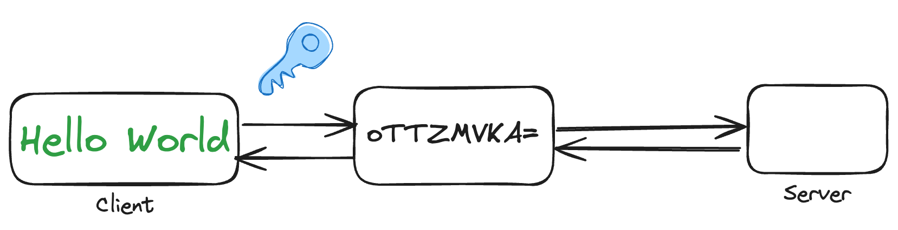
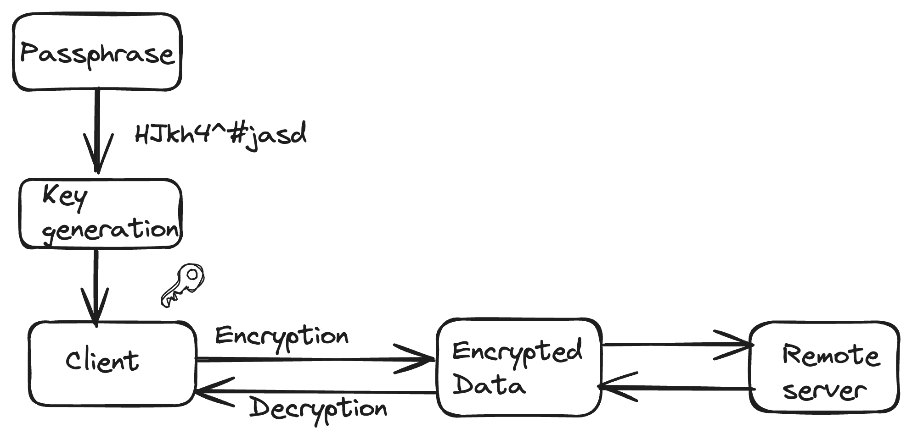

import styles from "!!raw-loader!./styles.css";

Client-side encryption refers to the practice of encrypting data on the client
side (user's device) before it is transmitted to a server or stored in a remote
location. This approach enhances the security and privacy of user data by
ensuring that sensitive information is encrypted locally, and only the encrypted
form is transferred or stored on the server.

Here's how client-side encryption typically works:

{/* truncate */}

For the first time setup the keys are generated which are typically the
master-keys. These keys are used to encrypt and decrypt. They are derived from
user entered passphrases.

In cloud services before the client sends the data to the server, the client
encrypts the data using the generated encryption key. Most commonly AES
encryption is used as the encryption algorithm. Once the data is encrypted, it
is transmitted to the remote server and stored in encrypted form, even if the
data is intercepted it is in unreadable form without corresponding decryption
key.

While reading the data the server transmits the encrypted data back to the
client and client decrypts the encrypted data using the encryption key. This
step ensures the sensitive information remains secure as decryption occurs on
the user's trusted services.

In some cases, client-side encryption is used in conjunction with end-to-end
encryption (E2EE), where only the end users (clients) have the keys to decrypt
and access the data. This ensures that even service providers or server
administrators cannot access the unencrypted data.

Client-side encryption is commonly implemented in various applications and
services, such as:

**Cloud Storage Services:** Users can encrypt their files locally before
uploading them to the cloud, ensuring that the cloud service provider cannot
access the content.

**Messaging Apps:** End-to-end encryption in messaging apps ensures that only
the intended recipients can decrypt and read the messages.

**File Transfer Services:** Encrypting files before transferring them over the
internet ensures the confidentiality of the data during transit.

This approach empowers users with greater control over their data and adds an
extra layer of security, especially in scenarios where users may not fully trust
the server or the service provider with their sensitive information.

## Benefits of Client-side encryption

Client-side encryption offers several advantages, particularly in enhancing the
security and privacy of user data. Here are some key benefits:

**Enhanced Data Security:**

Client-side encryption ensures that sensitive data is encrypted on the user's
device before being transmitted or stored remotely. This significantly reduces
the risk of unauthorized access or data breaches.

**User Control:** Users have greater control over their encryption keys and,
consequently, their data. This empowers individuals to manage and safeguard
their information, reducing dependence on service providers.

**Privacy Preservation:** Client-side encryption enhances user privacy by
preventing service providers or third parties from accessing unencrypted user
data. Only users with the corresponding encryption keys can decrypt and access
their information.

**Reduced Trust in Service Providers:**

Users don't need to fully trust service providers with their unencrypted data.
Even if the service provider is compromised, the encrypted data remains
unreadable without the encryption keys.

**Compliance with Privacy Regulations:** Client-side encryption aids in
compliance with data protection and privacy regulations by ensuring that
sensitive information is secured at the source, reducing the risk of
non-compliance.

## Challenges with client-side encryption

Client-side encryption, while offering enhanced security and privacy, comes with
its own set of challenges and considerations:

**Key Management:** Effective key management is critical. Lost or forgotten
encryption keys can result in permanent data loss, and securely storing and
recovering keys can be challenging.

**User Experience:** Implementing seamless user experiences, especially around
key generation and storage, can be complex. Striking a balance between security
and user-friendliness is essential.

**Key Distribution:** In scenarios where multiple devices or users need access
to encrypted data, securely distributing and managing encryption keys becomes a
significant challenge.

**Recovery Mechanisms:** Implementing secure and user-friendly key recovery
mechanisms is important. Users should have a way to regain access to their
encrypted data if they forget their password or lose their encryption key.

**Search and Indexing:** Searching and indexing encrypted data becomes
challenging, as the server cannot directly access the content. Techniques like
searchable encryption may be used, but they add complexity.

Despite these challenges, client-side encryption remains a valuable approach for
securing user data, particularly in scenarios where users prioritize privacy and
want control over their information. Addressing these challenges requires
careful planning, a user-centric approach, and ongoing efforts to stay abreast
of advancements in encryption technologies and best practices.

Several well known implementations of client side encryption in cloud services
are Amazon S3, AWS Wickr, Azure blob storage, Snowflake, MongoDB.
