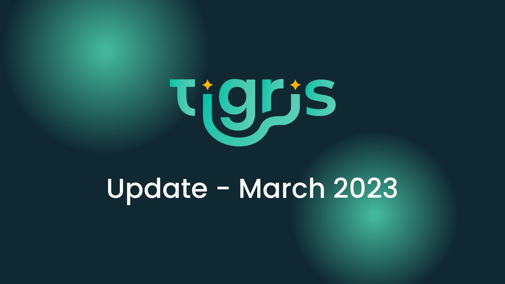
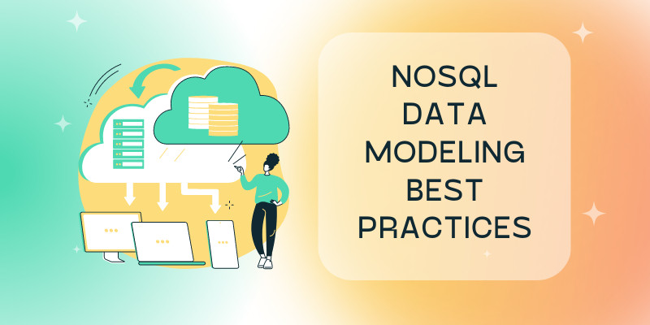

import tigrisConfig from "@site/tigris.config.js";

# Tigris Update - March 2023

Hello, and welcome to the first Tigris update. Each month we'll share product and community highlights and let you know what to look out for in the coming month.

[](./tigris-march-2023-update/)

<!-- truncate -->

## What is Tigris?

Since this is our first update, I thought I'd start from the beginning and remind you what Tigris is.

Tigris is a serverless NoSQL Database and Search platform that offers a modern open source alternative to MongoDB and DynamoDB. Tigris allows developers to rapidly build applications with a platform that combines NoSQL database, full-text search, and sync mechanism. Tigris simplifies operations by automatically scaling throughput and storage as application traffic grows at a fraction of the cost of MongoDB and DynamoDB, while providing high availability and data security.

We manage a hosted version of Tigris called <a href={tigrisConfig.signupUrl}>Tigris Cloud</a>.

## Tigris MongoDB compatibility in beta

In March, we released Tigris MongoDB compatibility in beta, providing support for MongoDB 6.0+ CRUD and Aggregation operations. This means that any application that uses the supported operations, no matter the programming language, can now use Tigris instead of a self-hosted MongoDB instance or MongoDB Atlas.

- [Read the announcement](https://www.tigrisdata.com/blog/mongodb-compatibility-beta/)
- Get started with the Tigris MongoDB compatibility quickstarts for:
  - [TypeScript & Node.js](https://www.tigrisdata.com/docs/quickstarts/mongodb-compatibility/typescript/)
  - [Go](https://www.tigrisdata.com/docs/quickstarts/mongodb-compatibility/go/)
  - [Java](https://www.tigrisdata.com/docs/quickstarts/mongodb-compatibility/java/)
  - [Python](https://www.tigrisdata.com/docs/quickstarts/mongodb-compatibility/python/)
  - [PHP](https://www.tigrisdata.com/docs/quickstarts/mongodb-compatibility/php/)
- Or try out Tigris MongoDB compatibility using [mongosh, the MongoDB REPL](https://www.tigrisdata.com/docs/sdkstools/mongodb-compatibility/mongosh/)

## NoSQL data modeling best practices

[](/blog/tags/data-modeling/)

Our database engineer, Garren, published parts 1 and 2 of his NoSQL data modeling best practice guides.

In the first part, Garren covers [one-to-one relationships](https://www.tigrisdata.com/blog/modelling-one-to-one-relations/), and in the second, [one-to-many relationships](https://www.tigrisdata.com/blog/modeling-one-to-many-relations/).

Lookout for part 3, many-to-many relations, in April.

## New Search releases coming in April

A developer data platform promises to contain multiple data services. If a database is the most fundamental of those services, then search is the next priority. In April, we'll be making two search releases:

### Standalone Search

If you're not quite ready to move all your data into Tigris Database but want to benefit from Tigris Search, you can use Tigris Search standalone.

Standalone search allows you to create indexes, and insert, search, and delete documents in the index. As with Tigris database schemas, search indexes are defined within data models using the programming language you already use in your codebase. For example, in your TypeScript application, a search index is defined as follows:

```ts
@TigrisSearchIndex("catalog")
export class Catalog {
  @SearchField({ sort: true })
  name: string;

  @SearchField({ sort: true })
  price: number;

  @SearchField({ facet: true })
  brand: string;

  @SearchField({ elements: TigrisDataTypes.STRING, facet: true })
  @Field({ elements: TigrisDataTypes.STRING })
  tags: Array<string>;
}
```

The decorators inform Tigris to create a search index called `catalog` and index all fields with `@SearchField`. Various decorator options are available for fine-grained configuration. You take a look at the [TypeScript docs for Search](https://www.tigrisdata.com/docs/sdkstools/typescript/search/) now.

### Collection Search

Collection Search is a feature that automatically synchronizes data from database collections into a search index.

To update your database models to be searchable, add a `@SearchField()` decorator to the fields you want to be synchronized. So, if your existing data model TypeScript code looks as follows:

```ts
@TigrisCollection("posts")
class Post {
  @PrimaryKey(TigrisDataTypes.UUID, { order: 1, autoGenerate: true })
  id?: string;

  @Field()
  title: string;

  @Field()
  body: number;
}
```

All you have to enable search synchronization is to add the `@SearchField()` decorator:

```ts
@TigrisCollection("posts")
class Post {
  @PrimaryKey(TigrisDataTypes.UUID, { order: 1, autoGenerate: true })
  id?: string;

  @SearchField()
  @Field()
  title: string;

  @SearchField()
  @Field()
  body: number;
}
```

Note that the field with the `@PrimaryKey` decorator will always be synchronized.

Join the [Tigris Discord](https://www.tigrisdata.com/discord/) to be instantly notified when the new search functionality becomes available.

## Blog highlights

- [Tigris transaction internals and comparison with MongoDB transactions](https://www.tigrisdata.com/blog/transaction-internals-tigris/) - our CTO and co-founder walks through the technical details of how transactions are implemented in Tigris and how Tigris offers a simpler and cleaner transaction experience to the developers as compared to MongoDB.
- [Backing up FoundationDB](https://www.tigrisdata.com/blog/backing-up-foundationdb/) - how to backup and restore FoundationDB to S3 by our founding engineer, Peter.

## Feedback request

We're a week into our public beta and excited by the feedback we've had so far. But we know we will only be successful by making you successful - this means building a product you're as excited about as we are.

So, we'd love to hear your feedback. Please get in touch via one of the following options:

- [Book a 30-minute chat with us](https://calendly.com/tigrisdata/feedback)
- [Join the Tigris Discord](https://www.tigrisdata.com/discord/)
