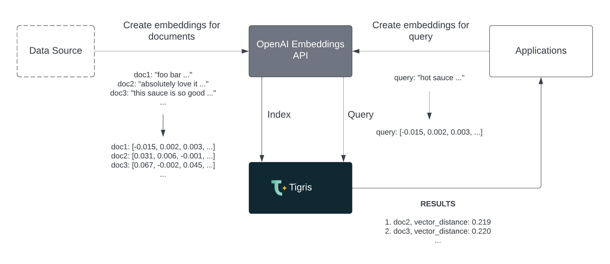

import tigrisConfig from "@site/tigris.config.js";

# Fast and scalable vector search with Tigris and OpenAI

In this post, we'll show you how to use the OpenAI Embeddings API to generate
embeddings for your documents and then use Tigris to index these embeddings
for fast and scalable vector search.

This is a powerful combination that can be used for building semantic search
applications, recommendation engines, and more.

## What is vector search?

Vector search is a type of search that uses vector representations of documents
to find similar documents. Vector search is a powerful technique that can be
used to find similar documents, images, and videos. Vector search is also
useful for finding similar products, recommendations, and more.

<!-- truncate-->

## What is an embedding?

An embedding is a vector representation of a document. Embeddings are
generated by a machine learning model that is trained on a large corpus of
documents. The model learns the relationships between words and documents and
then generates a vector representation of the document. The vector
representation is a dense vector of floating-point numbers that can be used
to find similar documents.

For more information, check out the [OpenAI embeddings guide](https://platform.openai.com/docs/guides/embeddings).

## Vector search workflow with OpenAI and Tigris

The vector search workflow with OpenAI and Tigris works as follows:

1. Generate embeddings for your documents using the OpenAI Embeddings API.
2. Index the embeddings in Tigris.
3. Pass the search query through the OpenAI Embeddings API to generate an
   embedding.
4. Use the embedding to search for similar documents in Tigris.
5. Get back semantically similar documents, even if they don't contain the
   search query keywords.



Now, let's build a vector search application that implements this workflow.

## Building the vector search application

To follow along with this post, you'll need:

- An OpenAI account. You can sign up for an account [here](https://platform.openai.com/)
- A Tigris Cloud account. You can sign up for a free account <a href={tigrisConfig.signupUrl}>here</a>
- [Node.js 18.13.0](https://nodejs.org/) or newer

Once you have signed up for the Tigris Cloud account, create a new project called `vectorsearchapp`.
Next, make a note of the `clientId` and `clientSecret`, which you can get from the **Application Keys**
section of the project.

### Bootstrap the application

Tigris provides a tool called `create-tigris-app` that you can use to quickly bootstrap a new Node.js
application. We will use this tool to create an application with Tigris and OpenAI clients already
configured.

```bash
npx create-tigris-app@latest --project vectorsearchapp --uri api.preview.tigrisdata.cloud --example vector-search-openai
```

<details>
<summary>Command output</summary>

```bash
✔ What is the clientId? … client_id_here
✔ What is the clientSecret? … *******************************************************
Creating a new app in /Users/ovaistariq/projects/vectorsearchapp.

Downloading files for example vector-search-openai. This might take a moment.


Initializing project with template: vector-search-openai

Using npm.

Installing dependencies:
- @tigrisdata/vector: 1.1.0
- express: 4.18.2
- openai: 3.2.1


added 245 packages, and audited 246 packages in 5s

35 packages are looking for funding
  run `npm fund` for details

found 0 vulnerabilities
Initialized a git repository.

Success! Created vectorsearchapp at /Users/ovaistariq/projects/vectorsearchapp

Inside that directory, you can run several commands:

  npm run dev
    Starts the development server.

  npm run build
    Builds the app for production.

  npm start
    Runs the built app in production mode.

We suggest that you begin by typing:

  cd vectorsearchapp
  npm run dev

```

</details>

The `create-tigris-app` tool will create a new directory called `vectorsearchapp`. Let's
change into this directory.

```bash
cd vectorsearchapp
```

We will need the OpenAI Organization ID and API key to authenticate with OpenAI.
Visit the [API Keys](https://platform.openai.com/account/api-keys) page to retrieve the API key
and the [Org Settings](https://platform.openai.com/account/org-settings) page to retrieve
the Organization ID.

Then update the `.env` file with the OpenAI Organization ID and API key.

```bash
OPENAI_ORG=your_org_id_here
OPENAI_API_KEY=your_api_key_here
```

Now we are all set.

Next, we will demonstrate how simple it is to store the embeddings in Tigris and then use
the Tigris client to search for similar documents. We will use a subset of reviews from the
[Amazon fine-food reviews](https://www.kaggle.com/snap/amazon-fine-food-reviews) dataset.

### Generating embeddings with OpenAI

Let's run the following command to generate embeddings for the reviews and store the
reviews and embeddings in Tigris.

```bash
npm run seed
```

The command performs the following steps:

#### 1. Creates the Vector Database client

We will use the project name, clientId and clientSecret from the previous step to
create the vector database client.

```ts title="scripts/seed.ts"
import { VectorDocumentStore } from "@tigrisdata/vector";

const vectorDocStore = new VectorDocumentStore({
  connection: {
    serverUrl: "api.preview.tigrisdata.cloud",
    projectName: "vectorsearchapp",
    clientId: "clientId_here",
    clientSecret: "clientSecret_here",
  },
  indexName: "reviews",
  numDimensions: 1536, // 1536 floats total for ada-002
});
```

Here, we have created a new VectorDocumentStore instance that connects to the
Tigris Vector Database. The indexName is the name of the index that will store
your embeddings, documents, and any additional metadata. You can use any name
you like for the index. The numDimensions is the number of dimensions of the
vector embeddings.

#### 2. Store reviews and embeddings in Tigris

The reviews are loaded from the CSV file and embeddings are generated via OpenAI:

```ts title="scripts/seed.ts"
// ...
// setup OpenAI client
const openai = getOpenaiClient();

let numDocsLoaded = 0;

const ids: string[] = [];
const documents: Document[] = [];
const contents: string[] = [];
for await (let doc of readStream.pipe(parse({ columns: true, cast: true }))) {
  doc = doc as Review;

  ids.push(`${doc.Id}`);
  documents.push({
    content: doc.Text,
    metadata: {
      ProductId: doc.ProductId,
      UserId: doc.UserId,
      ProfileName: doc.ProfileName,
      HelpfulnessNumerator: doc.HelpfulnessNumerator,
      HelpfulnessDenominator: doc.HelpfulnessDenominator,
      Score: doc.Score,
      Time: doc.Time,
      Summary: doc.Summary,
    },
  });

  contents.push(`${doc.Summary} ${doc.Text}`);

  if (documents.length >= BATCH_SIZE) {
    await storeDocuments(ids, documents, contents, store, openai);

    numDocsLoaded += documents.length;
    ids.length = 0;
    documents.length = 0;
    contents.length = 0;
  }
}
// ...
```

The `storeDocuments` function uses the OpenAI client to generate embeddings and
stores the documents and embeddings:

```ts title="scripts/seed.ts"
async function storeDocuments(
  ids: string[],
  documents: Document[],
  contents: string[],
  store: VectorDocumentStore,
  openai: OpenAIApi
) {
  const embeddingsResponse = await createEmbeddings(openai, contents);
  const embeddings = embeddingsResponse.data.map((e) => e.embedding);

  await store.addDocumentsWithVectors({
    ids,
    embeddings,
    documents,
  });
}
```

Now that the embeddings have been generated and stored in Tigris, we can start the
application and perform searches.

## Running the vector search application

Let's run the following command to start the application in development mode running on `http://localhost:3000`:

```bash
npm run dev
```

The server is now running on `http://localhost:3000`. You can now run the API
requests, e.g.
[http://localhost:3000/search](http://localhost:3000/search).

### Searching for similar reviews

Let's perform some searches now.

```bash
curl \
  'http://localhost:3000/search?searchString=hot%20sauce&k=5' \
  -H 'Content-Type: application/json'
```

This returns the following results:

```json
[
  {
    "Id": 988,
    "ProductId": "B006F2NYI2",
    "UserId": "A36GDATSF85X7W",
    "ProfileName": "Matt Waz",
    "Score": 5,
    "Summary": "Awesome Sauce",
    "Text": "This hot sauce is one of my favorites. Its a perfect balance of tasty and spicy. You can smell the flavors immediately when you open the bottle. A mix of garlic, habanero, and other spices. I put this on everything and tend to go through one bottle a week. I highly recommend this to anyone who likes hot sauce.",
    "VectorDistance": 0.14292240142822266
  },
  {
    "Id": 995,
    "ProductId": "B006F2NYI2",
    "UserId": "A1T5CH6SHV989P",
    "ProfileName": "a biemold",
    "Score": 5,
    "Summary": "best hot sauce around",
    "Text": "absolutely love the habenaro sauce...use it on eggs, sandwiches most anything for a good kick! have watched the progessing popularity of theis homegrown product...have nothing but the highes accolades for the chef and the product..get out there and try it!",
    "VectorDistance": 0.14448332786560059
  },
  {
    "Id": 994,
    "ProductId": "B006F2NYI2",
    "UserId": "A1KFUVZ3BZ59R1",
    "ProfileName": "merplinger",
    "Score": 5,
    "Summary": "Best all around hot sauce",
    "Text": "So far I have had the habanero and the medium sauces and they were amazing. My fiance and I use them nearly daily and I just picked up 3 more. It goes really well on all sorts of dishes to add the extra kick.<br /><br />The sauce itself lasts a lot longer than it appears. It is thick and a bottle will last us a couple of weeks of heavy use. We love to use it for breakfast on eggs or in burritos and for dinners or soups for added spice.",
    "VectorDistance": 0.1463753581047058
  },
  {
    "Id": 998,
    "ProductId": "B006F2NYI2",
    "UserId": "A3G313KLWDG3PW",
    "ProfileName": "kefka82",
    "Score": 5,
    "Summary": "this sauce is the shiznit",
    "Text": "this sauce is so good with just about anything, i like adding it to asian food or anything with egg or noodles, it has a good burn with a strong flavor. im hoping to see some of the other flavors like the pineapple experiment on here soon. buy it you wont regret it",
    "VectorDistance": 0.1499418020248413
  },
  {
    "Id": 996,
    "ProductId": "B006F2NYI2",
    "UserId": "A1D3F6UI1RTXO0",
    "ProfileName": "Swopes",
    "Score": 5,
    "Summary": "Hot & Flavorful",
    "Text": "BLACK MARKET HOT SAUCE IS WONDERFUL.... My husband Loves this Habenero sauce, its very very flavorful with a nice kick to it. I in fact love the medium sauce- the taste is so yummy with a bit of zing behind it. We used it for everything and you can use it with any meal.<br /><br />I like the fact that there are so many different levels of spicyness. We love the medium & habenero. Kind of like a \"HIS & HERS package\". Thank you for your hard work guys! Keep up the hard work.",
    "VectorDistance": 0.15223878622055054
  }
]
```

We have searched for "hot sauce" and the results are sorted by the vector distance.
The vector distance is a measure of how similar the search string is to the review
text. The closer the vector distance is to 0, the more similar the review text is
to the search string.

Here is what the code for the vector search API looks like:

```ts title="src/routes/search.ts"
// ...
import { Router } from "express";
import { OpenAIApi } from "openai";
import { createEmbedding } from "../utils/openai";
import { VectorDocumentStore } from "@tigrisdata/vector";
// ...
async (req, res, next) => {
  const { searchString, k } = req.query;

  try {
    const embeddings = await createEmbedding(openai, searchString as string);

    const results = await vectorStore.similaritySearchVectorWithScore({
      query: embeddings,
      k: Number(k) || 10,
    });

    res.json(results);
  } catch (error) {
    next(error);
  }
};
// ...
```

## Next Steps

Try out this application, and [let us know](https://www.tigrisdata.com/contact/) what
other examples of vector search you'd like to see.

Continue to the [Getting Started](https://www.tigrisdata.com/docs/concepts/vector-search/getting-started/)
guide to learn how to get started with Vector Search using Tigris.

---

import NewsletterSubscribe from "../../src/components/NewsletterSubscribe";

<NewsletterSubscribe />
