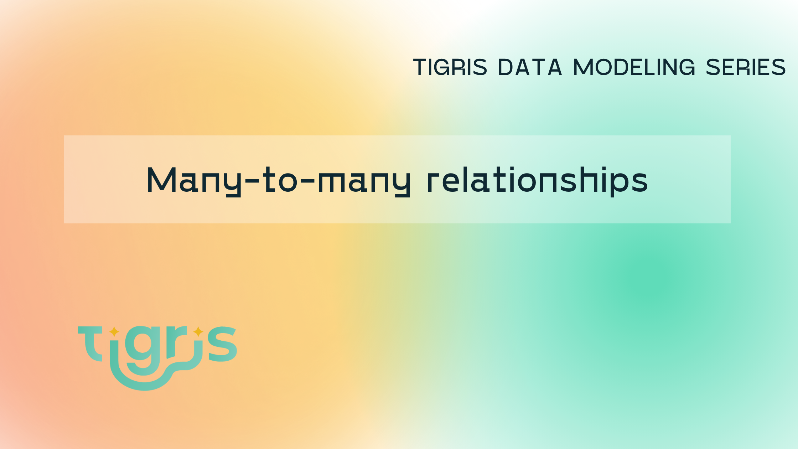

This is part 3 of the **Tigris Data Modeling Series**. In part one of the series, we covered [modeling one-to-one relations](../2023-03-02-one-to-one-relations/index.mdx).
and in part two we explored [modeling one-to-many relations](../2023-03-09-one-to-many-relations/index.mdx). This is the third and final
post and we will dive into modeling many-to-many relations. We model many-to-many relations in two ways. As embeded documents
and as related documents and will use full-text search to perform advanced queries against our data.



<!--truncate-->

## Getting started

To follow along, you will need to get set up with Tigris. This is a quick and easy process.
The Tigris Docs have a [Quickstart](https://www.tigrisdata.com/docs/quickstarts/) to show you how to sign up. Once you have signed up and created a new project, let's create a new template to get started.

```
$ npx create-tigris-app@latest --project relations --example playground
```

Follow the prompts to add your `clientId` and `clientSecret`.

## Embeded Many-to-Many

Let us start with modeling many-to-many relations with an embeded document. To do that we will model a set of courses and students.
There will be many courses with many students in each.

In the playground repository create a new file in the model directory - `src/db/models/courses.ts`.
In that file create a `course` and `student` collection that will look like the below:

```ts showLineNumbers {29,33}
import {
  Field,
  PrimaryKey,
  SearchField,
  TigrisCollection,
  TigrisDataTypes,
} from "@tigrisdata/core";

@TigrisCollection("course")
export class Course {
  @PrimaryKey(TigrisDataTypes.INT64, { order: 1, autoGenerate: false })
  id?: number;

  @Field()
  title: string;

  @Field()
  description: string;
}

@TigrisCollection("student")
export class Student {
  @PrimaryKey(TigrisDataTypes.STRING, { order: 1, autoGenerate: false })
  email: string;

  @Field()
  name: string;

  @SearchField(TigrisDataTypes.ARRAY, { elements: TigrisDataTypes.INT64 })
  @Field(TigrisDataTypes.ARRAY, { elements: TigrisDataTypes.INT64 })
  courseIds: Array<number>;

  @Field(TigrisDataTypes.ARRAY, { elements: TigrisDataTypes.STRING })
  interests: Array<string>;
}
```

We have created two models, each in its own collection. The first collection, `course`, will contains all the courses a student can take.
The second collection is the `student` collection and will contain a list of students, we will aslo embed the courses the student is attending in the student document.
On line `29` and `33` we also add a search tag to the `courseIds` and the `interests` array. This will allow us to use
Tigris' Text Search to query for specific courses.

Now let's change the `index.ts` file so that we can explore this design:

```ts showLineNumbers{5-13,19,71-73}
import { Tigris } from "@tigrisdata/core";
import { Student, Course } from "./db/models/courses";

// setup client
const tigrisClient = new Tigris();
async function setup() {
  // ensure branch exists, create it if it needs to be created dynamically
  let db = await tigrisClient.getDatabase();
  await db.initializeBranch();
  await db.dropCollection();
  // register schemas
  await tigrisClient.registerSchemas([Student, Course]);
}

async function main() {
  await setup();
  const db = await tigrisClient.getDatabase();
  const courseCollection = await db.getCollection<Course>(Course);
  const studentCollection = await db.getCollection<Student>(Student);

  const tx = await db.beginTransaction();
  await courseCollection.insertOrReplaceMany([
    {
      id: 1,
      title:
        "I tried these 10 things with a databases and you won't guess what happened next",
      description: "Learn all about the basics of database systems",
    },
    {
      id: 2,
      title: "Next.js to the MAX!!!",
      description:
        "Take your Next.js development to the maximum with this course....",
    },
    {
      id: 3,
      title: "Kubernetes is awesome",
      description: "Dispite many misgivings, K8 is awesome. Find out why",
    },
  ]);

  await studentCollection.insertOrReplaceMany([
    {
      email: "dolores@example.com",
      name: "Dolores Abernathy",
      courseIds: [1, 3],
      interests: ["kubernetes", "databases"],
    },
    {
      email: "maeve@example.com",
      name: "Maeve Millay",
      courseIds: [2, 3],
      interests: ["nextjs", "databases"],
    },
    {
      email: "charlotte@example.com",
      name: "Charlotte Hale",
      courseIds: [1, 2, 3],
      interests: ["nextjs"],
    },
    {
      email: "caleb@example.com",
      name: "Caleb Nichols",
      courseIds: [],
      interests: ["movies", "kubernetes", "databases"],
    },
  ]);

  await tx.commit();

  const iterator = await studentCollection.search({
    filter: { courseIds: 1, interests: "databases" },
  });

  for await (let resultPage of iterator) {
    for (let student of resultPage.hits) {
      console.log(student.document.name);
    }
  }
}

main()
  .then(async () => {
    console.log("Complete ...");
    process.exit(0);
  })
  .catch(async (e) => {
    console.error(e);
    process.exit(1);
  });
```

Lines `5` to `13` we set up our database and collections. On line 19 we start a transaction and add
documents to our collection in that transaction. This makes sure that the data is consistent across both collections.
On line `71` we use Tigris' Text search to find all students that are taking the first course and have
an interest in `"databases"`. Text Search is a great use case for handling complex situations.
I encourage you at this point to experiment with some more complex queries to really see how well Text Search
will work.

:::note
I've used the `insertOrReplaceMany` because this is a sort demo and we want to run it
many times. But in production, typically you would choose `insertMany`.
:::

This design of embedding the id's of the related document works very well and will work in most use cases.
And I would recommend starting with this design. But there are cases when there are lots of writes to update a document
concurrently. This could lead to lots of write conflicts. A way to avoid this is to create an intermediate document and collection
that links a student to a course. Let's do this by editing our `courses.ts` file to look like this:

```ts showLineNumbers{34-41}
import {
  Field,
  PrimaryKey,
  SearchField,
  TigrisCollection,
  TigrisDataTypes,
} from "@tigrisdata/core";

@TigrisCollection("course")
export class Course {
  @PrimaryKey(TigrisDataTypes.INT64, { order: 1, autoGenerate: true })
  id?: number;

  @Field()
  title: string;

  @Field()
  description: string;
}

@TigrisCollection("student")
export class Student {
  @PrimaryKey(TigrisDataTypes.STRING, { order: 1, autoGenerate: false })
  email: string;

  @Field()
  name: string;

  @SearchField(TigrisDataTypes.ARRAY, { elements: TigrisDataTypes.STRING })
  @Field(TigrisDataTypes.ARRAY, { elements: TigrisDataTypes.STRING })
  interests: Array<string>;
}

@TigrisCollection("studentToCourse")
export class StudentToCourse {
  @PrimaryKey(TigrisDataTypes.STRING, { order: 1, autoGenerate: false })
  studentEmail: string;

  @PrimaryKey(TigrisDataTypes.INT64, { order: 2, autoGenerate: false })
  courseId: number;
}
```

We have removed `courseIds` from the `Student` model and instead created the linking collection `StudentToCourse`.
Notice that the primary key for `StudentToCourse` is a combination of the `student` email address and the `course` id.
This forces a unique constraint so that a `student` will only be signed up for a course once.

Let's add data and explore this model. Change your `index.ts` to look like this:

```ts showLineNumbers{24,70,91}
import { Tigris } from "@tigrisdata/core";
import { Student, Course, StudentToCourse } from "./db/models/courses";

// setup client
const tigrisClient = new Tigris();
async function setup() {
  // ensure branch exists, create it if it needs to be created dynamically
  const db = await tigrisClient.getDatabase();
  db.initializeBranch();
  // await db.dropAllCollections();
  // register schemas
  await tigrisClient.registerSchemas([Student, Course, StudentToCourse]);
}

async function main() {
  await setup();
  const db = await tigrisClient.getDatabase();
  const courseCollection = await db.getCollection<Course>(Course);
  const studentCollection = await db.getCollection<Student>(Student);
  const studentToCourseCollection = await db.getCollection<StudentToCourse>(
    StudentToCourse
  );

  let tx = await db.beginTransaction();
  await courseCollection.insertOrReplaceMany([
    {
      id: 1,
      title:
        "I tried these 10 things with a databases and you won't guess what happened next",
      description: "Learn all about the basics of database systems",
    },
    {
      id: 2,
      title: "Next.js to the MAX!!!",
      description:
        "Take your Next.js development to the maximum with this course....",
    },
    {
      id: 3,
      title: "Kubernetes is awesome",
      description: "Dispite many misgivings, K8 is awesome. Find out why",
    },
  ]);

  await studentCollection.insertOrReplaceMany([
    {
      email: "dolores@example.com",
      name: "Dolores Abernathy",
      interests: ["kubernetes", "databases"],
    },
    {
      email: "maeve@example.com",
      name: "Maeve Millay",
      interests: ["nextjs", "databases"],
    },
    {
      email: "charlotte@example.com",
      name: "Charlotte Hale",
      interests: ["nextjs"],
    },
    {
      email: "caleb@example.com",
      name: "Caleb Nichols",
      interests: ["movies", "kubernetes", "databases"],
    },
  ]);

  await tx.commit();

  tx = await db.beginTransaction();
  studentToCourseCollection.insertOrReplaceMany([
    {
      courseId: 1,
      studentEmail: "dolores@example.com",
    },
    {
      courseId: 3,
      studentEmail: "dolores@example.com",
    },
    {
      courseId: 2,
      studentEmail: "charlotte@example.com",
    },
    {
      courseId: 3,
      studentEmail: "charlotte@example.com",
    },
  ]);
  await tx.commit();

  tx = await db.beginTransaction();
  let iter = await studentToCourseCollection.findMany({
    filter: { courseId: 3 },
  });

  for await (let linkDoc of iter) {
    let student = await studentCollection.findOne({
      filter: { email: linkDoc.studentEmail },
    });
    console.log(student.name);
    const iter2 = studentToCourseCollection.findMany({
      filter: { studentEmail: student.email },
    });

    for await (let courseLink of iter2) {
      const course = await courseCollection.findOne({
        filter: { id: courseLink.courseId },
      });
      console.log(`course: ${course.title}`);
    }
  }

  await tx.commit();
}

main()
  .then(async () => {
    console.log("Complete ...");
    process.exit(0);
  })
  .catch(async (e) => {
    console.error(e);
    process.exit(1);
  });
```

On line `24` we create a transaction and add the students and courses. But there is no association yet between `students` and `courses`.
We then create another transaction, on line `70`. We have added this in a different transaction to simulate what would happen when a student
would sign up for a course via a website. Finally on line `91`, we do a query. We look for all the students taking the course with id `3`
and then we query for what other courses they are doing and print all their courses to the console.

Play around with the querying options to find students and courses in different ways. One idea would be to search for a specific interest and
then see which courses those students are taking.

This completes the relationship modeling series. This series covered the three main ways to model relationships. How to model each one in a few
different ways to fit your needs and most importantly how to do that safely with transactions.

import NewsletterSubscribe from "../../src/components/NewsletterSubscribe";

<NewsletterSubscribe ctaMessage="Make sure you don't miss the next post in the series by subscribing to the Tigris Newsletter:" />

---

import OpenSourceCTA from "../_oss-cta.mdx";

<OpenSourceCTA />
