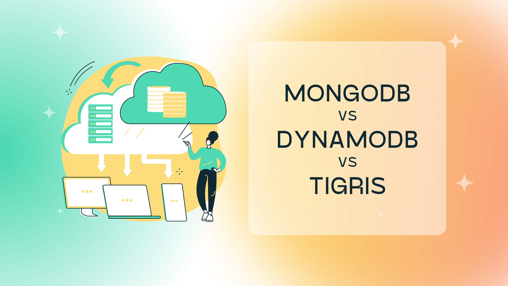

<head>
  <meta name="twitter:creator" content="@matthewrevell" />
</head>

import tigrisConfig from "@site/tigris.config.js";

Choosing how your app stores and manages data is one of those foundational
decisions that will impact just about every other step you take. But with so
much variety, how do you make the right call?

Tigris is an open source NoSQL database and search platform that you can run in
any cloud, on your own hardware, or have managed for you in

<a href={tigrisConfig.signupUrl}>Tigris Cloud</a>. Here we'll look at how Tigris
compares both to MongoDB and DynamoDB, as well as providing an overview of some
of the features and tradeoffs you'll need to consider.

**Just want to see the feature comparison table? No problem,
[view the NoSQL database comparison table >](/blog/mongodb-vs-dynamodb-vs-tigris-nosql-comparison/#mongodb-vs-dynamodb-comparison)**

<!-- truncate -->

## Types of NoSQL database

There are three fundamental things you need to consider when looking at
different data stores:

- NoSQL Data model
- Scaling
- Consistency

Each of those impacts the role a database can play in your application
architecture. Tigris, MongoDB, and DynamoDB all take a different approach, and
understanding where they differ will help you decide which makes most sense for
your needs.

### Data models

Let's start with the data model. In a relational DBMS, such as PostgreSQL or
Oracle, data falls into the familiar rows and columns of a table, with the
option to create relationships across those tables.

With NoSQL databases, on the other hand, there's much more variety in how they
store data. The most common non-relational data models are:

- **Document:** Both MongoDB and Tigris store data as JSON documents, rather
  than in tables.
- **Key value:** Probably the simplest form of database, a key-value store such
  as DynamoDB has a one-to-one relationship between the key and an item of data.
  Typically, the database system has no insight into what is stored: it could be
  raw text, a binary blob, numeric, JSON, or anything else.
- **Column store:** Similar to a relational database, column stores like
  Cassandra or Google's Bigtable organizes data into families of columns and
  rows, but rather than adding data as a new row, it is added as a new column.
- **Time series database: **Optimized for time-stamped data, such as a series of
  readings from industrial IoT sensors.
- **Multi-model:** A data platform, such as Tigris, or a database like
  FoundationDB, might have one underlying data model (such as document or
  key-value) but provide multiple ways of querying that data so as to break out
  of the confines of one particular data model.

### Scaling

At its simplest, databases can scale up or scale out. Scaling up means adding
more RAM, disk space, CPU, and so on to a single machine or VM. That approach is
easy, but it has a couple of downsides. The most obvious is that bare metal
servers and virtual machines can get only so big. The other is that relying on
one machine introduces a single point of failure.

Scaling out, on the other hand, expands capacity by adding more database
instances and spreading both the data stored and the query load across them.
That usually means storing more than one copy of the same data in different
places or storing the data in one place, but it might be that an index that
refers to that data lives on another machine. However it plays out, the moment
your database spreads across more than one machine, you have to choose between
two data consistency scenarios.

### Data consistency

In a scale out database, data consistency comes in one of two forms:

- **Strongly consistent:** The database ensures that every copy of and reference
  to an item of data is the same however and wherever it is accessed. As a
  result, the data might sometimes be unavailable in order to avoid
  inconsistency.
- **Highly available:** All data is always available. Even if another user is
  updating one instance of a document, for example, you can still access the
  older version before their write completes. The tradeoff is that different
  users might see different versions of the same data.

MongoDB, DynamoDB, and Tigris all take somewhat different approaches to data
model, scaling, and data consistency. And that impacts how they deliver on
features such as ACID transactions, full-text search, and globally consistent
secondary indexes. Let's look in detail at some of those key features that
differ between MongoDB, DynamoDB, and Tigris.

## Interactive ACID transactions

Writing to a database is usually made up of a chain of operations. Let's say
you're updating an existing document. The process might look a little like this:

1. Fetch the existing document.
2. Find and fetch any indexes that reference that document.
3. Write the new version of the document.
4. Share that new version to any replicas.
5. Update existing references in indexes, add any new ones, and delete those
   that no longer apply.

Let's say that just after writing the new document, someone puts a backhoe
through the data center's power cable, and the back-up generator fails to
kick-in on time. Or, more likely, a hard drive fails unexpectedly and takes the
server down. Once the server was back online, some NoSQL databases would plough
on despite two major problems:

- There would be two different versions of the same document available to use.
- The indexes would be inaccurate.

ACID transactions prevent those types of inconsistency. In an ACID transaction,
either every step of a change takes place, or none takes place. In our scenario
above, on regaining power, the server would either reverse the steps that had
taken place or complete those that hadn't.

## Strongly consistent global secondary indexes

Secondary indexes make it easier and faster to find data within the body of a
document. Let's say we have a database of people. We can be sure that each
person's email address is unique, so we use that as the key for the documents.

However, if we also want to find people from a certain city, then the database
would have to trawl through each document to find those that match. The
resultant read could take a substantial amount of time. A more efficient way is
to maintain an index of which people are in each city. That way, if we want to
find all the people from Berlin, for example, the database can perform a single
look-up in the cities index to return all the relevant documents.

The accuracy of those indexes depends on when they get updated. Some databases
update indexes in the background, separately from writing the document itself.
That way, it's never really clear if the index is accurate or stale. Strongly
consistent global secondary indexes, on the other hand, get updated when the
document is updated. That way, they're always up to date.

## Database branching

Imagine working on a codebase without branching. Any change you committed would
immediately be in the mainline. It would stifle most engineering teams and make
innovations such as CI/CD nearly impossible.

But that's how most databases work. With some effort, you can create a replica,
but it's neither automated nor designed as a standard path. Database branching
makes creating new database copies as simple as making a git branch. That way,
you can create and destroy database branches as part of an automated development
workflow without impacting the main branch.

## Integrated full text search

Secondary indexes are ideal when you know upfront how you'll need to retrieve
data. But they're less useful in a few scenarios:

- A query is rare enough that it's not worth the overhead of maintaining a
  secondary index. For example, in our user profiles, the system might only
  occasionally need to retrieve people with particular dietary requirements.
- Where you can't anticipate the data you'll need. Let's say each user profile
  also includes a free text resume field. Without a schema for the resume, it
  could hold any data, so searches could be similarly unpredictable.
- Where potential results are spread across multiple fields. Retrieving the
  profiles of every person who has a connection with London, for example, could
  require diving into multiple free text fields.

Full-text search is more efficient than a brute-force query of every document,
because it maintains indexes of its own that point to the locations of specific
words and phrases.

## Automatic database sharding

The moment a database outgrows a single server, the question arises of how to
spread the data across each node. There are several common ways to shard, or
partition, a database, but as an application developer, you almost certainly
don't want to have to get into the detail of how that happens.

Automatic database sharding finds the most efficient way to spread data across
multiple servers. Depending on the database in question, it will maintain
multiple copies of each record to speed up data access and improve redundancy.

## Cloud-native architecture

Many of the database systems in use today date back to a world of monoliths
running mostly on bare metal servers. That made provisioning and scaling a thing
of detailed planning.

A datastore built for cloud-native architecture, on the other hand, separates
out each aspect -- such as query, indexing, and persistence -- into
complementary services that scale independently of each other. That makes it
easier to adjust capacity either up or down as demand changes.

## Data hosting with customer

Where you host a database can decide how much control you have over it. A purely
cloud-based service might make it harder to move your data should your needs
change. Even if you start out with a cloud-based service, the option to
self-host gives you flexibility and avoids lock-in.

## Comparing Tigris with MongoDB and DynamoDB {#mongodb-vs-dynamodb-comparison}

When making a choice between Tigris, MongoDB, and DynamoDB you need to take each
of the above criteria into account. Here's how each of them compares.

<table>
  <tr>
    <td></td>
    <td>Tigris</td>
    <td>DynamoDB</td>
    <td>MongoDB</td>
  </tr>
  <tr>
    <td>
      <strong>Interactive ACID Transactions</strong>
    </td>
    <td>
      <a href="https://www.tigrisdata.com/docs/concepts/database/transaction/">
        yes
      </a>
    </td>
    <td>no</td>
    <td>
      yes (
      <a href="https://www.mongodb.com/docs/manual/reference/read-concern-linearizable/#performance-comparisons">
        blocking reads
      </a>
      ,<a href="https://www.mongodb.com/docs/manual/core/transactions-sharded-clusters/#performance">
        {" "}
        significant performance cost
      </a> for cross-shard transactions, read/write concern)
    </td>
  </tr>
  <tr>
    <td>
      <strong>Strongly Consistent Global Secondary Indexes</strong>
    </td>
    <td>yes</td>
    <td>no</td>
    <td>
      <a href="https://www.mongodb.com/community/forums/t/indexes-on-sharded-collection/152795/2">
        no
      </a>
    </td>
  </tr>
  <tr>
    <td>
      <strong>Database Branching</strong>
    </td>
    <td>
      <a href="https://www.tigrisdata.com/docs/concepts/database/branching/">
        yes
      </a>
    </td>
    <td>no</td>
    <td>no</td>
  </tr>
  <tr>
    <td>
      <strong>Integrated Full Text Search</strong>
    </td>
    <td>
      <a href="https://www.tigrisdata.com/docs/concepts/database/search/">
        yes
      </a>
    </td>
    <td>no</td>
    <td>yes</td>
  </tr>
  <tr>
    <td>
      <strong>Automatic Database Sharding</strong>
    </td>
    <td>yes</td>
    <td>yes</td>
    <td>no</td>
  </tr>
  <tr>
    <td>
      <strong>Cloud-native Architecture</strong>
    </td>
    <td>yes</td>
    <td>yes</td>
    <td>no</td>
  </tr>
  <tr>
    <td>
      <strong>Data Hosting with Customer</strong>
    </td>
    <td>yes</td>
    <td>yes</td>
    <td>no</td>
  </tr>
</table>

## Tigris: the MongoDB and DynamoDB alternative

We built Tigris to give developers the consistency of ACID transactions with the
flexibility of NoSQL at a fraction of the cost of alternatives. Compared to
MongoDB and DynamoDB, Tigris gives you:

- **Consistent data for mission-critical applications:** With Tigris, you can be
  sure that the data you retrieve is always up to date. That's not the case for
  all NoSQL databases.
- **Developer-first workflow:** With
  [database branching](https://www.tigrisdata.com/docs/concepts/database/branching/),
  you can treat your database just like your codebase, whether that's for
  testing, feature branches, or CI/CD.
- **Effortless scaling:** Tigris's cloud-native architecture makes scaling
  second nature, meaning you can focus on your data while Tigris takes care of
  the mechanics.
- **Self-host or cloud host:** Tigris is fully open source and cloud agnostic,
  so you can host it wherever you choose. Or leave the heavy lifting to us by
  hosting in Tigris Cloud. There's no vendor lock-in and no heavy DevOps burden.
- **MongoDB compatibility:** Already have an application built for MongoDB? No
  problem, with our
  [MongoDB compatibility layer](https://www.tigrisdata.com/docs/concepts/mongodb-compatibility/),
  you can port to Tigris with minimal refactoring.
- **Lower total cost of ownership:** Tigris costs less to run, even at petabyte
  scales.

<a href={tigrisConfig.signupUrl}>Sign up for a free Tigris Cloud account</a> to see
the benefits of our serverlesss NoSQL Database and Search platform.

Have questions? [Get in touch](https://www.tigrisdata.com/contact/).
