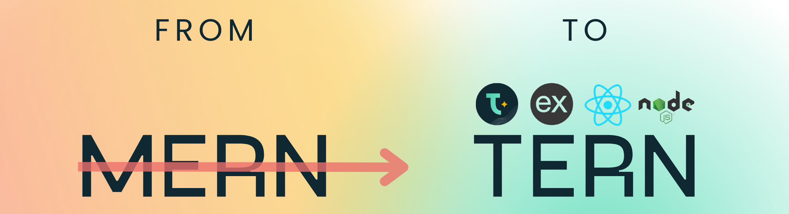
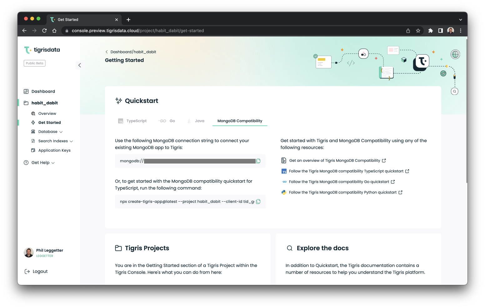

<head>
  <meta name="twitter:creator" content="@leggetter" />
</head>

import tigrisConfig from "@site/tigris.config.js";

export const CloudLink = ({ text = "Tigris Cloud" }) => {
  return <a href={tigrisConfig.signupUrl}>{text}</a>;
};

Welcome to the Tigris April 2023 update!

This month saw a preview of our Vector database search, a new Tigris Astro
integration, the completion of our NoSQL data modeling guides, the invention of
a new technology stack called TERN, and more.

This update covers:

- [🤖 Vector search preview](/blog/april-2023-update#vector-search)
- [👾 Tigris Astro integration](/blog/april-2023-update#astro)
- [🧑‍🏫 NoSQL data modeling series complete](/blog/april-2023-update#data-modeling)
- [🧰 From the MERN stack to TERN](/blog/april-2023-update#tern)
- [✨ Tigris TypeScript SDK filter syntax update (Breaking change!)](/blog/april-2023-update#ts-sdk)
- [🚛 Data import with schema inference for both JSON and CSV](/blog/april-2023-update#data-import)
- [🦾 Web console updates](/blog/april-2023-update#console)
- [🤔 MongoDB vs DynamoDB vs Tigris](/blog/april-2023-update#compare)

<!-- truncate -->

## 🤖 Vector search preview {#vector-search}

Earlier this month, we previewed how to use our upcoming Vector Search feature
in a blog post that demonstrates how to use
[Tigris Vector Search with OpenAI embeddings](/blog/vector-search-openai/).

[](/blog/vector-search-openai/)

Stay tuned for much more on our Vector Search feature.

## 👾 Tigris Astro integration {#astro}

[Astro](https://astro.build) is a web framework with an exciting and growing
ecosystem of integrations. But we were particularly pleased to be the first
[Astro database integration](/blog/astro-tigris-integration/).

Here's a taster of what the Tigris Astro integration makes possible:

```ts
---
import { useTigrisCollection } from "@tigrisdata/astro";

class Comment {
  id: string;
  slug: string;
  name: string;
  message: string;
  createdAt: Date;
}

const { slug } = Astro.props;

const commentCollection = await useTigrisCollection<Comment>("comments");
const postCommentsCursor = await commentCollection.findMany({
  filter: { slug },
  sort: [{ field: "createdAt", order: "$desc" }],
});

const comments = await postCommentsCursor.toArray();
---

  {
    comments.map((comment) => {
      return (
        <div class="comment" id={`comment${comment.id}`}>
          <p>{comment.message}</p>
          <h4>{comment.name}</h4>
          <time>{new Date(comment.createdAt).toLocaleString()}</time>
        </div>
      );
    })
  }
```

You can also find the integration over on the
[official Astro integrations page](https://astro.build/integrations?search=tigris).

## 🧑‍🏫 NoSQL data modeling series complete {#data-modeling}

I often find myself heading to Garren's
[NoSQL data modeling series posts](/blog/tags/nosql-data-modeling-series/) to be
reminded how best to model the relationships between data when I'm building
demos. Yes, the examples use Tigris, but the principles for
[one-to-one](/blog/modelling-one-to-one-relations/),
[one-to-many](/blog/modeling-one-to-many-relations/), and
[many-to-many](/blog/nosql-modeling-many-to-many-relations-with-search/) NoSQL
data modeling remains the same no matter what NoSQL database you're using. Make
sure you bookmark these!

## 🧰 From the MERN stack to TERN {#tern}

We introduced the TERN stack: an evolution of the MERN stack.

MERN is a popular technology stack utilizing MongoDB, Express.js, React, and
Node.js. TERN is an evolution of MERN, swapping MongoDB for Tigris, enabling you
to take advantage of a modern cloud-native NoSQL database and search platform.

[](/blog/tern-stack/)

You can read our [introduction to TERN](/blog/tern-stack/) which includes steps
on how to migrate from MERN to TERN.

You can also read our post covering
[getting started with TERN](https://dev.to/tigrisdata/how-to-get-started-with-the-tern-stack-4k1i)
which introduces a new
[TERN GitHub template](https://github.com/tigrisdata-community/tern-stack-template)
to enable you to quickly get up and running with a TERN stack app.

## ✨ Tigris TypeScript SDK filter syntax update (**Breaking change!**) {#ts-sdk}

The Tigris TypeScript SDK filter syntax was simplified in v1.0.0-beta.46 to be
much more intuitive and will save us a few characters too.

Prior to v1.0.0-beta.46 the filter syntax was as follows:

```ts
const productsCursor = catalog.findMany({
  filter: {
    op: LogicalOperator.OR,
    selectorFilters: [
      {
        brand: "adidas",
      },
      {
        op: SelectorFilterOperator.LT,
        fields: {
          price: 50,
        },
      },
    ],
  },
});
```

I'm sure you'll agree that the following is much better:

```ts
const productsCursor = catalog.findMany({
  filter: {
    $or: [{ brand: "adidas" }, { price: { $lt: 50 } }],
  },
});
```

Supported operators:

- `$eq`: equal to is used for exact matching.
- `$lt`: less than is used for matching documents using less than criteria.
- `$lte`: less than or equal to is similar to $lt but also matches for equality.
- `$gt`: greater than is used for matching documents using greater than
  criteria.
- `$gte`: greater than or equal to is similar to $gt but also matches for
  equality.
- `$not`: not is used for matching documents using not equal criteria.
- `$regex`: regex is used for matching documents using a regular expression.
- `$contains`: contains is used for matching documents with fields containing
  the given substring.

For multiple conditions, there are two logical operators supported.

- `$or`: Combines multiple filter operators and returns documents when either
  condition is met.
- `$and`: Combines multiple filter operators and returns documents when all the
  conditions are met.

Read the
[TypeScript query docs](https://www.tigrisdata.com/docs/sdkstools/typescript/database/query/#filter)
for full details.

## 🚛 Data import with schema inference for both JSON and CSV {#data-import}

Changing database providers can be a big challenge, so we want to make it as
simple as possible to bring your data over to us. We recently released new
functionality in the Tigris CLI that enables you to import JSON and CSV data and
the Tigris platform will automatically infer the database schema from the data
you import.

Read the
[data importing docs](https://www.tigrisdata.com/docs/sdkstools/cli/importing/)
for more information.

## 🦾 Web console updates {#console}

The Tigris web console allows you to manage your account and projects in Tigris
Cloud. It comes with a suite of tools to improve your developer workflow and
investigate the data you have stored in Tigris.

### Create and edit database branches

You can now create
[database branches](https://www.tigrisdata.com/docs/concepts/database/branching/),
and define schema, browse data, and edit data within those branches within the
Tigris web console.

import newBranchVideo from "./console-create-branch.mp4";

<video controls style={{ width: "100%" }}>
  <source src={newBranchVideo} />
</video>

### MongoDB compatibility connection string

You can now quickly access the MongoDB compatibility connection string to be
used within your MongoDB applications.

Just head to **Your project** -> **Get Started** -> **MongoDB Compatibility**.



## 🤔 MongoDB vs DynamoDB vs Tigris {#compare}

Find out
[how Tigris compares as an alternative to MongoDB and DynamoDB](/blog/mongodb-vs-dynamodb-vs-tigris-nosql-comparison/).
This article covers types of NoSQL databases, data models, scaling, data
consistency, ACID transactions, secondary indexes, database branching,
integrated search, automatic database sharding, and more.

---

## 📰 Subscribe to the Tigris Newsletter

And that's a wrap!

import NewsletterSubscribe from "../../src/components/NewsletterSubscribe";

<NewsletterSubscribe
  headerText=""
  ctaMessage="Don't miss the next Tigris monthly update! Subscribe to the Tigris Newsletter."
/>
