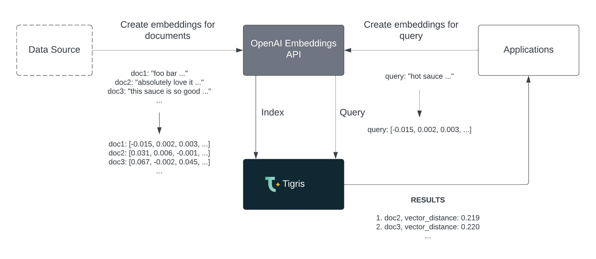

<head>
  <meta name="twitter:creator" content="@leggetter" />
</head>

import tigrisConfig from "@site/tigris.config.js";

export const CloudLink = ({ text = "Tigris Cloud" }) => {
  return <a href={tigrisConfig.signupUrl}>{text}</a>;
};

Welcome to the Tigris April 2023 update!

This month saw a preview of our Vector database search, a new Tigris Astro
integration, the completion of our NoSQL data modeling guides, and the invention
of a new technology stack called TERN, and more.

April was packed. No joke!

<!-- truncate -->

## Vector search preview

Earlier this month we previewed how to use our upcoming Vector Search feature in
a blog post which demonstrated how to use
[Tigris Vector Search with OpenAI embeddings](/blog/vector-search-openai/).

[](/blog/vector-search-openai/)

Stay tuned for much more on our Vector Search feature.

## Tigris Astro integration

[Astro](https://astro.build) is a web framework with an exciting and growing
ecosystem of integrations. But, we were particularly pleased to be the first
[Astro database integration](/blog/astro-tigris-integration/).

Here's a taster of what the Tigris Astro integration makes possible:

```ts
---
import { useTigrisCollection } from "@tigrisdata/astro";

class Comment {
  id: string;
  slug: string;
  name: string;
  message: string;
  createdAt: Date;
}

const { slug } = Astro.props;

const commentCollection = await useTigrisCollection<Comment>("comments");
const postCommentsCursor = await commentCollection.findMany({
  filter: { slug },
  sort: [{ field: "createdAt", order: "$desc" }],
});

const comments = await postCommentsCursor.toArray();
---

  {
    comments.map((comment) => {
      return (
        <div class="comment" id={`comment${comment.id}`}>
          <p>{comment.message}</p>
          <h4>{comment.name}</h4>
          <time>{new Date(comment.createdAt).toLocaleString()}</time>
        </div>
      );
    })
  }
```

You can also find the integration over on the
[official Astro integrations page](https://astro.build/integrations?search=tigris).

## NoSQL data modeling series complete

I often find myself heading to Garren's
[NoSQL data modeling series posts](/blog/tags/nosql-data-modeling-series/) to be
reminded how best to model the relationships between data when I'm building
demos. Yes, the examples use Tigris, but the principles for
[one-to-one](/blog/modelling-one-to-one-relations/),
[one-to-many](/blog/modeling-one-to-many-relations/), and
[many-to-many](/blog/nosql-modeling-many-to-many-relations-with-search/) NoSQL
data modeling remain the same no matter what NoSQL database you're using. Make
sure you bookmark these!

## From the MERN stack to TERN

We introduced the TERN stack: an evolution of the MERN stack.

## MongoDB vs DynamoDB vs Tigris

## Tigris TypeScript SDK filter syntax update (Breaking change!)

The Tigris TypeScript SDK filter syntax was simplified in v1.0.0-beta.46 to be
much more intuitive and will save us a few characters too.

Prior to v1.0.0-beta.46 the filter syntax was as follows:

```ts
const productsCursor = catalog.findMany({
  filter: {
    op: LogicalOperator.OR,
    selectorFilters: [
      {
        brand: "adidas",
      },
      {
        op: SelectorFilterOperator.LT,
        fields: {
          price: 50,
        },
      },
    ],
  },
});
```

I'm sure you'll agree that the following is much better:

```ts
const productsCursor = catalog.findMany({
  filter: {
    $or: [{ brand: "adidas" }, { price: { $lt: 50 } }],
  },
});
```

The other operators include:

Consider ending on a CTA... A few examples below:

<p>
  <CloudLink text="Sign up for a free Tigris Cloud account" /> to see the
  benefits of our serverlesss NoSQL Database and Search platform.
</p>

Have questions? <a href="https://www.tigrisdata.com/contact/">Get in touch</a>.

---

import NewsletterSubscribe from "../../src/components/NewsletterSubscribe";

<NewsletterSubscribe />
