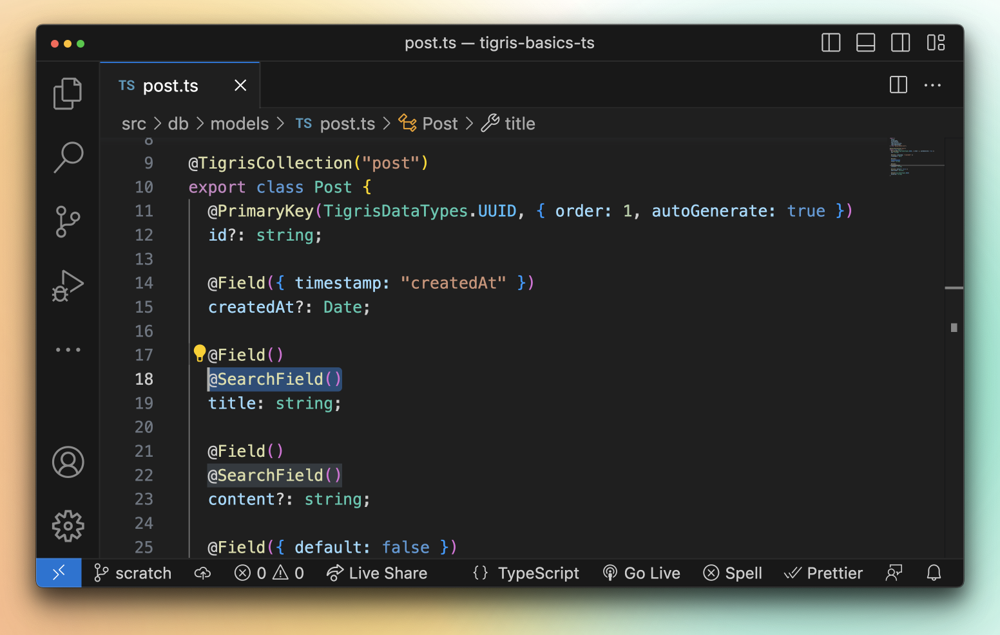

<!-- update "image" above to a custom image as a preference. The Vercel OG hosted version is a fallback -->

<head>
  <meta name="twitter:creator" content="@leggetter" />
</head>

import tigrisConfig from "@site/tigris.config.js";

export const CloudLink = ({ text = "Tigris Cloud" }) => {
  return <a href={tigrisConfig.signupUrl}>{text}</a>;
};

export const DiscordLink = ({ text = "Tigris Discord" }) => {
  return <a href={tigrisConfig.discordUrl}>{text}</a>;
};

Today, we're excited to share that **Tigris Search has moved into beta**.

Over the coming days, we'll share more about the features available in Tigris
Search. But in this post, we'd like to focus on a feature that feels magical and
we believe differentiates Tigris from the competition: **Tigris Database to
Search automatic synchronization**.

Tigris Database to Search automatic synchronization allows you to automatically
create search indexes and synchronize your data from Tigris Database to Tigris
Search. You don't need to spin up any new and costly infrastructure or add any
complex configuration to take advantage of this. All you need to do is update
your Tigris data model definitions!

[](/blog/tigris-database-search-sync-beta)

<!-- truncate -->

## How to use Tigris Automatic NoSQL Database to Search Sync

Tigris takes a code-first approach to data modeling. This means you define your
data models using your preferred programming language.

For example, with TypeScript, adding automatic search sync to a data model is as
simple as adding the `@SearchField` decorator:

```diff
import {
  Field,
  PrimaryKey,
+ SearchField,
  TigrisCollection,
  TigrisDataTypes,
} from "@tigrisdata/core";

@TigrisCollection("post")
export class Post {
  @PrimaryKey(TigrisDataTypes.UUID, { order: 1, autoGenerate: true })
  id?: string;

  @Field({ timestamp: "createdAt" })
  createdAt?: Date;

  @Field()
+ @SearchField()
  title: string;

  @Field()
+ @SearchField()
  content?: string;

  @Field({ default: false })
  published?: boolean;

  @Field(TigrisDataTypes.UUID)
  authorId: string;
}
```

The example above shows how to define a data model in TypeScript, with
`SearchField` decorators added to instruct Tigris that `title` and `content` are
to be indexed and used for full-text search.

Simple and powerful!

## Get started Tigris Automatic NoSQL Database to Search Sync

We're excited to have worked with
[Jason Lengstorf](https://twitter.com/jlengstorf/status/1658168719225540608) to
put together a **Learn With Jason** tutorial to help you get started with Tigris
Automatic NoSQL Database to Search Sync.

<center>
  <iframe
    width="560"
    height="315"
    src="https://www.youtube.com/embed/PlCQmGUBKg0"
    title="YouTube video player"
    frameborder="0"
    allow="accelerometer; autoplay; clipboard-write; encrypted-media; gyroscope; picture-in-picture; web-share"
    allowfullscreen
    style={{ marginBottom: "20px" }}
  ></iframe>
</center>

You can read the full
[Tigris Database + Search and Remix tutorial](https://www.learnwithjason.dev/blog/tigris-data-remix-custom-search)
over on the Learn With Jason blog.

You can find additional information over in the
[Tigris Search docs](https://www.tigrisdata.com/docs/concepts/searching/).

## Join the Tigris Community

The growing <DiscordLink /> community is here to help you with any questions
that you may have. Whether it's getting up and running with the Tigris Database,
Tigris Automatic NoSQL Database to Search Sync, and anything else Tigris.
