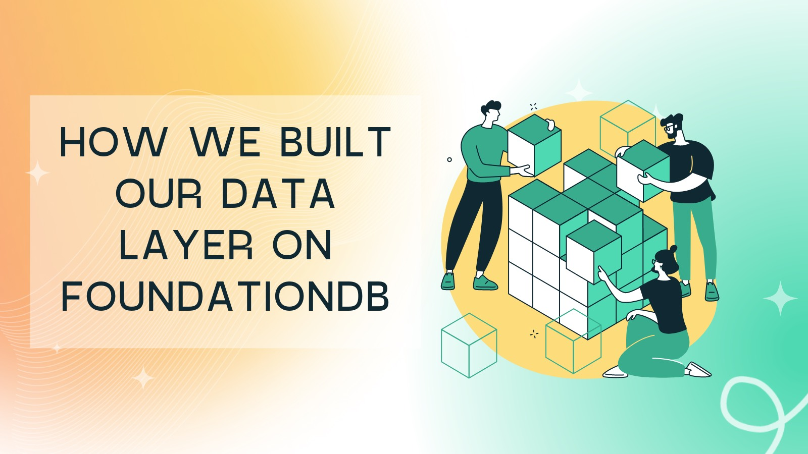
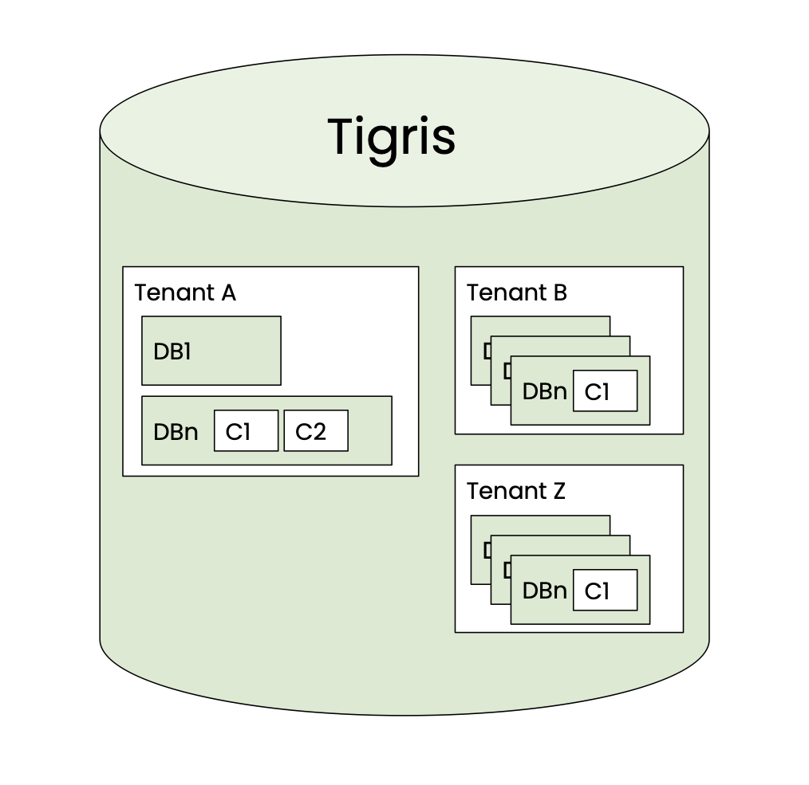

Tigris is a globally available, S3 compatible object storage service.

Tigris uses FoundationDB's transactional key-value interface as its underlying
storage engine. In our blog post
[Skipping the boring parts of building a database using FoundationDB](/building-a-database-using-foundationdb)
we went into the details of why we chose to build on FoundationDB. To recap,
FoundationDB is an ordered, transactional, key-value store with native support
for multi-key strictly serializable transactions across its entire keyspace. We
leverage FoundationDB to handle the hard problems of durability, replication,
sharding, transaction isolation, and load balancing so we can focus on
higher-level concerns.

We are starting a series of blog posts that go into the details of how Tigris
has been implemented. In the first post of the series, we will share the details
of how we have built the metadata storage layer on top of FoundationDB. We will
cover the topics of data layout, and schema management.



<!-- truncate-->

## Data layout

As Tigris is a multi-tenant system, when a user is created they are assigned to
a tenant. All of their data is then stored under this tenant. Thus, the
hierarchy of data storage looks something like this



### Data layout

As Tigris leverages FoundationDB as the storage engine, which exposes a
key-value interface, the data has to be stored as key-value pairs. This means
there needs to be some translation from a logical layout of storing tenants,
buckets, objects, and schemas to a physical layout.

Tigris maintains different key layouts depending on the information it stores.
Each key layout has a custom encoder-decoder and has a prefix at the start of
the key. The encoder adds this prefix; then, the decoder uses it to decode it
according to the appropriate structure. The high-level concept of key encoding
remains the same for all types of data (users or system data).

### Key encoding

Within Tigris, metadata is stored in collections. A collection is identified by
a tenant, database, and collection name. This is the minimum information we need
in the key to identify a record. However, a collection may have secondary
indexes as well. Therefore, an index identifier must also be part of the key.

This key structure is made extensible by having a **version** component allowing
us to add or remove attributes in the future.

To summarize, we need to pack the following information in the key:

```
tenant | database | collection | index name | index value
```

Taking a more realistic example, let's say we have a tenant _foobar_ with a
database _userdb_, a collection _users_, and an _id_ field defined as the
primary key of the records. This translates to the following key structure

```json
["fooApp", "userdb", "users", "pkey", [1]] =>
  {"id": 1, "email": "alex@example.com", "phone_number": 12345}
```

The index values are seen as an array here because Tigris supports composite
indexes as well, meaning a collection can have one or more than one field
defined as index fields. These index values are packed in a single binary
structure.

However, storing this information in every key as-is means unnecessary costs
attached to each record. Therefore we implemented key compression.

### Key compression

The key compression algorithm that we have implemented replaces these long
strings with integers and ensures that the integer assignments are unique. This
is accomplished by persisting these mapping in an internal metadata collection
and assigning to these strings during creation time.

In order to compress a key, the first step is to assign a unique integer to the
container (tenant, database, collection) names. This is done during a Data
Definition Language (DDL) operation. Whenever Tigris receives a tenant creation,
or bucket creation request, it starts a transaction. In this transaction, a
unique integer value is reserved for this container name and then assigned to
this container. This mapping is stored in an internal collection called
encoding. The value assigned is incremented in a fashion that each mapping is
unique. This mapping is immutable so that it can be freely cached on Tigris
servers. In other words, all the user metadata like a tenant, database,
collection, and index names are uniquely identifiable by their corresponding
integer representation. As this is done in a transaction, completing the request
means a unique assignment of the integer to the string.

Using integers has the following benefits:

- Machine-level instruction can be used to perform integer comparison in one
  cycle
- Packed as 4bytes; on the other hand, if the string size grows, it will take up
  a lot of memory. This results in compact keys, therefore, optimizing CPU,
  memory, and storage usage
- Even nominally saving a few bytes per string representation does add up when
  there are billions of records

The encoding collection that has this information and has the following layout:

```shell
encoding | version | tenant-name => integer identifier
encoding | version | tenant-id | database-name => integer identifier
encoding | version | tenant-id | database-id | collection-name => integer identifier
```

Where

- encoding → identifier of this metadata collection (key layout)
- version → version of this key structure so that we can evolve this layout
- tenant-name, database-name, collection-name → The user-facing names

These integer values are then used to form the key. Now with this information,
here is how the key structure looks like:

```json
["usr",0x01,0x01,0x02,0x03,0x04,[1]] =>
  {"id": 1, "email": "alex@example.com", "phone_number": 12345}
```

Where

- usr → the identifier for this key layout
- 0x01 → version of this key layout
- 0x01 → tenant-id
- 0x02 → database-id
- 0x03 → collection-id

### Value encoding

Internally all user values are stored inside a
[protobuf](https://developers.google.com/protocol-buffers/docs/overview)
message. We don't mutate user payload. Introducing this top-level structure
allows us to have metadata of the record attached to it along with raw user
content. As an example, this protobuf message, apart from user data, has
information such as compression, created time, updated time, the schema version,
and other housekeeping fields. Some of this information is then indexed so that
we can support time series queries like returning records that are created after
_Jan 1, 2022_.

```protobuf
message ValueWrapper {
  int32 ver = 1; // schema version
  int32 enc = 2; // encoding of the raw data
  int32 comp = 3; // compression of the raw data
  Timestamp created_at = 4; // created timestamp of the record
  Timestamp updated_at = 5; // updated timestamp of the record
  bytes raw = 6; // raw user payload
}
```

Our wrapper adds a slight overhead to every value, but provides us with much
flexibility. For example, we can switch between different compression algorithms
and value encodings on the fly with no downtime or backfills required. In
addition, unused fields don't have to be encoded at all.

This is the first blog post in a multi-part series where we will be sharing the
details of how we have implemented some of the core features in Tigris. Be on
the lookout for the next part!
