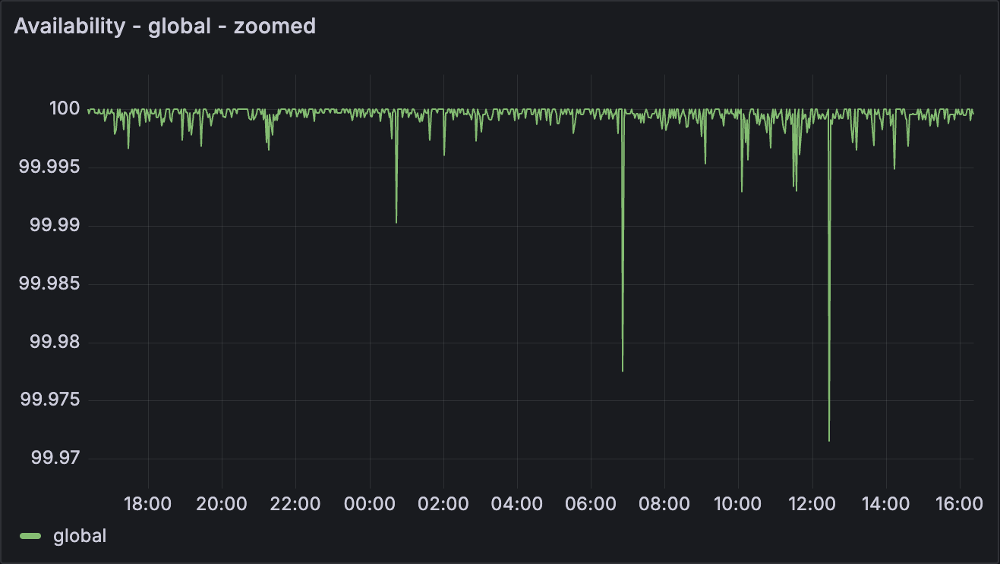

# We're making our reliability metrics public

_We're Tigris, a globally distributed object storage platform built for
high-performance workloads. It's designed to work seamlessly across clouds,
countries, and continents, making it simple and efficient for developers.
[Try it out, you'll be up and running in a minute.](https://storage.new/)_

We're trying something a little different— we're making our reliability and
performance metrics public!

We are _serious_ about providing 99.99% global availability. Check out our
[live dashboard](https://public-metrics.storage.tigris.dev/pgrafana/d/bdy2ujij13fuod/availability?orgId=1)
(embedded below). We're pretty sure we're the first to share this type of live
production data publicly.

<!-- truncate -->

A cool thing happened when we looked at this data. We observed that a temporary
failure in our metadata service within a region was affecting write availability
for users in that region, which wasn't acceptable for a service built on global
high availability. To address this, we utilized our multi-region architecture.
In the event of a metadata service failure in one region, requests are now
seamlessly rerouted to the nearest available region's metadata service, ensuring
uninterrupted processing for all user requests.

Another unique part of this data is that we aren't playing around with our
definition of _"available"_ by pulling tricks like _"if 50% of the requests
succeed then the service is available”_ nor basing the metric on a simple binary
up/down. Instead, our availability metric is based on real requests to our
production system: it's calculated as the number of successful requests
(anything that's not a 5xx) divided by the total number of requests.

## Why these metrics matter

It's easy to be reliable when no one uses your service. There's a
chicken-and-egg problem with startups offering highly performant services. High
scale use cases demand performance, and demonstrating performance requires high
scale usage. Making our live production data public is us going all-in to prove
our reliability at scale.
