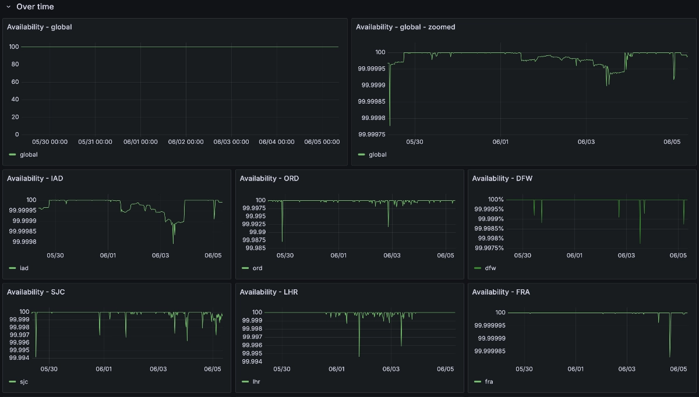

import InlineCta from "@site/src/components/InlineCta";
import PullQuote from "@site/src/components/PullQuote";
import styles from "!!raw-loader!./styles.css";

<style>{styles}</style>

At Tigris Data, we provide object storage to our users. People put bytes into
our servers with a name, and expect that come hell and high water, when they put
in the name, they get _the exact same bytes back_. This is a very high trust
position to be in because when people ask themselves things like “Oh, what would
happen if my object storage provider is unreliable”, that conversation usually
involves phrases like “Maybe we should have gone with The Big Cloud afterall”.

Such conversations are rarely good for the business.



<center>
  <small>
    <em>A screenshot of Tigris' live Availability Dashboard</em>
  </small>
</center>
<br />

{/* truncate */}

If you store your data in Tigris, you shouldn’t need to worry about a status
page full of green checkmarks or anything else that needs to be updated
manually. As a result, we’re trying something different. We’re making our
internal reliability and performance metrics public. We are _serious_ about
making sure that Tigris is globally available 99.99% of the time (that is a
total downtime budget of 8 seconds per day or less than an hour per year).

Don’t believe us? You don’t need to. Check out our live dashboard embedded right
here:

<iframe
  src="https://public-metrics.storage.tigris.dev/pgrafana/d/bdy2ujij13fuod/availability?orgId=1"
  width="100%"
  height={500}
/>

<a
  href="https://public-metrics.storage.tigris.dev/pgrafana/d/bdy2ujij13fuod/availability?orgId=1"
  target="_blank"
>
  View the dashboard full screen
</a>

As far as we can tell, we’re the first of our kind to share this raw, unfiltered
reliability metrics dashboard publicly. These are the same numbers that we use
to calculate our reliability.

Go ahead. Make a storm of requests against the API and refresh. We’re serious.

When we first took a look at this data while writing this post, we noticed that
a temporary failure in our metadata service was making some users unable to
write files in a region. This is unacceptable for us.

<PullQuote>We’d rather you have more latency than less availability.</PullQuote>

In order to work around this, we took advantage of the fact that Tigris is
global and the data largely does not care where it is stored. Whenever the
metadata service is flaky or failing in one region, requests are seamlessly
re-routed to the nearest available region’s metadata service. Automatically.
Without any human intervention. This ensures that all user requests will be
processed, even if it’s a bit slower it’s better than the requests not being
processed at all.

In our ideal world, we should be able to lose entire regions without users
noticing or caring (save some extra latency).

Site reliability people are well known for cooking metrics and/or mincing the
definition of words such that “available” means “50% or more requests are
processed” or making it a simple binary of “does any request at all work”. We’re
choosing a different path. Our availability metric is based on real requests to
our production system. When we calculate availability, we do something like
this:

```tsx
function availability(
  successfulRequests: number,
  totalRequests: number
): number {
  return successfulRequests / totalRequests;
}
```

We define “successful” requests as any request that triggers a non-5xx response.
Under our definition, an authentication failure (401) or a file not found (404)
is still a successful request (as the system is correctly denying access or not
finding a file that may not exist), but an internal server error (500) would be
a failed request and thus count against us.

<InlineCta
  title={"Want to try it out?"}
  subtitle={"Make a global bucket with no egress fees"}
  button={"Get Started"}
/>

## Why these metrics matter

It’s easy to be reliable when nobody uses your service. There’s also annoying
chicken-and-egg problems with startups offering highly performant services. As
you scale up, you need more reliability (every millisecond wasted retrying
requests is another millisecond that could have gone to the money generator),
but demonstrating reliability requires high scale usage due to the observation
paradox.

So we’re proving it to you by showing you our live production data for latency
and availability. The truth requires no belief. There is no need to trust us on
our latency and availability metrics when you can just look at them for
yourself.

Convinced? Make [a new bucket](https://storage.new) today and give Tigris a try.
