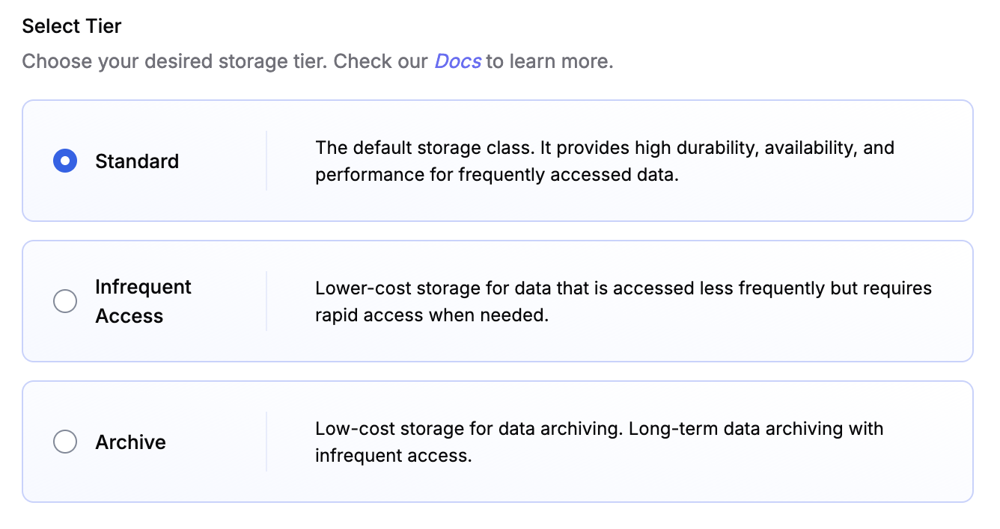

import InlineCta from "@site/src/components/InlineCta";
import Tabs from "@theme/Tabs";
import TabItem from "@theme/TabItem";
import heroImage from "./archive-tigers.png";


<center>
  <small>
    <em>
      A library with a fractal of bookshelves in all directions, wooden ladders
      connecting the floor to the shelves. Many blue tigers tend to the books. —
      Image generated with Flux [pro] 1.1 from Black Forest Labs on fal.ai
    </em>
  </small>
</center>

When you have _a lot_ of data, maybe even Big Data :tm:, you might start to
wonder why you're paying so much to keep it all hot and ready. Do you really
need that prior version of your model weights from last year to be available
_instantly_? Let's be clear though: we're happy to serve you petabytes of old
model weights and datasets… but we'd rather help you save some money on your
infrastructure budget.

{/* truncate */}

When you create new objects or buckets, you can select the storage tier to put
it in: Standard, Infrequent Access, or Archive. Everything you currently have in
Tigris is likely in the Standard storage tier, and when you create new objects
with the S3 API and don't specify a storage tier, it'll end up in Standard too.

We've updated our pricing with specifics, but you can expect to save $0.016 per
GB per month by moving your backups and other old data from the Standard storage
tier to the Archive storage tier. If you want to store one terabyte of data in
the Archive tier, it will cost you $4 (at time of writing). At Infrequent Access
rates, that will cost you $10, and at Standard, it'll cost you $20 per month.
This is a 5x cost reduction for data that you don't need often and can tolerate
waiting an hour or so for it to be pulled out of Archive.

And, of course, none of our Storage Tiers include egress fees.

<InlineCta
  title={"Want to try it out?"}
  subtitle={"Make a global bucket with no egress fees"}
  button={"Get Started"}
/>

### Deciding what tier to use

I'm sure you've heard of folks regretting their decision to archive data that
they end up needing in a hurry. Here's a good rule of thumb to decide where
objects should go: how much downtime can you tolerate when everything's on fire
and you need that data **NOW**?

If you can tolerate an hour of downtime for that data to get restored from
Archive, Archive is fine. If you can't, Infrequent Access is probably the best
bet: Tigris returns Infrequent Access objects as rapidly as Standard tier
objects.

Your database backups from 3 years ago or the shared drive from a long-completed
project are probably not going to be accessed very often (maybe even never), so
it makes sense to Archive them just in case. Your database backups from about 10
minutes ago are much more likely to be accessed, so it makes sense to put them
into Infrequent Access. That way you can respond instantly to the wrong database
being deleted instead of having to wait for an hour for the backups to load from
Archive.

### Here's how to use object tiers

When you create a new bucket in the Tigris Dashboard, you can select which
storage tier you want objects to use by default:



<center>
  <small>
    <em>
      A screenshot of the Tigris Dashboard showing the default storage tier
      selector for a newly created bucket. The options are: Standard, Infrequent
      Access, and Archive.
    </em>
  </small>
</center>

Choose between:

- Standard: the default storage class, it provides high durability,
  availability, and performance for frequently accessed data.
- Infrequent access: Lower-cost storage for data that isn't accessed frequently,
  but requires rapid access when needed.
- Archive: Low-cost storage for data archiving. Long-term data archiving with
  infrequent access.

Otherwise, you can set it when you upload a file:

<Tabs groupId="languages">
  <TabItem value="CLI" label="CLI">

```shell
# Standard
aws s3 cp --storage-class STANDARD hello.txt s3://your-bucket-name/your-object-name

# Infrequent Access

aws s3 cp --storage-class STANDARD_IA hello.txt s3://your-bucket-name/your-object-name

# Archive
aws s3 cp --storage-class GLACIER hello.txt s3://your-bucket-name/your-object-name
```

  </TabItem>

  <TabItem value="python" label="Python">

```python
import boto3

s3 = boto3.client('s3', endpoint_url='https://fly.storage.tigris.dev')

# Define the bucket name, file to upload, and the key (name) for the file in S3
bucket_name = 'your-bucket-name'
file_name = 'path/to/your/file'
object_name = 'your-object-name'

# Upload the file with the specified storage class
s3.upload_file(
    Filename=file_name,
    Bucket=bucket_name,
    Key=object_name,
    ExtraArgs={
        'StorageClass': 'STANDARD_IA', # Infrequent Access
        #'StorageClass': 'ARCHIVE', # Archive
    }
)

print(f"File {file_name} uploaded to tigris://{bucket_name}/{object_name} with storage class STANDARD_IA")
```

  </TabItem>
  
  <TabItem value="golang" label="Go">

```go
// assumes that ctx is of type context.Context and in scope

const (
  bucketName = "your-bucket-name"
  objectName = "your-object-name"
)

sdkConfig, err := config.LoadDefaultConfig(ctx)
if err != nil {
	panic(err)
}

cli := s3.NewFromConfig(sdkConfig, func(o *s3.Options) {
	o.BaseEndpoint = aws.String("https://fly.storage.tigris.dev")
	o.Region = "auto"
})

fin, err := os.Open("path/to/your/file")
if err != nil {
	return fmt.Errorf("can't open file: %w", err)
}
defer fin.Close()

st, err := fin.Stat()
if err != nil {
	return fmt.Errorf("can't stat %s: %w", fin.Name(), err)
}

contentType := mime.TypeByExtension(filepath.Ext(fin.Name()))

if _, err := cli.PutObject(ctx, &s3.PutObjectInput{
	Bucket:        aws.String(bucketName),
	Key:           aws.String(objectName),
	Body:          fin,
	ContentType:   aws.String(mime.TypeByExtension(filepath.Ext(fin.Name()))),
	ContentLength: aws.Int64(st.Size()),
	// use infrequent access tier
	StorageClass: types.StorageClassStandardIa,
	// use archive tier
	//StorageClass: types.StorageGlacier,
}); err != nil {
	return fmt.Errorf("can't upload %s to tigris://%s/%s: %w", fin.Name(), bucketName, objectName, err)
}
```

  </TabItem>
</Tabs>

### What's up next

I bet you're thinking, _Wow this would be really cool to use with a Lifecycle
Rule feature so I can better manage my backups and older objects._ Us, too!
Lifecycle Rules are coming soon.

Convinced? Make [a new bucket](https://storage.new) today and give Tigris a try.
