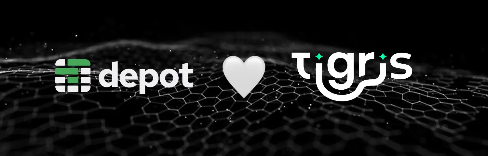

As the saying goes, the only constants in life are death and taxes. When you
work with the Internet, you get to add another fun thing to that list: service
deprecations. This is a frustrating thing that we all have to just live with as
a compromise for not owning every single piece of software and service that we
use. In their effort to keep life entertaining, Google has announced that
they’re deprecating
[Google Container Registry](https://cloud.google.com/artifact-registry/docs/transition/transition-from-gcr).
This is one of the bigger container registry services outside of the Docker Hub
and it’s suddenly everyone’s emergency.

Google Container Registry will be deprecated on March 18, 2025\. This date is
coming up fast. Are you ready for the change?

{/* truncate */}

Google has replaced Google Container Registry with
[Artifact Registry](https://cloud.google.com/artifact-registry/docs). It’s a lot
more flexible, but it’s significantly more expensive in ways that just add up
over time. Plus, it’s Google: who knows how long we’ll have Artifact Registry?

Sure, you could host your own Docker registry (and we have
[a how-to guide](https://www.tigrisdata.com/docs/apps/docker-registry/) to help
you make your own on top of Tigris), but you know what’s easier than doing that?
Not doing that, and also getting faster builds in CI. Our friends at Depot have
built their own registry on top of Tigris, and you can use it today
[here](https://depot.dev/docs/registry/overview).

## Why Docker image storage is complicated enough to rely on a third party

To start up your services that use Docker images, the server running them needs
to pull the image from the registry and then `docker run` it. The registry is a
hugely important service, especially with frequently deployments. It’s
understandable to want to outsource that to a specialized service. It’s the same
reason why you’d want to pick Tigris, a company totally dedicated to fast global
object storage, for fast global object storage.

In essence, Docker images are a bunch of fairly large (more than 128Mi) files
that get layered on top of each other to pull in all of your dependencies.
Docker image blobs can be anywhere from kilobytes to gigabytes, so when you’re
storing them in the cloud you need to put them somewhere you can get to them
quickly, without unpredictable delays.

It’s also important to have the image layers download as fast as humanly
possible: slow pull times mean slow cold start times, which can mean a long time
waiting for additional capacity to spin up while your app is going viral.

One of the biggest annoyances you have with many Docker image registries (where
you push images to and pull images from) is
[overly aggressive rate limits](https://docs.docker.com/docker-hub/usage/). You
can work around them with tricks like
[pull-through caches](https://www.tigrisdata.com/blog/pullthru-cache/) (which we
also have
[a guide](https://github.com/tigrisdata-community/pull-thru-docker-hub) for
building), but what if you just didn’t have to worry about that at all?

### The secret feature of Docker that makes everything work

Under the hood, there’s some deep magic going on with Docker images in ways that
you may not expect. Let’s take a look at the output of an example `docker pull`
command:

```text
λ docker pull golang
Using default tag: latest
latest: Pulling from library/golang
52daf8b0f06f: Pull complete
e5701e2b5d2b: Pull complete
31d7468eece7: Pull complete
3d9b8f871d0f: Pull complete
e18364ce0d25: Pull complete
349146bc915a: Pull complete
4f4fb700ef54: Pull complete
Digest: sha256:44b186e06a8596405ab90557930b2024994045cf20939688809b49af0d245692
Status: Downloaded newer image for golang:latest
```

Every one of those lines with “Pull complete” in it has a hexadecimal number in
it, such as `52daf8b0f06f`. This is based on the
[SHA-256](https://en.wikipedia.org/wiki/SHA-2) hash of the contents of the
layer. The reason Docker does this is because Docker clients and registries use
one of the dirtiest tricks in computer science: they’re based on a content-aware
store.

When you upload data to a content-aware store, you only have to upload that
individual bit of data once. If two layers have the same contents, they don’t
need to be stored twice. This also means that the data doesn’t need to be
downloaded twice, meaning that if you download the `golang` image, you don’t
need to re-download the `debian` image it’s based on when you are building a
multi-stage image:

```text
λ docker pull debian
Using default tag: latest
latest: Pulling from library/debian
52daf8b0f06f: Already exists
Digest: sha256:35286826a88dc879b4f438b645ba574a55a14187b483d09213a024dc0c0a64ed
Status: Downloaded newer image for debian:latest
```

The layer already exists! Docker’s content aware store is lazy so that you don’t
need to pull the same image layer twice, saving you time and storage. Under the
hood, Docker image tags are really just pointers to a stack of layers in order!

If you’re clever about how you cache things, you can absolutely take advantage
of this so that when you push an update to your app, the only thing that changes
on the server is your app code, the top layer of your image. That can make your
updates _even faster_.

However, it’s a bit of an art to craft the perfect Dockerfile that isolates
frequently changing components into the top layer. It takes precious developer
hours, and accelerating the distribution of the layers themselves can give
similar results.

A cool side effect of every layer being immutable and named based on its
contents is that some companies have made internal registries that use
well-understood technologies like bittorrent to replicate Docker image layers
between machines. Uber’s [Kraken](https://github.com/uber/kraken) is a great
example of this, it’s how they distribute terabytes of updates in single digit
seconds. It’s a cool approach, and we’re not just saying that because Tigris is
built by the ex-Uber storage team.

However, most of the time your workloads don’t need that kind of turbocharged
distributed power. You just need to have your images download fast so you aren’t
twiddling your thumbs during builds. This is where our friends at Depot can
help.

## Picking a new registry

If you have to switch registries, you have an opportunity to make the best of a
bad situation and cut both your image pull times and build times. Our friends at
[Depot built a registry](https://depot.dev/blog/introducing-depot-registry) on
top of Tigris to store your container images around the globe so you get fast
image pulls, anywhere. Push images in Virginia, and quickly pull them from
Singapore without skipping a beat. And you never have to worry about rate limits
or pull-through caches again.

> “Tigris gives us the global CDN we need for Depot Registry by giving us the
> ability to store customer container images in one region and have it
> automatically replicated across the globe. We get that right out of the box
> with better performance than R2 and similar pricing.”

\- Kyle Galbraith, CEO @ Depot



Oh, and when you sign up for the registry, you get access to Depot’s
[super-fast container builds](https://depot.dev/docs/container-builds/overview)
and
[mind-breakingly speedy CI runners](https://depot.dev/docs/github-actions/overview).
If you’re gonna switch to Depot to store your images, you might as well get
faster builds in CI too.

## Conclusion

We’re so excited to help Depot announce their container registry because this
helps fix a problem that everyone here has had: fast Docker image storage so you
don’t have to worry about your cold start times. This is a problem that is near
and dear to my heart as a recovering former site reliability engineer. The
docker registry going down has woken me up at 4 am. I trust the SRE teams at
both Depot and Tigris to be able to have better uptime than you could if you
hosted it yourself.

Give Depot’s registry a try. You’re gonna love not caring about your Docker
image storage anymore.
