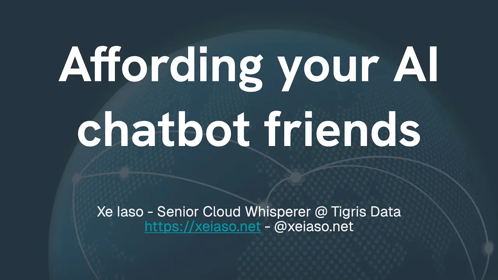

import InlineCta from "@site/src/components/InlineCta";

Hey! Thanks for catching my talk
[Affording your AI chatbot friends](https://www.socallinuxexpo.org/scale/22x/presentations/affording-your-ai-chatbot-friends).
Here's some resources that were mentioned during the talk.

{/* truncate */}

One of the big topics I brought up was
[Nomadic Compute](/blog/nomadic-compute/). If you're interested in learning more
about that, check out the blog post! I also did
[a talk at a local AI meetup about the philosophy](https://xeiaso.net/talks/2025/nomadic-compute/)
behind it in case you learn better through video.

You don't have to pay for workloads that aren't doing anything! Scale down your
AI workloads when they're not in use!

It's okay to use the cloud, just make sure you have an exit strategy.

The only specs that matter for generative AI:

- Model parameter count
- Model parameter size
- Overhead when performing inference
- GPU memory amount
- GPU memory bandwidth
- GPU model year

Models:

- [Facebook's Llama series](https://www.llama.com/) - a series of large language
  models that is usually good enough for most tasks
- Nous Research [Hermes 3](https://nousresearch.com/hermes3/) - the models I use
  for my chatbots, but may not be suitable for all tasks
- [DeepSeek R1 and V3](https://www.deepseek.com/) - very large models that score
  very well for their efficiency per watt

Filter models:

- [Facebook's Llama Guard](https://www.llama.com/docs/model-cards-and-prompt-formats/llama-guard-3/) -
  a filter model that can be used to filter out content that doesn't meet your
  standards
- [Google's ShieldGemma](https://ai.google.dev/gemma/docs/shieldgemma) - like
  Llama Guard but by Google and in more sizes

Inference Engines:

- [Ollama](https://ollama.com/) - like docker for large language models
- [Llama.cpp](https://github.com/ggml-org/llama.cpp) - a lower level library and
  inference runtime for large language models across multiple platforms
- [vllm](https://docs.vllm.ai/en/latest/) - a large language model to OpenAI API
  converter

Nomadic Compute tools:

- [SkyPilot](https://docs.skypilot.co/en/latest/docs/index.html) - describe what
  you want, it picks the cheapest infrastructure for you
- [PostgreSQL](https://www.postgresql.org/) - a database that is so boring that
  it requires no special setup for any stack, use this for structured data
- [Tigris](https://tigrisdata.com/) - multi-cloud native object storage for
  files, datasets, and other unstructured data

Terms:

- **AI Agent**: A model that has access to tools that allow it to interact with
  the outside world.
- **AI Model**: A large bag of floating point numbers that generates new output
  from user input.
- **Inference Engine**: A program that runs AI models. This is called inference
  for historical reasons because the model "infers" what comes next.
- **Nomadic Compute**: Structuring your workloads to not rely on specialized
  features of any platform so that it's easily portable between them.

Other tools and platforms referenced in the talk:

- [Beam](https://beam.cloud) - a platform for deploying and managing serverless
  AI infrastructure
- [fal](https://fal.ai) - easy API access for open-weights models
- [Fluidstack](https://www.fluidstack.io/) - a platform for deploying and
  managing GPU infrastructure with native SSH access
- [pgvector](https://github.com/pgvector/pgvector) - a PostgreSQL extension that
  turns Postgres into a vector database (read: AI model powered search engine)
- [RunPod](https://www.runpod.io/) - a platform that makes it easy to spin up AI
  workloads in the cloud
- [Vast.ai](https://vast.ai) - a bid-acquired GPU marketplace for getting very
  cheap GPUs for your AI workloads

Thanks for watching the talk! I'll have the video up by late next week and it'll
be embedded here. If you have any questions, feel free to reach out to me on
[LinkedIn](https://www.linkedin.com/in/xeiaso/).
