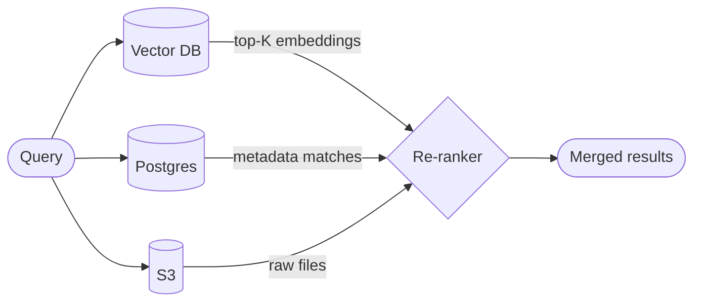
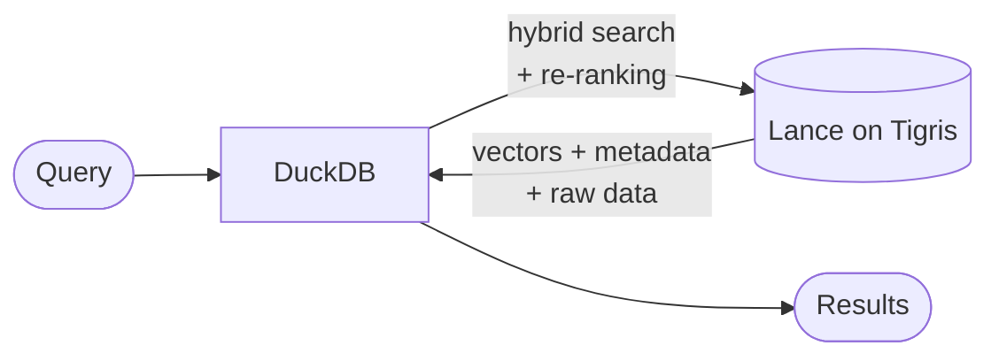

import InlineCta from "@site/src/components/InlineCta";
import heroImage from "./lance-duckdb.webp";


As the sole infra person at my previous company—and self-proclaimed chief incident investigator—I spent countless hours wrangling logs during outages. I came to know firsthand the pain of troubleshooting production issues by pouring over raw log outputs in real time. With the steady rise of AI over the last year, I started feeding logs through various RAG pipelines to see if I could offload root cause analysis to an LLM. When that job ended, the curiosity stuck. Over the last month, I've been hacking at my own RAG workflow for log analysis.

Every tutorial I found told me I needed: a vector database for embeddings, Postgres for metadata, S3 for raw files, and a suite of pipelines to keep it all in sync. For a personal project, that's a lot of operational overhead with real cost implications. There had to be a better way.

I was already using Tigris to store my raw data logs. And I'd recently stumbled on the [Lance format](https://lancedb.com/blog/lance-x-duckdb-sql-retrieval-on-the-multimodal-lakehouse-format/)—a columnar format that stores vectors, metadata, and raw data in a single file that DuckDB can query directly. So I asked myself: what if I built a data lakehouse workflow, something like Databricks but at a fraction of the cost?

{/* truncate */}

## RAG has something to learn from the data world

I'm no stranger to large volumes of data. In a past life, I built OLAP pipelines for billing customers by usage activity and saw firsthand the struggles of orchestrating proprietary ETL tools and data warehouses. As I went deeper into RAG, I kept seeing the same patterns. Data processing, management, retrieval—the AI world was wrestling with problems the data world solved over 10 years ago.

The lakehouse pattern emerged from the cruft of fragmented OLAP workflows. Teams stopped juggling proprietary formats and started storing data in standardized open formats, querying it in place with tools like Databricks or Iceberg. Why then was the AI world reinventing this wheel by pitching specialized vector databases as essential infrastructure?

These tools lock you into proprietary formats while still expecting you to manage the operational complexity of syncing data across multiple stores. The lakehouse pattern already showed us a better way: preprocess your data into an efficient open format like Parquet or Lance, keep it on cheap object storage, and query it in place. Embeddings are just another columnar dataset. They don't need their own database.

## Bringing the data lake to RAG

Before we dive in, let's look at how most RAG architectures work today—especially with multi-modal data. Typically, these workloads separate data by modality across different stores. Images and audio go into S3, structured metadata goes into Postgres, and embeddings go into a vector database like Pinecone.



Compartmentalizing by modality simplifies the modeling, but it pushes complexity downstream. You now need a re-ranker to reconcile results across modalities. Each one returns its own top-K with non-comparable similarity scores that require cross-modal scoring logic to produce coherent results. Despite its complexity, this has become the de facto architecture for RAG. The fact that standalone re-ranking services like Cohere Rerank exist is testament to this.

What if we could store all modalities in a single open format on cheap storage _and_ query them with an engine that handles re-ranking seamlessly? With Lance as the data layer and DuckDB as the query engine, that's exactly what you get. Instead of three data sources, you manage one.



## Hybrid RAG with Tigris

Let's walk through building this out with Tigris as the backing store. I used the [Google Landmarks dataset](https://github.com/cvdfoundation/google-landmark) as my test case—it's text-based, split into two datasets (images and metadata). I joined them, fetched and vectorized a subset of images from the Wikimedia links, and stored everything in Lance format on Tigris.

### Ingesting and storing data

First, download images and generate CLIP embeddings:

```python
def download_image(url: str) -> Image.Image | None:
    headers = {"User-Agent": "RAGBenchmark/1.0"}
    for attempt in range(3):
        try:
            response = requests.get(url, headers=headers, timeout=15)
            return Image.open(BytesIO(response.content)).convert("RGB")
        except Exception:
            continue
    return None

def embed_images_batch(images: list[Image.Image]) -> list[list[float]]:
    if not images:
        return []
    inputs = torch.stack([clip_preprocess(img) for img in images])
    with torch.no_grad():
        embeddings = clip_model.encode_image(inputs)
        embeddings = embeddings / embeddings.norm(dim=-1, keepdim=True)
    return embeddings.tolist()
```

Load the dataset, generate embeddings, and save to a local Lance table:

```python
dataset = load_dataset("visheratin/google_landmarks_photos", split="train")
samples = dataset.select(range(50_000))
images = [download_image(row["url"]) for row in samples]
embeddings = embed_images_batch([img for img in images if img])

records = [{**item, "image_vector": emb} for (item, _), emb in zip(valid, embeddings)]

local_db = lancedb.connect("./landmarks.lance")
table = local_db.create_table("landmarks", data=records, mode="overwrite")
```

Now here's where Tigris comes in. LanceDB supports S3-compatible storage, so pushing data to Tigris is just a connection string change:

```python
tigris_db = lancedb.connect(
    "s3://my-landmarks-bucket/lancedb",
    storage_options={
        "aws_access_key_id": os.environ["AWS_ACCESS_KEY_ID"],
        "aws_secret_access_key": os.environ["AWS_SECRET_ACCESS_KEY"],
        "aws_endpoint": "https://fly.storage.tigris.dev",
        "aws_region": "auto",
    },
)
tigris_db.create_table("landmarks", records, mode="overwrite")
```

That's it. Embeddings, metadata, everything—stored in a single Lance dataset on Tigris. No separate vector database. No Postgres sidecar. No sync pipeline.

The [full code is on GitHub](https://github.com/shortdiv/hybrid-rag).

Here's what a record looks like with both text and image embeddings:

```json
{
  "id": 104169,
  "text": "Stirling Castle. castle. Located in Stirling, Scotland, United Kingdom.",
  "text_vector": [0.023, -0.118, 0.045, "..."],
  "image_vector": [0.156, 0.089, -0.234, "..."],
  "name": "Stirling Castle",
  "category": "castle",
  "city": "Stirling",
  "state": "Scotland",
  "country": "United Kingdom",
  "lat": 56.1238,
  "lon": -3.9468,
  "url": "https://upload.wikimedia.org/wikipedia/commons/...",
  "photo_id": "a1b2c3d4"
}
```

### Hybrid search

In a traditional setup, a query like "Gothic architecture in New York" would have to hit the vector embeddings and text data separately, then explicitly merge the results. With LanceDB's hybrid search, both happen in a single call:

```python
def hybrid_search(query: str, limit: int = 10):
    db = lancedb.connect(
        "s3://my-landmarks-bucket/lancedb",
        storage_options={
            "aws_access_key_id": os.environ["AWS_ACCESS_KEY_ID"],
            "aws_secret_access_key": os.environ["AWS_SECRET_ACCESS_KEY"],
            "aws_endpoint": "https://fly.storage.tigris.dev",
            "aws_region": "auto",
        },
    )
    table = db.open_table("landmarks")
    reranker = RRFReranker()
    results = (
        table.search(
            query,
            query_type="hybrid",
            vector_column_name="vector",
            fts_columns="text",
        )
        .rerank(reranker)
        .limit(limit)
        .to_pandas()
    )
    return results
```

This relies on LanceDB's built-in embedding API. If you're generating embeddings separately, you can pass the vector query explicitly:

```python
vector_query = [0.1, 0.2, 0.3, 0.4, 0.5, ...]
text_query = "gothic architecture in brooklyn"

results = (
    table.search(query_type="hybrid")
    .vector(vector_query)
    .text(text_query)
    .limit(5)
    .to_pandas()
)
```

Running "Gothic architecture in New York" gave me this:

| Location | City, Country | Score |
| :--- | :--- | :--- |
| Saint Patrick's Cathedral | New York, United States | 0.0164 |
| Avasi Református Templom | Miskolc, Hungary | 0.0164 |
| Saint Patrick's Cathedral | New York, United States | 0.0161 |
| Avasi Református Templom | Miskolc, Hungary | 0.0161 |

The duplication is an implementation quirk. I modeled the data as one record per photo, and since several photos exist per landmark, search returned duplicates. "Saint Patrick's Cathedral" matched on full text search (the "New York" part) while "Avasi Református Templom" matched on semantic search (the "Gothic architecture" part). This is textbook [Reciprocal Rank Fusion](https://plg.uwaterloo.ca/~gvcormac/cormacksigir09-rrf.pdf) behavior—rankings from multiple signals interleaved into a combined ordering.

### Sprinkling in some SQL

To fix this, we normalize post-retrieval. The system already did the hard work of ranking. We just need to collapse duplicate matches into one result per landmark.

Lance returns results as Arrow tables, so we can register them directly in DuckDB and use window functions to deduplicate:

```python
import duckdb

con = duckdb.connect()
con.register("search_results", results)

deduped = con.execute(f"""
    WITH ranked AS (
        SELECT *,
               ROW_NUMBER() OVER (
                   PARTITION BY id
                   ORDER BY _relevance_score DESC
               ) as rn
        FROM search_results
    )
    SELECT id, name, category, city, state, country,
           lat, lon, url, photo_id, text, _relevance_score
    FROM ranked
    WHERE rn = 1
    ORDER BY _relevance_score DESC
    LIMIT {limit}
""").fetchdf()
```

Much better:

| Location | City, Country | Score |
| :--- | :--- | :--- |
| Saint Patrick's Cathedral | New York, United States | 0.0164 |
| Avasi Református Templom | Miskolc, Hungary | 0.0164 |
| Brooklyn Bridge | New York, United States | 0.0119 |

You can also query Lance datasets on Tigris directly from DuckDB using the [Lance DuckDB extension](https://lancedb.com/blog/lance-x-duckdb-sql-retrieval-on-the-multimodal-lakehouse-format/). This is where it gets interesting:

```sql
INSTALL lance FROM community;
LOAD lance;

-- Configure Tigris credentials
CREATE SECRET (
    TYPE LANCE,
    PROVIDER credential_chain,
    SCOPE 's3://my-landmarks-bucket/'
);

-- Query Lance data on Tigris directly
SELECT * FROM 's3://my-landmarks-bucket/lancedb/landmarks.lance'
LIMIT 5;
```

With this, you can run hybrid search, join against other datasets, and materialize results—all from SQL:

```sql
-- Materialize top results into a new Lance dataset on Tigris
COPY (
    SELECT r.*
    FROM lance_hybrid_search(
        's3://my-landmarks-bucket/lancedb/landmarks.lance',
        'image_vector', [0.8, 0.7, 0.2]::FLOAT[],
        'text', 'gothic architecture in new york',
        k = 50,
        alpha = 0.5
    ) r
    ORDER BY r._hybrid_score DESC
    LIMIT 50
) TO 's3://my-landmarks-bucket/lancedb/top_gothic_ny.lance'
  (FORMAT lance, mode 'overwrite');
```

### Why one record per photo matters

You might be wondering: why not just store one record per landmark with a nested array of photos? In columnar storage like Lance, updates are expensive. Every new photo would mean reading an existing row, modifying it, and rewriting the data segment. For semantic search, you'd then have to either explode the vector array at query time (slow) or pre-aggregate vectors ahead of time (lossy).

RAG data is fundamentally append-only and immutable. Modeling one record per photo honors that principle and preserves semantic signals at full resolution. Handle deduplication at query time instead. This is the same lakehouse insight applied to RAG: keep storage simple and immutable, push flexibility to the query layer.

## Why Tigris

A fair question: why not just use plain S3?

For one, Tigris is fully S3-compatible. LanceDB, DuckDB, and every tool in the stack works without modification. No proprietary APIs, no format migration. Your data is just Lance files on object storage—you could move it tomorrow if you wanted to.

But the more practical reason is that Tigris automatically distributes data to the regions where it's accessed. If I'm running my RAG pipeline from New York and a colleague runs theirs from London, the data is already close to both of us. No CDN setup, no cross-region replication config, it just works.

Tigris also supports object versioning, which turns out to be useful when you're iterating on embeddings. I can roll back a bad embedding run or compare retrieval quality across dataset versions without building any additional tooling. And of course, object storage is an order of magnitude cheaper than managed vector database infrastructure.

## Getting to production

This pattern works today for batch workloads, experimentation, and moderate-scale retrieval. To take it further, you'd want to think about indexing (Lance supports IVF and HNSW natively), incremental ingestion via Lance's append mode, and caching hot result slices for low-latency serving.

But for most RAG workloads that don't need sub-millisecond retrieval? This is more than enough. And you can always add complexity later. I'd rather start with a simple system I understand than a sprawling architecture I don't.

## Wrapping up

The vector database ecosystem wants you to believe you need specialized infrastructure for embeddings. I'm not convinced. Lance gives you an open columnar format that stores vectors, metadata, and raw data together. DuckDB gives you a SQL engine that handles hybrid search, joins, and aggregations. Tigris gives you globally distributed object storage that's S3-compatible and cheap.

Together, they replace the three-database architecture with a single data store you can query from Python or SQL. That's the lakehouse pattern applied to RAG. It's simpler, it's cheaper, and—at least for my log analysis project—it works.

<InlineCta />
