import InlineCta from "@site/src/components/InlineCta";

At Tigris, globally replicated object storage is our _thing_. But why should you
want your objects “globally replicated”? Today I’m gonna peel back the curtain
and show you how Tigris keeps your objects exactly where you need them, when you
need them, by default.

Global replication matters because computers are ephemeral and there’s a
tradeoff between performance and reliability. But does there have to be?

  <small>
    <em>
      A cartoon tiger running from datacentre to datacentre, buckets full of
      objects in tow. Image generated using Flux [ultra] 1.1 on fal.ai.
    </em>
  </small>

{/* truncate */}

Storage devices can and will degrade over time. Your CPUs aren’t immune from it
either, recent
[Intel desktop CPUs](https://community.intel.com/t5/Blogs/Tech-Innovation/Client/Intel-Core-13th-and-14th-Gen-Desktop-Instability-Root-Cause/post/1633239)
have been known to start degrading and returning spontaneous errors in code that
should work. Your datacenters could be hit by a meteor or a pipe could burst:
being in the cloud doesn’t mean perfect reliability. But failovers and multiple
writes take precious time. We write your data to 11 regions based on access
patterns, so you get low latency (and therefore higher user retention), without
sacrificing reliability.

Here’s how Tigris globally replicates your data; but first, let’s cover the easy
and hard problems of object storage.

## Object storage: an illustrated primer

At its core, object storage is an unopinionated database. You give it data,
metadata, and a key name, then it stores it. When you want the data or metadata
back, you give the key and it gives you what you want. This is really the gist
of it, and you can summarize most of the uses of object storage in these calls:

- PutObject - add a new object to a bucket
- GetObject - get the data and metadata for an object in a bucket
- HeadObject - get the metadata for an object in that bucket
- DeleteObject - banish an object to the shadow realm, removing it from the
  bucket
- ListObjectsV2 - list the metadata of a bunch of objects in a bucket based on
  the key

This is the core of how object storage is used. The real fun comes in when you
create a bucket. A bucket is the place where all your objects are stored. It’s
kind of like putting a bunch of shells in a bucket when you’re at the beach.

Most object storage systems make you choose up front where in the world you want
to store your objects. They have regions all over the world, but if you create a
bucket in us-east-1, the data lives and dies in us-east-1. Sure, there’s ways to
work around this like bucket replication, but then you have to pay for storing
multiple copies, and wait for cross region replication to get around to copying
your object over. Tigris takes a different approach: your objects are
dynamically placed by default.

Tigris has
[servers all over the world](https://www.tigrisdata.com/docs/concepts/regions/).
Each of those regions might have any given object, and they might not (unless
you restrict the regions to comply with laws like GDPR). What happens when you
request an object that doesn’t exist locally?

## Caches all the way down

:::note

Before I tell you the dark truths about how Tigris stores data, let’s clarify a
little bit of terminology that I feel will get everyone on the same page. Any
given file has two parts to it: the data and the metadata. For example, consider
this picture:

When you put it in an object storage bucket, you also attach metadata to the
file:

Whenever you see a square with an image in it, think about the data. Whenever
you see a rounded squircle with a table in it, think about the metadata.

:::

At a high level, think about Tigris as a series of tiered caches. All the
objects live in block storage. This is the primary storage location and is
(relatively) the slowest place.

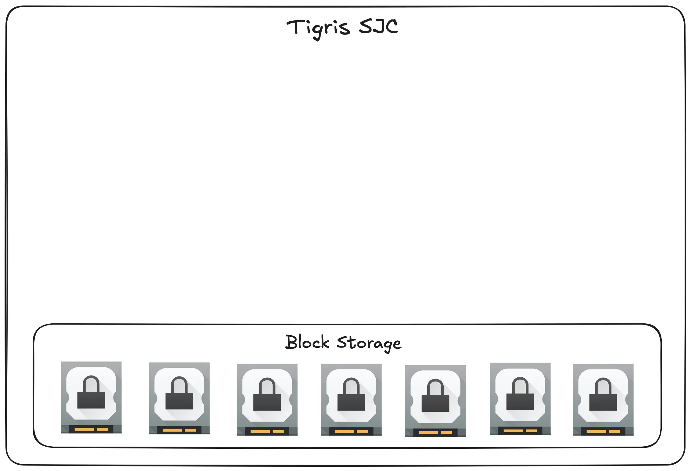

Every region also has a [FoundationDB](https://www.foundationdb.org/) cluster
that stores all the metadata for the objects. Usually this points to block
storage references.

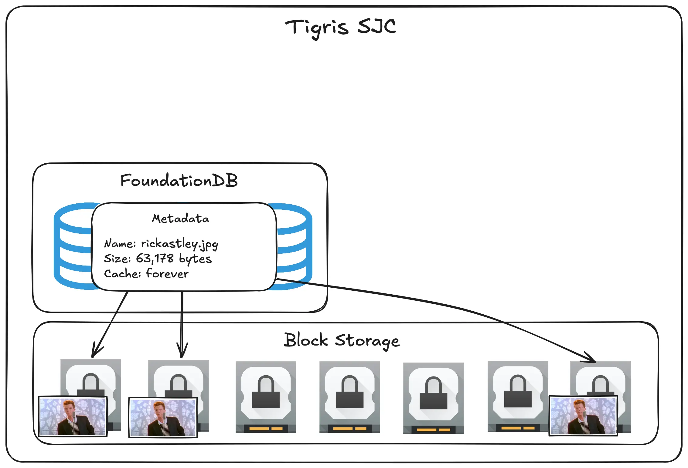

Now, Tigris could work fine like this. It’d be (relatively) slow, but it’d work
better than you think. However, we can do better. For objects that are small
enough, you can store them in a faster cache layer. We call this the SSD cache.

Diagram: add SSD cache, example record points to SSD cache that weakly points to
block storage labeled data source of truth

FoundationDB is plenty fast, but if we have the data cached in the SSD cache,
why can’t we put the metadata in the cache too? If you think about it, when you
upload an object to object storage, the primary key really is just the bucket
name plus the object name. You could just store all of the metadata along with
the data in the cache so it’s faster\!

Diagram: add metadata in ssd cache record weakly pointed to Foundationdb labeled
metadata source of truth

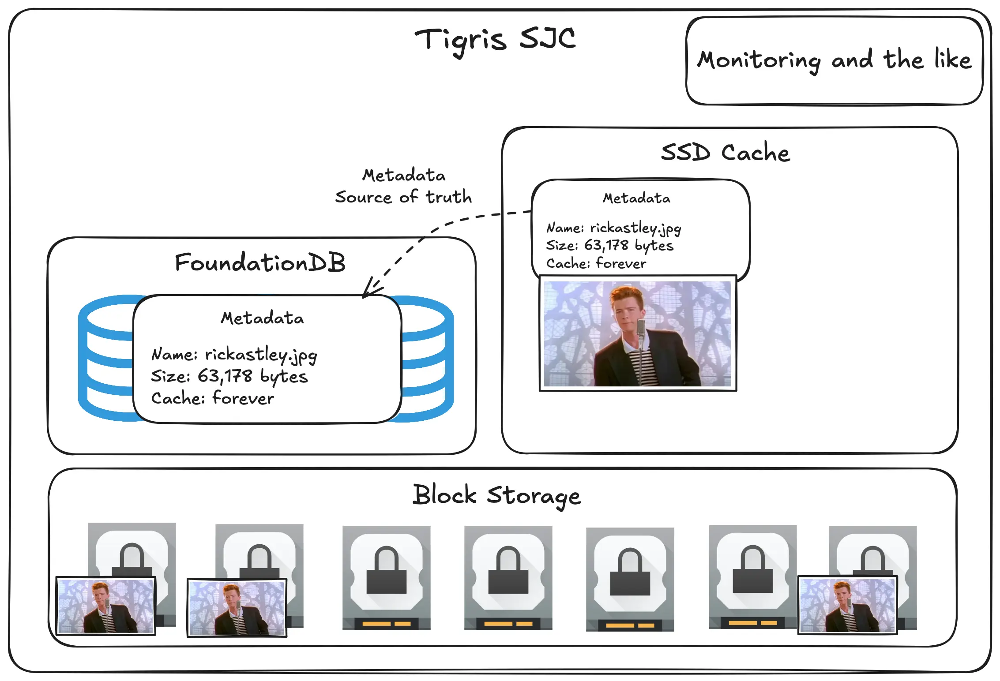

:::note

This kind of data and metadata separation is how we can do superpowers like
letting you rename objects without having to rewrite the data. In most object
storage systems, renaming an object (or a bunch of objects) requires you to run
a `CopyObject` request to copy the data to a new object and then you delete the
old object with `DeleteObject`. Tigris lets you rename in the `CopyObject`
request by passing the `X-Tigris-Rename: true` header. We’ve got more detail
about how you can use this in your stack
[in our docs](https://www.tigrisdata.com/docs/objects/object-rename/).

:::

And even better, what if the data is really small, like less than the average
NPM package? That’s small enough to fit into the FoundationDB record directly!
For those we can inline the data into the FoundationDB row and distribute the
data with the metadata!

This lets us get a three-tiered cache system. Small and medium sized objects can
be returned instantly or at least decently fast from the SSD cache, FoundationDB
can be referenced when the cache is dry, and everything else gets put into block
storage where it’ll still be fast.

Imagine the cache tiers like this:

- SSD cache: cached to nVME SSDs with most frequently accessed files cached in
  RAM
- Inlined to FoundationDB: cached to SSDs, but requires transactional operations
  which can be slower than a pure GET operation on the SSD cache
- Block storage: cached to rotational hard drives

I’d imagine that this is fundamentally how Amazon S3 works behind the scenes
(but probably with another intermediate tier in a way that makes sense for S3’s
scale). But this is just for one region. Tigris is globally replicated. How does
that work?

## How global replication works

When you’re designing any system, fundamentally it’s a game of tradeoffs. That
being said, there’s only really two general “shapes” for these kinds of globally
distributed systems: pull-oriented and push-oriented. Tigris uses elements of
both for its global replication strategy.

Let’s start with pull-oriented because it’s easier to think about.

### An illustrated primer to pull-oriented global replication

The best example for pull-oriented global replication is a Content Delivery
Network (CDN). With a CDN, you have a source of truth (such as an object storage
bucket) and a bunch of edge nodes all over the world that cache copies of the
data in that source of truth. When users load images, they load them from the
edge nodes. Here’s an example based on how Cloudflare works:

The big advantage of an architecture like this is that it’s easy to think about.
You put data into that bucket, and then when any edge node requests that data,
it makes a copy locally so it can serve it faster next time.

Honestly, this works well enough for most websites across the world. This basic
design scales really well, but there’s a hidden cost that can be a problem at
scale:

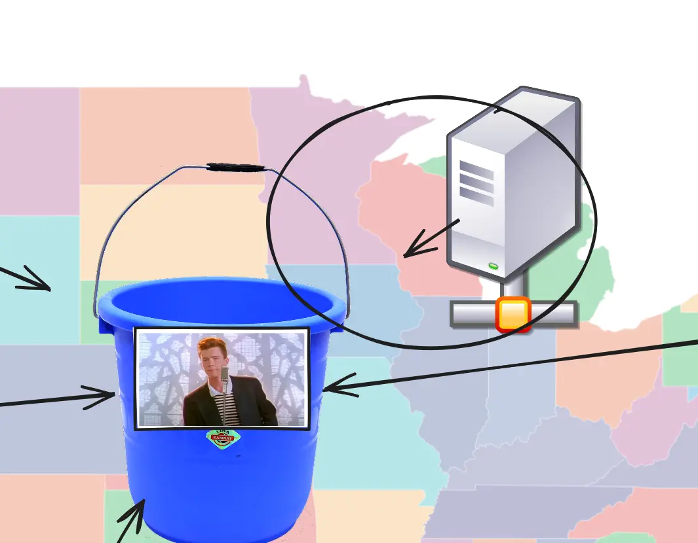

The edge nodes need to request the objects in the source of truth _on demand_.
This means that the first time someone in Seattle requests that picture of Rick
Astley, it can take a few milliseconds longer for it to load. Sure, there are
ways to work around this like blurhash or other placeholder images embedded in
the website, but what if the image was eagerly pushed to the cache when it was
uploaded?

### Push-oriented means eager caching

This is the core of how push-oriented replication works. When an image or video
is uploaded to the source of truth, it’s eagerly pushed out to all of the edge
nodes across the globe:

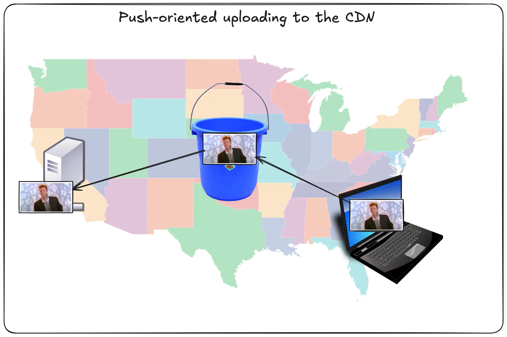

When you upload the image once, it’s automatically cached everywhere. This makes
it load fast for everyone without you having to think about it too much.

However, this can also backfire. What if you’re posting something that’s
incredibly local, such as an article about the scores for the Ottawa Senators vs
Montreal Canadiens hockey game? It doesn’t really make sense to eagerly cache
photos of the game all over the world because very few people in Singapore are
likely going to care about hockey (it’s fun to watch, but I get how it’s really
local to the US and Canada).

This is how CDN caching and eager pushing rules get complicated. This is also
really the core of the business of big enterprise grade CDNs, not to mention
things like video conversion and image format optimization. It’s also a slippery
slope into configuration madness.

What if you could get the best of both worlds? Let’s imagine a world where your
objects are global so that you can fetch them from anywhere quickly, but also at
the same time not having to eagerly cache everywhere (unless you want to).

### Push-oriented replication

The big difference between how Tigris works and how a traditional CDN works is
that every Tigris region can be authoritative for any given object. Let’s show
what that looks like for uploading that pic of Rick:

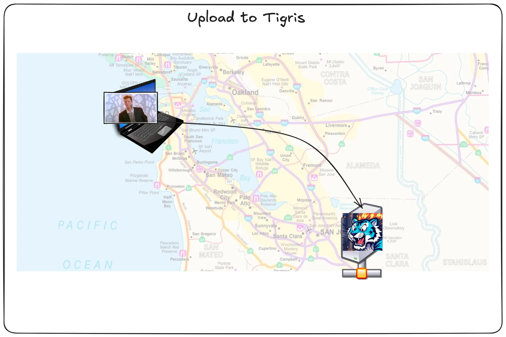

What happens next? How do the other Tigris regions know about the object so they
can know if they need to serve a 404 or not. One way you could do it is by using
a pull model for replicating the metadata. Let’s see what that would look like:

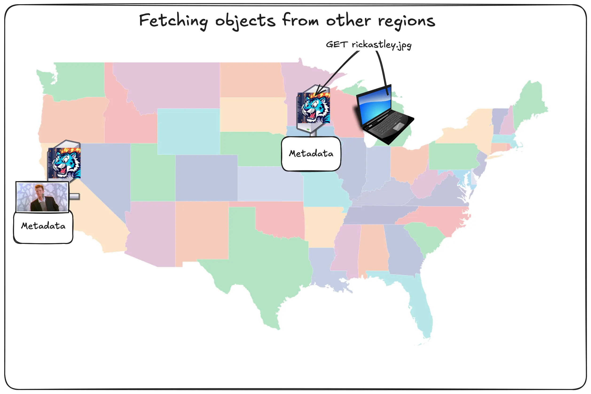  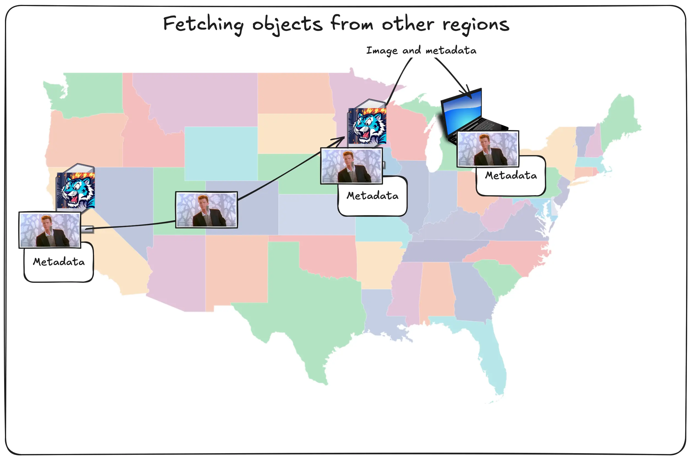

So in this theoretical world, the user in Chicago asks the Tigris region in
Chicago for the Rick Astley image. The Chicago region asks the San Jose region
if it has the image, San Jose says yes, then Chicago caches that image and sends
it back to the user. This could work, but there’s another problem you’ll have to
solve: any Tigris region can be authoritative for any object. The Chicago region
would have to ask every region around the world if it has that object or not:

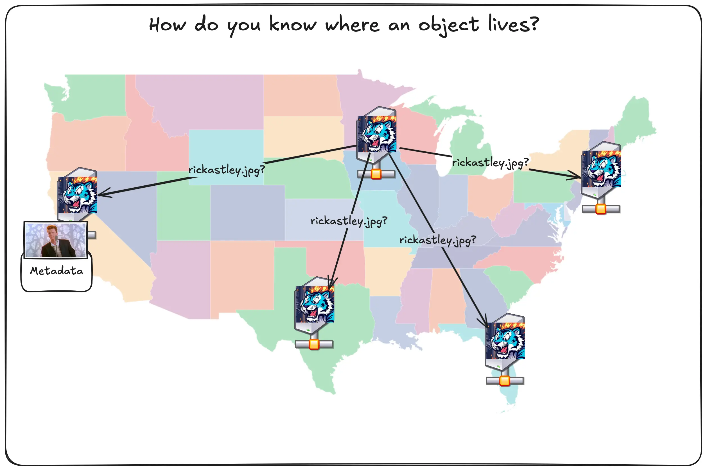

This gets latent and expensive very quickly, especially as we spin up more
regions around the world. Worse, this is also vulnerable to race conditions.
What if two people in two regions upload different files to the same key name?

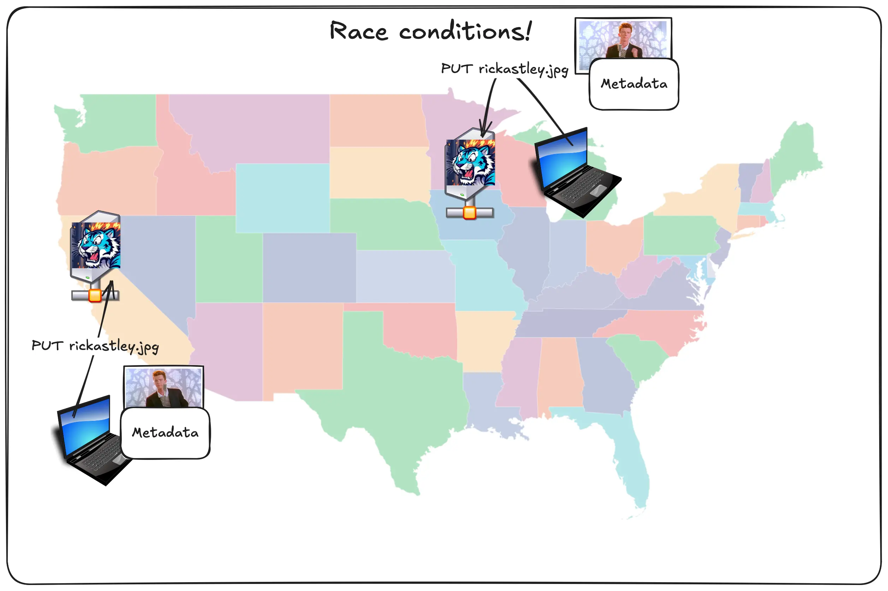

How would any of the regions know which pic of Rick is the right one?

## How Tigris does global replication

Tigris takes a different approach here. Tigris uses a hybrid of pushing metadata
out to every region, but only pulling the data when it’s explicitly requested.
Let’s see how that works with the pic of Rick:

Diagram: user uploads picture of Rick Astley to SJC, connected data and metadata
are uploaded

The user uploads the picture of Rick Astely and its corresponding metadata.
These two are separately handled. The picture is put into block storage (and
maybe the SSD cache), but the metadata is stored directly in FoundationDB. Then
the metadata is queued for replication.

A backend service handles our replication model. When it sees a new record in
the replication queue, it eagerly pushes out the metadata to every other region.

The really cool part about how this works under the hood is that the database is
itself the message queue. Time as an ordered phenomenon\*. FoundationDB is an
ordered datastore. The replication queue entries use the time that the object
was created in its key name.

:::note

\*Okay yes there’s issues like time dilation when you’re away from a large
source of mass like the earth (this is noticeable in the atomic clocks that run
GPS in low earth orbit), and if you’re on a spaceship that’s near the speed of
light. However, I’m talking about time in a vacuum with a nearby source of great
mass, perfectly spherical cows, and whatnot, so it’s really not an issue for
this example.

:::

This database-as-a-queue is based on how
[iCloud's global replication works](https://www.foundationdb.org/files/QuiCK.pdf).
It gives us a couple key advantages compared to using something like postgres
and kafka:

1. Data can be stored and queued for replication in the same transaction,
   meaning that we don’t have to coordinate transactional successes and failures
   between two systems
2. Tigris is already an expert in running FoundationDB, so we can take advantage
   of that experience and share it with our message queue, making this a lot
   less complicated in practice.

This isn’t a free lunch, there’s one sharp edge that you may run into: that
replication takes a nonzero amount of time. It usually takes single digit
seconds at most, which is more than sufficient for most applications. We’re
working on ways to do better though\!

:::note

This replication delay bit is why Tigris isn’t a traditional CDN per se. Most
traditional CDN designs will make every object either visible or 404d at any
given point in time. During the tiny bit of time after the object is put in the
source region and before the metadata is replicated out, other Tigris regions
won’t know that the object exists. This can look like a race condition if your
workload is sufficiently global, but everything should work if you retry with
exponential backoff.

We’re only aware of one customer ever running into this issue in the wild; but
if you do, please get in touch with us so we can understand what you’re doing
and use that to make Tigris better for everyone\!

:::

## The secret fourth tier of caching

Remember how I said that Tigris has three tiers of caching: block storage, SSD
cache, and inline FoundationDB rows? There’s actually a secret fourth tier of
caching: other Tigris regions. This is the key to how Tigris makes your data
truly global.

Let’s say you upload the pic of Rick to San Jose and someone requests it from
Chicago. First, the data is put into San Jose’s block storage layer and the
metadata is queued for replication.

There’s a dirty trick going on in the metadata, let’s double click on it:

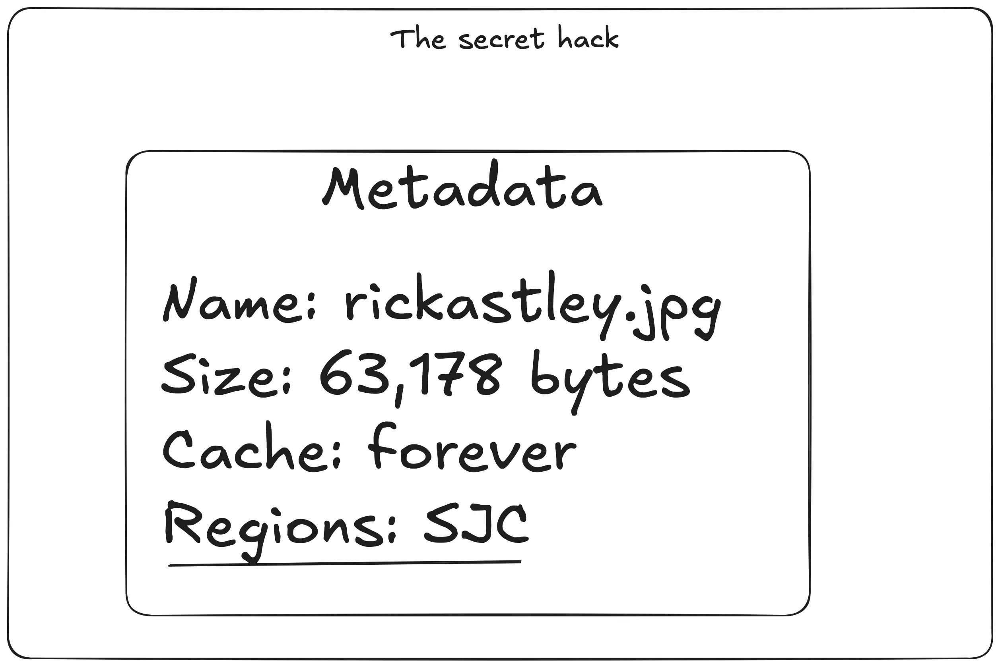

Every bit of metadata contains a reference to block storage. Block storage runs
in its own dedicated regions whose locations are sworn to secrecy, but run in a
different provider close to each Tigris region for redundancy. The cool part is
that any Tigris region can pull from the block storage service in every other
region.

Diagram: Chicago node pulls the data from SJC block storage and stores it in the
SSD / block storage cache layers

Then it stores it inside the cache layer like normal.

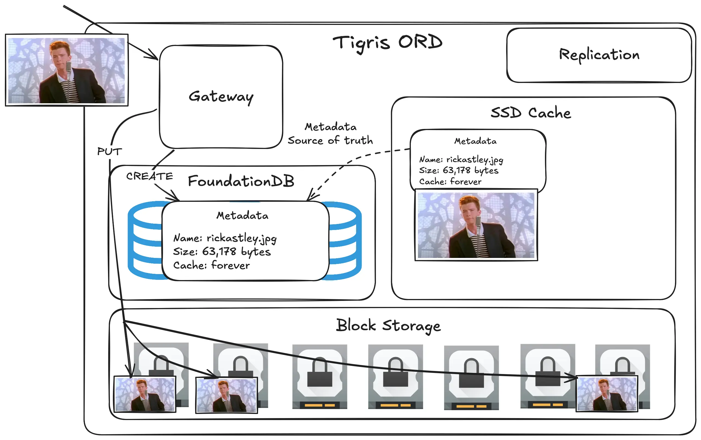

Once it’s done, it updates the metadata for the object to tell other Tigris
regions that it has a copy and queues that for replication:

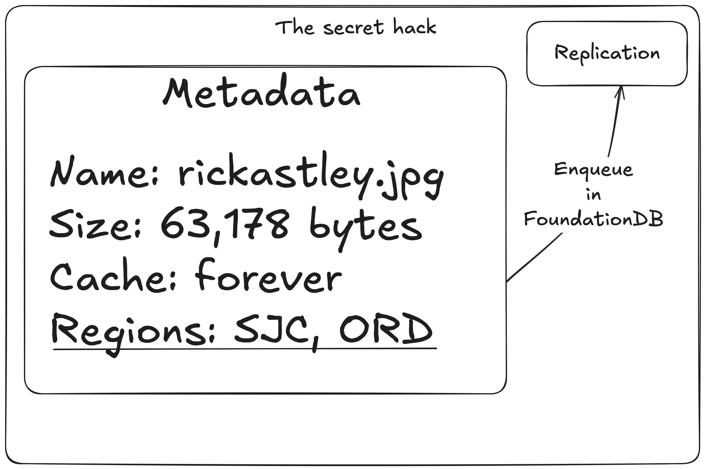

This means that there’s actually four layers of caching: FoundationDB, SSD
cache, local block storage, and the closest region’s block storage.

There’s also a neat trick we can do with this. We can have one of our regions
get hit by a meteor and come out on the other side of it smiling. Take a look at
this series of unfortunate events. Let’s say you upload the pic of Rick and then
SJC gets wiped off the internet map:

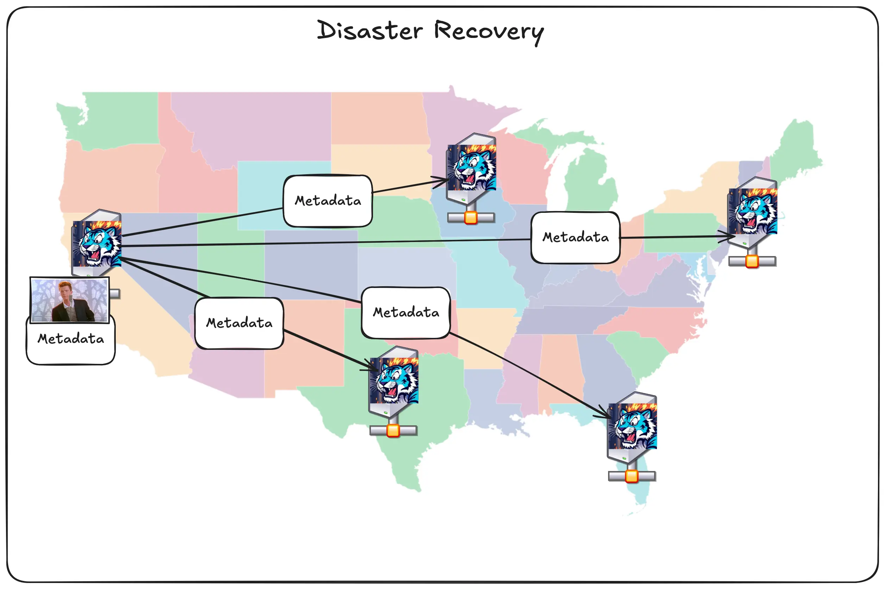

The metadata was already replicated and the data was uploaded to block storage,
so it doesn’t matter.

The user in Chicago can still access the picture because the Chicago region is
just accessing the copy of the image in block storage. This combined with other
dirty internet tricks like anycast routing means that we can suffer losing
entire regions and the only proof that it’s happening is either our status page
or you might notice that uploads and downloads are a tiny bit slower until the
regions come back up.

This is what sold me on Tigris enough to want to work with them. This ridiculous
level of redundancy, global distribution, and caching is the key to how Tigris
really makes itself stand apart from the crowd. What I think is the best part
though is that here’s how you enable all of this:

All you have to do is create a bucket and put objects into it. This global
replication is on by default. You don’t have to turn it on. It just works.

## What if I have to have opinions?

We don’t stop there. Some companies may need to make sure that their objects are
only ever stored in jurisdictions like the EU. We can handle that. When you
create a bucket, you can attach an `X-Tigris-Regions` header that restricts the
objects so that the data lives and dies in Europe.

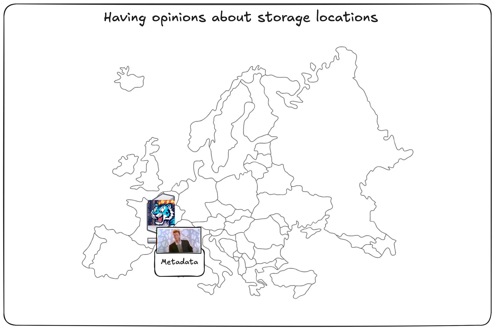

When people outside of the EU request those objects, they’ll just get the copy
from the EU. The data won’t be cached outside of the EU. This will make
downloading objects from the other side of the pond slower, but you can rest
assured that the data is permanently stored in the EU.

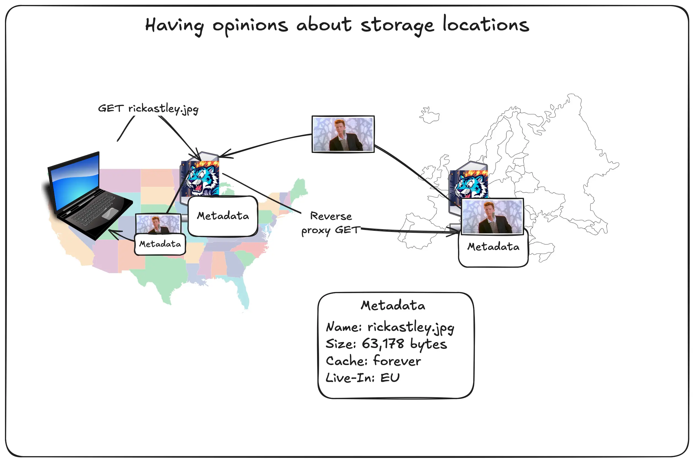

This also works for individual Tigris regions, so you can cordon your data to
Singapore just as easily as you can to Chicago.

Oh, it’s also not just at the bucket level. You can do it at the per-object
level too. See how after class\!

If you want to have the push-oriented flow because your workload needs it, all
you need to do is
e[nable the accelerate flag](https://www.tigrisdata.com/docs/objects/caching/#caching-on-put-eager-caching)
for the bucket. This will make Tigris eagerly push out copies of your objects to
a few key regions worldwide, so that users near those regions load things quick
and so that any other regions already have the data in the same continent.

Diagram: pic of rick going to chicago, frankfurt, and singapore, other tigris
regions labeled with arrows pointing to those regions

This gives you all the latency advantages of having a traditional push-oriented
CDN as well as the simplicity of a traditional pull-oriented CDN. It’s really
the best of both worlds.

## The 5 minute CDN with Tigris

Our friends at Fly.io wrote a guide in 2021 about how you can
[make your own CDN in 5 hours on top of Fly.io](https://fly.io/blog/the-5-hour-content-delivery-network/).
With Tigris, you can do one better: you can make your own CDN in 5 minutes with
Tigris. Don’t believe us? Let’s speedrun:

1. Open [storage.new](https://storage.new) and make a bucket named
   `cdn.yourdomain.example`.
2. Set a DNS CNAME pointing `cdn.yourdomain.example` to
   `cdn.yourdomain.example.fly.storage.tigris.dev`.
3. Wait a minute for the DNS records to percolate out (the slowest part).
4. Set the custom domain name in
   [the bucket settings page](https://www.tigrisdata.com/docs/buckets/settings/#custom-domains).
5. Put data into the bucket.
6. Link to it from your website.
7. There is no step 7.

That’s it. That’s all you need to do. If you want, you can set the
[eager caching](https://www.tigrisdata.com/docs/objects/caching/#caching-on-put-eager-caching)
settings I mentioned in order to make your objects percolate out at the speed of
code!

<InlineCta
  title={"Want to try Tigris?"}
  subtitle={
    "Wanna use Tigris for your workloads, be they AI, conventional, or even for offsite backups?"
  }
  button={"Get started today!"}
/>
