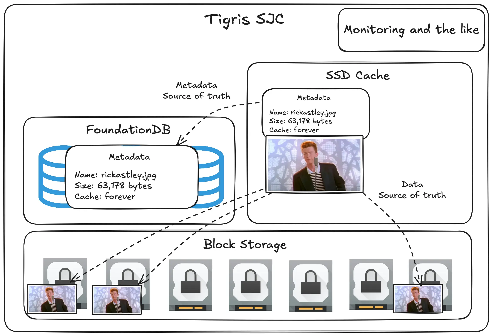
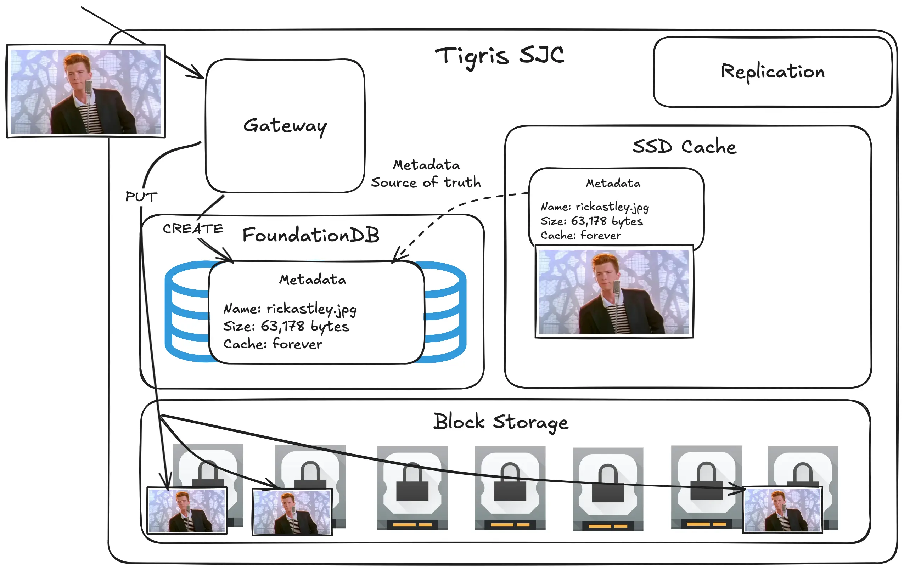
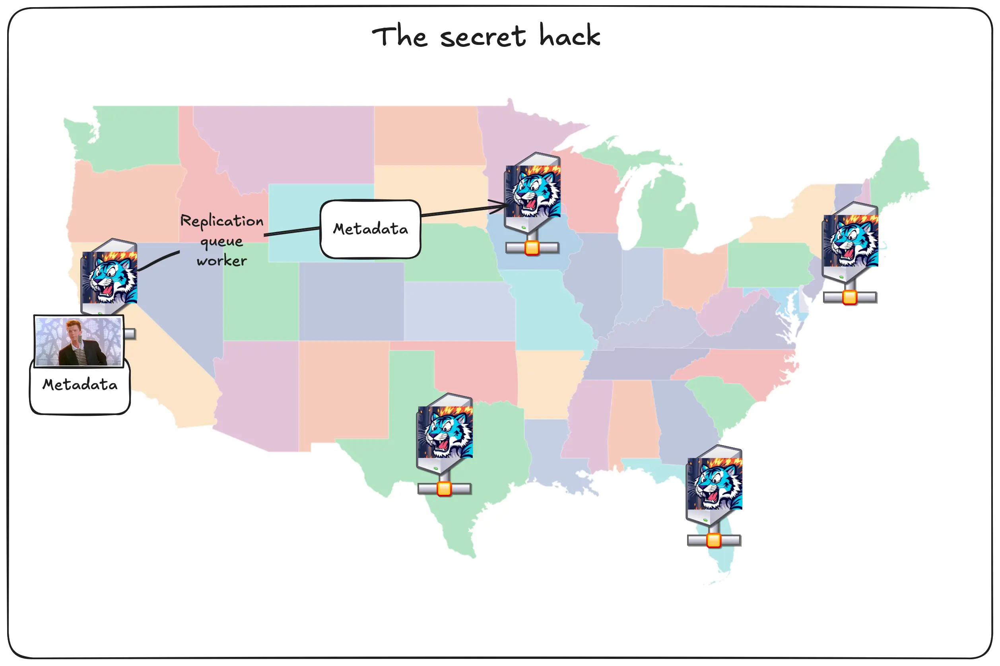
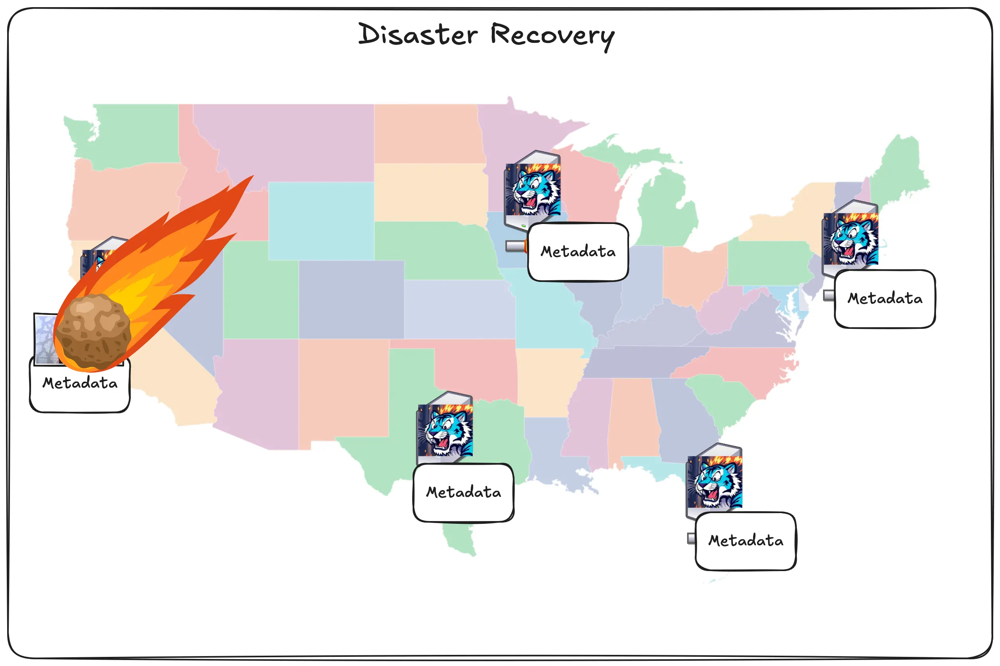
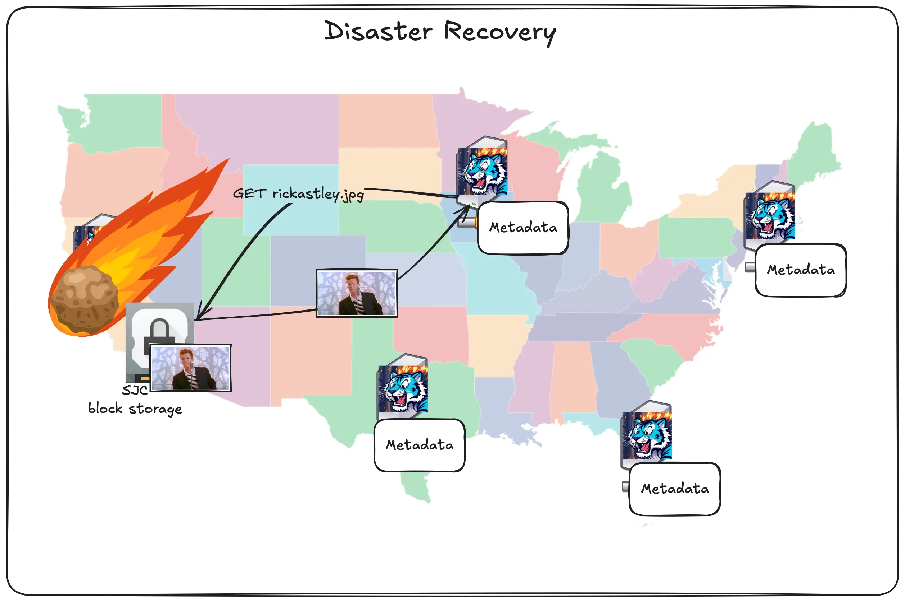
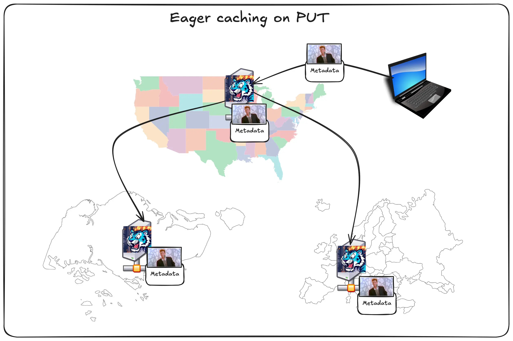

import InlineCta from "@site/src/components/InlineCta";

At Tigris, globally replicated object storage is our _thing_. But why should you
want your objects “globally replicated”? Today I’m gonna peel back the curtain
and show you how Tigris keeps your objects exactly where you need them, when you
need them, by default.

Global replication matters because computers are ephemeral and there’s a
tradeoff between performance and reliability. But does there have to be?

<div
  style={{
    height: "100%",
    width: "100%",
  }}
>
  <video
    id="attract-video"
    autoplay
    playsInline
    loop
    muted
    style={{
      width: "100%",
      height: "auto",
      maxWidth: "100%",
      maxHeight: "100%",
    }}
    onCanPlayThrough={(ev) => {
      ev.target.muted = true;
      ev.target.play();
    }}
    onLoadStart={(ev) => {
      console.log("hihi");
    }}
  >
    <source
      src="/blog/img/blog/global-replication/tiger-globe.mp4"
      type="video/mp4"
    />


  </video>
  <center>
    <small>
      <em>
        A cartoon tiger laying across the globe, protecting and distributing
        buckets to users. Image input made with Flux 1.1 [ultra] and video made
        with Veo 2.
      </em>
    </small>
  </center>
</div>

{/* truncate */}

Storage devices can and will degrade over time. Your CPUs aren’t immune from it
either, recent
[Intel desktop CPUs](https://community.intel.com/t5/Blogs/Tech-Innovation/Client/Intel-Core-13th-and-14th-Gen-Desktop-Instability-Root-Cause/post/1633239)
have been known to start degrading and returning spontaneous errors in code that
should work. Your datacenters could be hit by a meteor or a pipe could burst:
being in the cloud doesn’t mean perfect reliability. But failovers and multiple
writes take precious time. We write your data to 11 regions based on access
patterns, so you get low latency (and therefore higher user retention), without
sacrificing reliability.

Here’s how Tigris globally replicates your data; but first, let’s cover the easy
and hard problems of object storage.

## Object storage 101

At its core, object storage is an unopinionated database. You give it data,
metadata, and a key name, then it stores it. When you want the data or metadata
back, you give the key and it gives you what you want. This is really the gist
of it, and you can summarize most of the uses of object storage in these calls:

- PutObject - add a new object to a bucket
- GetObject - get the data and metadata for an object in a bucket
- HeadObject - get the metadata for an object in that bucket
- DeleteObject - banish an object to the shadow realm, removing it from the
  bucket
- ListObjectsV2 - list the metadata of a bunch of objects in a bucket based on
  the key

This is the core of how object storage is used. The real fun comes in when you
create a bucket. A bucket is the place where all your objects are stored. It’s
kind of like putting a bunch of shells in a bucket when you’re at the beach.

Most object storage systems make you choose up front where in the world you want
to store your objects. They have regions all over the world, but if you create a
bucket in us-east-1, the data lives and dies in us-east-1. Sure, there’s ways to
work around this like bucket replication, but then you have to pay for storing
multiple copies, and wait for cross region replication to get around to copying
your object over. Tigris takes a different approach: your objects are
dynamically placed by default.

Tigris has
[servers all over the world](https://www.tigrisdata.com/docs/concepts/regions/).
Each of those regions might have any given object, and they might not (unless
you restrict the regions to comply with laws like GDPR). What happens when you
request an object that doesn’t exist locally?

## How Tigris does global replication

Tigris takes a different approach here. Tigris uses a hybrid of pushing metadata
out to every region, but only pulling the data when it’s explicitly requested.
We use [FoundationDB](https://www.foundationdb.org/) as our database.

In Tigris we have three tiers of cache:

- SSD Cache: Near instant responses for either data+metadata or just the
  metadata
- FoundationDB: Fast but transactional responses for data+metadata if the object
  is inlined to the FoundationDB record, otherwise just the metadata
- Block storage: Fast but slightly more latent responses for objects that can't
  fit into the SSD cache

Overall it looks kinda like this:



Let’s see what happens when a user uploads a file to a bucket:


The user uploads the picture of Rick Astely and its corresponding metadata.
These two are separately handled. The picture is put into block storage (and
maybe the SSD cache), but the metadata is stored directly in FoundationDB. Then
the metadata is queued for replication.



A backend service handles our replication model. When it sees a new record in
the replication queue, it eagerly pushes out the metadata to every other region.


The really cool part about how this works under the hood is that the database is
itself the message queue. Time as an ordered phenomenon\*. FoundationDB is an
ordered datastore. The replication queue entries use the time that the object
was created in its key name.

:::note

\*Okay yes there’s issues like time dilation when you’re away from a large
source of mass like the earth (this is noticeable in the atomic clocks that run
GPS in low earth orbit), and if you’re on a spaceship that’s near the speed of
light. However, I’m talking about time in a vacuum with a nearby source of great
mass, perfectly spherical cows, and whatnot, so it’s really not an issue for
this example.

:::

This database-as-a-queue is based on how
[iCloud's global replication works](https://www.foundationdb.org/files/QuiCK.pdf).
It gives us a couple key advantages compared to using something like postgres
and kafka:

1. Data can be stored and queued for replication in the same transaction,
   meaning that we don’t have to coordinate transactional successes and failures
   between two systems
2. Tigris is already an expert in running FoundationDB, so we can take advantage
   of that experience and share it with our message queue, making this a lot
   less complicated in practice.

This isn’t a free lunch, there’s one sharp edge that you may run into: that
replication takes a nonzero amount of time. It usually takes single digit
seconds at most, which is more than sufficient for most applications. We’re
working on ways to do better though\!

## The secret fourth tier of caching

Remember how I said that Tigris has three tiers of caching: block storage, SSD
cache, and inline FoundationDB rows? There’s actually a secret fourth tier of
caching: other Tigris regions. This is the key to how Tigris makes your data
truly global.

Let’s say you upload the pic of Rick to San Jose and someone requests it from
Chicago. First, the data is put into San Jose’s block storage layer and the
metadata is queued for replication.



There’s a dirty trick going on in the metadata, let’s double click on it:

```
# Metadata:

Name: rickastley.jpg
Size: 63,178 bytes
Cache: forever
Regions: SJC
```

Every bit of metadata contains a reference to block storage. The cool part is
that any Tigris region can pull from the block storage service in every other
region. Then it stores it inside the cache layer like normal.


Once it’s done, it updates the metadata for the object to tell other Tigris
regions that it has a copy and queues that for replication:

```
# Metadata:

Name: rickastley.jpg
Size: 63,178 bytes
Cache: forever
Regions: SJC, ORD
```

This means that there’s actually four layers of caching: FoundationDB, SSD
cache, local block storage, and the closest region’s block storage.

There’s also a neat trick we can do with this. We can have one of our regions
get hit by a meteor and come out on the other side of it smiling. Take a look at
this series of unfortunate events. Let’s say you upload the pic of Rick and then
SJC gets wiped off the internet map:



The metadata was already replicated and the data was uploaded to block storage,
so it doesn’t matter.

The user in Chicago can still access the picture because the Chicago region is
just accessing the copy of the image in block storage. The block storage service
runs in the same region as the Tigris frontend, but specifically on a different
provider. This combined with other dirty internet tricks like anycast routing
means that we can suffer losing entire regions and the only proof that it’s
happening is either our status page or you might notice that uploads and
downloads are a tiny bit slower until the regions come back up.



This is what sold me on Tigris enough to want to work with them. This ridiculous
level of redundancy, global distribution, and caching is the key to how Tigris
really makes itself stand apart from the crowd. What I think is the best part
though is that here’s how you enable all of this:

All you have to do is create a bucket and put objects into it. This global
replication is on by default. You don’t have to turn it on. It just works.

## What’s Configurable?

What about the GDPR? Some European countries want their companies to store
European data in Europe. We support that. When you create a bucket, you can
attach an `X-Tigris-Regions` header that restricts the objects so that the data
lives and dies in Europe. You can do this when you create objects too. See
[restricting to specific regions](https://www.tigrisdata.com/docs/objects/object_regions/#restricting-to-specific-regions)
for more information. When someone outside of the EU views the objects, Tigris
will just reverse proxy it over. It’ll be slower, but the data will not be
replicated outside of the EU. This works for individual regions too, just in
case you need your hockey game pictures to only ever be stored in Newark.

Sometimes you need eager caching on PUT. We support that with
[the accelerate flag](https://www.tigrisdata.com/docs/objects/caching/#caching-on-put-eager-caching).
When you upload a picture to ORD, it’ll get pushed out all over the world for
you:



This gives you all the latency advantages of having a traditional centralized
architecture as well as the simplicity of a decentralized architecture. It’s
really the best of both worlds.

Wanna use Tigris for your workloads, be they AI, conventional, or even for
offsite backups? Get started today at [storage.new](https://storage.new).

<InlineCta
  title={"Want to try Tigris?"}
  subtitle={
    "Wanna use Tigris for your workloads, be they AI, conventional, or even for offsite backups?"
  }
  button={"Get started today!"}
/>
