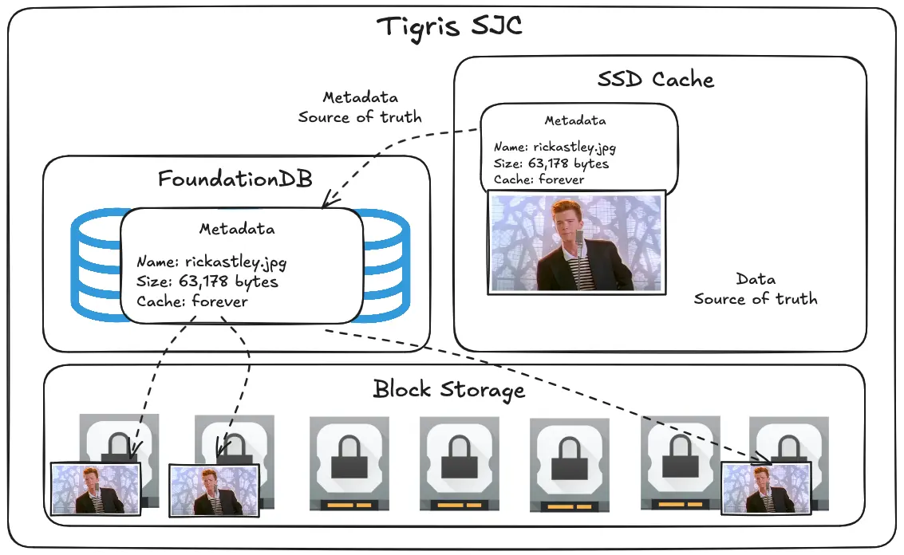

import InlineCta from "@site/src/components/InlineCta";

As the saying goes, there’s two hard problems in computer science:

1. Cache invalidation
2. Naming things
3. Off-by-one errors

Tigris takes care of cache invalidation, and we’d love to help with that last
one, but now we can help you out if you named your object wrong. That’s right,
we’ve added the ability to rename files.


{/* truncate */}

TL;DR:

When doing a CopyObject request, attach an `X-Tigris-Rename` header like this:

<div style={{tabSize: "2"}}>

```go
func WithHeader(key, value string) func(*s3.Options) {
	return func(options *s3.Options) {
		options.APIOptions = append(options.APIOptions, http.AddHeaderValue(key, value))
	}
}

func WithRename func(*s3.options) {
	return WithHeader("X-Tigris-Rename", "true")
}

// in your main function

sdkConfig, err := config.LoadDefaultConfig(ctx)
if err != nil {
	log.Fatalf("couldn't load default configuration: %v", err)
	return
}

// Create Tigris client
svc := s3.NewFromConfig(sdkConfig, func(o *s3.Options) {
	o.BaseEndpoint = aws.String("https://fly.storage.tigris.dev")
	o.Region = "auto"
	o.UsePathStyle = false
})

_, err = svc.CopyObject(ctx, &s3.CopyObjectInput{
	Bucket: aws.String("tigris-example"),
	CopySource: aws.String("tigris-example/old-name"),
	Key: aws.String("new-name"),
}, WithRename)
if err != nil {
	log.Fatalf("can't rename object: %v", err)
}
```

</div>

When the call is done, the object will be renamed and no longer accessible under
its old name. This will make your mass renames a lot easier\!

## Why this matters

Most of the time when you design something around an object storage bucket, you
get it right the first time. Or at least you got it right enough that it’s not
worth the effort required to change the universe in order to use different
filename patterns.

Sometimes you really need to do a big-scale rename and this can get scary. Very
scary in the costs department. You had to copy each object twice: once to a
temporary name for staging and then again to the final name. Back in the day,
the gigabytes were heavy and you had to do it uphill both ways in the snow.

When you do a rename with Tigris, you are charged for one standard class A
CopyObject request ($0.005 per 1000 requests, or about half a millipenny per
request). The only thing that changes is the metadata, not any of the actual
data.

Tigris is able to get away with doing this because we went out of the way to
design the system to store data and metadata separately in FoundationDB, the
database we use:



When you do a rename, under the hood we do something like this:

```js
// pseudocode
begin(async (tx) => {
  const metadata = await tx.readObjectMetadata(copySource);
  const newKey = await tx.newObject(bucket, key, metadata);
  await tx.deleteMetadata(copySource);
  await tx.enqueueCachebust(newKey);
});
```

We make a new transaction in the database, read the metadata out of the source
object, copy it to a new object, and then delete the metadata for the source
object. This doesn’t change the actual data in block storage, because that’s
intentionally separate from the metadata. Here’s a simplified view of what the
metadata for an object looks like:

```js
{
	name: "rickastley.jpg",
	length: 63178,
	headers: {
		"Content-Disposition": "inline",
		// other headers here depending on what was uploaded
	},
blockId: "eaa26db6480044a5327c9b2414caa333721d3b29ad2a21b958420241cde713f3",
	storageLocations: [ "SJC", "ORD" ]
}
```

There’s a block identifier (randomly generated) and a list of the regions where
Tigris can find it in block storage. This differs from a CopyObject request
because CopyObject copies the block storage data too:

```js
// pseudocode
begin(async (tx) => {
  const metadata = await tx.readObjectMetadata(copySource);
  const block = await block.clone(metadata.blockId);
  metadata.blockId = block.Id;
  const newKey = await tx.newObject(bucket, key, metadata);
  await tx.enqueueCachebust(newKey);
});
```

As an added bonus, this also enqueues busting and filling any caches in the
system so that things Just Work™️.

We hope that this helps us continue along our journey to make object storage
better for everyone by taking what makes it good and removing the friction we’ve
felt to make it better. Maybe this will be enough to give Tigris a shot; we’d
love to hear how it works for you!

<InlineCta
  title={"Object storage, refined with renames"}
  subtitle={
    "Tigris is object storage that works with you so that your small mistakes don't become a multi-thousand dollar bill to clean up. Not to mention being able to store everything all over the globe!"
  }
  button={"Get started today!"}
/>
