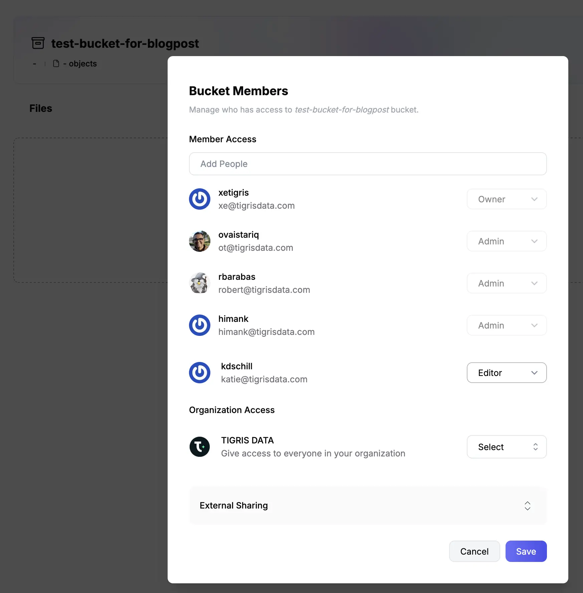
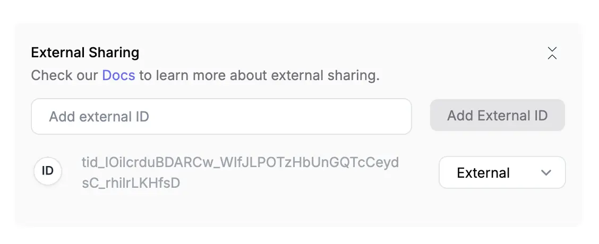

import InlineCta from "@site/src/components/InlineCta";

We’ve made it easy to share buckets with your team. Surprisingly, it isn’t so
easy to share buckets on $BigCloud. Life doesn’t have to be hard when you have
good developer experience.

Let’s say you want to share a bucket in a big public cloud. Suddenly you need
permissions to author IAM policies, and you have to worry about user policies,
bucket policies, and trawl through the documentation to remember which verb
means “this user can do this policy on these resources”. Tigris supports all the
[IAM goop you’re used to](https://www.tigrisdata.com/docs/iam/) if you want to
copy and paste something you already have. But you don’t have to deal with IAM
policies if you don’t want to. We’ve made it easy to share access to buckets in
the UI, exactly how you’d expect it to work.

{/* truncate */}

In Tigris, buckets are owned by users in organizations. If you are an
unprivileged user and create a bucket, only you and any admins can access it.
You can create access keys that are further scoped to only the buckets you own.

But what if you want to share a bucket with your coworkers? That should be easy,
right?

## Yes, it’s actually much easier

Yep, you can do that!

Just open the bucket in the console, click share, and choose who you want to
share it with as well as what powers they have. If you want to share it with
everyone in your organization, you can do that too with the organization access
section.

But what about an external partner? We make this easier, too.

## The ninth circle of IAM hell

Yes, it is possible to share buckets between organizations on $BigCloud\*. That
is a load-bearing asterisk. The main problem is that the only way to do this
_the right way_ isn’t as straightforward. What if it was just as easy as giving
an arbitrary access token editor permissions to the bucket?

Doing this on $BigCloud IAM requires a lot of clever abuse of the permissions
systems. I helped set this up at a previous job and I’m still not sure how it
works. Granted it’s been a few years; but still, it was not fun.

On Tigris, you can grant access to buckets by keypair. A keypair is a
combination of a token ID (which functions as the username) and a secret value
(which functions as a shared cryptographic secret for message signing). A
keypair is also a machine-scoped identity.

To share a bucket with an external collaborator, do the following:

- Ask them to create a keypair and give you the token ID (this starts with
  `tid_`).
- Open the sharing dialogue for that bucket in the admin console.
- Expand “External Sharing”.
- Paste the token ID into the text box and click “Add External ID”.
- Hit save at the top of the dialogue.

They should now have editor permissions in the bucket. That bucket won’t show up
by default when your friend lists all the buckets they have access to, but all
they need to do is specify it by name and they’re off to the races! No more
manually created cross-account bucket policies or date nights with the IAM
documentation.

Share your buckets, share the love!

<InlineCta
  title={"Object storage, now with additional bucket sharing feature"}
  subtitle={
    "Share files in a snap, be it with public URLs, presigned URLs, or even sharing an entire bucket! All without having to read the docs."
  }
  button={"I want that!"}
/>
