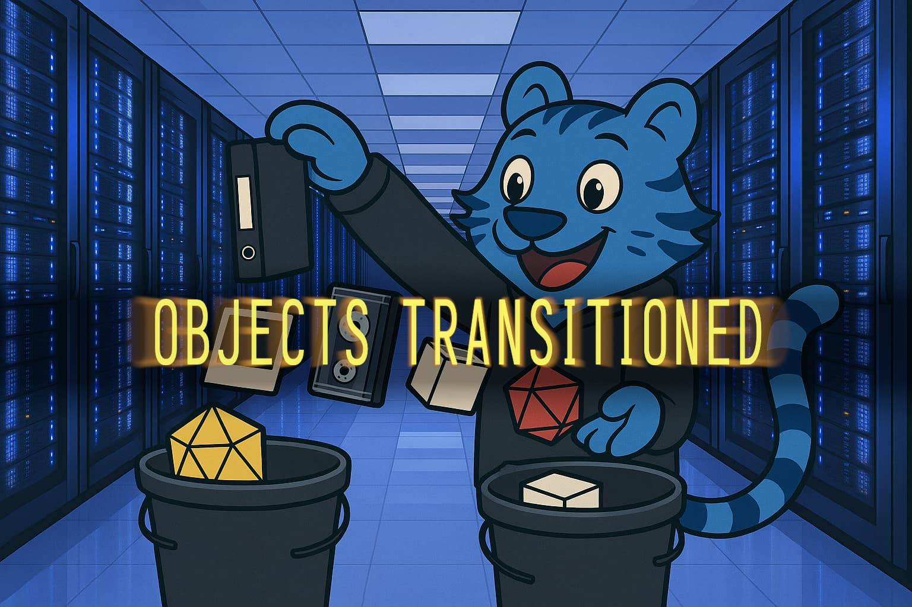
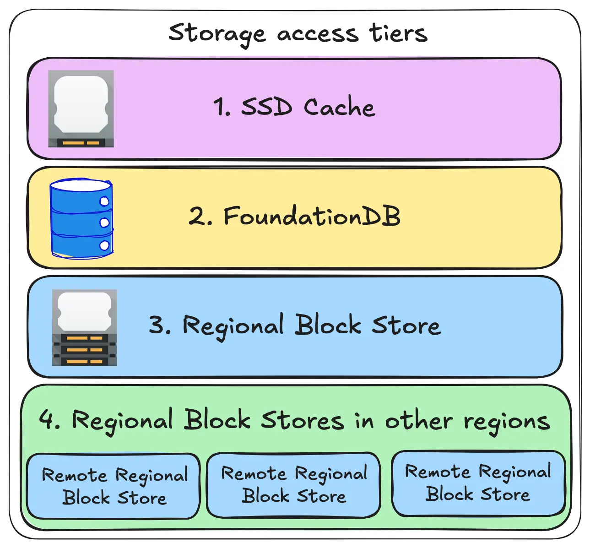
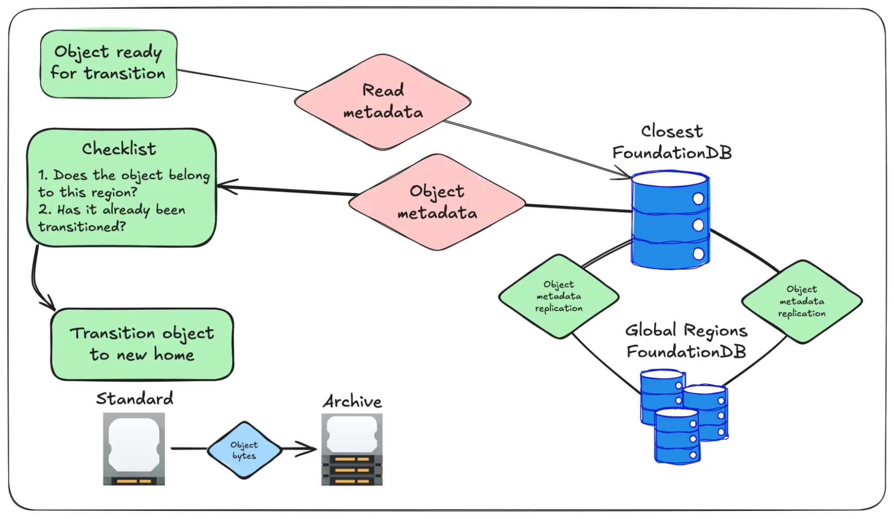

import Conv from "@site/src/components/Conv";
import InlineCta from "@site/src/components/InlineCta";

import xe from "@site/static/img/avatars/xe.jpg";
import garren from "@site/static/img/avatars/garren.jpg";

export const Xe = ({ children, top, bottom }) => (
  <Conv
    name="Xe"
    title="Senior Cloud Whisperer"
    profilePic={xe}
    top={top}
    bottom={bottom}
  >
    {children}
  </Conv>
);

export const Garren = ({ children, top, bottom }) => (
  <Conv
    name="Garren"
    title="Member of Technical staff, main implementor of lifecycle rules at Tigris"
    profilePic={garren}
    top={top}
    bottom={bottom}
  >
    {children}
  </Conv>
);

**Tigris makes your storage multicloud for you, so you don't have to worry about
all that.**

Lifecycle rules automatically move your objects to archive or infrequent access
tiers to help cut storage costs. This feature has become pretty standard for
object storage systems, but under the hood, it's relatively complex to
implement. Especially when you're building with global storage across many
regions. Let's walk through how we built the feature, and where things got a
little complicated.



{/* truncate */}

But first, a classic SRE koan:

<Xe top bottom>
  The simpler something looks, the harder it is to make it happen.
</Xe>

This is the core “problem” that we face at Tigris. Object storage looks really
simple from an end user standpoint but is actually quite complicated on the
backend. As a user, you put an object with a key into a bucket and then you can
get the data in that key back out of that bucket when you need it. On the
backend we need to worry about
[permissions](https://www.tigrisdata.com/blog/bucket-sharing/),
[renames](https://www.tigrisdata.com/blog/rename-object/),
[caching](https://www.tigrisdata.com/blog/global-replication/), and other fun
things that you don't need to care about such as
[erasure coding](https://en.wikipedia.org/wiki/Erasure_code).

It seems simple enough to move data between tiers, right? “Just” move the bytes
around. Well, it's a bit more interesting and complicated. Buckle up, you're in
for the ride now.

<Xe top bottom>
  Remember: it's never "just" that easy. If it was, we'd be out of a job.
</Xe>

## Lifecycle rules and you

One of the most under-appreciated features of object storage is the idea of
[lifecycle rules](https://docs.aws.amazon.com/AmazonS3/latest/userguide/object-lifecycle-mgmt.html).
These rules automatically move data from the standard tier to an archive or
infrequent access tier, usually to save on cost. Today I'll cover two of the
most common ways to use lifecycle rules I've seen in the wild: database backups
and temporary caches for social media services.

### Database backups

For example, let's imagine that you have a bucket full of database backups. This
bucket gets new backups written to it every day, but in practice you only really
need instant access to the backups made in the last week. Your backups are
growing in proportion to the size of your userbase and the acronym compliance
overlords demand that you delete old backups after 6 months so that you
implement the right to be forgotten. How would you handle this?

Think about it as your database backups having three “stages”: fresh, archived,
and eligible for cleanup:

| Stage                | Age                        | Storage tier |
| :------------------- | :------------------------- | :----------- |
| Fresh                | Less than two weeks old    | Standard     |
| Archived             | More than two weeks old    | Archive      |
| Eligible for cleanup | More than three months old | Deleted      |

This lets you compromise on your infrastructure costs based on the real-world
uses of your data. This also comes with significant cost savings too. Imagine
this realistic scenario:

- Your database starts out at 1 terabyte of data
- Your users are active enough that your database increases by 0.5% every
  calendar day

<Xe top bottom>
  Okay, it's not quite as realistic as you'd think because at that scale they
  really should set up incremental database backups, but I've seen datasets much
  bigger than this using a backup policy like this in practice. The most fun
  memorable one was that time that the daily database backup process took longer
  than 24 hours. I got to learn things no person should know about MySQL
  binlogs. I don't remember them, but I sure did get to know them!
</Xe>

After three months of this daily 0.5% database growth, your bucket will be
storing about 120 terabytes of data, costing you about $2,450 per month. But you
don't need instant access to backups from three months ago. Those “old” backups
account for the majority of your monthly cost, or about $2220 of your storage
cost.

If those backups were stored at the
[Archive tier](https://www.tigrisdata.com/docs/objects/tiers/#archive-tier),
they would only cost you $370 per month. In total, lifecycle rules to move data
around lets you cut your storage costs to _a third_ of what they were before:

| Before      | 120 TB @ Standard                 | $2450 |
| :---------- | :-------------------------------- | :---- |
| After       | 92 TB @ Archive, 28 TB @ Standard | $833  |
| Net savings |                                   | $1617 |

There are tradeoffs with the Archive tier, notably that you need to wait for
objects to be restored, but if that's a problem you can use the
[Archive instant retrieval tier](https://www.tigrisdata.com/docs/objects/tiers/#archive-with-instant-retrieval-tier).
This means you need to
[pay per gigabyte restored](https://www.tigrisdata.com/docs/pricing/#pricing-table),
but if you're in a situation where this data is needed NOW, money is
replaceable.

### Social media image caches

In distributed social media networks like
[the Fediverse](https://en.wikipedia.org/wiki/Fediverse), every user connects to
a home server and then uses that home server to interact with the wider
community. When posts are shared between home servers, they may contain
attachments like photos, videos, or podcast recordings. Importantly though,
these are shared as URLs to the uploaded files.

A naïve implementation of this would involve putting the image URL directly into
the webpage that shows the post. This would work, but it has a side effect that
you probably don't want: the origin home server for that post gets to see the IP
addresses and client metadata of everyone that views that image. This is not
good for user privacy.

To work around this, Mastodon
[has a remote media cache](https://masto.host/remote-media-cache-backups/). When
your home server gets a copy of a post with an image attached to it, the home
server downloads that image and stores it in that cache.

There's a few problems with this however, the first one is that it's essentially
an infinitely growing folder and the second one is that statistically nobody
will be looking at remote posts that are more than a week old. In ideal
circumstances, the media cache is that, a cache. If the data doesn't exist in
the cache, your home server can always refetch the data and cache it again.

This situation is where lifecycle rules can help a lot. With lifecycle rules you
can set a policy that has objects start out in Standard, get punted down to
Infrequent Access after a week, and then deleted after a month. This will save
you a lot of money as your home server sees more and more posts.

## How it works

At its heart, this works off the back of our
[global replication strategy](https://www.tigrisdata.com/blog/global-replication/).
Every object belongs to a region, we replicate the objects around the world as
needed. Otherwise, Tigris tries to fetch data in this order:



We have a background job that checks over every object in every bucket with a
lifecycle policy set. Every object in those buckets is automatically added to a
secondary index by their creation time, so we do our lifecycle transitions in
order. When the background job determines that it's time for an object to be
transitioned, it pushes the object's internal ID to a queue. Another worker
picks this up and then actually goes about moving the bytes around.

From here it sounds like it'd be super easy, right? All you do is just copy and
paste to the new location, update the metadata, and then you're off to the
races, right?

Remember that SRE koan I shared earlier:

<Xe top bottom>
  The simpler something looks, the harder it is to make it happen.
</Xe>

This was hard for us because of our global replication system. Internally each
object has metadata and the key bit of metadata that we use for replication is
the Last-Modified timestamp. You can see this Last-Modified timestamp if you
look at the response headers from the API:

```text
curl -s https://xe-demo-last-modified.fly.storage.tigris.dev/hello.txt --head | grep last-modified
last-modified: Tue, 29 Apr 2025 15:47:02 GMT
```

Semantically, this Last-Modified header has _strong meaning_ to users. Users
expect that if they modify the data in their object, it changes the
Last-Modified header value. They also expect that if they DO NOT modify the
data, the last-modified header value is not changed. Internally, this
Last-Modified header has also been used to mean “the last time the metadata was
modified” because the object metadata contains pointers to block storage.

We have a number of internal test buckets we use to keep track of Tigris'
performance, and the most scary part of this change was enabling lifecycle
migration rules on those buckets. Nothing went wrong, thanks to our tireless
effort making sure that every aspect of this had unit and functional test
coverage, but it's always scary to hit the big red button and know that you're
probably about to get paged if something goes wrong.

So when an object is ready for replication, we go through a few checks to make
sure all is good:



If the object belongs to the local region and hasn't been transitioned, the
object bytes get moved over to their new home. Once that's done we check to make
sure that the metadata hasn't been updated by another region during the move. If
it has been updated, then we remove the data from its new home (making sure to
leave its old home intact) and then re-enqueue the object so the system tries
again later.


If everything goes well the object metadata replicates out and the data is
deleted from its old home:


We need to do the checks in this exact order because Tigris has multiple regions
without any region being super-authoritative over any other. In the worst case
if we don't do it exactly like this, we could push out a stale pointer to data.
That would mean other regions would fail to read objects while a lifecycle
transition was running. This would be very bad, and we don't want you to have to
think about this as a failure case.

<Garren>
  With all that laid out, it sounds super easy, but it took me like four months
  to do all of that.
</Garren>

## How to enable this

Right now we support a single storage tier transition per bucket. You can
transfer data in the following ways:

- Standard to Infrequent Access
- Standard to Archive instant retrieval
- Standard to Archive

We are working on adding multiple lifecycle tier transitions into the mix (so
that you can slowly punt things down the tier list before they eventually get
deleted).

To implement the policy mentioned in the database backups part of this article,
you need the following lifecycle JSON document:

```json
{
  "Rules": [
    { "Expiration": { "Days": 90 }, "Status": "Enabled" },
    {
      "Status": "Enabled",
      "Transitions": [{ "Days": 14, "StorageClass": "GLACIER" }]
    }
  ]
}
```

Then enable it with the `aws s3api put-bucket-lifecycle-configuration` command:

```text
aws s3api put-bucket-lifecycle-configuration \
  --bucket tigris-example \
  --lifecycle-configuration file://database-backups.json
```

If you already have data in the bucket, it'll be enqueued for transition
instantly. Just wait a few minutes while you make another cup of coffee.

## Conclusion

We now
[let you move data between tiers](https://www.tigrisdata.com/docs/buckets/object-lifecycle-rules/)
so that you can save money on your old backups without having to think about the
details. We're surely going to make this more elaborate in the future, so keep
your eyes peeled!

<InlineCta
  title="Set and forget object storage"
  subtitle={
    <p>
      <>
        Configure your rules,
        <br />
      </>
      <>
        let time beat ever forward;
        <br />
      </>
      <>escape storage costs.</>
    </p>
  }
  button="Get started today!"
/>
