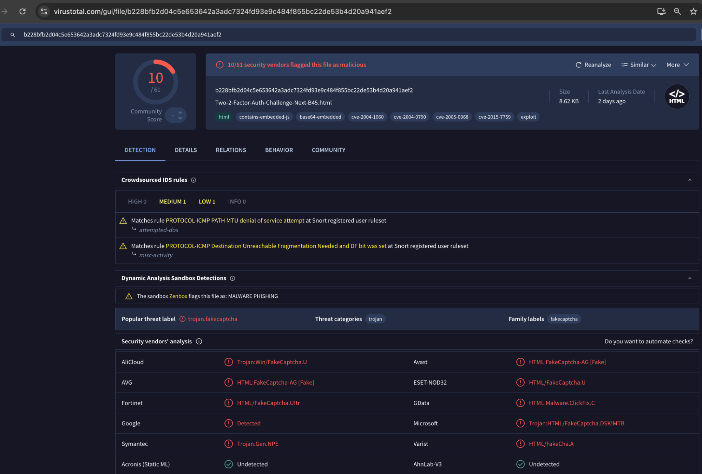
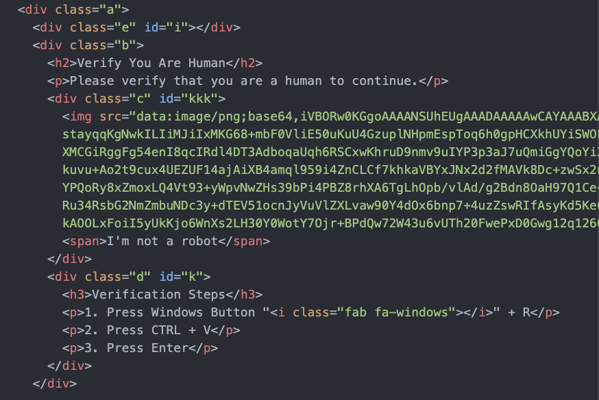
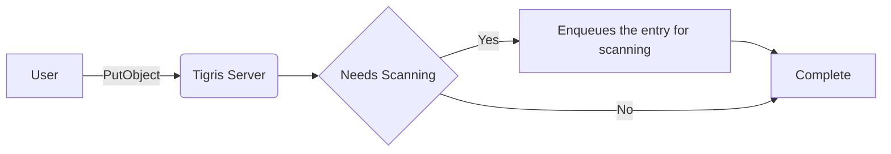
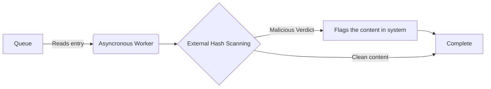

import CodeBlock from "@theme/CodeBlock";
import Tabs from "@theme/Tabs";
import TabItem from "@theme/TabItem";

import InlineCta from "@site/src/components/InlineCta";


As usage of Tigris has grown, so has the need to protect it from abuse. Tigris
is a globally distributed, multi-cloud object storage service with built-in S3
API support, and as more developers rely on it for performance and scale, we've
also seen a natural increase in attempts to misuse the platform.

{/* truncate */}

Earlier this year, a campaign dubbed
["DeceptionAds"](https://www.infostealers.com/article/deceptionads-fake-captcha-driving-infostealer-infections-and-a-glimpse-to-the-dark-side-of-internet-advertising/)
came to light, where attackers used fake CAPTCHAs hosted on trusted services to
trick users into running malicious commands. The end result: installation of the
Lumma info-stealer malware, which exfiltrates sensitive information like
passwords and financial data. The attackers used a combination of Bunny CDN (a
legitimate content delivery network) and BeMob (an ad tracking service) to
distribute and cloak their payloads - demonstrating how malicious actors
increasingly hide behind reputable infrastructure to evade detection.

In February, we identified a similar tactic being used on Tigris. Fake CAPTCHA
images were being hosted on our platform, and several threat intelligence feeds
began flagging Tigris URLs as malicious. We immediately launched an
investigation, scanned for additional indicators of compromise, and reached out
to third-party security services for more context. After verifying the abuse, we
removed the offending content and permanently banned the users behind it.

In this post, we'll walk through how we detected the scheme, the steps we took
to shut it down, and how we've strengthened our systems since then to prevent
similar abuse in the future.

## A Layered Approach to Abuse Prevention

With petabytes of data entering the platform, we have to be efficient with
scanning content. It's not trivial: a suboptimal solution could eclipse the cost
of storage by magnitudes. Not every object can be scanned on write, so modern
platforms rely on a multi-layered approach to manage risk that includes:

- Accepting abuse reports & acting on them
- Working with security vendors including researchers for fast response and
  prevention
- Reasonable scanning & prevention
- Enforcing identity verification for all users, including MFA

Not every file uploaded to the platform can reasonably be scanned, so it's
helpful to think about the larger patterns around abuse. Mainly, the bad actors
with many disposable emails and VPNs who recreate accounts and repost the same
malicious content. Requiring email verification and multifactor authentication
reduces the creation of these accounts dramatically. By leveraging our partners'
reliability systems and incorporating their user reputation score into our
considerations, we are able to prevent recurrence and ban users from the
platform entirely.

For users with a lower reputation score who upload content of a commonly
exploitable type, we flag their content for scanning in common security tooling.

We also partnered with the vendors and security researchers maintaining commonly
used Denylists and repositories of malware used in scanning. We partnered with
these vendors to ensure our monitoring caught the same issues they detected so
that we can act quickly in response to reports.

And, of course, our Terms of Service do not allow malicious content nor abuse.
We also maintain an `abuse@` email for reports and added links to our website
for reporting abusive usage.

## Types of Malicious Content

At Tigris, these are the most common types of malicious content we have
detected:

|                                             |                                                                                                                |                                                                                        |
| ------------------------------------------- | -------------------------------------------------------------------------------------------------------------- | -------------------------------------------------------------------------------------- |
| Activity                                    | MITRE ATT\&CK ID & Technique                                                                                   | Description                                                                            |
| User Executes Initial PowerShell Code       | T1566 - Phishing                                                                                               | The attack began with a phishing lure using a fake reCAPTCHA page to deceive the user. |
| Phishing via Fake CAPTCHA Page              | T1204 - User ExecutionT1059.001 - Command and Scripting Interpreter: PowerShell                                | The user was tricked into executing an initial PowerShell script.                      |
| Payload Download via mshta.exe              | T1218.005 - System Binary Proxy Execution: MshtaT1027.009 - Obfuscated Files or Information: Embedded Payloads | The script used mshta.exe to fetch a hidden script containing the payload.             |
| Obfuscated Payload Execution via PowerShell | T1059.001 - PowerShellT1027.013 - Obfuscated Files or Information: Encrypted/Encoded File                      | The payload was encrypted and executed through PowerShell.                             |
| Information Collection Activities           | T1217 - Browser Information DiscoveryT1083 - File and Directory Discovery                                      | The stealer gathered system, browser, and file information.                            |
| Data Exfiltration over C2 Channel           | T1041 - Exfiltration Over C2 Channel                                                                           | The collected data was exfiltrated through a remote C2 channel.                        |

### Example Walkthrough - Fake CAPTCHA

#### Findings

A Lumma Stealer campaign uses fake CAPTCHAs, malvertising, and new evasion
techniques to target Windows users globally. The infection chain includes
clipboard-based commands run via Windows Run, bypassing browser defenses.



<center>
  <small>
    <em>
      A fake reCAPTCHA detected by Virus Total and removed from a Tigris bucket
    </em>
  </small>
</center>

#### Sample



<center>
  <small>
    <em>HTML containing an obfuscated Javascript function</em>
  </small>
</center>
{/* truncate */}

This HTML contains an obfuscated Javascript function that looks like the
following:

import markdownChunk from "!!raw-loader!./markdownChunk.js";

<details>
  <summary>Obfuscated JavaScript function</summary>
  <CodeBlock language="js">{markdownChunk}</CodeBlock>
</details>

This function translates roughly to the code below:

```javascript
(function () {
  var encodedText = "R0cHM6Ly8ybm8uY28vMlpXNno2";
  var buttonId = "kkk";
  var classNameToAdd = "show";

  function decodeBase64(str) {
    return;
    decodeURIComponent(escape(window.atob(str)));
  }

  document.getElementById(buttonId).onclick = function () {
    var textarea = document.createElement("text" + "area");
    textarea.value = decodeBase64(encodedText);
    document.body.appendChild(textarea);
    textarea.select();
    document.execCommand("copy");
    document.body.removeChild(textarea);
    document.getElementById("i").classList.add(classNameToAdd);
    document.getElementById("k").classList.add(classNameToAdd);
    document.getElementById("ent").removeChild(textarea);
  };
})();
```

The key steps of this function are:

- Decodes a base64 string containing a likely payload (e.g., a malicious link)
- Auto-copies it to the user's clipboard using a hidden `<textarea>`.
- Modifies the DOM to show or hide elements using class changes (show class).
- Triggers on click of an element with ID kkk.
- Tricking users into running commands manually or auto-pasting payloads.

#### Obfuscated Payload Execution via PowerShell

Below HTML code is the original source:

import markdownChunk2 from "!!raw-loader!./markdownChunk2.js";

<details>
  <summary>Original source code</summary>
  <CodeBlock language="js">{markdownChunk2}</CodeBlock>
</details>

This code renders another HTML by base64 decoding this to below:

import markdownChunk3 from "!!raw-loader!./markdownChunk3.js";

<details>
  <summary>Rendered fake CAPTCHA page</summary>
  <CodeBlock language="js">{markdownChunk3}</CodeBlock>
</details>

This code does the following:

- It displays a fake "I'm not a robot" reCAPTCHA-style interface to trick the
  user into thinking they're completing a legitimate human verification step.
- When the user clicks the fake CAPTCHA button, a popup appears with
  instructions:
  - Press Windows Key + R
  - Paste something
  - Press Enter
- The JavaScript copies a hidden command (Base64-decoded PowerShell or other
  script) into the user's clipboard without their knowledge.
- The user is tricked into pasting and running the malicious command in the
  Windows Run dialog (Win + R), executing malware or giving the attacker access
  to the system.

## How we detect malicious content

Tigris uses a layered approach to malware detection that balances performance
with security. Instead of scanning every object on write, which would be
prohibitively expensive, we selectively scan content based on signals like:

- User trust score
- File type and accessibility
- Reputation of the uploading account

When a file is written to Tigris (e.g., via PutObject), our system evaluates
whether it should be flagged for malware scanning. If it meets certain criteria,
an asynchronous worker submits the file's hash to third-party malware detection
services such as Pangea Cloud and ReversingLabs.





If the content is later identified as malicious, we take immediate action:
removing the file and banning the associated account, if necessary.

## What we do when we detect malicious content

When a file is confirmed to be malicious, we act quickly to contain and prevent
further abuse. Our response includes:

- Deleting the malicious content from the platform
- Removing the associated bucket and revoking access keys
- Blocking the user's email address and preventing new signups with it
- Reporting the incident to partner security services and threat intelligence
  platforms

These steps help us limit the impact, prevent recurrence, and contribute to the
broader security ecosystem.

## Conclusion

At the scale Tigris operates, scanning every uploaded file in real time isn't
practical or efficient. Instead, we take a layered approach that balances speed,
cost, and security. We flag risky content based on file type and user
reputation, require identity verification and MFA to keep bad actors out, and
work closely with security vendors and researchers to catch threats early and
respond fast.

This approach allows us to stay ahead of abuse without compromising the speed or
reliability our users expect. By focusing on patterns—like repeat offenders
using disposable accounts—and leveraging trusted partner data, we can prevent
harm before it spreads and keep the platform safe and trustworthy for everyone.

Have questions or want to report abuse? Reach out to
[abuse@tigrisdata.com](mailto:abuse@tigrisdata.com).

<InlineCta
  title={"Infinite storage you can trust"}
  subtitle={
    "Tigris is object storage that distributes your objects around the world."
  }
  button={"Get started today!"}
/>
