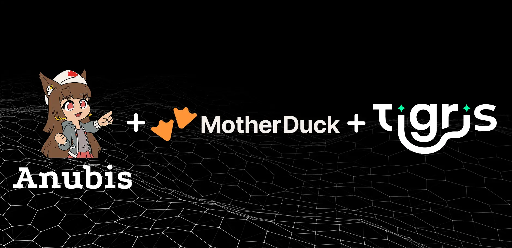
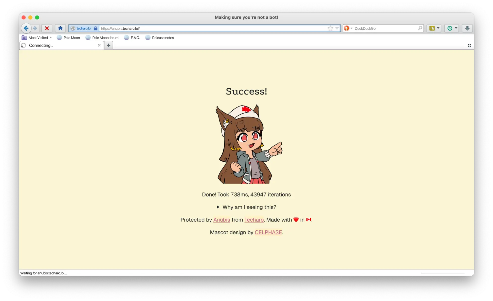

By day I work on DevRel at Tigris Data, and by night I’m
[a virtual anime person that makes software deployed by the United Nations](https://void.rehab/notes/a6tp1qqquesrjpy5).
A side project of mine took off recently, a Web AI Firewall Utility named
[Anubis](https://anubis.techaro.lol). Anubis blocks abusive scrapers from taking
out web services by asserting that clients that claim to act like browsers do,
in fact, act like browsers. As usage has grown (yes, the UN actually uses
Anubis), we’ve gotten creative about detecting bots, including setting honeypots
that give us more detailed data on their requests. These honeypot logs are sent
to Tigris, and we analyze them using DuckDB to find patterns and improve bot
detection.

In this article I'm going to be calling those abusive scrapers "AI scrapers",
but to be clear I'm not really sure if they are for training generative AI or
not. However, the worst offender has been Amazon's Alexa team so it's pretty
easy to take those two points and draw a line between them.



{/* truncate */}

At a high level, Anubis has a big old set of rules in
[your bot policy file](https://anubis.techaro.lol/docs/admin/policies). If
clients match a rule, they either get allowed through, blocked, or selected for
secondary screening. By default, Anubis is meant to instantly work by stopping
all the bleeding and letting administrators sleep without downtime alerts waking
them up. This means that it's overly paranoid and aggressively challenges
everything, similar to Cloudflare's "I'm under attack" mode.

My intent was that admins would start out with Anubis being quite paranoid and
then slowly lessen the paranoia as they find better patterns and match out ways
to do things. Users tend to use Anubis in its default configuration, but this
default configuration interferes with RSS feed readers and other "good bots".
Some users also have opinions about their privacy that lead them to disable
things like cookie storage, JavaScript execution, and other fundamental parts of
how the internet works. All of these interfere with how Anubis works.



I'd like to have Anubis throw challenges less often than it does right now, but
there are a few key problems that interfere with this:

- Anubis is open source software, a critical part of the setup. Anubis is open
  source so that adoption is easier and so that users can trust that I am not
  doing malicious things in the name of security. It’s an asset as much as it is
  a liability because it means that attackers can (and have been) studying the
  open source code in order to bypass it better.
- In order to show the challenge page less often, you need data. A lot of data.
  More specifically you need a general "shape" of what "known good" and "known
  bad" clients look like. For privacy, Anubis does not collect this data. This
  is intentional. You can look in
  [the code](https://github.com/TecharoHQ/anubis/) to confirm for yourself
  should you desire.
- Data that can be used to improve bot detection is sensitive– it can be used to
  identify individual users. Though tools like Tigris are equipped to handle
  sensitive data, me personally, I don’t want that responsibility right now.

Finally, the biggest problem is that I don’t really know how to analyze data.
I'm getting better at it, but generally if it's a bit too big for me to either
fit into a single SQLite database or excel sheet, it becomes a problem. I don’t
have an analytics team (yet), so an easy-to-use toolchain for small data seems
appropriate. Enter: DuckDB, a lightweight SQL DB that’s meant for exploratory
queries with minimal overhead.

From here the rest is just wiring things up, getting access to the data I need,
and figuring out how to analyze it.

## Everything's a big data problem

As the sacred texts have foretold:

> Given enough time, every problem becomes a big data problem.

My sites are popular, sure, but I need more data than I can get myself. After
experimentation, I set up some honeypot servers. I had a TLS terminating reverse
proxy in my [giant bag of experimental code](https://github.com/Xe/x), so I
slapped some logic on the side of it to dump information about every request to
Tigris:

- Basic request metadata (method, path, query string)
- HTTP header metadata (names and contents of HTTP headers, just in case there's
  a pattern there)
- Other connection-level metadata (TLS session details, other metadata like IP
  addresses)

I set up two honeypots: one that gets talked about, and one that does not. Both
had TLS certificates via Let's Encrypt. It’s commonly thought that AI scrapers
use the TLS certificate transparency log in order to find new targets to scrape.
To attract the AIs, I ensured that the second honeypot had a cgit server with
the source code to the Linux kernel. For some reason the AI scrapers seem to
love requesting the “git blame” route. I won’t reveal all my tricks, but rest
assured, the honeypot was loaded with AI Brawndo: it’s got what AI’s crave.

I set the trap and let it sit for a few weeks. I posted publicly about the known
server, and I kept the other a secret outside of its listing in the TLS
certificate transparency logs. I also asked ChatGPT, Gemini, Qwen, and DeepSeek
about the git server, just to see if I managed to get lucky and get them thrown
into the training dataset.

Spoiler alert: I got lucky.

## Peering at the data

In Tigris, the honeypot log data is a giant pile of `.jsonl` files. For lack of
a better idea, I named them after [UUIDv7](https://uuid7.com) values so that
alphabetic sorting would result in each file being in temporal order. I set up
[tigrisfs](https://github.com/tigrisdata/tigrisfs) on my Fedora workstation and
then started running grep to look for some patterns like what the OpenAI crawler
does. Turns out that crawler is particularly noisy:

```json
{
  "request_date": {
    "seconds": 1748104928,
    "nanos": 106832015
  },
  "response_time": {
    "nanos": 12817879
  },
  "host": "[redacted]",
  "method": "GET",
  "path": "/glibc.git/plain/locale/setlocale.c",
  "query": {
    "id": "b647f210e61ab339fbb75dd9873daf7cb8f12665"
  },
  "headers": {
    "Accept": "*/*",
    "Accept-Encoding": "gzip, br, deflate",
    "From": "gptbot(at)openai.com",
    "User-Agent": "Mozilla/5.0 AppleWebKit/537.36 (KHTML, like Gecko; compatible; GPTBot/1.2; +https://openai.com/gptbot)",
    "X-Openai-Host-Hash": "589806218",
    "X-Real-Ip": "[redacted but in an Azure ASN]"
  },
  "remote_ip": "20.171.207.44",
  "ja4": "t13d1011h2_61a7ad8aa9b6_3fcd1a44f3e3",
  "request_id": "0197032c-5b6a-7c7f-944d-8b2cfdb87258"
}
```

Other searches for `openai` got me here:

```json
{
  "request_date": {
    "seconds": 1747130654,
    "nanos": 998119913
  },
  "response_time": {
    "nanos": 3273033
  },
  "host": "[redacted]",
  "method": "GET",
  "path": "/robots.txt",
  "headers": {
    "Accept": "text/plain",
    "Accept-Encoding": "gzip, deflate, br",
    "Cache-Control": "no-cache",
    "User-Agent": "Mozilla/5.0 (Macintosh; Intel Mac OS X 10_15_7) AppleWebKit/537.36 (KHTML, like Gecko) Chrome/131.0.0.0 Safari/537.36; compatible; OAI-SearchBot/1.0; +https://openai.com/searchbot",
    "X-Envoy-Expected-Rq-Timeout-Ms": "13916",
    "X-Openai-Internal-Caller": "webcrawler-robots-txt",
    "X-Openai-Originator": "webcrawler-robots-txt",
    "X-Openai-Originator-Env": "prod",
    "X-Openai-Product-Sku": "unknown",
    "X-Openai-Traffic-Source": "user",
    "X-Real-Ip": "[redacted but in an Azure ASN]",
    "X-Request-Id": "577763b8-200d-49c4-985f-bd7cdaf1964b"
  },
  "request_id": "0196c91a-2116-71ca-8a8a-429b4b14de76",
  "response_code": 404
}
```

This is plenty of metadata to be able to write a good set of rules for OpenAI in
particular:

```yaml
- name: openai-crawler
  action: DENY
  expression:
    all:
      - userAgent.contains("https://openai.com/gptbot")
      - '"X-Openai-Host-Hash" in headers'
      - '"From" in headers'
      - headers["From"] == "gptbot(at)openai.com"

- name: openai-robots-txt-fetcher
  action: DENY
  expression:
    all:
      - userAgent.contains("OAI-SearchBot")
      - '"X-Envoy-Expected-Rq-Timeout-Ms" in headers'
      - '"X-Openai-Internal-Caller" in headers'
      - '"X-Openai-Originator" in headers'
      - '"X-Openai-Traffic-Source" in headers'
```

Or even to write a ruleset that matches clients that only partially look like
OpenAI:

```yaml
- name: challenge-sus-openai-crawler
  action: CHALLENGE
  expression:
    all:
      - userAgent.contains("https://openai.com/gptbot")
      - '!("From" in headers)'
      - '!("X-Openai-Host-Hash" in headers)'

- name: challenge-sus-openai-robots-txt-fetcher
  action: CHALLENGE
  expression:
    all:
      - userAgent.contains("OAI-SearchBot")
      - '!("X-Envoy-Expected-Rq-Timeout-Ms" in headers)'
      - '!("X-Openai-Internal-Caller" in headers)'
      - '!("X-Openai-Originator" in headers)'
      - '!("X-Openai-Traffic-Source" in headers)'
```

This should be all I need to make more educated guesses about how crawlers work
so I can make it easier for website operators to interfere with the quality of
service that the scraper bots get. In case you're wondering, here's how many
requests OpenAI has made to my server:

| openai_request_count |
| -------------------: |
|                78132 |

All of these requests account for four hours of compute time on my server.
During OpenAI's most aggressive scrape, the server crashed and rebooted because
it ran out of ram.

But as the scrapers evolve, so must my methods. I needed to dig deeper to make
more educated guesses about how crawlers work and improve detection.

## Importing the logs to MotherDuck with DuckDB

Now that I have data, how do I find patterns so that we can better detect the AI
scrapers as they evolve? I’m more of an SRE than a data analyst, but I have a
lot of experience with SQL. Normally I’d use SQLite for this because
[their documentation has the most lovely diagrams](https://sqlite.org/lang_select.html),
but SQLite has very poor support for nested data, such as HTTP headers. DuckDB
is based on SQLite but adds extensions for things like arbitrary key/value pairs
and strongly typed structures. This lets me take the JSON logs that the
honeypots produce and turn them into something I can query.

MotherDuck offers a cloud SaaS built on DuckDB that gives you a notebook,
storage, sharing, and hybrid execution across cloud and local data. The
notebooks are pretty convenient, especially if I want to have fresh data as it
gets written to Tigris. Having fresh data becomes important when I want to
analyze traffic from a machine currently experiencing a heavy volume of scraping
traffic.

Connecting your Tigris bucket o’ logs to MotherDuck is pretty simple: in your
notebook, you use your Tigris URL:

```sql
from 's3://your-tigris-bucket/path/to/data'
```

And set the endpoint to the Tigris high performance endpoint in your secret
config:

```sql
CREATE OR REPLACE SECRET tigris
  (      TYPE  s3
  ,  PROVIDER  config
  ,    REGION  'auto'
  ,  ENDPOINT  't3.storage.dev'
  , URL_STYLE  'vhost'
  );
```

It’s also pretty easy to run DuckDB locally if your data is small enough to fit
on your laptop. I’m pretty pro having the same toolchain for local development
as I do in the cloud, so that’s a little nicety.

Now that we have the data loaded into a notebook, we can take a look at those
honeypot logs. The JSON logs contains nested key-value pairs in two basic
shapes:

1. Known shapes, such as the timestamps and durations
2. Unknown shapes, such as request headers and query strings

DuckDB lets me handle both of them. Here's the SQL table I made after reading
the [DuckDB schema docs](https://duckdb.org/docs/stable/sql/data_types/overview)
and converting
[relayd’s HTTP request schema](https://github.com/Xe/x/blob/master/proto/relayd.proto)
by hand:

```sql
CREATE TABLE requests
  ( request_date      STRUCT("seconds" BIGINT, "nanos" BIGINT)
  , response_time     STRUCT(nanos BIGINT)
  , host              VARCHAR
  , "method"          VARCHAR
  , path              VARCHAR
  , headers           MAP(STRING, STRING)
  , remote_ip         VARCHAR
  , ja4               VARCHAR
  , request_id        UUID UNIQUE
  , request_protocol  VARCHAR
  , alpn              VARCHAR
  );
```

Then I imported all of the data
[through DuckDB's object storage functions](https://www.tigrisdata.com/docs/quickstarts/duckdb/#configure-duckdb-to-use-tigris):

```sql
INSERT INTO
  requests
    ( request_date  , response_time
    , host       , "method"
    , path       , headers
	  , remote_ip  , ja4
	  , request_id , request_protocol
    , alpn
	)
SELECT
  *
, CASE
    WHEN ja4 LIKE 't_______h1\_%' ESCAPE '\' THEN 'HTTP/1.1'
    WHEN ja4 LIKE 't_______h2\_%' ESCAPE '\' THEN 'HTTP/2.0'
    WHEN ja4 LIKE 'q_______h3\_%' ESCAPE '\' THEN 'HTTP/3.0'
    ELSE NULL
  END AS alpn
, CASE
    WHEN alpn IS NOT NULL THEN alpn
    ELSE 'HTTP/1.1'
  END AS request_protocol
FROM
  READ_JSON
    ( 's3://relayd-logs/halone.within.lgbt/*.jsonl'
    , columns =
      {  request_date: 'struct("seconds" bigint, "nanos" bigint)'
      , response_time: 'struct(nanos bigint)'
      ,          host: 'varchar'
      ,      "method": 'varchar'
      ,          path: 'varchar'
      ,       headers: 'map(string, string)'
      ,     remote_ip: 'varchar'
      ,           ja4: 'varchar'
      ,    request_id: 'uuid'
      }
    , format = 'nd'
    );
```

## Off to the races

Now that we have the data, we can start to look for patterns. Let’s start by
looking at patterns involved with my own browser's User-Agent string:

```sql
SELECT COUNT(DISTINCT remote_ip)
  FROM requests
  WHERE headers['User-Agent'] = 'Mozilla/5.0 (Macintosh; Intel Mac OS X 10.15; rv:138.0) Gecko/20100101 Firefox/138.0';
```

| count(DISTINCT remote_ip) |
| ------------------------: |
|                       185 |

Cool! 185 IP addresses. Let's see if there's any other things that pop up.
Here's Google Chrome hits:

```sql
SELECT headers['User-Agent'], COUNT(*) AS hits
  FROM requests
  WHERE headers['User-Agent'] LIKE '%Chrome/%'
  GROUP BY headers['User-Agent']
  HAVING COUNT(*) >= 76
  ORDER BY hits DESC;
```

| headers['User-Agent']                                                                                                 | hits |
| --------------------------------------------------------------------------------------------------------------------- | ---: |
| Mozilla/5.0 (Linux; Android 10; K) AppleWebKit/537.36 (KHTML, like Gecko) Chrome/136.0.0.0 Mobile Safari/537.36       |  325 |
| Mozilla/5.0 (Windows NT 10.0; Win64; x64) AppleWebKit/537.36 (KHTML, like Gecko) Chrome/136.0.0.0 Safari/537.36       |  179 |
| Mozilla/5.0 (X11; Linux x86_64) AppleWebKit/537.36 (KHTML, like Gecko) Chrome/136.0.0.0 Safari/537.36                 |  170 |
| Mozilla/5.0 (Linux; Android 10; K) AppleWebKit/537.36 (KHTML, like Gecko) Chrome/135.0.0.0 Mobile Safari/537.36       |  154 |
| Mozilla/5.0 (Macintosh; Intel Mac OS X 10_15_7) AppleWebKit/537.36 (KHTML, like Gecko) Chrome/135.0.0.0 Safari/537.36 |  140 |
| Mozilla/5.0 (Macintosh; Intel Mac OS X 10_15_7) AppleWebKit/537.36 (KHTML, like Gecko) Chrome/136.0.0.0 Safari/537.36 |  138 |
| Mozilla/5.0 (X11; Linux x86_64) AppleWebKit/537.36 (KHTML, like Gecko) Chrome/135.0.0.0 Safari/537.36                 |   76 |

So, let's look at a random Google Chrome for Android request:

```json
{
  "request_date": {
    "seconds": 1746331998,
    "nanos": 774116562
  },
  "response_time": {
    "nanos": 1002352
  },
  "host": "halone.within.lgbt",
  "method": "GET",
  "path": "/",
  "headers": {
    "Accept": "text/html,application/xhtml+xml,application/xml;q=0.9,image/avif,image/webp,image/apng,*/*;q=0.8,application/signed-exchange;v=b3;q=0.7",
    "Accept-Encoding": "gzip, deflate, br, zstd",
    "Accept-Language": "en-US,en;q=0.9",
    "Priority": "u=0, i",
    "Sec-Ch-Ua": "\"Chromium\";v=\"136\", \"Google Chrome\";v=\"136\", \"Not.A/Brand\";v=\"99\"",
    "Sec-Ch-Ua-Mobile": "?1",
    "Sec-Ch-Ua-Platform": "\"Android\"",
    "Sec-Fetch-Dest": "document",
    "Sec-Fetch-Mode": "navigate",
    "Sec-Fetch-Site": "cross-site",
    "Upgrade-Insecure-Requests": "1",
    "User-Agent": "Mozilla/5.0 (Linux; Android 10; K) AppleWebKit/537.36 (KHTML, like Gecko) Chrome/136.0.0.0 Mobile Safari/537.36",
    "X-Real-Ip": "[mobile phone IP]"
  },
  "remote_ip": "[mobile phone IP]",
  "ja4": "t13d1516h2_8daaf6152771_d8a2da3f94cd",
  "request_id": "0196997f-9a36-71c2-9662-6e7bf807b43d"
}
```

Something interesting about Chrome is that it sets a bunch of headers other than
the User-Agent string and you can use those headers to pretty reliably identify
Chrome.

Either way, these let you build a library of “known good” patterns so you can
build fingerprinting methods on HTTP requests. There’s prior art here in the
form of
[JA4H](https://github.com/FoxIO-LLC/ja4/blob/main/technical_details/JA4H.md),
but in testing against this dataset I didn’t have a sufficiently high match rate
against malicious clients.

## Labeling

One of the great things about this dataset is it’s all HTTP requests, which are
a well known structure with many components. Patterns of interest could be based
on the IP range the requests came from, HTTP headers, or other bits of metadata.

Every request has a unique ID, so it’s pretty easy to match requests into rules
by creating a little table:

```
CREATE TABLE rule_matches
  ( request_id TEXT
  , rule_name TEXT
  );

CREATE UNIQUE INDEX
  rule_matches_request_id_rule_name
ON
  rule_matches(request_id, rule_name);
```

And then using `INSERT INTO ... SELECT` to fill it with data:

```sql
INSERT INTO rule_matches (request_id, rule_name)
  SELECT request_id, 'chrome-without-sec-ch-ua'
  FROM requests
  WHERE headers['User-Agent'] LIKE '%Chrome/%'
    AND NOT map_contains(headers, 'Sec-Ch-Ua');

SELECT COUNT(*) FROM rule_matches WHERE rule_name='chrome-without-sec-ch-ua';
```

| count_star() |
| -----------: |
|          267 |

```sql
INSERT INTO rule_matches (request_id, rule_name)
  SELECT request_id, 'generic-browser'
  FROM requests
  WHERE headers['User-Agent'] LIKE '%Mozilla/%'
    OR headers['User-Agent'] LIKE '%Opera/%';

select COUNT(*) from rule_matches where rule_name='generic-browser';
```

| count_star() |
| -----------: |
|        86143 |

I’ve converted over a lot of the other
[core/stdlib request matchers](https://github.com/TecharoHQ/anubis/tree/main/data)
and have found that they seem to work well against this dataset.

## Conclusion

Though this starter dataset is much smaller than ram, as I collect more data,
I’ll be more confident in the patterns I find. I’m working on an Ingress
Controller named [hythlodaeus](https://git.xeserv.us/Techaro/hythlodaeus) that
helps my homelab and production clusters collect a filtered version of this
request metadata. Then I can import that data into duckdb, find more patterns,
and refine my filtering logic. I’d like to try having webhooks

As AI Scrapers evolve, Anubis has to stay a couple steps ahead by spotting new
patterns in the data. Lightweight tools like Tigris and DuckDB make it easy to
query data and ultimately make the internet a better place by stopping bots.
