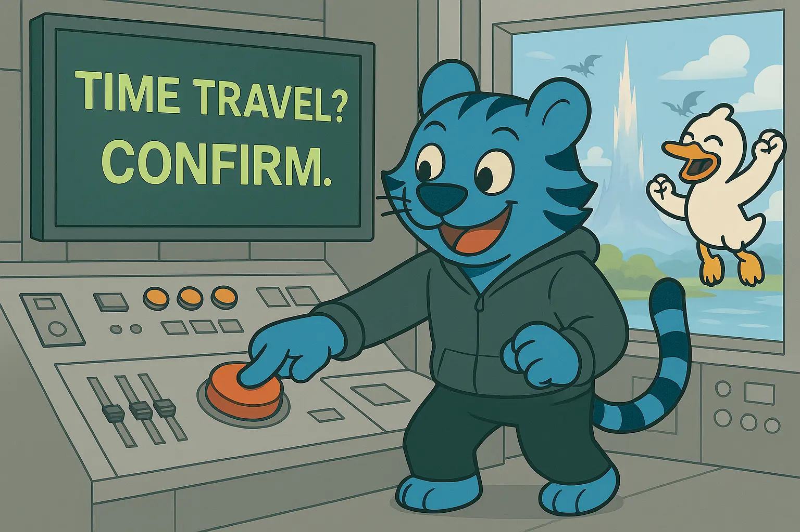

import InlineCta from "@site/src/components/InlineCta";



You’ve got your tunes in high gear, your editor is open, and you’re working on
recreating some database tables with your AI agent in an epic duo. Your AI agent
says “run this SQL query?” and you click yes. The tests pass, you make PR that’s
quickly stamped and merged, when suddenly your pager goes off. And again. And
again. You’ve just broken the analytics database and everything is on fire. What
do you do?

{/* truncate */}

If you’re using most database engines, this is a priority zero “stop the world
and restore from backups” shaped problem. This is especially annoying with
analytics databases because many times those databases aren’t just bigger than
ram, they’re bigger than your local disk, and sometimes even bigger than any
disk in any computer can ever be. But further, if your AI starts renaming
columns or combining data in interesting ways, it can be quite the mess to
untangle, even impossible. In such cases, this is an XK-class end-of-the-project
scenario, which is triple-plus ungood.

However, you read
[our last post on Ducklake](https://www.tigrisdata.com/blog/ducklake/) and have
been storing your analytics data in Tigris so you can get that sweet, sweet
global performance. How do you go back to the past where everything Just Worked?
Turns out it’s easy, no DeLorean required. All you have to do is reset the
timeline with a couple simple commands.

## Ducklake and you

[Ducklake](https://ducklake.select/) is an analytics data lakehouse that lets
you import SQL and NoSQL data so you can run SQL queries on it. One of the
really cool parts about Ducklake is that when you do any INSERT or DELETE into
Ducklake tables, you create a new snapshot of the database that you can roll
back to. Ducklake turns your SQL database into an append-only-log.

As an example, let’s create a Ducklake database backed by Tigris, insert some
data and see what happens. First,
[install DuckDB](https://duckdb.org/docs/installation/) and then set up the
Ducklake extension:

```sql
INSTALL ducklake;
LOAD ducklake;
```

Then attach to a new Ducklake database in Tigris:

```sql
ATTACH 'ducklake:timetravel_demo.ddb'
AS delorean
  ( DATA_PATH 's3://xe-ducklake/delorean'
  );
```

Note: This creates the Ducklake metadata on the local filesystem which is fine
for demos like this, but for production use we suggest putting your Ducklake
metadata in the cloud with a Postgres database or
[one of the other backends Ducklake supports](https://ducklake.select/docs/stable/duckdb/usage/choosing_a_catalog_database).

Now that we have the database, let’s create a simple table and throw some data
in it:

```sql
CREATE TABLE IF NOT EXISTS delorean.youtube_videos
  ( id TEXT NOT NULL PRIMARY KEY
  , title TEXT NOT NULL
  , channel TEXT NOT NULL
  );

INSERT INTO delorean.youtube_videos
  ( id, title, channel )
VALUES
  ( 'WcSCYzI2peM', 'Delfino Plaza (Super Mario Sunshine) - Mario Kart World', 'SiIvaGunner' )
, ( 'W4AcveHnDzg', 'Retribution for the Eternal Night ~ Imperishable Night (Beta Mix) - Touhou 8: Imperishable Night', 'SiIvaGunner' );
```

Awesome, let’s see what the bucket looks like:

```text
$ aws s3 ls s3://xe-ducklake/delorean/main/youtube_videos/
2025-06-25 10:28:34       1175 ducklake-0197a77d-905b-7624-8e32-c80c69470e52.parquet
```

Interesting, Ducklake created a parquet file named after the table we inserted
the data into, let’s see what it looks like:

```sql
FROM 's3://xe-ducklake/delorean/main/youtube_videos/ducklake-0197a77d-905b-7624-8e32-c80c69470e52.parquet';
```

| id          | title                                                                                            | channel     |
| ----------- | ------------------------------------------------------------------------------------------------ | ----------- |
| WcSCYzI2peM | Delfino Plaza (Super Mario Sunshine) - Mario Kart World                                          | SiIvaGunner |
| W4AcveHnDzg | Retribution for the Eternal Night ~ Imperishable Night (Beta Mix) - Touhou 8: Imperishable Night | SiIvaGunner |

This is the key to how Ducklake works. Every time you write to one of its
tables, it puts those rows you added into a parquet file in object storage.
Let’s see the changes we made to the `delorean` database:

```sql
FROM ducklake_snapshots('delorean');
```

| snapshot_id | snapshot_time              | schema_version | changes                                  |
| ----------: | -------------------------- | -------------: | ---------------------------------------- |
|           0 | 2025-06-25 10:19:32.897-04 |              0 | `{schemas_created=[main]}`               |
|           1 | 2025-06-25 10:27:33.45-04  |              1 | `{tables_created=[main.youtube_videos]}` |
|           2 | 2025-06-25 10:27:40.828-04 |              2 | `{tables_dropped=[1]}`                   |
|           3 | 2025-06-25 10:27:45.229-04 |              3 | `{tables_created=[main.youtube_videos]}` |
|           4 | 2025-06-25 10:28:33.497-04 |              3 | `{tables_inserted_into=[2]}`             |

The first change is creating the `main` schema, and then you can see that while
I was working on this article I made the `youtube_videos` table, messed up the
schema, dropped it, recreated it, and then inserted information about
[epic tunes](https://youtu.be/W4AcveHnDzg) into the table. To really show off
this time travel power though, let’s delete the data and then add other data
into the mix:

```sql
DELETE FROM delorean.youtube_videos;

INSERT INTO delorean.youtube_videos
  ( id, title, channel )
VALUES
  ( 'jhl5afLEKdo', 'Hatsune Miku World is Mine / ryo（supercell)', 'Hatsune Miku' )
, ( 'sqK-jh4TDXo', 'Machine Love (feat. Kasane Teto)', 'Jamie Page' );
```

So what happened to the database? Here’s what the table looks like now:

```sql
SELECT * FROM delorean.youtube_videos;
```

| id          | title                                        | channel      |
| ----------- | -------------------------------------------- | ------------ |
| jhl5afLEKdo | Hatsune Miku World is Mine / ryo（supercell) | Hatsune Miku |
| sqK-jh4TDXo | Machine Love (feat. Kasane Teto)             | Jamie Page   |

But if you look in the bucket, the old data is still there:

```sql
FROM 's3://xe-ducklake/delorean/main/youtube_videos/*.parquet';
```

| id          | title                                                                                            | channel      |
| ----------- | ------------------------------------------------------------------------------------------------ | ------------ |
| WcSCYzI2peM | Delfino Plaza (Super Mario Sunshine) - Mario Kart World                                          | SiIvaGunner  |
| W4AcveHnDzg | Retribution for the Eternal Night ~ Imperishable Night (Beta Mix) - Touhou 8: Imperishable Night | SiIvaGunner  |
| jhl5afLEKdo | Hatsune Miku World is Mine / ryo（supercell)                                                     | Hatsune Miku |
| sqK-jh4TDXo | Machine Love (feat. Kasane Teto)                                                                 | Jamie Page   |

How do you get the old data back? Well for one, we can time travel _directly in
SQL queries_\! Let’s look at the database snapshots again and try to figure out
what happened:

```sql
FROM ducklake_snapshots('delorean');
```

| snapshot_id | snapshot_time              | schema_version | changes                      |
| ----------: | -------------------------- | -------------: | ---------------------------- |
|           4 | 2025-06-25 10:28:33.497-04 |              3 | `{tables_inserted_into=[2]}` |
|           5 | 2025-06-25 10:38:19.959-04 |              3 | `{tables_deleted_from=[2]}`  |
|           6 | 2025-06-25 10:41:48.455-04 |              3 | `{tables_inserted_into=[2]}` |

So it looks like the table was added to in snapshot 4, the data was deleted in
snapshot 5, and the new data comes in at snapshot 6\. Let’s get the superset of
the data at snapshot 4 AND snapshot 6:

```sql
SELECT * FROM delorean.youtube_videos AT (VERSION => 4)
UNION ALL
SELECT * FROM delorean.youtube_videos AT (VERSION => 6)
```

| id          | title                                                                                            | channel      |
| ----------- | ------------------------------------------------------------------------------------------------ | ------------ |
| WcSCYzI2peM | Delfino Plaza (Super Mario Sunshine) - Mario Kart World                                          | SiIvaGunner  |
| W4AcveHnDzg | Retribution for the Eternal Night ~ Imperishable Night (Beta Mix) - Touhou 8: Imperishable Night | SiIvaGunner  |
| jhl5afLEKdo | Hatsune Miku World is Mine / ryo（supercell)                                                     | Hatsune Miku |
| sqK-jh4TDXo | Machine Love (feat. Kasane Teto)                                                                 | Jamie Page   |

You can see the power here right? The data is still safely stored in your
bucket, so deletes _don’t matter_. It may be more inconvenient to access the
data, but you can also time travel for _the entire database at once_:

```sql
ATTACH 'ducklake:timetravel_demo.ddb'
AS delorean_past
  ( DATA_PATH 's3://xe-ducklake/delorean'
  , SNAPSHOT_VERSION 4
  );

SELECT * FROM delorean_past.youtube_videos;
```

| id          | title                                                                                            | channel     |
| ----------- | ------------------------------------------------------------------------------------------------ | ----------- |
| WcSCYzI2peM | Delfino Plaza (Super Mario Sunshine) - Mario Kart World                                          | SiIvaGunner |
| W4AcveHnDzg | Retribution for the Eternal Night ~ Imperishable Night (Beta Mix) - Touhou 8: Imperishable Night | SiIvaGunner |

## Advanced temporal mechanics

You’re not limited to just running queries against the past, you can also
connect to the database at a given point in time. This combined with making a
local fork of the database lets you get into _advanced_ temporal mechanics.

Let’s make a local copy of the database to debug the AI agent’s changes. Connect
to the database in the past before the AI model messed things up:

```sql
ATTACH 'ducklake:timetravel_demo.ddb'
AS delorean_past
  ( DATA_PATH 's3://xe-ducklake/delorean'
  , SNAPSHOT_VERSION 4
  );
```

Cool, then let’s make a local copy of it at that point in time:

```sql
ATTACH 'ducklake:timetravel_local_copy.ddb'
AS local_delorean
    ( DATA_PATH 's3://xe-ducklake/delorean'
    );

COPY FROM DATABASE delorean TO local_delorean;
DETACH delorean;
DETACH local_delorean;
```

The magic part of that is the `COPY FROM DATABASE` instruction. That makes a
copy of the database locally so you can debug the AI agent’s change and prevent
a future timeline from coming to pass the way the current one did. Then for the
cherry on top, attach the local database with the same name as the remote one so
that your agent is none the wiser:

```sql
ATTACH 'ducklake:timetravel_local_copy.ddb'
AS delorean
    ( DATA_PATH 's3://xe-ducklake/delorean'
    );
```

Et voila\! We have successfully forked the timeline and can now make any change
we want without affecting the main timeline. Test it by running a SQL query:

```sql
SELECT * FROM delorean.youtube_videos
```

| id          | title                                                                                            | channel     |
| ----------- | ------------------------------------------------------------------------------------------------ | ----------- |
| WcSCYzI2peM | Delfino Plaza (Super Mario Sunshine) - Mario Kart World                                          | SiIvaGunner |
| W4AcveHnDzg | Retribution for the Eternal Night ~ Imperishable Night (Beta Mix) - Touhou 8: Imperishable Night | SiIvaGunner |

The really cool part is that we did all that _without_ affecting the data in
Tigris:

```sql
SELECT * FROM 's3://xe-ducklake/delorean/main/youtube_videos/*.parquet';
```

| id          | title                                                                                            | channel      |
| ----------- | ------------------------------------------------------------------------------------------------ | ------------ |
| WcSCYzI2peM | Delfino Plaza (Super Mario Sunshine) - Mario Kart World                                          | SiIvaGunner  |
| W4AcveHnDzg | Retribution for the Eternal Night ~ Imperishable Night (Beta Mix) - Touhou 8: Imperishable Night | SiIvaGunner  |
| jhl5afLEKdo | Hatsune Miku World is Mine / ryo（supercell)                                                     | Hatsune Miku |
| sqK-jh4TDXo | Machine Love (feat. Kasane Teto)                                                                 | Jamie Page   |

When we made a copy of the data lake to hack on locally, all we were copying was
the schemata of the database and references to objects in Tigris. At some level,
the tables don’t logically exist, they’re really just a bunch of rules and
references that Ducklake uses to rebuild your database on the fly\! And because
the tables quack like SQL tables enough, the illusion is maintained\!

Another really cool thing is that every INSERT or UPDATE operation results in
discrete parquet files being put into Tigris:

```text
$ aws s3 ls s3://xe-ducklake/delorean/main/youtube_videos/
2025-06-25 10:28:34       1175 ducklake-0197a77d-905b-7624-8e32-c80c69470e52.parquet
2025-06-25 10:41:49        975 ducklake-0197a789-b1b2-797e-8bd5-a20905d2d73f.parquet
```

These parquet files are written to once and NEVER updated. This means that as
your analytics pipelines or developers all over the world access things, they’re
automatically fast and local thanks to Tigris’ global performance.

## Victory achieved\!

Now you can turn your analytics pipeline back on and go on with hacking up a
storm. Next time you do those changes with your AI agent though, make sure to
test them against a backup of the data lake just in case things go pear-shaped
again. Ensure your AI isn’t renaming columns, deleting tables, changing the
structure, etc. Ideally your schema changes should only add columns and never
remove them. Your database tables should be treated as a public API.

To make a local backup of your data lake so your agent can break whatever the
tokens deem worthy without breaking prod:

```sql
ATTACH 'ducklake:timetravel_local_copy.ddb'
AS local_delorean
    ( DATA_PATH 's3://xe-ducklake/delorean'
    );

COPY FROM DATABASE delorean TO local_delorean;
DETACH delorean;
DETACH local_delorean;

ATTACH 'ducklake:timetravel_local_copy.ddb'
AS delorean
    ( DATA_PATH 's3://xe-ducklake/delorean'
    );
```

And to attach to Ducklake in read-only mode so that it can’t break anything if
it wanted to:

```sql
ATTACH 'ducklake:timetravel_demo.ddb'
AS stone_tablet
  ( DATA_PATH 's3://xe-ducklake/delorean'
  , READ_ONLY -- <- attaches the ducklake database in read-only mode
  );
```

And then you can go back to fearless vibe coding to make your dreams come true
in the form of B2B SaaS\! All your data will be safe in the cloud and fast to
load anywhere in the world, even if you need to time travel a bit to get things
working again.

<InlineCta
  title={"Analytics databases with time travel!"}
  subtitle={
    "Tigris lets you store your data everywhere, including your analytics data. When you use Tigris and Ducklake together, you get global performance to rival the cloud giants at a fraction of the cost. Query data from the past to bring you to a better future!"
  }
  button={"Make my data everywhere!"}
/>
