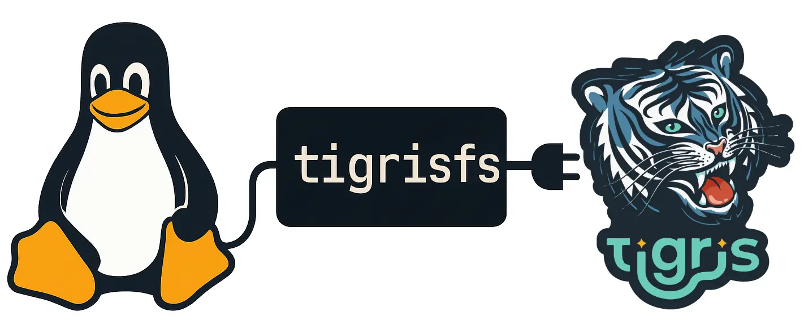

import Conv from "@site/src/components/Conv";
import InlineCta from "@site/src/components/InlineCta";
import Tabs from "@theme/Tabs";
import TabItem from "@theme/TabItem";

import ovais from "@site/static/img/avatars/ovais.jpg";

export const Ovais = ({ children, top, bottom }) => (
  <Conv
    name="Ovais Tariq"
    title="CEO @ Tigris Data"
    profilePic={ovais}
    top={top}
    bottom={bottom}
  >
    {children}
  </Conv>
);


At Tigris we put your big data close to your compute so you don't have to do it
yourself. However, there's been a small problem with that: most of the programs
that are built to process that data such as AI training, document indexing, and
other kinds of workloads expect to read data from a filesystem.

Not to mention, big data means big data. Bigger than ram. Bigger than your disk.
Bigger than any one machine can have on any amount of disks. Sometimes even
bigger than human minds can imagine. What if that data was as easy to access as
your code folder, but had unlimited storage?

{/* truncate */}

We're proud to announce the immediate availability of
[tigrisfs](https://github.com/tigrisdata/tigrisfs), the native filesystem
interface for Tigris. This lets you mount Tigris buckets to your laptops,
desktops, and servers so you can use data in your buckets as if it was local.
This bridges the gap between the cloud and your machine.

<Ovais top bottom>
  Internally, tigrisfs is a fork of
  [geesefs](https://github.com/yandex-cloud/geesefs), another project that
  converts object storage buckets into mountable storage. geesefs has good
  performance and makes it easy to access the same bucket from the S3 API and
  the filesystem without obfuscating object names like juicefs. We have extended
  geesefs to leverage Tigris-specific features that improve throughput and
  latency. With tigrisfs you can use the S3 API or the filesystem
  interchangeably without having to worry about name mangling. tigrisfs is the
  canonical filesystem implementation for Tigris.
</Ovais>

## Your data: everywhere

Let's imagine that you have big data in your stack. Not just big, but
_unimaginably big_, we're talking about data the size of Wikipedia, the entire
Linux Kernel Mailing List archives, and the entire git history for all the big
open source projects. Not to mention small datasets like every scientific paper
from arxiv. tigrisfs lets you mount the same dataset in the same place on every
machine in your cluster. Imagine just reading from
`/mnt/tigris/datasets/raw/lkml`, processing the data around a bit, and then
writing it to `/mnt/tigris/datasets/massaged/lkml` for the downstream analysis
to run. We'll go into more detail about this in the near future, keep an eye out
for that!

The really cool part about this is that it lets you have a global filesystem on
your local machine. All your data is just there and waiting to be used. If you
write that massaged dataset to `/mnt/tigris/datasets/massaged/lkml` on one
machine, it's instantly available to any other machine in the cluster. Any time
it's used, it'll be seamlessly cached on the device so that it's hot'n'ready for
action! It's like having a ReadWriteMany Kubernetes volume, but without having
to set up Ceph.

| Dataset Type                                                  | Examples                                                                                                                                           |
| ------------------------------------------------------------- | -------------------------------------------------------------------------------------------------------------------------------------------------- |
| Bigger than any one machine can hold with any number of disks | Wikipedia, Linux Kernel Mailing List archives, entire git history for all big open source projects, and every book published in the last 100 years |
| Bigger than any one disk                                      | The entire YouTube upload history of your favorite creator                                                                                         |
| Smaller than RAM                                              | Every scientific paper from arXiv                                                                                                                  |

If you're dealing with anything bigger than ram, tigrisfs is a great fit.

One of the neat parts about tigrisfs is that using it means you can deal with
your files using either the S3 API or the filesystem API. This is in contrast to
other tools like JuiceFS which break files into blocks and obfuscate the
filenames, meaning you need to spend time and energy reverse-engineering how the
block → data mapping works. With tigrisfs you can `PUT` an object into your
bucket with the S3 API, and then open the file in your favorite text editor.
This unlocks any number of fun integrations, including:

- Using `inotifywait` to process data as it's created in a bucket by your
  analytics pipeline
- Backing up your home folder with `rsync` in a cronjob
- Using tools like `gzcat` to read compressed data without having to decompress
  it
- Storing TLS certificates across the cluster so that one machine can renew it,
  and it'll roll out to the rest of the machines instantly
- Reading your training datasets directly from disk instead of having to set up
  object storage with the datasets library
- Reading a raw video out of one bucket and compressing it for global
  distribution into another bucket using `ffmpeg`

Let's say you want to edit your secret plans in your Linux VM on your MacBook.
First, upload it to Tigris with `aws s3 cp`:

```text
$ aws s3 cp secretplans.txt s3://pitohui
upload: ./secretplans.txt to s3://pitohui/secretplans.txt
```

Then you can view it like normal with the shell:

```text
xe@pitohui:~ $ cat /mnt/tigris/pitohui/secretplans.txt
- world domination via the use of hypnodrones
- make there be such a thing as a free lunch
- create more paperclips
```

And now you can do whatever you want\! You can even do backups of your home
folder with a single command:

```text
xe@pitohui:~ $ rsync -av ~ /mnt/tigris/pitohui
```

The cloud's the limit\!

## Getting started with tigrisfs

If you want to get started, all you need is an aarch64/x86_64 Linux system, a
Tigris bucket, and a keypair.

### Installing tigrisfs

#### One-liner install

This will install the latest version of tigrisfs and its dependencies.

```sh
curl -sSL https://raw.githubusercontent.com/tigrisdata/tigrisfs/refs/heads/main/install.sh | bash
```

#### Or, install using package manager

If you're using a package manager, you can install tigrisfs by following the
instructions below.

- Download the package from
  [the most recent release](https://github.com/tigrisdata/tigrisfs/releases)
- Install the package using your package manager
  - Debian/Ubuntu: `sudo apt install ./tigrisfs-version.deb`
  - Alma Linux/Fedora/Red Hat/Rocky Linux:
    `sudo dnf install ./tigrisfs-version.rpm`

### Mounting the filesystem

We are going to assume that you have a bucket called `pitohui` and you want to
mount it to `/mnt/tigris/pitohui`.

Open `/etc/default/tigrisfs` in your favorite text editor as root and uncomment
the `AWS_ACCESS_KEY` and `AWS_SECRET_ACCESS_KEY` variables and paste in the
access key you got from the Tigris dashboard.

<Tabs>
<TabItem value="cli" label="Using the command line" default>

First, create the directory you want to mount the bucket to:

```sh
mkdir -p /mnt/tigris/pitohui
```

Then mount the bucket:

```sh
tigrisfs pitohui /mnt/tigris/pitohui
```

</TabItem>
<TabItem value="systemd" label="Using systemd">

If you're in an environment with `systemd`, mount your bucket with
`systemctl enable --now`:

```text
sudo systemctl enable --now tigrisfs@pitohui.service
```

Your bucket will be available at `/mnt/tigris/pitohui`. If you need things to be
writable by your user account, edit the `OPTS` line based on your account's
information. For example on my MacBook's Oracle Linux VM:

```text
$ id
uid=1000(xe) gid=1000(xe) groups=1000(xe),10(wheel) context=unconfined_u:unconfined_r:unconfined_t:s0-s0:c0.c1023
```

My user id (uid) is `1000` and my group id (gid) is `1000`, so to give my user
permissions, I need this `OPTS` line:

```text
# Mount options
OPTS="-o allow_other --gid=1000 --uid=1000"
```

</TabItem>
</Tabs>

This gives me permission to do whatever I want such as touching grass:

```sh
$ touch /mnt/tigris/pitohui/grass
$ stat /mnt/tigris/pitohui/grass
  File: /mnt/tigris/pitohui/grass
  Size: 0           	Blocks: 0      	IO Block: 4096   regular empty file
Device: 80h/128d    	Inode: 1631    	Links: 1
Access: (0644/-rw-r--r--)  Uid: ( 1000/ 	 xe)   Gid: ( 1000/ 	xe)
Context: system_u:object_r:fusefs_t:s0
Access: 2025-04-07 20:15:07.549222957 +0000
Modify: 2025-04-07 20:15:07.549222957 +0000
Change: 2025-04-07 20:15:07.549222957 +0000
 Birth: -
```

And make sure it exists in Tigris:

```text
$ aws s3 ls s3://pitohui | grep grass
2025-04-07 16:15:07      	0 grass
```

Perfect\!

If you are looking to crank up performance, there are a few configuration
options that you can tweak. Take a look at the
[documentation](https://www.tigrisdata.com/docs/training/tigrisfs/#maximizing-performance)
for more details.

## Under the hood

tigrisfs is a fork of [geesefs](https://github.com/yandex-cloud/geesefs), a high
performance FUSE filesystem adaptor for object storage. We have extended geesefs
to leverage Tigris-specific features that improve throughput and latency.

tigrisfs is a high performance FUSE filesystem adaptor for object storage based
on [geesefs](https://github.com/yandex-cloud/geesefs), which is a fork of
[goofys](https://github.com/kahing/goofys). GeeseFS solves performance problems
which FUSE file systems based on S3 typically have, especially with small files
and metadata operations. It solves these problems by using aggressive
parallelism and asynchrony.

### Improvements over GeeseFS

Our initial release zeroed-in on hardening the codebase for production, focusing
on two areas:

- **Security hardening**
  - Replaced the bundled, legacy AWS SDK that contained known CVEs
  - Upgraded every dependency to its latest secure version
- **Reliability upgrades**
  - Eliminated all race conditions flagged by the Go race detector (now
    mandatory in tests)
  - Fixed every linter warning and added lint checks to CI
  - Dramatically expanded the test-suite and made the extended tests a default
    part of CI

### Tigris-specific improvements

We also shipped a few features that lean on Tigris internals:

- **POSIX semantics** - permissions, special files, and symlinks now behave just
  like they do on a local disk.
- **Turbo-charged small files** - listing a directory automatically
  batch-fetches and caches tiny objects in a single round-trip.
- **Smart prefetch** - directory listings kick off background fetches so the
  next `cat` or `grep` feels instant.

In essence, tigrisfs bridges the gap between the Linux kernel and Tigris. It
translates filesystem calls into S3 API calls so that you can explore your
bucket with the shell and bridge the gap between the old world of servers and
shells with the new world of dynamic infinity in the cloud.



### Benchmarks

Benchmarking filesystems is kind of annoying, and networked filesystems can be
even more annoying to benchmark. Most of the time, you end up making a lot of
assumptions about the system state and network configuration. Here are the specs
of our benchmarking machine:

| Component         | Quantity                           |
| ----------------- | ---------------------------------- |
| Instance type     | VM.Standard.E5.Flex (Oracle Cloud) |
| CPU cores         | 24                                 |
| Memory            | 24 gigabytes (24Gi)                |
| Network bandwidth | 24 gigabits per second             |

Our benchmarks are done with the
[flexible i/o tester fio](https://github.com/axboe/fio). Note that we are using
direct I/O to avoid [page caching](https://en.wikipedia.org/wiki/Page_cache)
being an issue.

#### Read performance

Here is the command we used to test read performance on a bucket:

```sh
fio --name=read_throughput \
    --directory=/mnt/test-tigrisfs-bucket \
    --numjobs=4 \
    --size=4G \
    --time_based \
    --runtime=120s \
    --ramp_time=2s \
    --ioengine=libaio \
    --direct=1 \
    --verify=0 \
    --bs=1M \
    --iodepth=1 \
    --rw=read \
    --group_reporting=1
```

This has fio run for 2 minutes with 2 seconds of ramp-up time (during which, the
results are not counted in the statistics) trying to read up to 4 gigabytes of
data per thread (job) in one megabyte blocks. This reads a total of 16 gigabytes
of data. The test was run in permutations of thread count and block size to see
if the limitations are on tigrisfs, the Tigris service, and the network card of
the machine.

And we got these results for each permutation of the test:

| Threads | Block Size | Throughput (MiB/sec) |
| ------- | ---------- | -------------------- |
| 4       | 1M         | 1630                 |
| 4       | 4M         | 2446                 |
| 8       | 1M         | 2802 \*              |
| 8       | 4M         | 2732 \*              |

:::note

The throughput numbers with the asterisk next to them could theoretically be
faster, but at this point we saturated out the network card on the test machine.

:::

#### Write performance

Here is the command we used to test write performance:

```
fio --name=write_throughput \
    --directory=/mnt/test-tigrisfs-bucket \
    --numjobs=8 \
    --size=4G \
    --time_based \
    --runtime=120s \
    --ramp_time=2s \
    --ioengine=libaio \
    --direct=1 \
    --verify=0 \
    --bs=4M \
    --iodepth=1 \
    --rw=write \
    --group_reporting=1
```

This has fio run for 2 minutes with 2 seconds of ramp-up time (during which the
results are not counted in the statistics) trying to write up to 4 gigabytes of
data per thread (job) in four-megabyte blocks. This writes a total of 16
gigabytes of data. The test was run in permutations of thread count and block
size to see if the limitations are on tigrisfs, the Tigris service, and the
network card of the machine.

And we got these results for each permutation of the test:

| Threads | Block Size | Throughput (MiB/sec) |
| ------- | ---------- | -------------------- |
| 4       | 1M         | 1118                 |
| 4       | 4M         | 1119                 |
| 8       | 1M         | 1269                 |
| 8       | 4M         | 1279                 |

Needless to say, this represents being able to read and write multiple DVDs of
data per second per machine with tigrisfs. This combined with the caching that
tigrisfs uses means that it should be more than sufficient for anything you can
throw at it.

## When should I use tigrisfs?

| Feature                  | TigrisFS | S3 API |
| ------------------------ | -------- | ------ |
| Legacy Tool Integration  | ✅       | ❌     |
| Direct Filesystem Access | ✅       | ❌     |
| On-Demand File Fetching  | ✅       | ❌     |
| AI Model Training        | ✅       | ✅     |
| Global Performance       | ✅       | ✅     |

Personally, I use tigrisfs all the time on my own machines. One of the main
things I use it for is running
[analytics across honeypot logs](https://www.tigrisdata.com/blog/anubis/) so
that I can fight off evil scrapers and save the internet.

In general, tigrisfs can be slower than the native disk for files that aren't
cached yet, but it more than makes up for it by allowing you to make the
location of your files irrelevant. All you need to do is run tigrisfs, and you
have a single global namespace for your data across all your machines.

tigrisfs is written in Go and is
[open source on GitHub](https://github.com/tigrisdata/tigrisfs). We welcome any
and all contributions to make it even better\!
