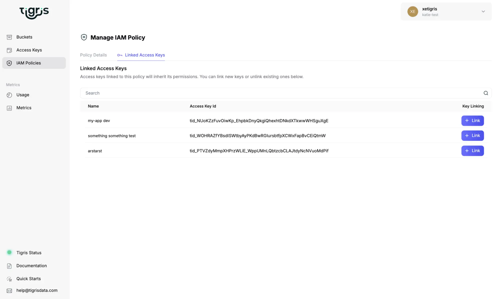

import ErrorSquiggles from "@site/src/components/ErrorSquiggle";
import PostEmbed from "@site/src/components/PostEmbed";


We made IAM you can’t hate. Simplified permissions, an easy way to list access
keys attached to a given policy, and a VSCode style editor experience that feels
like your local development environment: all in our new IAM Policy Builder in
the Tigris Console.

{/* truncate */}

<video controls width="100%">
  <source
    src="/blog/img/blog/iam-policy-builder/iam-editor-demo.mp4"
    type="video/mp4"
  />
  Download the <a href="/blog/img/blog/iam-policy-builder/iam-editor-demo.mp4">
    MP4
  </a> version.
</video>

It should be a code smell that there are
[several](https://github.com/iann0036/iamlive)
[tools](https://docs.aws.amazon.com/IAM/latest/UserGuide/access-analyzer-policy-generation.html)
for constructing
[least privilege policies](https://en.wikipedia.org/wiki/Principle_of_least_privilege),
all of which require you to have overprivileged entities and then cut back
privileges, rather than making a least privilege policy from the start. I can
personally list eight different ways to give access to an S3 bucket; there may
be more. Why is it so hard to do the right thing?

The feedback loop of IAM policy development leads to even Senior Engineers :™:
having reactions like this:

<PostEmbed
  link="https://x.com/glcst/status/1909957508682129883"
  userId="glcst"
  username="Glauber Costa"
  imageUrl="https://pbs.twimg.com/profile_images/1278683104178089985/gWWT4dja_400x400.jpg"
  timestamp="2025-04-09T09:12:00Z"
>
  If one had to properly configure AWS IAM roles to get into Heaven, everyone
  would be in Hell.
</PostEmbed>

<div style={{ margin: "2rem" }} />

<PostEmbed
  link="https://bsky.app/profile/cr3ative.co.uk/post/3ltpfm2hsq22w"
  userId="cr3ative.co.uk"
  username="Paul Curry"
  imageUrl="https://cdn.bsky.app/img/avatar/plain/did:plc:p7vrqbxhgykgi4kulow7u7uk/bafkreihing2lp5pxwyhgwmm42mrwcxuav2frkfhul7y2qviokbwiyyjiqu@jpeg"
  timestamp="2025-07-11T13:46:00-04:00"
>
  Sorry, you don’t have permission to do this.
</PostEmbed>

<div style={{ margin: "2rem" }} />

<PostEmbed
  link="https://triangletoot.party/@donaldball/114857960806541467"
  userId="donaldball@triangletoot.party"
  username="Donald Ball"
  imageUrl="https://cdn.masto.host/triangletootparty/accounts/avatars/109/286/587/209/265/115/original/a1f582456e91272e.jpeg"
  timestamp="2025-07-15T11:29:00-04:00"
>
  user, role, permission, policy, policy document, resource – these entities are
  poorly defined and either more or less complex than they need to be, haven’t
  decided which. The explosion of permission names and the laughable practice of
  using wildcard matching in policies suggests that bit is in desperate need of
  simplification, perhaps by decomposing permissions into a tuple of entity type
  and a tight set of action verbs.
</PostEmbed>

<div style={{ marginTop: "2rem" }} />

How do you simplify IAM whilst maintaining a strong security posture? We started
by removing two of the easiest to misuse components: IAM Users and IAM Roles. On
Tigris, you’re a member of an organization, but that’s as far as “users” go. You
don’t assume roles to get temporary credentials that you then need to refresh in
the middle of longer running jobs. We don’t have compute instances, so we don’t
need instance profiles for policy attachments to access your data from an
instance. It’s only access keys with policy attachments. That’s the beauty of
using a product that does one thing, and does it well.

“But static keys will get leaked and my data ransomed\!” What you really want to
do is ensure that a given access key has only enough permissions to get its job
done for a given amount of time and no more. And then that key loses access
automatically. It doesn’t have to be so complex, truly.

## Example: Running a Training Job on a Newer Cloud Provider

A Suspicious Person :™: in a trench coat shuffles past you on the streets of San
Francisco and surreptitiously looks you up and down, sees the wad of computer
cables poking from your backpack, and pulls you aside: “GPUs for 35 cents an
hour?” They whip open their trench coat and dazzle you with a full selection of
cloud prices so cheap you swear that they’re a front for the mafia. But you work
at a startup, and runway is runway. How can you take advantage of these low, low
prices without exposing yourself to hackery and leakery?

Do you load your data into their storage? Surely not, if they even have storage.
You don’t want anything especially long-lived on those trench-coat GPUs, and you
certainly don’t want to initially overprovision access to then cut down to least
privilege. It should be tightly scoped from the start: mint access keys with
minimum permissions to do the job, then delete them when you’re done.

So we do that: your training job on those absurdly affordable GPUs gets
permission to:

- Read only access to one dataset so that the job cannot modify any datasets in
  use by other jobs
- Read only access to the base model collection so that the job can’t corrupt
  any of your models
- Write only access to the finetuned model collection so that all the job can do
  when it’s done is submit its work

If an access key with these permissions is leaked, your attack surface is still
quite small: your precious finetuned models are safe. The one dataset allocated
to the job and base model collection can be read, but not altered. Other jobs
are unaffected. Let’s take a look at building such a policy for your training
job in the new IAM Policy Builder, and adding a time based restriction:

<video controls width="100%">
  <source
    src="/blog/img/blog/iam-policy-builder/training-job-demo.mp4"
    type="video/mp4"
  />
  Download the <a href="/blog/img/blog/iam-policy-builder/training-job-demo.mp4">
    MP4
  </a> version.
</video>

And here’s the policy JSON for that:

```json
{
  "Version": "2012-10-17",
  "Statement": [
    {
      "Sid": "WikipediaReadOnly",
      "Effect": "Allow",
      "Action": ["s3:GetObject", "s3:ListBucket"],
      "Resource": [
        "arn:aws:s3:::contoso-training-datasets-wikipedia-2025-07-01",
        "arn:aws:s3:::contoso-training-datasets-wikipedia-2025-07-01/*"
      ]
    },
    {
      "Sid": "BaseModelsReadOnly",
      "Effect": "Allow",
      "Action": ["s3:GetObject", "s3:ListBucket"],
      "Resource": [
        "arn:aws:s3:::contoso-base-models",
        "arn:aws:s3:::contoso-base-models/*"
      ]
    },
    {
      "Sid": "FinetunedModelsWrite",
      "Effect": "Allow",
      "Action": [
        "s3:GetObject",
        "s3:ListBucket",
        "s3:PutObject",
        "s3:PutObjectAcl",
        "s3:AbortMultipartUpload",
        "s3:ListMultipartUploadParts",
        "s3:CompleteMultipartUpload"
      ],
      "Resource": [
        "arn:aws:s3:::contoso-finetuned-models",
        "arn:aws:s3:::contoso-finetuned-models/*"
      ]
    }
  ]
}
```

When you make policies in our editor, you can use other policies as a starting
point so that you don’t have to summon each statement into existence with sheer
might of your left click button. We even give you some of the creature comforts
that you get in your editor of choice: <ErrorSquiggles>error
squiggles</ErrorSquiggles> to let you know when something is wrong, syntax
highlighting so you can visually distinguish the brackets, and schema validation
so you can’t create a policy that doesn’t work.

Imagine this same situation, but with the AWS IAM structure.

And even in correctly and fully implementing this complex process, there’s still
inconsistencies that can bite back: tags based on policies on iam:PassRole are
known to be unreliable. Complex doesn’t always mean secure.

## Burying the Lede: Linked Access Keys

Being able to build policies with a combination of JSON and button clicking is
nice, but we’re burying the lede here: we added something you cannot easily do
in other storage providers. On Tigris, you can list all the access keys that
have a given policy attached. Then if you do have a key leak or want to
investigate the permissions of keys you found on some vintage cron job, it’s all
there in the Dashboard.



This is nontrivial to assemble on other platforms due to the overhead involved
with IAM Roles and IAM Users. It’s possible but not the most pleasant. In case
you need it, here’s the incantation for AWS:

```sh
POLICY_ARN="arn:aws:iam::123456789012:policy/YourPolicyName"

for user in $(aws iam list-entities-for-policy \
    --policy-arn "$POLICY_ARN" \
    --query 'PolicyUsers[].UserName' --output text); do
  echo "User: $user"
  aws iam list-access-keys --user-name "$user" \
    --query 'AccessKeyMetadata[].AccessKeyId' --output text
done
```

This really helps when your production environment looks like this:


## Conclusion

IAM doesn’t have to be hellish; it can be just as good as your local development
setup. Tigris’ IAM Policy Builder blends a tile based GUI with a VSCode like
editor experience to give you the best of both worlds. You can start with a
pasted example policy, customize it, and know what you’re writing actually
works. Give it a try, we’re sure that you’ll come to learn to love IAM in a way
you never have before.
