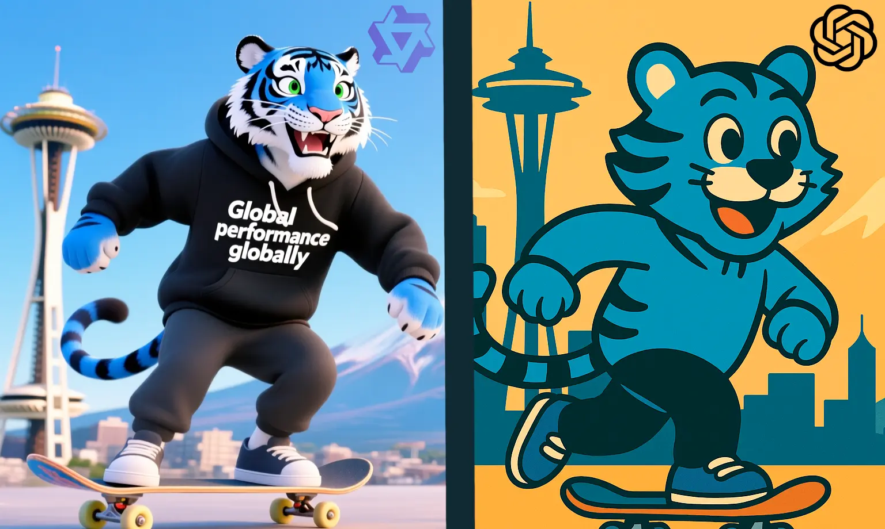
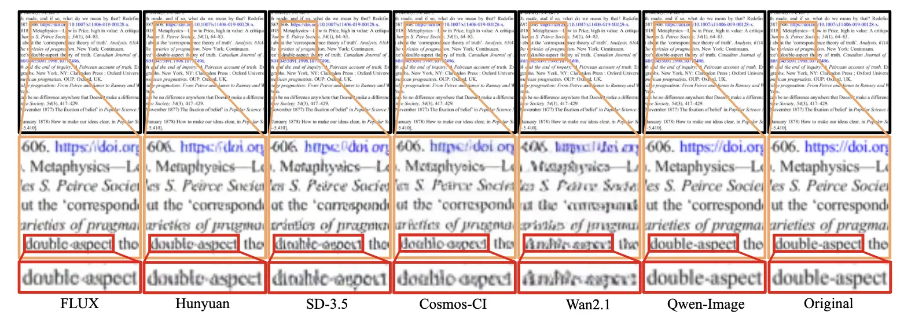
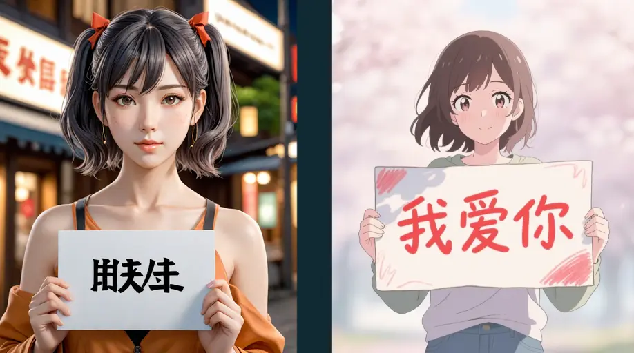
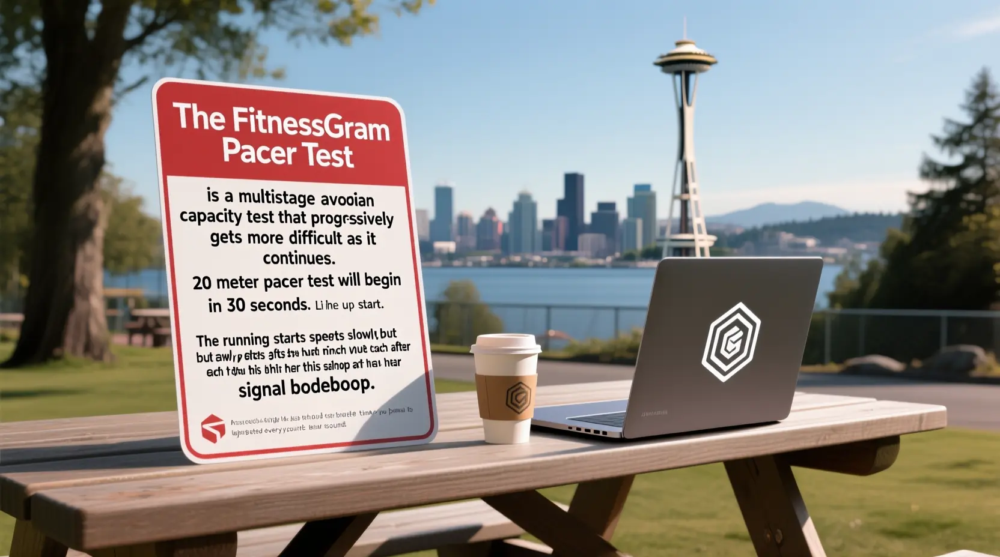
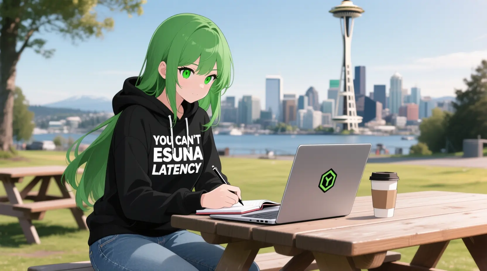
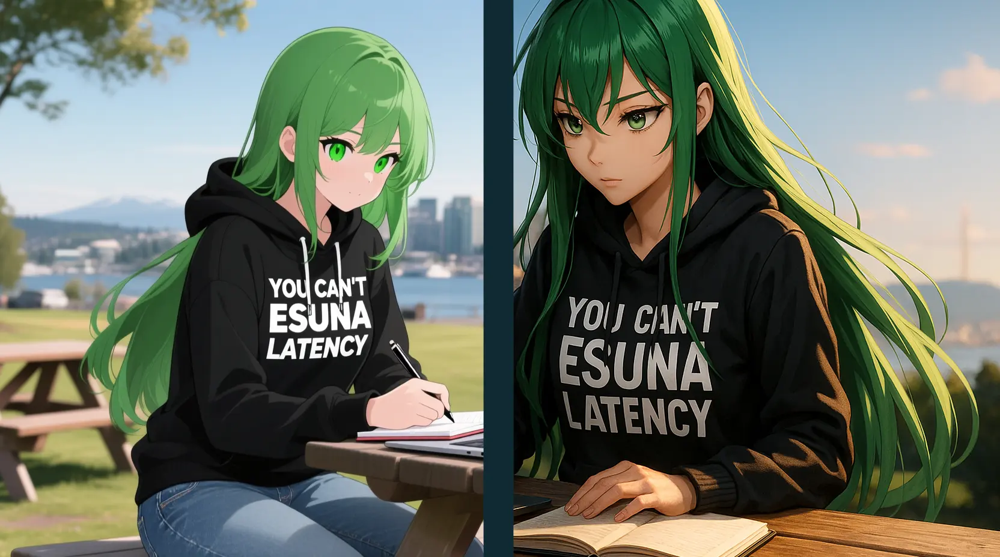

import InlineCta from "@site/src/components/InlineCta";

<style>
  {`@media (min-width: 1536px) {
  img:not(.hero-image) {
    max-width: 48rem; /* 3xl equivalent */
  }
}

.hero-image {
  margin-bottom: 1rem;
}

p:not(:has(img)) {
  max-width: 42rem; /* 2xl equivalent */
  margin-left: auto;
  margin-right: auto;
}

h2, h3, h4, h5, h6, blockquote, .theme-admonition {
  max-width: 42rem; 
  margin-left: auto;
  margin-right: auto;
}

.theme-code-block {
  max-width: 48rem; /* 3xl equivalent */
  margin-left: auto;
  margin-right: auto;
}

table {
  max-width: 42rem; /* 4xl equivalent - wider for tables */
  margin-left: auto;
  margin-right: auto;
  width: 100%;
  border-collapse: collapse;
}

td, th {
  padding: 0.75rem;
  text-align: left;
}

img:not(.hero-image) {
  margin-left: auto;
  margin-right: auto;
  display: block;
}`}
</style>

import heroimage from "./cover-plasticine.webp";


This week Alibaba released
[Qwen Image](https://qwenlm.github.io/blog/qwen-image/), an open-weights
(Apache 2) model that claims to support image editing that can match a described
style, and better support for generating text. All while fitting into a chat
experience. I took a day to experiment with the new model by generating our
mascot, Ty. It went… well, you can compare the main image here to our other blog
posts.



I read the paper so you don’t have to, and I have a take.

{/* truncate */}

## Introduction

I've been messing around with image generation models since Stable Diffusion v1
was released in 2022\. I like to keep up with the latest models even though I'm
not using image generation models on my own blog anymore. I generate most of the
illustrations on the Tigris blog, and I've settled on this cheerful pseudo-manga
style that is flexible enough to generate reliably. One of the main downsides
with this style is that it heavily relies on
[gpt-image-1](https://openai.com/index/image-generation-api/) with multimodal
inputs, a closed model that I can’t run myself.

I wanted to like Qwen Image: improved text rendering and the claim of a
conversational editing flow usually means I can’t run the models myself. But
with Qwen, I can do it on my own hardware privately. However, the images just
weren’t consistent stylistically, even with consistent prompting. And checking
their [Hugging Face page](https://huggingface.co/Qwen/models), the image editing
features were nowhere to be found.

To rub salt in the wound, in
[the Qwen Image paper](https://qianwen-res.oss-cn-beijing.aliyuncs.com/Qwen-Image/Qwen_Image.pdf),
they claim:

> We further train a multi-task version of Qwen-Image for image editing (TI2I)
> tasks, seamlessly integrating both text and image as conditioning inputs.

(Section 5.2.3: Performance of Image Editing, bottom of page 23)

I understand that there’s a race to announce new features before competing
models, but I believe in actually testing out new tools before I have an
opinion. I would love to try Google’s
[new world simulation model](https://deepmind.google/discover/blog/genie-3-a-new-frontier-for-world-models/),
too. However:

> We believe Genie 3 is a significant moment for world models, where they will
> begin to have an impact on many areas of both AI research and generative
> media. To that end, we're exploring how we can make Genie 3 available to
> additional testers in the future.

This is PR speak for “you’re never going to see this in a product.”

All I can say is: it’s cool AI tech is moving so fast. But without actually
trying these features out myself, I truly don’t know how fast it’s actually
going.

Before we get into the meat of how Qwen Image performs in my testing, let’s go
over how diffusion models work just so we're on the same page.

## How diffusion models work

Diffusion models are a kabbalistic miracle of math. At the core, they’re just
incredibly advanced denoising systems, formally known as Denoising Diffusion
Probabilistic Models (DDPMs), e.g. Stable Diffusion and DALLE-2.

During training, the model is shown hundreds of millions of images paired with
text descriptions. To teach it how to "clean up" noisy images, we intentionally
add random noise to each training image. The model’s job is to learn how to
reverse it using the text prompt as a guide for where and how to remove the
noise.

When you generate an image, the model performs this process in reverse. It
starts with a latent space of pure random noise and gradually subtracts more and
more noise with each diffusion step. It's synthesizing an image from scratch by
removing all of the noise until the image remains, organizing the chaos into
whatever you asked it to generate.

I think this is much easier to explain visually, so here’s an animation of each
diffusion phase of Qwen Image generating Ty riding a skateboard:

<center style={{ marginBottom: "2rem" }}></center>

Each frame in that GIF shows a separate de-noising step. You can see the noise
gradually get removed as the image is unearthed from the chaos. I don’t really
know how to describe why this is intellectually cool to me– it’s like you’re
uncovering order from chaos.

Another cool thing you can do is an “image to image” flow by shoving an existing
image into the latent space in place of the randomly generated noise. This is
yet another mathematical miracle which allows you to generate images matching
the style of another image.

Either way, the model is effectively synthesizing the image one pixel at a time
and removing noise one component at a time. This works great for illustrations,
scenery, and wallpapers; but the model doesn't handle text properly because it's
going for pixel patterns instead of internally consistent symbols. This works
great for our blog illustrations, but it means I have to add the text in after
the fact instead of it being a fundamental component of the image. It'd be great
if a model could just solve text rendering for me.

## Qwen Image claims to have solved text rendering

One of the biggest weaknesses of open weights AI models is rendering text. Text
is surprisingly complicated and bad AI text examples can be found all over the
internet. This is bad enough for languages like English, but even worse for
logographic languages like Chinese. One of my test prompts for this is a sign
that says "我爱你" (I love you). Those characters are some of the most common in
the Chinese language, so I’d expect them to be well represented in the training
set.

Qwen claims to excel at “complex text rendering, including multi-line layouts,
paragraph-level semantics, and fine-grained details.” In the paper, they compare
the generation of text in a flat document, but how does it fare in more complex
scenarios?



Fig 17, Qwen paper

## Complex text rendering

Prompt: An anime woman holding a sign that says "我爱你" (I love you in
Simplified Chinese) -- Left side is Stable Diffusion XL, right side is Qwen
Image



This is night and day better, almost to a ridiculous level.

### Paragraph-level semantics

However it falls apart when you ask it to emit a longer paragraph, such as the
intro to the FitnessGram Pacer Test:



<details>
<summary>How it should read</summary>

The FitnessGram Pacer Test is a multistage aerobic capacity test that
progressively gets more difficult as it continues. The 20 meter pacer test will
begin in 30 seconds. Line up at the start. The running speed starts slowly but
gets faster each minute after you hear this signal _bodeboop_. A single lap
should be completed every time you hear this sound.

</details>

This also works with less common English words like "esuna" (an RPG spell that
dispels temporary status effects like poison, paralysis, or sleep):

Prompt: A green-haired anime woman with long hair and green eyes wearing a black
hoodie with "YOU CAN'T ESUNA LATENCY" in bold white letters. She is also wearing
denim jeans. She is sitting at a picnic table outside in Seattle with a coffee
next to her laptop. The laptop has a hexagonal logo on it. digital art,
cinematic lighting, highly detailed, 4k, focused, looking at laptop, writing in
notebook, space needle visible in distance. – Qwen Image



This looks…fine? The text is curved, but not draped. The multiline layout is
pretty good.

:::note

In case you can’t see it, the pull string in the “U” of “YOU” is partially
merged into the right side of the letter. The same is happening with the “N” in
“CAN’T”. It’s like the objects aren’t being separated cleanly. I’m sorry for
telling you about this because you are undoubtedly never going to be able to
unsee this.

:::

It falls apart when you make things more complicated such as adapting my email
signature onto the hoodie. It misses a line entirely:


It should read something like:

```
.iko snura .iko kanro
.iko panpi .iko gleki
```

Which is the main set of instructions for
[Loving-kindness (Metta) meditation](https://when-then-zen.christine.website/meditation/metta)
translated into Lojban, targeted at the reader. It’s intended as a blessing to
end the communication with.

Compare it to
[gpt-image-1](https://chatgpt.com/share/6893b930-56bc-8006-9a83-ff6e2ad29456),
and you can see which wins out with the fine grained details:



Maybe this is just an outlier and it gets better if you do a bunch of
iterations. For funsies, these images are in a mix of Chinese and English, in a
context models seem to struggle with, a person holding a sign:

Prompt: An anime woman holding a sign that says "我爱你" or "I love you"

import Carousel from "@site/src/components/Carousel";
import slide1 from "./carousel-1.webp";
import slide2 from "./carousel-2.webp";
import slide3 from "./carousel-3.webp";
import slide4 from "./carousel-4.webp";
import slide5 from "./carousel-5.webp";
import slide6 from "./carousel-6.webp";
import slide7 from "./carousel-7.webp";
import slide8 from "./carousel-8.webp";

export function CarouselDemo() {
  return (
    <>
      <Carousel>
        
        
        
        
        
        
        
        
      </Carousel>
    </>
  );
}

<CarouselDemo />
<div style={{ marginBottom: "1rem" }} />

Each of them looks like it's the same font photoshopped into the image. It's
kinda bizarre. The text is at least at the right rotation relative to where the
sign is, but something just looks…off.

Let's take a look at
[the paper](https://qianwen-res.oss-cn-beijing.aliyuncs.com/Qwen-Image/Qwen_Image.pdf)
and see what it has to say about its training data. Skip to section 3.4 "Data
Synthesis":

> Given the long-tail distribution of textual content in real-world images,
> particularly for non-Latin languages such as Chinese, where numerous
> characters exhibit extremely low frequency, relying solely on naturally
> occurring text is insufficient to ensure adequate exposure to these rare
> characters during model training. To address this challenge and improve the
> robustness of text rendering across diverse contexts, we propose a multi-stage
> text-aware image synthesis pipeline. This pipeline integrates three
> complementary strategies: Pure Rendering, Compositional Rendering, and Complex
> Rendering. The details of each strategy are elaborated below.

Oh, that's why it looks like the text was photoshopped in: that's how they
assembled the training data\! They just photoshopped a bunch of text in a few
fonts onto a bunch of reference images and then made all their GPUs rotate
shapes in a loop until the model could render text reliably. I’m skeptical that
this is a good idea. In the short term it does result in gain of functionality
like we see with Qwen Image, but in the long term this can cause significant
damage to future models due to
[model collapse](https://www.nature.com/articles/s41586-024-07566-y) as models
are trained off of AI generated output.

To be clear, using synthetic data does make sense from their perspective.
Logographic languages like Chinese have
[literally tens of thousands of characters](https://studycli.org/chinese-characters/number-of-characters-in-chinese/)
(Taiwan's dictionary tracks at least 106,000), but most people will never need
to use more than about 15,000 for daily life. Among those, the most commonly
used ones (你 "you", 我 "I/me", 是 "is", etc.) will follow
[Zipf's law](https://en.wikipedia.org/wiki/Zipf%27s_law) and be way more present
in any dataset than the less commonly used ones (爨, "the stove").

Prompt: An anime woman holding a sign that says "爨", Qwen Image


Okay, that was unfair, I found that character by looking at the bottom of the
most used list of Chinese characters.

They also went out of their way to make sure that their synthetic data met
quality standards:

> To ensure high-quality synthesized samples, a rigorous quality control
> mechanism is employed: if any character within a paragraph cannot be rendered
> due to limitations (e.g., font unavailability or rendering errors), the entire
> paragraph is discarded. This strict filtering guarantees that only fully valid
> and legible samples are included in the training dataset, thereby maintaining
> high fidelity in character-level text rendering.

They really did make text rendering better, but at the cost that all the text
just looks "samey". I'm sure it can be polished out with some post-training,
finetuning, or LoRA adapter models, but the text is just in that uncanny valley
that makes people think it's badly photoshopped in.

## So how does Qwen Image Stack up?

|                                         | Qwen Image     | gpt-image-1           |
| :-------------------------------------- | :------------- | :-------------------- |
| Image editing                           | ❌             | ✅                    |
| Style consistency across generations    | ❌             | ✅                    |
| Text synthesis                          | ✅             | ✅                    |
| High resolution output                  | ✅             | ✅                    |
| Open weights (run on your own hardware) | ✅             | ❌                    |
| Fine grained details                    | ✅             | ✅                    |
| Paragraphs of text                      | ✅ (sometimes) | ✅ (most of the time) |

## Conclusion

The best part about Qwen Image is the fact that it's licensed with Apache 2, so
you can fine tune it yourself with pretty darn good results.

I'm going to keep an eye on the local image diffusion model community to see if
anyone manages to fix a lot of these issues and on the Qwen blog in case they do
actually release the image editing model.
