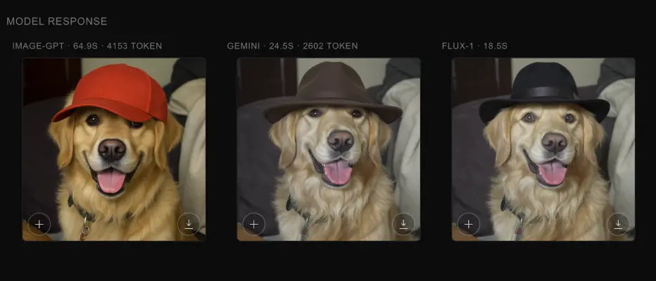
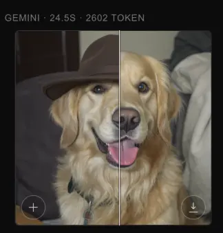
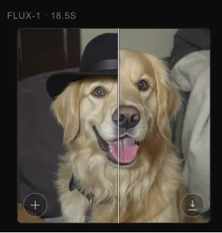

import PostEmbed from "@site/src/components/PostEmbed";
import InlineCta from "@site/src/components/InlineCta";
import heroPoster from "./flux-kontext-vs-nano-banana.webp";

<video
  className="hero-image"
  controls
  autoPlay
  playsInline
  loop
  muted
  poster={heroPoster}
>
  <source src={require("./demo.mp4").default} type="video/mp4" />
</video>

Long ago the GPU supply chains existed in harmony. Then, everything changed once
GPT 4o image generation landed and the “Ghiblify” trend happened. I have since
somewhat stopped seeing my Twitter (it’ll always be Twitter to me) feed flooded
with as many Ghibli-styled AI generated images, but one thing is certain, image
models have changed the way we think about image content.

:::note

In this post I’m calling these models “image models”, but they are actually
complex multi-modal models that are really good at image generation and editing.

:::

<PostEmbed
  link="https://x.com/sama/status/1905296867145154688"
  userId="sama"
  username="Sam Altman"
  title="CEO @ OpenAI"
  imageUrl="https://pbs.twimg.com/profile_images/1904933748015255552/k43GMz63_400x400.jpg"
  timestamp="2025-03-27T08:32:00Z"
>
    it's super fun seeing people love images in chatgpt.

    but our GPUs are melting.

    we are going to temporarily introduce some rate limits while we work on making it more efficient. hopefully won't be long!

    chatgpt free tier will get 3 generations per day soon.

</PostEmbed>

We're excited about multi-modal and image models, not just because our blog
covers are generated, but because many Tigris customers use us to store and
distribute generative media like images and video. From ideation and
storyboarding to post-processing and editing, image models have become
indispensable tools in the creative process.

Since the Ghibli moment, several companies such as Black Forest Labs, Google and
Alibaba have released state-of-art after state-of-the art models, with the most
recent being Gemini 2.5 Flash Image a.k.a Nano Banana. Which begs the question:
which of these models should you use? That’s why we published
[image-models.dev](https://image-models.dev), an app for you to compare image
models’ generation and editing capabilities. For now, we’ve picked the following
models: gpt-image-1, gemini-2.5-flash-image-preview and flux-kontext-pro.

{/* truncate */}

<InlineCta
  title="Try image-models.dev"
  subtitle={
    <>
      Try image-models.dev and let us know if there are other models you want to
      see us add..
    </>
  }
  button="Try Image Models Dev now"
  link="https://www.image-models.dev"
/>

{/* truncate */}

## TLDR;

I’ve been personally playing with these models for quite some time. Here’s what
I’ve learned so you can make your image generations better.

### 1. Generations quality and prompt adherence

It’s challenging to objectively measure generations' quality. In my attempt, I
test a complex prompt to assess both the image quality and the ability of the
model to follow detailed instructions. Here is the prompt:

```bash
Render a single 4K photoreal scene of a rainy neon alley at dusk reflected in a transparent glass teapot on a checkerboard marble table as a left hand in a teal knit sleeve places a translucent origami crane beside it; include motion-blurred cyclist in the alley, precise refraction/caustics on the table, perfectly legible 8-pt bilingual signage reading “Bonjour” and “مرحبا”, and place EXACTLY 7 red lanterns and 3 blue umbrellas with hard top-left shadows, correct perspective, and no object interpenetration.
```

Output:

| gpt-image-1                | gemini-2.5-flash-image-preview     | flux-kontext-pro            |
| -------------------------- | ---------------------------------- | --------------------------- |
|  |  |  |

All generations look quite good in my opinion. They all render the teapot along
with the origami and include the cyclist in the background. However when it
comes to the details, each of the models have kept and omitted a few details.
For example, nano-banana managed to add the “Bonjour” sign, and even if it has
written what it looks like Arabic letters, none of them display “مرحبا”.
gpt-image-1 and nano-banana both display the red lanterns and 3 blue umbrellas
but gpt-image-1 displays 7 red lanterns and 3 blue umbrellas like mentioned in
the prompt, while nano-banana fails to get the details partially right with 3
blue umbrellas and 2 red lanterns.

Although all generations are of high quality, gpt-image-1 seems to be better at
capturing the details of the prompt, so it logically wins this round.

### 2. Speed and cost

When it comes to the speed of the generations, flux-kontext-pro is the fastest
with an average generation of 7 sec, but only a few seconds faster than
nano-banana with an average generation time of 9 sec. gpt-image-1 is 5-6 times
slower than the two other models, but as we have seen above, the attention to
detail probably requires more compute resources and processing time.

Cost wise, while gpt-image-1 and nano-banana generations are respectively $40
and $30 per 1 million token, `flux-kontext-pro`’s pricing is very simple (and
cheap): $0.04 per generation and edit.

In my experiments, `gpt-image-1` and `nano-banana` averaged outputs are
respectively about 4000 and 2000 tokens. However, for edits, both models charge
for input text and images.

For example, editing a 2000 token image will cost approximately $0.2 using
`gpt-image-1` and $0.34 using `nano-banana`.



`flux-kontext-pro` wins this round since it’s both fast and cheap, but with the
slightest of margins against nano-banana, while `gpt-image-1` ‘s pricing remains
competitive but trails far behind in speed.

### 3. Image preservation

You can see below that `flux-kontext-pro` and `nano-banana` are extremely good
at image editing with a very high image preservation and are almost a
replacement to traditional image editing tools, while `gpt-image-1` does a
decent job at editing images.


| gpt-image-1                | nano-banana                  | flux-kontext-pro      |
| -------------------------- | ---------------------------- | --------------------- |
|  |  |  |

**Overall comparison**

<div style={{marginRight:"auto", marginLeft: "auto", justifyContent: "center"}}>

| Metric               | `gpt-image-1` | `nano-banana` | `flux-kontext-pro` |
| -------------------- | ------------- | ------------- | ------------------ |
| Attention to details | High          | Medium        | Medium             |
| Speed                | Low           | High          | High               |
| Cost per generation  | $0.16         | $0.039        | $0.04              |
| Cost per edit        | $0.2          | $0.339        | $0.04              |
| Image preservation   | Low           | High          | High               |

</div>

## Conclusion

Overall, flux-kontext-pro fits most use cases. It’s fast with high preservation
for image editing, as a predictable cost. It’s also accessible via BFL’s
playground or the API.

nano-banana comes as “very” close second, with high speed generations and image
preservation. You can use the model via the Google’s AI Studio. However,
accessing the API requires a few more steps and Google Cloud project.

Finally, gpt-image-1 is probably the most widely used since it’s accessible via
ChatGPT, and a good candidate if you need strict prompt adherence and tricky
compositional details. However, it’s slower and pricier per result, but it nails
the specs more reliably.

If you want to reproduce or challenge these results, try the prompts in
image-models.dev, lock seeds, and measure against your own constraints
(fidelity, latency budgets, and cost per accepted asset).

Tell me which models you want next and I’ll add them to the bench.
