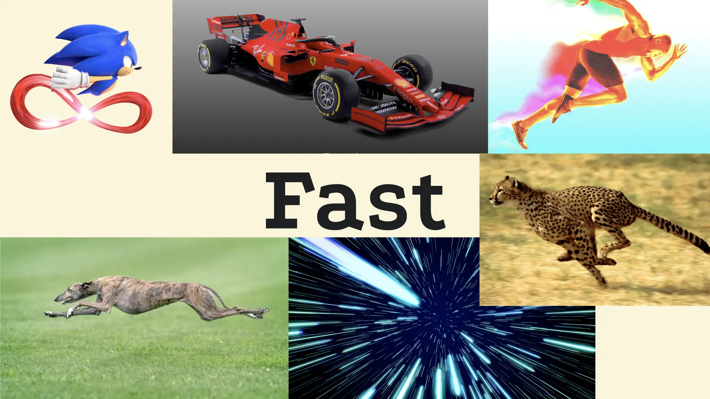
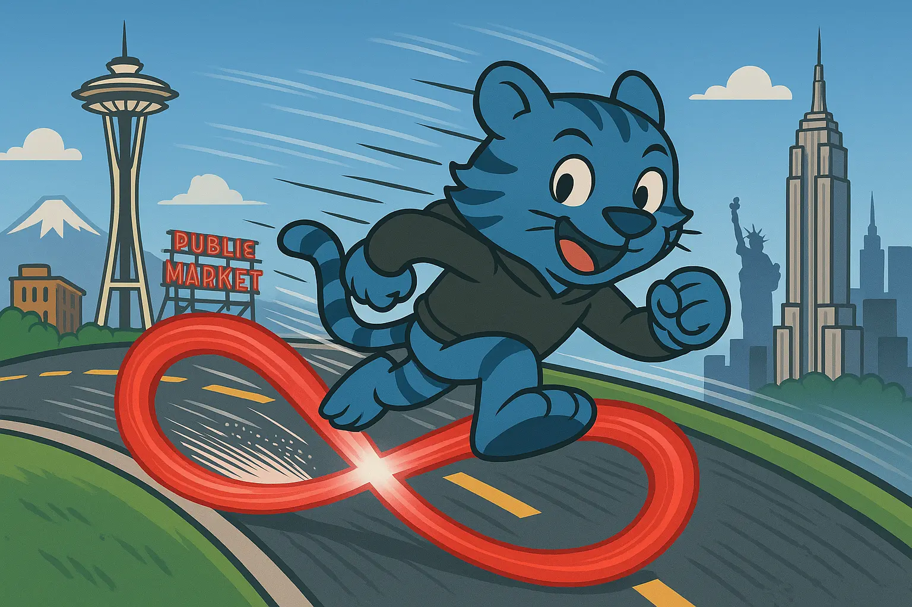
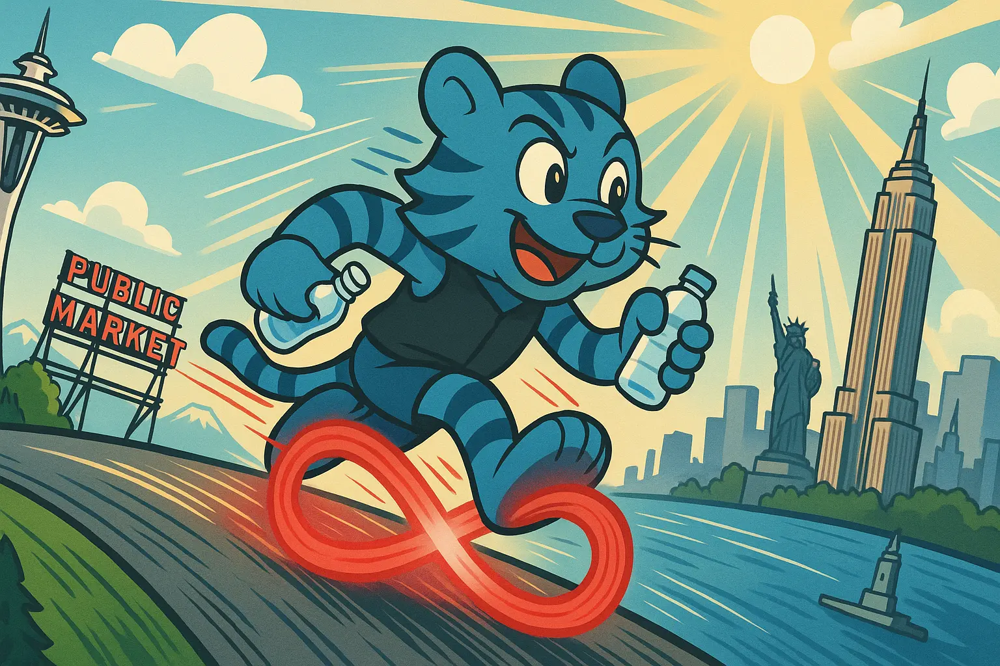

import InlineCta from "@site/src/components/InlineCta";
import PostEmbed from "@site/src/components/PostEmbed";

import heroimage from "./recursion.webp";
import styles from "!!raw-loader!./styles.css";

  <small>
    <em>
      A blue tiger drawing a picture of a blue tiger drawing a picture of a blue
      tiger ad infinitum.
    </em>
  </small>

One of the biggest things you can do for Search Engine Optimization on your blog
is to write well. One of the other biggest things you can do is add cover images
to your posts. I’m not totally sure why it makes people click on links more
often, but it does.

Either way, we have cover images for all the posts we make on this blog and I
don’t just want to have a pretty image when I do it, I want the image to convey
_meaning_ that mirrors the meaning or lesson of the post. Today I’m gonna peel
the curtain back a bit and show you how I make these illustrations and the demo
app I made in the process of making it easier to make them.

## On Ty

One of the common things you see across our blog’s illustrations is the cartoon
bengal tiger Ty Gris. He is named that because I am not good at naming
characters. Here’s some examples of Ty in action:

Ty is a sort of stand-in for the company. He’s the teacher in the Socratic flow.
He’s not really defined with much of a personality besides being nice and
studious.

## How the images are made

When I design these illustrations, I try to visually convey the core lesson or
insight of a blogpost. Essentially, I take the key insight from the post, reduce
it down to a single sentence or idiomatic statement, then I use that as the
basis for making the illustrations. From there I figure out what the composition
should look like with three basic questions I got from a witchcraft art book I
found on the dark web:

1. What is there?
2. What is it like?
3. Where is it taking place?

From here I can figure out what I want with a combination of the vibes, those
questions, and a dash of hyperphantasia. Then I start the process of crafting
and iterating on prompts and outputs until I get the image in my head sundered
into the canvas.

## An example

For example, let’s consider a blogpost where I benchmark
[TigrisFS](https://www.tigrisdata.com/blog/tigrisfs/), our filesystem adaptor
for object storage buckets. Let’s say I’ve done benchmarks and gotten the
numbers through, and the conclusion is that TigrisFS is fast. For the sake of
argument, let’s say it’s _really fast_.

From here I just ask one question: what is “fast”? For the sake of argument,
let’s consider these ideas to be “fast”:

Think Sonic the Hedgehog, F1 cars, sprinters, Cheetahs, Greyhound dogs, and that
neat hyperspace effect from Star Wars. From here, I take the most “promising”
idea and then answer those questions from before:

- **What is there?** Ty running down a freeway from Seattle to NYC just like
  Sonic the Hedgehog.
- **What is it like?** Speed, distance, velocity, global, calm, in control, but
  fast.
- **Where is it taking place?** In the middle of the freeway with greenery
  around. Seattle is on the left side of the frame, NYC is on the right to
  mirror the map layout of the two cities.

Then I take this, build a prompt, and feed it into gpt-image-1 to get a feel of
what the prompt looks like to the model:

> Draw this cartoon tiger running like sonic the hedgehog across the highway
> from Seattle to New York. Show the curvature of the earth and emphasize the
> speed. The space needle and other famous Seattle landmarks should be on the
> left side of the image and the right side of the image should contain
> landmarks and iconic towers of New York City like the Empire State Building.

That was enough to get something like this:

This is good, but it’s not good enough. We can do better. Try this:

> Draw this cartoon tiger running with his legs blurring in a figure eight like
> Sonic the Hedgehog across the highway from Seattle to New York. Show the
> curvature of the earth, emphasize the speed. Space Needle on the left of the
> image, Empire State Building on the right of the image. Compose it from the
> side. The ground beneath the tiger should be a semi-circle with Seattle at
> about a 60-degree angle on the left and New York at about 60 degrees on the
> right. Clouds in the sky, sun beaming down from above. Give the tiger a black
> vest and show some darker blue stripes on his arms for visual contrast. Have
> him hold a water bottle because it's important to stay hydrated.

Then I got this, which is much better and likely shippable:

And that’s basically it\! This started out as a fairly manual process with the
ChatGPT UI though, so I wanted to make it easier for my coworkers to get roughly
the same results without as much me needing to be in the loop. Thus, I got to
hand-coding a solution.

## Introducing Tygen

I made an app called [tygen](https://github.com/tigrisdata-community/tygen) with
Go, HTMX, the OpenAI API, and Postgres. It automates the process of generating
images of Ty following that process I outlined:

When it generates images, it stores the final and intermediate outputs on
Tigris. Here’s a small animation of what that looks like:

Tygen is
[open source code on GitHub](https://github.com/tigrisdata-community/tygen) so
you can take it apart, see how it works, and learn how you can use Tigris with a
Go application.

## Conclusion

I hope this gives you some insight as to the creative process behind the scenes!
I’ve been tinkering with image generation models since mid-2022 when Stable
Diffusion v1.5 was released and have found ways to make really nice results with
them:

<PostEmbed
link="https://bsky.app/profile/yasomi.xeiaso.net/post/3lbbgja6tqs2k"
userId="yasomi.xeiaso.net"
username="Mimi"
title="AI agentic illustrator"
imageUrl={require("./mimi-avatar.webp").default}
timestamp="2024-11-18T21:52:00+00:00"
>
It's an older model sure, but it gets a lot better composition and conveyance. Do rule of thirds analysis on this illustration, it's following all the rules in the right ways.

</PostEmbed>

Mind you, that was made with a model from late 2022 that I’ve spent a fair
amount of time learning how to really get what I want with.

Please dig into the code! It’s a really simple app and should be more than
enough to get you started in making your own tool like it. Either way, have a
great day and stay hydrated!

InlineCTA
