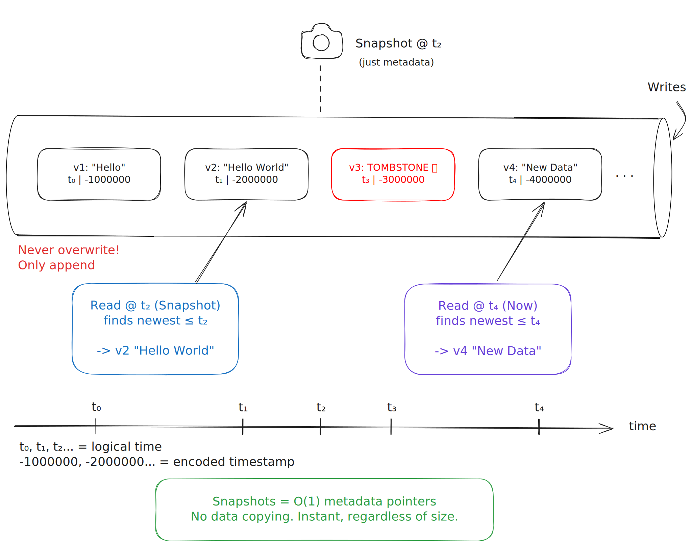
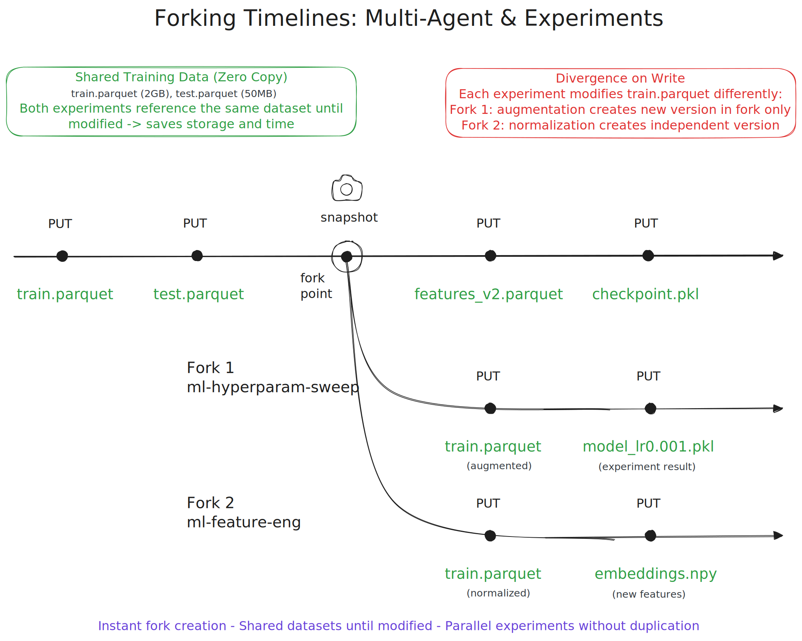

import InlineCta from "@site/src/components/InlineCta";
import logDbImage from "./log-db.webp";
import styles from "!!raw-loader!./styles.css";

<style>{styles}</style>


<p
  style={{
    textAlign: "center",
    fontStyle: "italic",
    marginTop: "0.5rem",
    color: "var(--docs-color-text-100)",
  }}
>
  Append-Only Object Storage: The Foundation Behind Cheap Bucket Forking
</p>

## Introduction: The Log Is the Database

> "The log is the database; everything else is cache or materialized views."

That idea — echoed by Pat Helland, Jay Kreps, and
[Martin Kleppmann](https://martin.kleppmann.com/2015/03/04/turning-the-database-inside-out.html)
— captures a deep truth about modern systems: **immutability simplifies
everything.**

In most databases, the log hides behind layers of mutable state. In Tigris, the
object store _is_ the log. Every write is an immutable event. Every snapshot is
a bookmark in time.

{/* truncate */}

Kleppmann wrote:

> "Databases are global, shared, mutable state … A more promising model … is to
> think of a database as an always-growing collection of immutable facts."  
> —
> [Turning the Database Inside Out, 2015](https://martin.kleppmann.com/2015/03/04/turning-the-database-inside-out.html)

That's the design philosophy behind Tigris — taking the principles of
log-structured storage and applying them at the scale of cloud object stores.

Immutability turns time from a source of inconsistency into a controllable part
of the design.

## A Brief History of Immutability in Storage

Early filesystems and databases overwrote state in place. Safety mechanisms like
write-ahead logs and journals were mere patches around mutable cores.

Then came the immutability revolution:

**NetApp WAFL (1990s)** — introduced copy-on-write inode trees, enabling instant
snapshots.

**LVM - Logical Volume Manager (1998)** — extended the concept to block devices.
LVM snapshots marked original data blocks as read-only and redirected writes
elsewhere — implementing copy-on-write at the volume level. This made "instant
rollback" possible long before distributed systems had it.

**ZFS (2004)** — elevated the model:

<div style={{ marginLeft: "2rem" }}>

> "Everything is copy-on-write. Never overwrite live data."  
> — Jeff Bonwick,
> [ZFS: The Last Word in File Systems](https://pages.cs.wisc.edu/~dusseau/Classes/CS736/CS736-F13/Lectures/1_zfs_overview.pdf)

</div>

**Kafka, [Datomic](https://www.infoq.com/news/2012/04/datomic/), and
[Samza](https://samza.apache.org/learn/documentation/latest/core-concepts/core-concepts.html)
(2010s)** — brought the same idea to distributed data systems. Kafka reimagined
the database log as a first-class citizen. Datomic treated data as immutable
facts: nothing ever changes, only new truths are added. Samza showed that even
computation could be modeled as functions over append-only logs.

Each of these systems — from block-level to distributed dataflow — reinforced
the same insight: immutability makes systems simpler, safer, and more powerful.

Tigris borrows that lineage but lifts it one level up — from immutable blocks to
immutable objects.

<div style={{ marginLeft: "2rem" }}>
  <span
    style={{
      fontWeight: "900",
      fontStyle: "italic",
      textShadow: "0.5px 0 0 currentColor",
    }}
  >
    A personal note:
  </span>
  <em>
    Tigris' design is influenced by our time at Uber. We helped build Uber's
    global storage platform, scaling to hundreds of billions of requests daily.
    The append-only data model was central to the design of Uber's core trips
    data store
    [Schemaless](https://www.uber.com/blog/schemaless-part-one-mysql-datastore/).
  </em>
</div>

## Turning Object Storage Inside Out

Traditional object stores treat buckets as mutable maps: you PUT, overwrite,
DELETE — and history vanishes.

Even S3's "versioning" operates per object; it doesn't capture a consistent
point-in-time view of an entire bucket. There's no concept of a _snapshot_.

Tigris flips that model. Every operation becomes an entry in an **append-only
log**:

- Each `PUT` → a new immutable version
- Each `DELETE` → a tombstone
- Each snapshot → a **named cutoff in time**

No mutations, no in-place updates — only **immutable events indexed by time**.

Kleppmann summarized it perfectly:

> "What do we have to gain from turning the database inside out? Simpler code,
> better scalability, better robustness, lower latency."  
> —
> [Martin Kleppmann, Øredev 2015](https://martin.kleppmann.com/2015/11/05/database-inside-out-at-oredev.html)

With this design, object storage inherits the same architectural principles that
once turned databases inside out.

## Append-Only Immutability: The Core Design

Under the hood, Tigris uses FoundationDB as a globally distributed, ordered
key-value store that indexes every object version. Each object is represented
as:

```bash
(bucket, object_key, version_epoch) → bytes
```

- **Writes are append-only.** A new version is always inserted; existing data is
  never modified.
- **Deletes are logical tombstones** that remain until all referencing snapshots
  are gone.
- **Reads return the newest version** ≤ snapshot timestamp.

To preserve descending chronological order, Tigris encodes timestamps as
**negative Unix epochs**, taking advantage of FoundationDB's lexicographic key
ordering. This ensures the newest version of each object naturally appears first
in a regular forward range scan.



When you take a snapshot, it's just a metadata entry — a timestamp cutoff that
defines a consistent read boundary.

Snapshots require no data copies or scans — just a metadata pointer defining a
consistent view.

Snapshots are effectively **O(1)** metadata operations — their cost depends on
metadata, not data size.

As ZFS itself claims:

> "Actually cheaper to take a snapshot than not! Constant-Time Snapshots."  
> —
> [ZFS: The Last Word in File Systems](https://pages.cs.wisc.edu/~dusseau/Classes/CS736/CS736-F13/Lectures/1_zfs_overview.pdf)

Even massive buckets can be snapshotted or forked almost instantly, since only
metadata changes.

## Why Append-Only Enables Cheap Snapshots

Mutable systems pay O(N) in copying or diffing to simulate immutability.
Append-only systems pay O(1): snapshots are just **timestamps** over an
immutable log.

| Operation         | Mutable Storage | Append-Only Storage |
| ----------------- | --------------- | ------------------- |
| Snapshot creation | Deep copy       | Metadata write      |
| Restore           | Re-copy         | Flip pointer        |
| Consistency       | Lock-based      | Version-based       |
| GC safety         | Risky           | Reference-counted   |

ZFS pioneered this model: _"Never overwrite live data."_
([ZFS Presentation, UT Austin](https://www.cs.utexas.edu/~dahlin/Classes/GradOS/papers/zfs_lc_preso.pdf))

Tigris inherits it — but distributes it globally, at the object layer.

Instead of ZFS's block-level **deadlists** — see
[Ahrens, _How ZFS Snapshots Really Work_](https://papers.freebsd.org/2019/BSDCan/ahrens-How_ZFS_Snapshots_Really_Work.files/ahrens-How_ZFS_Snapshots_Really_Work.pdf),
Tigris tracks object version references across snapshots and forks. Old versions
are garbage-collected only after every referencing snapshot has expired —
mirroring ZFS's deadlist semantics at internet scale.

## The Many-Worlds of Data: Snapshots and Forks

Each snapshot freezes the world at a moment in time. A **fork** spawns a new,
parallel timeline.

**ZFS:**

```bash
zfs snapshot tank/data@t0
zfs clone tank/data@t0 tank/data-dev
```

**Tigris:**

```python
from tigris_boto3_ext import (
  create_fork,
)

# Fork from the latest state of a bucket
create_fork(
    s3_client,
    "llm-fork-snap",
    "llm-base"
    )
```

Or if you want to fork from a specific snapshot:

```python
from tigris_boto3_ext import (
  create_snapshot,
  get_snapshot_version,
  create_fork,
)
# Fork from a specific snapshot
result = create_snapshot(
    s3_client,
    "llm-base",
    snapshot_name='pre-finetune' # optional name for the snapshot
    )

snapshot_version = get_snapshot_version(result)

create_fork(
    s3_client,
    "llm-fork-snap",
    "llm-base",
    snapshot_version=snapshot_version
    )
```

Forks share all unchanged data with their parent, but diverge lazily on writes.
It follows the same branching model that Git made familiar.



## Why Forks Matter

Forks and snapshots bring **data version control** to object storage — something
the ecosystem has long lacked. Unlike external catalog systems or overlays,
versioning is native to Tigris's storage layer.

- **Reproducibility**: Point-in-time datasets guarantee reproducible ML training
  and analytics.

- **Safe Experimentation**: Fork a production bucket, run transformations,
  discard it — the production data stays pristine.

- **Multi-Agent AI Workflows**: Each agent gets its own forked universe, all
  derived from the same snapshot baseline. Agents can process, train, and mutate
  independently without collision.

- **Auditing & Recovery**: Immutable snapshots form a verifiable audit trail.
  Forks can restore state instantly after errors.

## Why This Matters for the Future of Storage

Every generation has made one architectural bet: **treat changes as immutable
facts**.

| Era   | Innovation      | Principle                  |
| ----- | --------------- | -------------------------- |
| 1990s | WAFL            | Copy-on-write filesystem   |
| 2000s | ZFS             | Transactional CoW blocks   |
| 2010s | Kafka / Datomic | Logs as systems of record  |
| 2020s | Tigris          | Append-only object storage |

Tigris extends that principle to the cloud's most fundamental layer: object
storage.

Snapshots, forks, and time-travel are implemented as primitives, not layered
abstractions.

Tigris combines the durability of ZFS, the branching semantics of Git, and the
scalability of S3 — in a single, consistent storage model.

## Conclusion: The Log Beneath the Cloud

> "The log is the database. Everything else — indexes, forks, views — are just
> materialized projections of it."

That's Tigris: a distributed object store where immutability isn't an
afterthought — it's the architecture.

If you care about immutability and version control at the storage layer, **try
bucket snapshots and forks in Tigris** — and see what happens when your object
store really becomes your source of truth.

<InlineCta
  title="Experience Inside-Out Object Storage"
  subtitle="Ready to try immutable snapshots and forks?"
  button="Check out the docs"
  link="https://www.tigrisdata.com/docs/buckets/snapshots-and-forks/"
/>
